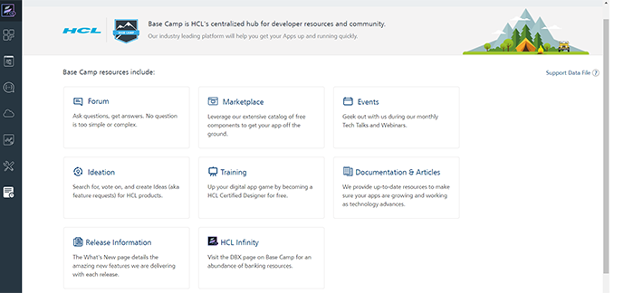

                              

User Guide: Support

Volt MX  Support
===============

The **Support** page displays links to the latest tutorials and articles and Developer resources from Base Camp Library. Base Camp is VoltMX's centralized hub for developer resources and community. Our resource-rich platform will help you get your Apps up running quickly.

The following are the Developer resources from Base Camp Library:

*   [Forum](https://basecamp.voltmx.com/s/) - Ask questions, get answers.
*   [Marketplace](https://marketplace.hclvoltmx.com /#/) - Free! Yes, we said free components to pop into your apps.
*   [Events](https://basecamp.voltmx.com/s/events) - Geek out with us during our monthly Tech Talks and Webinars.
*   [Ideation](https://basecamp.voltmx.com/s/ideation?page=1) - Search for, vote on, and create Ideas (feature requests) for HCL products.
*   [Training](https://basecamp.voltmx.com/s/Skills) - Up your game by becoming a HCL Certified Designer for free.
*   [Documentation](https://basecamp.voltmx.com/s/app-platform-documentation) & [Articles](https://basecamp.voltmx.com/s/articlelistview) & [Announcements](https://basecamp.voltmx.com/s/announcements) – Resources the way you want them.
*   [Release Information](https://basecamp.voltmx.com/s/whats-new) - Do not miss a beat when we release new features into the wild.
*   [HCL Infinity](https://basecamp.voltmx.com/s/dbx) - Visit the DBX page on Base Camp for banking resources.

You can join the Base Camp community to participate in Groups, Events, and Forums. You'll be earning points and badges as you engage with the content and fellow members. To join Base Camp, click **[JOIN US ON BASE CAMP](https://basecamp.voltmx.com/login/?startURL=/s/)**.
