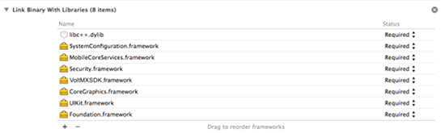

                              

User Guide: [SDKs](../Foundry_SDKs.html) > [iOS SDK](Installing.html) > Invoking a Sync Service

Invoking a Sync Service
=======================

*   [Getting Sync Instance](#getting-sync-instance)
*   [Initializing a Sync Service](#initializing-a-sync-service)
*   [Encrypting the Offline Database](#encrypting-the-offline-database)
*   [Creating a Sync Object](#creating-a-sync-object)
*   [Error Codes](#error-codes)
*   [Create, Read, Update, and Delete (CRUD) operations in Native SDK](#create-read-update-and-delete-crud-operations-in-native-sdk)
*   [Updating a Sync Object](#updating-a-sync-object)
*   [Retrieving an Object](#retrieving-an-object)
*   [Deleting an Object](#deleting-an-object)
*   [Pushing (or syncing ) Changes to the Sync Server](#pushing-or-syncing-changes-to-the-sync-server)

Getting Sync Instance
---------------------

To get sync service instance pass context of the activity.

 HCLSync * sync = nil;@
try {
    sync = [HCLSync sharedInstance];
}@
catch (HCLException * exception) { //failed to encrypt offline database 
} //start to be removed


Initializing a Sync Service
---------------------------

Before using any sync related API you have to initialize sync services.

### Initializing Sync

 @try {
    [
        [HCLSync sharedInstance] initSync
    ];
    //init sucess
}@catch (HCLException * exception) {
    //init failure
}


### Initializing Sync in Background

  [
    [HCLSync sharedInstance] initSyncInBackground: ^ (BOOL succeeded, NSError * error) {
        if (error) {
            //init failed
        } else {
            //init success
        }
    }
];


Encrypting the Offline Database
-------------------------------

To encrypt offline database (SQLite) on device we use SQL Cipher. Encryption has to be specified while initializing sync services. After the sync service is initialized without encryption, you cannot encrypt it. If you want to use encryption, you must initialize the sync service with encryption for the first time. After you encrypt the database, you cannot decrypt it.

 HCLSync * sync = nil;
@try {
    sync = [HCLSync sharedInstance];
    [sync initSyncWithPassPhrase: @"somekey"];
    //successfully encrypted offline database
}
@catch (HCLException * exception) {
    //failed to encrypt offline database
}
}


Creating a Sync Object
----------------------

1.  Create a Sync Object
    
    You need to have the following files to use Sync SDKs:
    
    Once you upload the sync config file, the system generates code. For iOS, the generated code will contain the following two packages:
    
    *   Metadata Files:
        *   SyncGeneratedMetatadata.h
        *   SyncGeneratedMetatadata.mm
    *   Sync Object Files: 
        *   SyncObjectName.h
        *   SyncObjectName.mm
2.  Configure native SDK in iOS.
    1.  Add the generated files in step1 in your project.
    2.  Link the following libraries in your project.
        
        
        

Error Codes
-----------

The following is a list of error codes for iOS platform along with the corresponding causes and error messages:

  
| Error Code | Cause | Error Message | Comments |
| --- | --- | --- | --- |
| HCL1000E |   | Unknown Error |   |
| HCL1001E |   | Please initialize init before calling any other API |   |
| HCL1002E |   | Out of memory | [cplusplus > bad\_alloc](http://www.cplusplus.com/reference/new/bad_alloc) |
| HCL1003E |   | Input Output Exception | [cplusplus > ios\_base](http://www.cplusplus.com/reference/ios/ios_base/failure/) |
| HCL1004E |   | Error occurred while creating database path:<dbPath> |   |
| HCL1005E |   | Null Pointer Exception |   |
| HCL1006E |   | Error occurred while parsing metadata |   |
| HCL1007E |   | Row Doesn't Exist |   |
| HCL1008E |   | Session in progress |   |
| HCL1009E |   | Cannot delete as child record(s) with cascades false exist for this record |   |
| HCL8888E |   | whatever message comes from server |   |
| HCL1010E |   | UpgradeRequired In Progress |   |
| HCL2006E | sync.initSync | class not found exception | [Supported Doc](https://developer.apple.com/library/mac/documentation/Cocoa/Conceptual/Exceptions/Concepts/PredefinedExceptions.html#//apple_ref/doc/uid/20000057-BCIGHECA) |
| HCL3000E | any native NSExceptoin | native iOS error |   |

> **_Important:_** For asynchronous APIs, NSError Codes are the same as other error codes. However, the NSError Codes will not have a HCL prefix or an E suffix, because as errors have errorcode as numbers, not string. Also, all errors will have com.voltmx.mobileFoundry.sync as their ErrorDomain.

### Predefined iOS Exception

If any API throws a predefined iOS exception, refer to the below link: [https://developer.apple.com/library/mac/documentation/Cocoa/Conceptual/Exceptions/Concepts/PredefinedExceptions.html #//apple\_ref/doc/uid/20000057-BCIGHECA](https://developer.apple.com/library/mac/documentation/Cocoa/Conceptual/Exceptions/Concepts/PredefinedExceptions.html#//apple_ref/doc/uid/20000057-BCIGHECA)

For any network errors, refer to the below link: [https://developer.apple.com/library/mac/documentation/Networking/Reference/CFNetworkErrors/index.html#//apple\_ref /c/tdef/CFNetworkErrors](https://developer.apple.com/library/mac/documentation/Networking/Reference/CFNetworkErrors/index.html#//apple_ref/c/tdef/CFNetworkErrors)

Create, Read, Update, and Delete (CRUD) operations in Native SDK
----------------------------------------------------------------

##### Create/Update

For both Create and Update, we have the same APIs. If object passed is a new object then create happens, otherwise if object is fetched from device update happens.

### Creating a Record

**API Used**: public <T extends SyncObject> void save(T syncObject) throws VoltMXException

**Sample Code**

 	API Used: -(void) saveSyncObject: (HCLSyncObject * ) hclSyncObject;
CODE: @try {
    Categories * cat = [
        [Categories alloc] init
    ];
    [cat setCategoryName: @"Fruits"];
    [cat setDescription: @"Apple"];
    [
        [HCLSyncDataStore sharedInstance] saveSyncObject: cat
    ];
    //save success
}@
catch (HCLException * e) {
    //save failed
}


### Creating a Record in Background

**API Used**: public <T extends SyncObject> void saveInBackground(T dataObject, SyncObjectCallback<T> callback)

**Sample Code**:

 API Use - (void) saveSyncObjectInBackground: (HCLSyncObject * )
hclSyncObject
withCompletionBlock: (HCLSyncObjectResultBlock) result;

Categories * cat;@
try {
    cat = [
        [Categories alloc] init
    ];
    [cat setCategoryName: @"Fruits"];
    [cat setDescription: @"Apple"];
}@
catch (HCLException * e) {
    NSLog(@"Exception occurred: % @", e);
}
[
    [HCLSyncDataStore sharedInstance] saveSyncObjectInBackground: cat
    withCompletionBlock: ^ (HCLSyncObject * syncObject, NSError * error) {
        if (error) {
            //error in saving syncobject in background
        } else {
            //successfully saved the syncobject in background
        }
    }
];



### Bulk Create

 -(void) bulkSave: (NSArray * ) hclSyncObjects;
@try {
    Categories * cat = [
        [Categories alloc] init
    ];
    [cat setCategoryName: @"Fruits"];
    [cat setDescription: @"Apple"];

    Categories * cat1 = [
        [Categories alloc] init
    ];
    [cat1 setCategoryName: @"Fruits1"];
    [cat1 setDescription: @"Apple1"];

    Categories * cat2 = [
        [Categories alloc] init
    ];
    [cat2 setCategoryName: @"Fruits2"];
    [cat2 setDescription: @"Apple2"];

    NSArray * catArray = @ [cat, cat1, cat2];
    [
        [HCLSyncDataStore sharedInstance] bulkSave: catArray
    ];
    //bulk save success
}
@catch (HCLException * exception) {
    //bulk save failed
}


### Bulk Create in Background

 HCLQuery * query;
NSArray * catArray;

@try {
    query = [
        [HCLSyncDataStore sharedInstance] createQueryWithClassObj: [Categories class]
    ];
    [query addWhereClause: @"CategoryName='Fruits'"];
    catArray = [
        [HCLSyncDataStore sharedInstance] executeQuery: query
    ];
    for (Categories * cat in catArray) {
        [cat setDescription: @"Fruits Updated"];
    }
}
@catch (HCLException * exception) {
    // Catch the exception and print if required.
}
[
    [HCLSyncDataStore sharedInstance] bulkSaveInBackground: catArray
    withCompletionBlock: ^ (NSArray * objects, NSError * error) {
        if (error) {
            //bulk save failed in background
        } else {
            //bulk save success in background
        }
    }
];


### Bulk Update

 @try {
    HCLQuery * query = [
        [HCLSyncDataStore sharedInstance] createQueryWithClassObj: [Categories class]
    ];
    [query addWhereClause: @"CategoryName='Fruits'"];
    NSArray * catArray = [
        [HCLSyncDataStore sharedInstance] executeQuery: query
    ];
    for (Categories * cat in catArray) {
        [cat setDescription: @"Fruits Updated"];
    }
    [
        [HCLSyncDataStore sharedInstance] bulkSave: catArray
    ];
    //bulk save success
}
@catch (HCLException * exception) {
    //bulk save failed
}


### Bulk Update in Background

  HCLQuery * query;
NSArray * catArray;
@try {
    query = [
        [HCLSyncDataStore sharedInstance]
        createQueryWithClassObj: [Categories class]
    ];
    [query addWhereClause: @"CategoryName='Fruits'"];
    catArray = [
        [HCLSyncDataStore sharedInstance]
        executeQuery: query
    ];
    for (Categories * cat in catArray) {
        [cat setDescription: @"Fruits Updated"];
    }
}
@catch (HCLException * exception) {
    // Catch the exception and print if required.
}
[
    [HCLSyncDataStore sharedInstance]
    bulkSaveInBackground: catArray
    withCompletionBlock: ^ (NSArray * objects, NSError * error) {
        if (error) {
            //bulk save failed in background
        } else {
            //bulk save success in background
        }
    }
];



Updating a Sync Object
----------------------

### Updating a Record

 	 @try {
    HCLPrimaryKey * pk = [
        [HCLPrimaryKey alloc] init
    ];
    [pk setAttributeForKey: @"CategoryID"
        value: @"1"
    ];
    Categories * cat = (Categories * )[[HCLSyncDataStore
        sharedInstance
    ] getSyncObjectWithClass: [Categories class] primaryKey: pk];

    //update the record
    [cat setCategoryName: @"Fruits Updated"];
    [cat setDescription: @"Apple Updated"];
    [
        [HCLSyncDataStore sharedInstance] saveSyncObject: cat
    ];
    //save success
}
@catch (HCLException * exception) {
    //save failed
}


### Updating a Record in Background

 HCLPrimaryKey * pk = [
    [HCLPrimaryKey alloc] init
];
[pk setAttributeForKey: @"CategoryID"
    value: @"1"
];
[
    [HCLSyncDataStore sharedInstance]
    getSyncObjectWithClassInBackground: [Categories class]
    primaryKey: pk completionBlock: ^ (HCLSyncObject * syncObject,
        NSError * error) {
        if (error) {
            //get syncObject failed
        } else {
            Categories * cat = (Categories * )(syncObject);
            //update the record
            [cat setCategoryName: @"Fruits Updated"];
            [cat setDescription: @"Apple Updated"];
            [
                [HCLSyncDataStore sharedInstance]
                saveSyncObjectInBackground: cat
                withCompletionBlock: ^ (HCLSyncObject * syncObject, NSError * error) {
                    if (error) {
                        //save failed
                    } else {
                        //save success
                    }
                }
            ];
        }
    }
];


Retrieving an Object
--------------------

### Executing Queries

Query class can be used to define queries.

#### Execute Query

 @try {
    HCLQuery * query = [
        [HCLQuery alloc] initWithSyncObject: [Categories class]
    ];
    [query addSelectColumn: @[@"CategoryId"]];
    [query addWhereClause: @"CategoryName='Fruits'"];
    NSArray * catArray = [
        [HCLSyncDataStore sharedInstance] executeQuery: query
    ];
    //query success
}
@catch (HCLException * exception) {
    //query failed
}


#### Execute Query in Background

 HCLQuery * query = [
    [HCLQuery alloc] initWithSyncObject: [Categories class]
];
[query addSelectColumn: @[@"CategoryId"]];
[query addWhereClause: @"CategoryName='Fruits'"];
[
    [HCLSyncDataStore sharedInstance] executeQueryInBackground: query
    withCompletionBlock: ^ (NSArray * objects, NSError * error) {
        if (error) {
            //query failed
        } else {
            //query success
        }
    }
];



### Getting an Object

To retrieve an object from database using its primary key.

#### getObject

 @try {
    HCLPrimaryKey * pk = [
        [HCLPrimaryKey alloc] init
    ];
    [pk setAttributeForKey: @"CategoryID"
        value: @"1"
    ];
    Categories * cat = (Categories * )[[HCLSyncDataStore sharedInstance] getSyncObjectWithClass: [Categories class] primaryKey: pk];
    //getSyncObject success
}
@catch (HCLException * exception) {
    //getSyncObject failed
}


#### getObject in background

    HCLPrimaryKey * pk = [
    [HCLPrimaryKey alloc] init
];
[pk setAttributeForKey: @"CategoryID"
    value: @"1"
];
[
    [HCLSyncDataStore sharedInstance] getSyncObjectWithClassInBackground: [Categories class]
    primaryKey: pk completionBlock: ^ (HCLSyncObject * syncObject, NSError * error) {
        if (error) {
            //getSyncObject failed
        } else {
            //getSyncObject success
        }
    }
];


### Fetching an Object

To fetch all the details of a partially fetched object.

#### Fetching an Object

 @try {
    HCLQuery * query = [
        [HCLQuery alloc] initWithSyncObject: [Categories class]
    ];
    [query addSelectColumn: @[@"CategoryId"]];
    [query addWhereClause: @"CategoryName='Fruits'"];
    NSArray * catArray = [
        [HCLSyncDataStore sharedInstance] executeQuery: query
    ];
    //fill the partial object
    for (Categories * cat in catArray) {
        [
            [HCLSyncDataStore sharedInstance] fetchDetails: cat
        ];
    }
    //fetch success
}
@catch (HCLException * exception) {
    //fetch failed
}
	



#### Fetching an Object in Background

 HCLQuery * query = [
    [HCLQuery alloc]
    initWithSyncObject: [Categories class]
];
[query addSelectColumn: @[@"CategoryId"]];
[query addWhereClause: @"CategoryName='Fruits'"];
NSArray * catArray = [
    [HCLSyncDataStore sharedInstance] executeQuery: query
];
if (0 & lt;
    [catArray count]) {
    Categories * cat = [catArray objectAtIndex: 0];
    [
        [HCLSyncDataStore sharedInstance]
        fetchDetailsInBackground: cat
        completionBlock: ^ (HCLSyncObject * syncObject, NSError * error) {
            if (error) {
                //fetch failed
            }
        }
    ];
}


Deleting an Object
------------------

### Delete

  @try {
    HCLPrimaryKey * pk = [
        [HCLPrimaryKey alloc] init
    ];
    [pk setAttributeForKey: @"CategoryID"
        value: @"1"
    ];
    Categories * cat = (Categories * )[[HCLSyncDataStore sharedInstance] getSyncObjectWithClass: [Categories class] primaryKey: pk];
    [
        [HCLSyncDataStore sharedInstance] deleteSyncObject: cat
    ];
    //delete success
}
@catch (HCLException * exception) {
    //delete failure
}


### Delete in Background

 HCLPrimaryKey * pk = [
    [HCLPrimaryKey alloc] init
];
[pk setAttributeForKey: @"CategoryID"
    value: @"1"
];
Categories * cat = (Categories * )[[HCLSyncDataStore sharedInstance] getSyncObjectWithClass: [Categories class] primaryKey: pk];
[
    [HCLSyncDataStore sharedInstance]
    deleteSyncObjectInBackground: cat
    withCompletionBlock: ^ (NSError * error) {
        if (error) {
            //delete failure
        } else {
            //delete success
        }
    }
];


### Bulk Delete

 @try {
    HCLQuery * query = [
        [HCLSyncDataStore sharedInstance]
        createQueryWithClassObj: [Categories class]
    ];
    [query addWhereClause: @"CategoryName='Fruits'"];
    NSArray * catArray = [
        [HCLSyncDataStore sharedInstance]
        executeQuery: query
    ];
    [
        [HCLSyncDataStore sharedInstance] bulkDelete: catArray
    ];
    //bulk delete success
}
@catch (NSException * exception) {
    //bulk delete failed
}


### Bulk Delete in Background

 HCLQuery * query;
NSArray * catArray;

@try {
    query = [
        [HCLSyncDataStore sharedInstance]
        createQueryWithClassObj: [Categories class]
    ];
    [query addWhereClause: @"CategoryName='Fruits'"];
    catArray = [
        [HCLSyncDataStore sharedInstance]
        executeQuery: query
    ];
}
@catch (HCLException * exception) {
    // Catch the exception and print if required.
}
[
    [HCLSyncDataStore sharedInstance]
    bulkDeleteInBackground: catArray
    withCompletionBlock: ^ (NSError * error) {
        if (error) {
            // bulk delete failed
        } else {
            //bulk delete success
        }
    }
];


Pushing (or syncing ) Changes to the Sync Server
------------------------------------------------

The startSessionInBackgroundAPI can be used to sync (upload and download/push and pull) changes between device and sync server. This is purely asynchronous API. To get notifications during the API execution you can implement SyncListener interface and pass object of implementing class to synchronize.

 HCLSync * sync = [HCLSync sharedInstance];
//implement <HCLSyncEventDelegate>; protocol and setSynceventDelegate
sync.syncEventDelegate = self; //or any class object 
that implemented & lt;
HCLSyncEventDelegate & gt;
protocol[sync startSessionInBackground];



### Configuring Various Sync Options

You can use sync options class to configure various sync options like:

*   **Upload Error Policy**: This policy can be used to configure whether to continue or abort on getting upload error. Default value is continue on error.
*   **Schema Upgrade Policy**: This policy is used to configure what action to be taken when schema upgrade is available. Default value is upload and upgrade.
*   **Enabling or disabling download/upload for a scope**: Default value is continue on error.
*   **Adding filter for syncing**: This can be used to set download filters. By default, all pass filters are used.
*   **Configuring remove after upload policy**: this can be used to configure removal of records instance from device after successful upload. By default, this option is disabled for all scopes.

### Configuring NetworkOptions

The NetworkOptions class can be used to configure various options for APIs that use the network.

For example, startSessionInBackground, performUpgradeInBackground, and isUpgradeRequiredInBackground.

Following options can be configured:

1.  **Network Timeout**: the time for which device should wait for server to respond. If server does not respond in the specified time, an error is thrown. Default value is ten seconds.
2.  **Retry Count**: Retry count specifies how many times a request can be sent to server in case of a server error. Default value is five.
3.  **Retry Wait Time**: Time between two retries. Default value is five seconds.
4.  **Retry Listener**: The listener which should be invoked on each retry.
