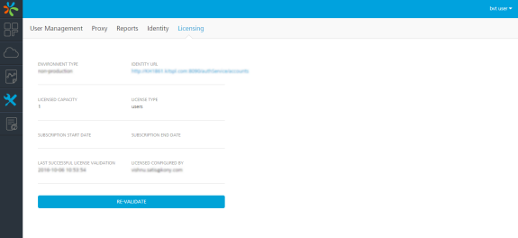
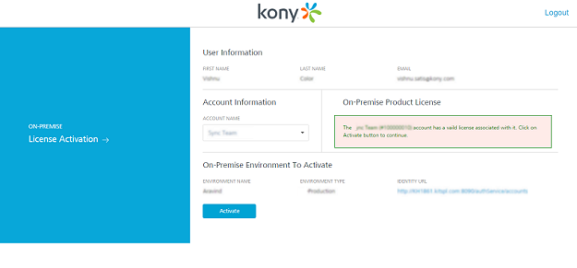

                           

License Validity
----------------

The license validity is the remaining application usage period from the current day. When the license validity is lesser than or equal to 30 days, the Notification dialog box is displayed automatically on each launch. For each day, the license validity period decreases by one. After the validity period, the license expires disabling you to access the application. If you view the license expiry message as displayed below, you need to upgrade the license with a commercial version within the required time.

### Viewing the License Validity on Volt MX Iris Enterprise

To view the license validity on Volt MX Iris Enterprise, follow these steps:

1.  Click **Help**. The help pane appears.
2.  Click **About Volt MX License**. The **VoltMX Iris Enterprise License Information** dialog box appears and displays your license information.

### Revalidating Volt MX Foundry license

To re-validate Volt MX Foundry license, follow these steps:

1.  Go to **Licensing** section under Settings.
    
    
    
2.  Click **RE-VALIDATE**, a confirmation dialog appears.
3.  Click on **Continue**. You will be redirected to Volt MX Cloud Account Sign-in page.
4.  Enter your Volt MX account credentials and click **Sign in**. After your credentials are validated, you will be redirected to **Licensing Activation** page.
    
    
    
5.  From **ACCOUNT NAME** list, select an account name. Based on the license validity, a message is displayed under **On-Premise Product license**.
    
    *   If the account does not have a valid license, you cannot proceed further. Please contact Volt MX Support.
    
    *   If the account has a valid license, click on **Activate** button. The license will be activated and you will be redirected to the **Licensing** section of your Volt MX Foundry console.The page displays all the license related information.

[Open topic with navigation](../Content/Upgrading_License.html)

Comments

[Reply](#)

 

 <input class="comment-submit" type="button" value="Submit" > 
 
 </body> <.html></x-turndown>
