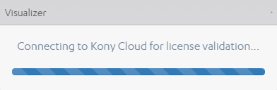
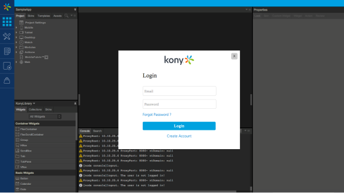

                           

### Activating Volt MX Iris Enterprise License

This section enables you to activate Volt MX Iris Enterprise license.

#### Cloud Activation

To activate Volt MX Iris Enterprise license, follow these steps:

1.  After installation, launch Volt MX Iris Enterprise.
    
    
    
    On the first launch, you will be redirected to Volt MX Cloud log-in page for license validation.
    
    
    
2.  Enter your credentials and click **Login**. If you have a valid Enterprise license associated with your Volt MX Cloud account, the product will be activated and you will be redirected to Volt MX Iris Enterprise Welcome screen.

Volt MX  Iris Enterprise prompts you for credentials every time you launch it. If you do not have access to a network connection when you launch Volt MX Iris Enterprise, it bypasses the Login credentials, and you will continue to have access to all the product's features. If another 30 days pass without entering your Volt MX credentials, you will not be able to access the important features in Volt MX Iris Enterprise until you enter them.

#### Manual Activation - Windows

If you have a valid 7.2 Enterprise license file, follow these steps:

1.  Create a **lic** folder in the Volt MX Iris Enterprise install directory.  
    For example: _C:\\VoltMXIrisEnterprise<version>\\VoltMX\_Iris\_Enterprise\\lic_
2.  Place the license file in the **lic** folder.
    
    > **_Note:_** Name of the license file must be **ide.lic** (lower case).
    
3.  Create a JSON file and name it as **userinfo.json**. The JSON file must have the following information:

{"first\_name" : "<placeholder>", "last\_name" : "<placeholder>", "email" : "<placeholder>"}

5.  Place the **userinfo.json** file in the **lic** folder.
6.  Launch Volt MX Iris Enterprise, your license will be activated.

#### Manual Activation - Mac

If you have a valid 7.2 Enterprise license file, follow these steps:

1.  Create a **lic** folder in the Volt MX Iris Enterprise install directory.  
    For example: _/Applications/VoltMXIrisEnterprise<version>/VoltMX\_Iris\_Enterprise/lic_
2.  Place the license file in the **lic** folder.
    
    > **_Note:_** Name of the license file must be **ide.lic** (lower case).
    
3.  Create a JSON file and name it as **userinfo.json**.
    
    > **_Note:_** Volt MX recommends using **VI Editor** to create the **JSON** file.
    
4.  In the **VI Editor** terminal, follow these steps:
    1.  Type **vi** userinfo.json and press enter. The **userinfo.json** file will be created.
    2.  Type **i** and press enter. This will let you insert the text into the file.
    3.  Type the following command in the terminal.
        
        {"first\_name" : "<placeholder>", "last\_name" : "<placeholder>", "email" : "<placeholder>"}
        
        Press Enter
        
    4.  Press Esc button to exit the text insert function.
    5.  Type **wq!** and press enter to save the JSON file and exit the terminal.
5.  Place the **userinfo.json** file in the **lic** folder.
6.  Launch Volt MX Iris Enterprise, your license will be activated.

[Open topic with navigation](../Content/VoltMXOne_Studio_IDE.html)

Comments

[Reply](#)

 

 <input class="comment-submit" type="button" value="Submit" > 
 
 </body> <.html></x-turndown>
