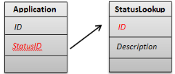
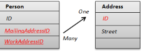
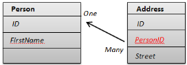

                           

Avoid Complex Relationships between SyncObjects
===============================================

While defining a SyncObject model, relationships form an essential part of the definition. The user must be very careful in not replicating every relationship between the objects. You should therefore define only those relationships in SyncConfiguration that drive the application behavior.

Relationships defined in SyncConfiguration drive the primary key management done on the server as well as data filtering when downloading data to the device. The relationships also drive data creation and modification on client side.

Consider the two database tables and the relationship between them. It is clear that the StatusLookup table provides more descriptive information about a particular application status. Even though Application has reference to a key in _StatusLookup_, it may not be necessary to download only those StatusLookup rows as referenced by the Application. Even though this is desirable it can be over optimization. _Application_ and _StatusLookup_ share the parent child relationship in a real world context. So, defining a relationship between these two SyncObjects is overkill.

Differentiate between Lookup and Transactional Data
---------------------------------------------------

Almost in every Enterprise Backend system, there is lookup (Reference) data that changes very rarely (mostly READ) while there are transactional data that change very frequently (mostly WRITE).

By designing them as part of different SyncScopes, you can apply different synchronization characteristics. You can synchronize lookup data every two days while you can refresh the transactional data every two hours.

Lookup data is often same across users, and is maintained in a single DataSource at the backend. To differentiate the data specific to a user you can apply a client filter.

Identify Appropriate Batch Size for the Application
---------------------------------------------------

When downloading data to the device, the Volt MX Foundry Sync Server does not send all the data in one response. It sends them in batches. The user defines the batch size while initiating a sync (default batch size is 500).

As you have batchsize for download, similarly, you have batching for upload as well . You can break the data to upload into batches to reduce the load on network. To achieve this, you need to configure "uploadbatchsize" config param for _sync start_.

A very small value of batch size results in many network calls and hence can lead to poor sync performance. A very large value of batch size can lead to Out Of Memory issues on the server and the device (as all the data in batch is loaded in memory).

You are recommended to perform some tests (using different batch sizes) with real world application data to arrive at the batch size that is more appropriate for the application.

> **_Note:_** Batching does not work as is, if there is huge data that is almost similar to the value of the timestamp.

Getting the SyncObject Relationships Right
------------------------------------------

You need to get the SyncObject relationships right for Database datasource.

Volt MX  Foundry Sync currently supports _One-To-Many_ and _Many-To-One_ relationships between the SyncObjects. It is important to understand how the developer should decide which side of the relationship is the Many side. The below example illustrates how to identify that.

The _Many_ side is always defined on the table that has the Foreign Keys.

Example 1

In the above example, since the Foreign keys exist on the Person table it becomes the Many side of the One-To-Many or Many-To-One relationship.

Example 2

In the above example, since the Foreign keys exist on the Address table it becomes the _Many_ side of the One-To-Many or Many-To-One relationship.

It is equally important to identify where to define this relationship. Let us say in _Example 1_, we can define the _Many-To-One_ relationship on the Person SyncObject or One-To-Many relationship on the Address SyncObject. The relationship should be defined on the SyncObject whose filters have to be inherited by the other Syncobject. For example; if the application demands that only selected PersonIDs that the user defined should be downloaded (so a client filter on Person) and only those Address records that the client filter selected, need to be downloaded, then you have to define the relationship on the Person SyncObject. (As in this case Address inherits the filter criteria from Person).

Define Appropriate Indexes
--------------------------

In case of database datasource, ensure that appropriate indexes are defined for all the columns that are part of the relationship and sync filters (both client and server).

> **_Note:_** Indexes can affect the WRITE performance on the tables.

Optimize the SOAP Requests
--------------------------

Let us consider SalesForce Datasource as an example to optimize SOAP requests.

SalesForce offers a very rich query interface through its WebService interface. This API allows a user to define its own objects as well as construct complex queries to select only the required fields.

With respect to SalesForce, you must not download deleted records to the device when downloading data for the initial downloads. You can do this by having a code snippet similar to below, in the SOAP request template for _getAll_ operation mapping.

<urn:queryString>select Id, IsDeleted, MasterRecordId, Name, Type, RecordTypeId, LastModifiedDate from Account where LastModifiedDate&gt;$StartDate and LastModifiedDate&lt;$EndDate #if($InitialSync=='true') and IsDeleted=false #end</urn:queryString>

SFDC expects a specific NULL tag to set the value of an attribute to null. So one must modify the **update** and **create** SOAP request template in the operation mapping.

#if($Name != "null")  
<urn1:Name>$Name</urn1:Name>  
#else  
<urn1:fieldsToNull>Name</urn1:fieldsToNull>  
#end
