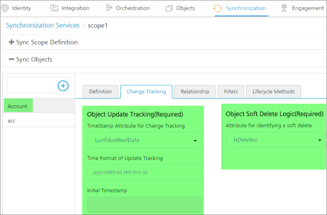
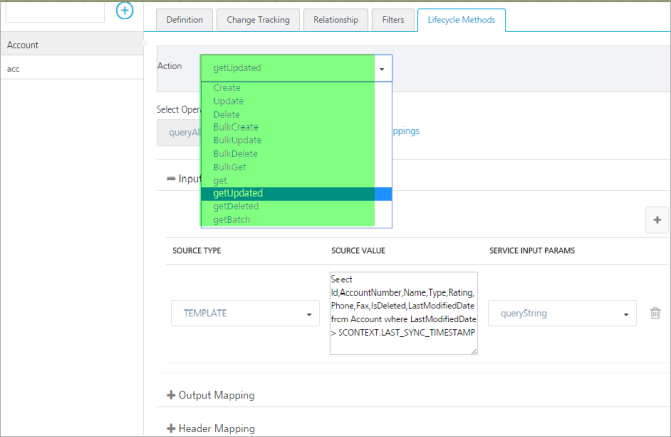
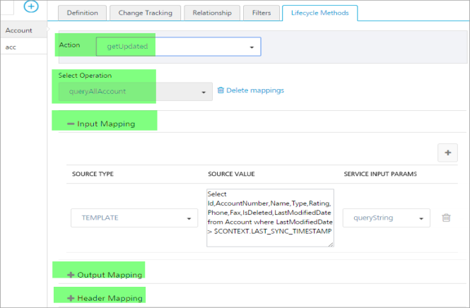

                            

Guidelines for Web Services
===========================

In this section you will find guidelines to implement web services and the SAP DataSource connector to integrate with Volt MX Foundry Sync Server.

Services
--------

Volt MX  Foundry Sync Framework operates on SyncObjects (for example, Contact and Product). To read or update data in these objects, Volt MX Foundry Sync Framework expects the Enterprise backend to provide a CRUD (Create, Read, Update, Delete) friendly interface. This helps the Volt MX Foundry Sync Framework to map actions performed on the data to be replicated on the Enterprise backend. The web service should have the following operations defined for each SyncObject.

> **_Note:_** There is no particular naming convention on Service name, and the request and response field names. For example, service name can be “Contact\_Create” or “ContactCreate” or “ContactInsert” for the Create operation.

  
| Operation | Description |
| --- | --- |
| Create | Service that takes all the field level data in the request and creates an instance in the enterprise data source and returns the auto generated primary key information in response (if primary key is auto generated). |
| Update | Service that takes all the field level data along with primary key in the request and updates the instance in enterprise data source. |
| Delete | Service that takes the primary key of the row and soft-deletes the row from the data source. |
| Get | Service that takes the primary key of the row in the input and gives all the field data in the response. This service is typically used for doing conflict resolution. This is also invoked when GetUpdated returns only primary keys and does not return all the data values for a SyncObject. In case of some services, it may not take any inputs and return complete data always. In such scenarios, the service does not perform delta sync. |
| GetUpdated | Services that takes the date time value in the request and returns all the rows (with all the field data) changed after that date time. |
| GetBatch | Service that provides ability to retrieve data in batches. |
| GetServerTime | This is defined once at datasource level. It returns current datetime value of the datasource. It is not mandatory to define this service, but you are recommended to have this service to ensure that a very precise batching is done for large datasets. So consider this while designing the services. |

> **_Note:_** There is no restriction on the name of the WebService methods but the semantics/behaviour has to be similar to what is described above. There is "getUpdated" operation for OTA and persistent provisioned sync strategy, and the "getUpdated" operation is renamed to "GetAll" for persistent unprovisioned sync strategy.

See Datasources > Other DataSources section in Framework Getting Started guide on [VoltMX Documentation Library](http://docs.voltmx.com/voltmxlibrary/sync.html) to understand more about the service requirements and batching support.

### Mapping Input and Output Parameters for Operations

**Input parameters** are the parameters that you pass to the service and are used during a service call. All the services do not have input parameters. Input parameters are provided based on the elements that are present in the Request pane.

> **_Note:_** You have to map all the input parameters expected by the service in Input mapping.

**Output parameters** are the parameters fetched from the response of a service call.

**Example**: The screen shots below will help you understand mapping parameters. The example shows a Contact object based on the Salesforce model.

[Object details](javascript:void(0);)

[Operation details](javascript:void(0);)

Ensure that the following guidelines are adhered to while mapping the input and output parameters:

Create Input Mapping

This operation has to accept all or subsets of fields from Volt MX Foundry Sync attributes of the same object as well as from other objects, if a relationship exists between the objects.

Create Output Mapping

If there is an auto-generated key, then you have to map the auto-generated value in output mapping.

**Header Mapping**

Header Mapping is done for all the operations.

Update Input Mapping

This operation has to accept all or subsets of fields from the attributes. This operation has to accept all or subsets of fields from Volt MX Foundry Sync attributes of the same object as well as from other objects, if a relationship exists between the objects.

Update Output Mapping

This operation does not require output mapping. If the service fails with SOAP fault or with failed HTTP status code, it implies that the update has failed. Otherwise, it is considered as successful.

Delete Input Mapping

This operation has to accept the primary key of the row.

Delete Output Mapping

This operation does not require output mapping. If the service fails with SOAP fault or with failed HTTP status code, it implies that the update has failed. Otherwise, it is considered as successful.

Get Input Mapping

This operation has to accept the primary key of the row.

Get Output Mapping

This operation should return all the field level data for that particular primary key.

GetUpdated Input Mapping

This operation can accept the last sync time (lower bound) and current timestamp (upper bound), and return the rows that are added, changed, or deleted between the lower and upper bound values.

GetUpdated Output Mapping

This operation should return the list of rows containing all the field level data. For batching support, the service has to return one parameter flag that indicates whether more batches are available. The service can also return identifiers like QueryLocator that can be stored in context and can be sent as GetBatch Input.

GetBatch Input Mapping

The GetBatch operation will be invoked when the moreChangesAvailable flag from the GetUpdated operation is true. This operation will be invoked by Volt MX Foundry Sync Server recursively until the flag is false.

GetBatch Output Mapping

The output should be the same as GetUpdated operation output.

For batching, the operation takes batch size as an input parameter and returns the batch size number of rows. The number of rows in the output can differ from batch size.

Provisional Columns
-------------------

Every SyncObject should have defined provisional columns in addition to the service operations. Provisional is a term that signifies typical database design patterns have been followed, such as tracking deletes through a soft delete flag and tracking last updated timestamp for each data item or a table row.

The Change Tracking Columns (for example, Last UpdateTimestamp and Soft Delete Flag) must be defined for each SyncObject.

SoftDeleteFlag

This column represents whether the row is deleted. The column captures a Boolean flag (true/false) that is used to track if the row has been marked for deletion. This column is optional if the SyncObject does not deal in delete functionality.

LastUpdateTime

This column indicates the time when the row is last modified.

**Error handling**

If the service is invoked and there are errors, Volt MX Foundry Sync Server will handle the error depending on the web services (SOAP, REST and JSON). Volt MX Foundry Sync Server will also notify the device. For example, in case of SOAP service, SOAP Fault is considered as an exception. For REST and JSON services, errors will be handled based on the HTTP status codes.

For handling custom errors from the backend services, map one service output parameter with name errmsg with XPath expression to the error message in response payload to catch the exact error.

If the web service is the DataSource and errors are reported in SOAP response instead of SOAP Faults, then add the below param in the Synconfig file under each service output param to catch the exact error. For example, to use salesforce web service, add as shown:

<Param Name="errmsg" Expression="//errors/message/text()" Datatype="string"/>

Refer Developing Offline Apps on [VoltMX Documentation Library](http://docs.voltmx.com/voltmxlibrary/sync.html) for more information.

Batching Approach
-----------------

You must use the GetUpdated and GetBatch operations to retrieve data in batches. If you do not have the service already implemented for the batching purpose, then you can implement the service for each SyncObject by following the [algorithm](#Algorithm) as shown to fetch the batch-size number of rows from the backend DataSource. After implementing the service, map the service with [GetUpdated and GetBatch operations](#Operation). Volt MX Foundry Sync Server will invoke this service to get the incremental changes in batches. Data will be sent to a device in batches to avoid memory and network issues when there are more rows in initial sync and incremental sync.

Algorithm to fetch the batch-size number of rows from the backend DataSource

Algorithm <entity> GetUpdated(datetime, batchSize)  
cursor ← Open a cursor on <entity> where lastUpdateTime > datetime   
recordCount ← 0
prevLastUpdateTime ← 0			  
row ← cursor.firstrow()			  
**while** recordCount < batchSize or row.lastUpdateTime == prevLastUpdateTime **do**  
 recordCount ← recordCount + 1			  
 prevLastUpdateTime ← row.lastUpdateTime 			  
 list.add(row)			  
 row ← cursor..nextrow()			  
**end-while**
lastRowDatetime ← row.lastUpdateTime 			  
cursor.close()			  
**if** recordCount >= batchSize **then**  
 moreDataAvailable ← true			  
**else**  
 moreDataAvailable ← false			  
**end-if**  
**Return** list, moreDataAvailable, lastRowDatetime 


Operation mapping

*   In GetUpdated input mapping, map the following:
    *   LAST\_SYNC\_TIMESTAMP from the context to datetime
    *   BATCH\_SIZE from context to batchSize
*   In GetUpdated output mapping, map the fields from list to the corresponding Volt MX Foundry Sync attributes as shown:
    *   moreDataAvailable to MORE\_CHANGES\_AVAILABLE in context
    *   lastRowDatetime to any temporary variable in context (for example, QueryLocator)
*   In GetBatch input mapping, map the following:
    *   Temporary context variable(QueryLocator) from the context to datetime
    *   BATCH\_SIZE from context to batchSize
*   The GetBatch operation output mapping will be the same as GetUpdated operation output mapping.
