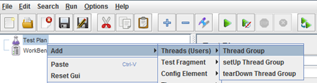
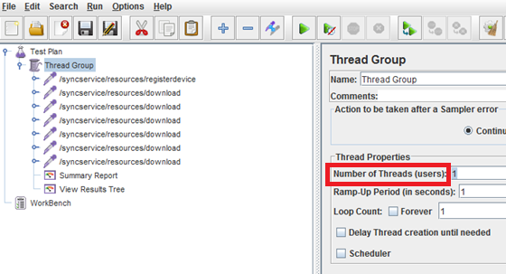
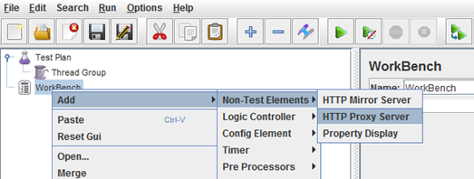
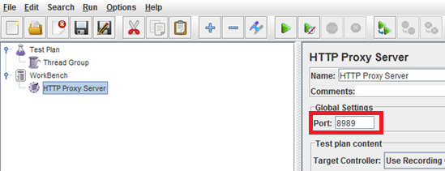
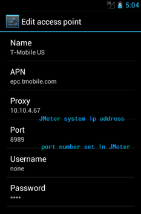

                           

Load Testing Volt MX Foundry Sync Services with Apache JMeter
=========================================================

This section explains the steps required to record Volt MX Foundry Sync service calls with Apache JMeter. If you are new to JMeter, create a test plan by recording Volt MX Foundry Sync service calls with JMeter using Android emulator.

Download and install JMeter from [http://jmeter.apache.org/download\_jmeter.cgi](http://jmeter.apache.org/download_jmeter.cgi)

**Prerequisite**

*   Volt MX Foundry Sync Server
*   Volt MX Foundry Sync Application must be synched with data resources to get data.

> **_Note:_** This document does not explain how to use JMeter in detail. For more information on using JMeter, refer to [http://jmeter.apache.org/usermanual/](http://jmeter.apache.org/usermanual/)  
Make sure Volt MX Foundry Sync Server is running and the Volt MX Foundry Sync application is reset.  

To perform load testing on Volt MX Foundry Sync Service calls, do the following:

1.  Build a basic test plan in JMeter
    1.  Navigate to **JMETER\_HOME/bin**.
    2.  Launch **jmeter.bat**. JMeter window appears.
    3.  Right-click on **Test Plan** and then select **Add** > **Threads (Users)** > **Thread Group**. Thread group is added to test plan.
        
        
        
    4.  Click **Thread Group**. Thread group window appears.
    5.  Under **Thread Properties**, enter the number of threads or users you want to view.
        
        
        
2.  Add a HTTP Proxy Server.
    1.  In JMeter, right-click on **WorkBench** and then select **Add** > **Non-Test elements** > **HTTP Proxy Server**. HTTP proxy server is added to WorkBench.
        
        
        
    2.  Click HTTP Proxy Server. HTTP Proxy Server details appear.
    3.  Under **Global Settings**, enter **Port** number.
        
        
        
3.  Set up Android emulator.
    1.  From Volt MX Iris, launch Android emulator.
    2.  Navigate to **Settings** > **Wireless & Networks** > **Mobile Networks** > **Access Point Names**.
    3.  Select default access point name, **T-Mobile US**.
    4.  In the T-Mobile US proxy, edit the following.
        1.  **Proxy**: Set the IP address of the system where JMeter is running.
        2.  **Port**: Enter the port number specified in JMeter.
            
            
            
4.  Launch Volt MX Foundry Sync application in the Android emulator and start the Volt MX Foundry Sync application.
5.  In JMeter, click **Start** to start load test.

Recording Volt MX Foundry Sync Requests of a Windows 7 Desktop Application with JMeter
----------------------------------------------------------------------------------

To record Volt MX Foundry Sync requests of a Windows 7 desktop application with JMeter, follow these steps:

1.  In your Internet Explorer, from the **Tools** menu, click **Internet Options**. The Internet Options window appears.
2.  Click on **Connections** tab.  
    The Connections tab details appear.
3.  Click **LAN Settings**  
    The Local Area Network settings window appears.
4.  Under **Proxy Server**, select Use a proxy server for LAN.
5.  Click **Advanced**.  
    The **Proxy Settings** window appears.
6.  Enter the following details
    1.  **HTTP**: Enter HTTP server details.
    2.  **Port**: Enter port number.
7.  Navigate to **JMETER\_HOME/bin**.
    
8.  Launch jmeter.bat. JMeter window appears.
9.  Right click on **Test Plan** and then select **Add** > **Threads (Users)** > **Thread Group**. Thread group is added to test plan.
    
    
    
10.  In JMeter, right-click on **WorkBench** and then select **Add** > **Non-Test elements** > **HTTP Proxy Server**. HTTP proxy server is added to WorkBench.
    
    
    
11.  Click **HTTP Proxy Server**. HTTP Proxy Server details appear.
12.  Under **Global Settings**, enter **Port** number. This is the same number you have provided in your Internet Explorer proxy settings.
    
    
    
13.  In JMeter, click **Start** to start load test.
    
    > **_Note:_** To compare the load test results, refer to **Monitor and Tune Volt MX Foundry Sync Server Performance**section in _Server Planning Guide_ on [VoltMX Documentation Library](http://docs.voltmx.com/voltmxlibrary/sync.html).
