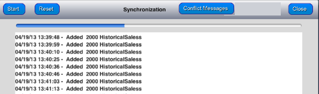

                           

Designing a Good User Experience
================================

You need to design a good user experience during the sync process, specially for the initial sync.

Applications that are designed to work offline often involve downloading large data sets during the first launch of the application (typically known as the provisioning phase of the device). The data sets can range from 30 MB to 400 MB. The initial download time can range between 10 minutes to three hours. If you do not place appropriate guards within the application, then the user can get frustrated and may abandon the application. The following are some of the guidelines to follow a good user experience:

*   Ensure the user is provided with appropriate feedback regarding the data that downloads and the overall progress. You can do this using a simple progress bar as below:
    
    
    
    The design ensures that the user is provided with appropriate feedback on the long running activity and is well informed.
    
*   The initial download (provisioning phase) should be performed on a WiFi network. Downloading 400 MB data on a cellular network may lead to frequent disconnects or sync errors. So you should advise users to be in an area where a good WiFi connection is available.
*   You should advise users to keep their devices sufficiently charged before they perform the initial sync. Shutting down the device abruptly in middle of sync may lead to inconsistent database. In such a case, the only option is to completely delete the application and restart sync.
