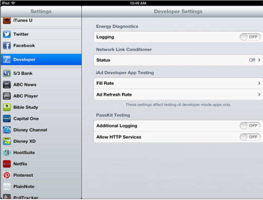

                           

Simulating and Testing for Different Network Conditions
=======================================================

Being able to test different network conditions is important for an application that downloads or uploads large amount of data. It is important to understand the user experience under such conditions. The last thing you want is the user being stuck, or some functionality not working at all because the user is on a mediocre networking connection.

One way to simulate a bad network connection on iOS is to use tools like “Network Link Conditioner”.

Refer the below URL for a detailed usage of “Network link Conditioner”:

[http://www.neglectedpotential.com/2012/09/ios6-network-link-conditioner/](http://www.neglectedpotential.com/2012/09/ios6-network-link-conditioner/)

Another tool useful for simulating bad network connections is “Charles Proxy” [http://www.charlesproxy.com/](http://www.charlesproxy.com/). It allows you to record traffic as well simulate slow network connections.
