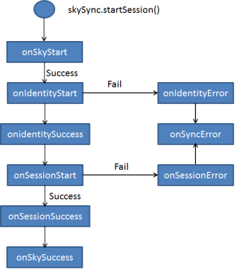

                            

Application Level
=================

This set of APIs help the developer to perform various ORM operations at Application level.

skySync.init
------------

This API initializes Sky Sync engine. Internally, it calls _sky.provision_ API. On successful, the connection establishes between device and Sky Sync engine. So you should call this function always after application re-start and before you perform any Sync operation.

### Signature

_skySync.init(config)_

### Configuration Parameters

  
| Parameter Name \[Mandatory/Optional\] | Parameter Type | Description |
| --- | --- | --- |
| SERVER \[Mandatory\] | String | The host name or IP address of SkyMobile gateway on which the target provisioning service runs. It may also be in the form of a URL. |
| PORT \[Mandatory\] | String | The port of SkyMobile gateway on which the target provisioning service is runs. Not required if a URL is used for the SERVER parameter. |
| PROFILE \[Mandatory\] | String | The name of SkyMobile provisioning profile to use when provisioning the device. |
| USEWIFI \[Optional\] | Boolean | Whether or not to use wifi for the connection. Permitted values are _TRUE_/_FALSE_. If no value is given _FALSE_ is assumed. |
| CONNECTIONMODE (Optional/BlackBerry) | String | The connection mode you have to use when connecting as part of provisioning process. Permitted values are _BES_, _BIS-B_, _DIRECT_. If no value is given or any other value is given, _DIRECT_ is assumed. |
| onProvisionError \[Optional\] | Function | Indicates the callback that is called in case the provision process encounters an error. It receives a context object with the below keys:
errorCode \[String\] – error Code errorMessage \[String\] - Message erroInfo \[JSObject/null\] – Further information about errors in various scopes

 |
| onProvisionSuccess \[Optional\] | Function | Indicates a callback that is called on successful provision. |

### Platform Availability

Available on all platforms mentioned.

### Example

function syncInit() 
{
	var config = {};
	//The below values should be set inorder to do provision.
		config.SERVER = "192.168.2.41";
		config.PORT = “60000”;
		config.PROFILE = “A”
		config.USEWIFI = true

	//onXXXXDemo is a function which will be called on these callbacks
		config.onProvisionError = onProvisionErrorDemo ;
		config.onProvisionSuccess = onProvisionSuccessDemo;

	

// The skySync.init command after populating the config object
		skySync.init(config);
}



skySync.startSession
--------------------

This function triggers the synchronization cycle. This function makes the device database ready with the following two steps:

1.  identify: This method identifies the current user of SkySync engine, and leverages SkyMobile identity management processing.
2.  start: This method starts Sky Sync engine. It immediately begins synchronizing data with the back-end Sky MEAP Server in background mode (asynchronously).

### Client Side Lifecycle Events

The following image shows the client side lifecycle events:

The _skySync.startSession_ receives a set of configuration as input that helps to fine tune the synchronization process to specific application Configuration Parameters.

### Configuration Parameters

  
| Parameter Name \[Mandatory/Optional\] | Parameter Type | Description |
| --- | --- | --- |
| userid \[Mandatory\] | String | Specifies the user identifier to be used to authenticate the user to access the SKY Mobile gateway |
| password \[Mandatory\] | String | Specifies the password to be used to authenticate the user to access the SKY Mobile gateway |
| onSkyStart \[Optional\] | Function | Indicates the callback that is called before sky session starts |
| onSkySuccess \[Optional\] | Function | Indicates a final callback that is called after successful sky session |
| onSkyError \[Optional\] | Function | Indicates the final callback that is called for in case the sky start session process encounters an error. It receives a context object with the below keys:
errorCode \[String\] – error Code errorMessage \[String\] - Message erroInfo \[JSObject/null\] – Further information about errors in various scopes

 |
| onIndentifyStart \[Optional\] | Function | Indicates a callback that is called before sky identification starts |
| onIndentifyError \[Optional\] | Function | Indicates the final callback that is called for in case the sky identification process encounters an error. It receives a context object with the below keys:

errorCode \[String\] – error Code errorMessage \[String\] - Message erroInfo \[JSObject/null\] – Further information about errors in various scopes

 |
| onIndentifySuccess \[Optional\] | Function | Indicates a callback that is called after sky identification Successful |
| onSessionStart \[Optional\] | \[Optional\] | Indicates a callback that is called before sky start session starts |
| onSessionSuccess \[Optional\] | Function | Indicates a callback that is called before sky start session successful |
| onSessionError \[Optional\] | Function | Indicates the callback that is called for in case the sky start session process encounters an error. It receives a context object with the below keys:

errorCode \[String\] – error Code errorMessage \[String\] - Message erroInfo \[JSObject/null\] – Further information about errors in various scopes

 |

### Signature

**sync.startSession(config)**

### Parameters

config \[JSObject\] - **Mandatory**

### Platform Availability

Available on all platforms mentioned.

### Example

function syncStart() 
{
	var config = {};
	//The below values should be set inorder to do provision.
		config.USER = skyUserID;
		config.PASSWORD = skyPwd; 

	//onXXXXCallback is a function which will be called on these callbacks
		config.onSkyStart = onSkySyncStartCallback;	
		config.onSkySuccess = onSkySyncSuccessCallback;
		config.onSkyError = onSkySyncErrorCallback;	
		config.onIndentifyStart = onIndentifyStartCallback;
		config.onIndentifyError = onIndentifyErrorCallback;
		config.onIndentifySuccess = onIndentifySuccessCallback;
		config.onSessionStart = onSessionStartCallback;	
		config.onSessionSuccess = onSessionSuccessCallback;
		config.onSessionError = onSessionErrorCallback;	

	// The skySync.startSession command after populating the config object
		skySync.startSession(config);
}



skySync.reset
-------------

This method resets SkySync engine back to its initial state (prior to provisioning). All user related data is destroyed, including the database, all logs and any associated binary files.

### Signature

****skySync.reset(config)****

### Parameters

config \[JSObject\] – **Mandatory**

### Platform Availability

Available on all platforms mentioned.

### Example

function resetSyncSkySession(){
	var config = {};	
	config.onResetStart = syncSkyResetStartCallback ;
	config.onResetError = syncSkyResetErrorCallback ;
	config.onResetSuccess = syncSkyResetSuccessCallback;
	skySync.reset(config);
}
function syncSkyResetStartCallback(){
	alert("Sky Sync reset started");	
}
function syncSkyResetSuccessCallback(){
	alert("Sky Sync reset successfull");	
}
function syncSkyResetErrorCallback(outputparams){
	alert("Sky Sync reset error occured");
}



skySync.stop
------------

This method stops SkySync engine. You should call this API if the application terminates, or the user logs out. The SkySync engine requires time to shut down gracefully.

### Signature

****skySync.stop****(config)

### Parameters

config \[JSObject\] – **Mandatory**

### Platform Availability

Available on all platforms mentioned.

### Example

function stopSyncSkySession(){
	var config = {};	
	config.onStopStart =syncSkyStopStartCallback ;
	config.onStopError =syncSkyStopErrorCallback ;
	config.onStopSuccess = syncSkyStopSuccessCallback;
	skySync.stop(config);
}
function syncSkyStopStartCallback(outputparams){
	alert("Stopping Sky Sync sever started");
}
function syncSkyStopErrorCallback(outputparams){
	alert("Sky Sync stop error occured");
}
function syncSkyStopSuccessCallback(){
	alert("Sky Sync stop successful");
}



skySync.beginTransaction
------------------------

This method begins a series of related updates, making them atomic. By default, all updates to SkySync data are committed to the database immediately. However, calling beginTransaction signals to the SkySync engine that the current thread is beginning a series of related updates that must be committed to the database as an atomic unit of work. Thereafter, all updates to the data made by the calling thread are considered part of the same unit of work, until either commitTransaction or rollbackTransaction is called.

### Signature

**skySync.beginTransaction**(config)

### Parameters

config \[JSObject\] – **Mandatory**

### Platform Availability

Available on all platforms mentioned.

### Example

function beginTransaction(){
	var config = {};	
	config.onSuccessTransaction =transactionSuccessCallback;
	skySync.beginTransaction(config);
}
function transactionStartedCallback(outputparams){
	alert("Transaction is started");
}



skySync.rollbackTransaction
---------------------------

This method performs an "undo" or rolls back a unit of work initiated by a call to beginTransaction, backing out all of the uncommitted changes made to the database by the current thread.

### Signature

****skySync.rollbackTransaction**_(config)_**

### Parameters

config \[JSObject\] – **Mandatory**

### Platform Availability

Available on all platforms mentioned.

### Example

function rollbackTransaction(){
	var config = {};	
	config.onSuccessTransaction =transactionRollbackCallback;
	skySync.rollbackTransaction(config)
}
function transactionRollbackCallback(outputparams){
	alert("Transaction is Rolled back");
}



skySync.commitTransaction
-------------------------

This method finalizes an atomic unit of work, writing it to the database. After you call the commitTransaction, any future updates to the data are again immediately written to the database, unless/until beginTransaction is called second time.

### Signature

****skySync.commitTransaction****(config)

### Parameters

config \[JSObject\] – **Mandatory**

### Platform Availability

Available on all platforms mentioned.

### Example

function rollbackTransaction(){
	var config = {};	
	config.onSuccessTransaction =transactionRollbackCallback;
	skySync.rollbackTransaction(config)
}
function transactionRollbackCallback(outputparams){
	alert("Transaction is Rolled back");
}

