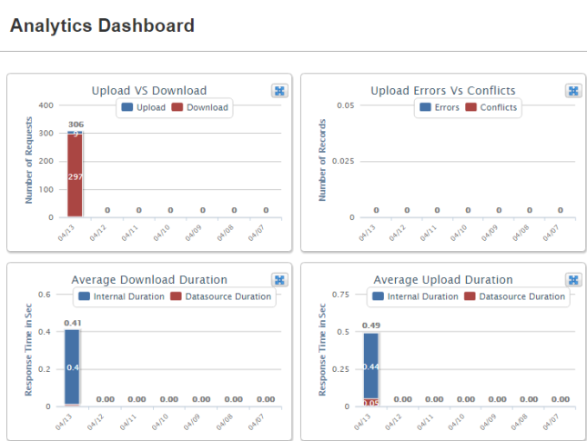
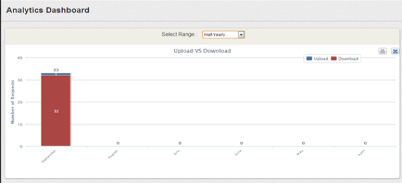

                           

Analytics Dashboard
===================

**Analytics Dashboard** is the landing page of the application. This feature enables you to view the system performance based on various criteria for a selected duration of time interval.

The four different reports that you can view are:

*   Upload versus Replica
*   Number of Sync Errors versus Conflicts
*   Avg Download Response Time
*   Avg Upload Response Time

By clicking the Maximize button on any given report, the drop-down for choosing **period** appears as shown. You can view the data on a weekly, monthly, half-yearly and yearly basis.

> **_Note:_** You cannot view the graphs when the respective tabs are not populated with data.

