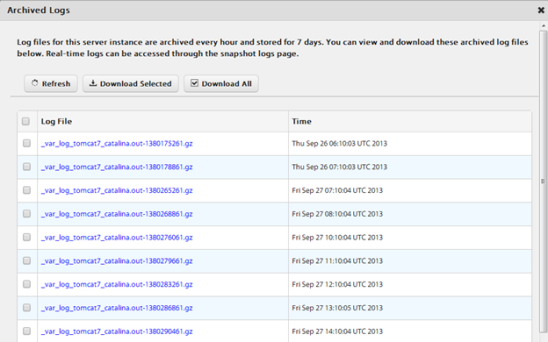
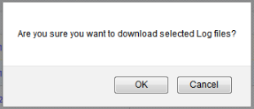
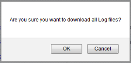
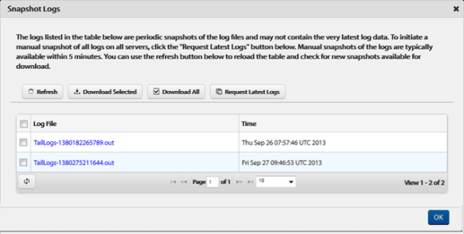
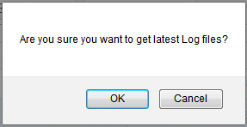
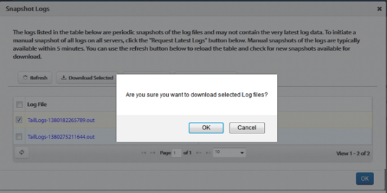
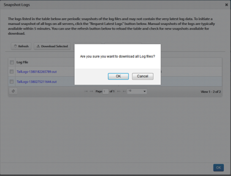

                           

Checking Volt MX Foundry Sync Server Side Logs
==========================================

The Cloud Logs view provided in Volt MX Foundry Sync Console enables to check for the Volt MX Foundry Sync Server side logs in PaaS (Cloud) environment. It shows a list of instances with instance id, IP address along with the links to view the Archived and Snapshot Logs. If the number of logs is more than 10, you can use the **Next** or **Previous** to move to more number of logs.

There are two types of cloud logs:

*   Archived Logs
*   Snapshot Logs

Archived Logs
-------------

The log files for the server instance that are archived every hour and stored for seven days. You can view and download these archived log files. If the number of archived log files is more than 10, you can use **Next** or **Previous** to move to more number of archived logs.

On **Cloud Logs** tab, you can view the list of archived logs and manage them. You can perform the following tasks:

*   [Viewing Archived Logs](#viewing-archived-logs)
*   [Downloading Selected Logs](#downloading-selected-logs)
*   [Downloading All the Logs](#downloading-all-logs)
*   [Refreshing Archived Logs](#Refreshing_Archived_Logs)

### Viewing Archived Logs

To view the archived logs, click **View Archived Logs** under **Archived Logs**. The **Archived Logs** pop-up appears with all the archived log files.

### Downloading Selected Logs

To download the selected logs, follow these steps:

1.  On the **Archived Logs** page, select the checkbox of desired archived file that you want to download and click **Download Selected**.  
    A pop-up appears with the message, "Are you sure you want to download selected Log files?".
2.  Click **OK** to download the selected archived log files.  
    A pop-up appears to choose the location to save the downloaded archived log files.
    
    
    
3.  Select the location to save the downloaded archived log files, and click **OK**.

### Downloading all Logs

To download all the archived log files, follow these steps:

1.  On the **Archived Logs** page, click **Download All**.  
    
    A pop-up appears with the message, "Are you sure you want to download all Log files?".
    
    
    
2.  Click **OK** to download the selected archived log files.  
    A pop-up appears to choose the location to save all downloaded archived log files.
3.  Select the location to save the downloaded archived log files, and click **OK**.

### Refreshing Archived Logs

To refresh the archived logs, on the **Archived Logs** page, click **Refresh**.  
The Archived Logs are refreshed.

Snapshot Logs
-------------

You can access real-time logs through the snapshot logs page. Snapshot logs comprise the last manual log snapshot fetched from the server.The logs listed in the table are periodic snapshots of the log files and may not contain the very latest log data. You can view and download these snapshot log files. If the number of snapshot log files is more than 10, you can use **Next** or **Previous** to move to more number of snapshot log files.

On **Cloud Logs** tab, you can view the list of snapshot logs and manage them.

You can perform the following tasks:

*   [Viewing Snapshot Logs](#Viewing_Snapshot_Logs)
*   [Requesting Latest Snapshot Logs](#requesting-latest-snapshot-logs)
*   [Downloading Selected Logs](#downloading-selected-logs)
*   [Downloading all the Logs](#downloading-all-the-logs)
*   [Refreshing Snapshot Logs](#refreshing-snapshot-logs)

### Viewing Snapshot Logs

To view the snapshot logs, click **View Snapshot Logs** under **Snapshot Logs**. The **Snapshot Logs** pop-up appears with all the snapshot log files.

### Requesting Latest Snapshot Logs

To request latest snapshot logs, follow these steps:

1.  On the **Snapshot Logs** page, to initiate a manual snapshot of all logs on all servers, follow these steps:
2.   Click **Request Latest Logs**.  
    A pop-up appears with the message, "Are you sure you want to get latest Log files?".
    
      
    
3.  Click **OK** to download the latest log files.  
    The manual snapshots of the logs are typically available within five minutes.

### Downloading Selected Logs

To download the selected log files, follow these steps:

1.  On the **Snapshot Logs** page, select the checkbox of desired snapshot file that you want to download and click **Download Selected**.  
    A pop-up appears with the message, "Are you sure you want to download selected Log files?".
    
    
    
2.  Click **OK** to download the selected snapshot log files.  
    A pop-up appears to choose the location to save all downloaded archived log files.
3.  Select the location to save the downloaded snapshot log files, and click **OK**.

### Downloading all the Logs

To download all the snapshot log files, follow these steps:

1.  On the **Snapshot Logs** page, click **Download All**.
    
    A pop-up appears with the message, "Are you sure you want to download all Log files?".
    
    
    
2.  Click **OK** to download the selected snapshot log files.  
    A pop-up appears to choose the location to save all downloaded snapshot log files.
3.  Select the location to save the downloaded snapshot log files, and click **OK**.

### Refreshing Snapshot Logs

To refresh the snapshot logs and to reload the table with new snapshots available for download, on the **Snapshot Logs** page, click **Refresh**.  
The Snapshot Logs are refreshed.
