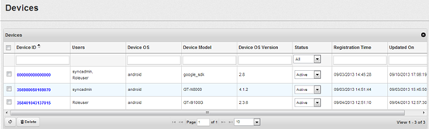
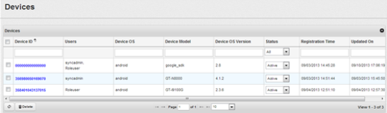
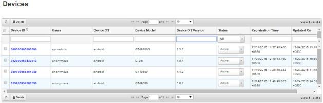
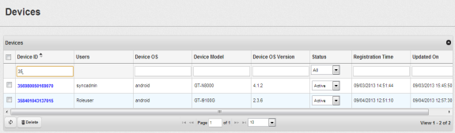
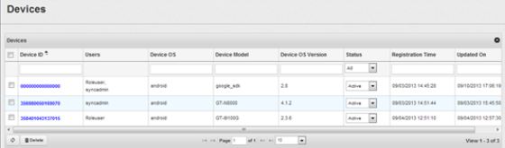
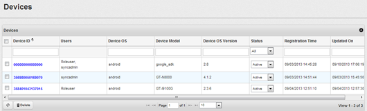
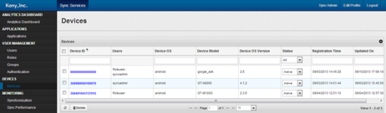
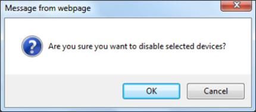

                           

Devices
=======

Devices user interface enables you to view the list of devices that are in sync with Enterprise Data Source server. The number of devices to view is 10, by default. You may change the number of devices to view by selecting from the drop-down corresponding to **Page**.

Device Auto Registration
------------------------

When you perform a sync operation from the handset for the first time, the device is auto registered into the console application after the authentication succeeds.

You can perform the following tasks:

*   [Searching a Device](#searching-a-device)
*   [Deleting a Device](#deleting-a-device)
*   [Enabling a Device](#enabling-a-device)
*   [Disabling a Device](#disabling-a-device)

Searching a Device
------------------

The search option enables you to search a Device ID, or all the devices that are assigned to the selected User ID. There are three types for searching:

1.  **Searching using only the _Device ID_**: This search criteria results in displaying the corresponding Device ID and all other Device IDs that are similar.
2.  **Searching using only the _User ID_**: This search criteria results in displaying all the Device IDs that are assigned to the corresponding User ID.
3.  **Searching using both _Device ID_ and _User ID_**: This search criteria results in displaying all the Device IDs that are assigned to the corresponding user ID.

To search a device, follow these steps:

1.  Click **Devices** from the Volt MX Foundry Sync Console. The Devices view appears.
    
    
    
2.  Enter the device id in **Device ID**.
3.  Enter the user id in **User ID**.
4.  Select the registration date in **Reg. Date**. You can select the date if you know the range of dates.
5.  Select the status from the **Status** drop-down menu.
6.  Select the device operating system from the **Device OS** drop-down menu.
    
    > **_Note:_** The **Device ID** or **User ID** fields are mandatory. You can enter either Device ID or User ID as required.
    
    
    
7.  Click **Search** by entering the Device ID, for example, starting with _35_. The device with the entered Device ID appears.
    
    
    

> **_Note:_** The search results displays all Device IDs that start with Device ID as entered in the search field. For example, If you search for the User ID “admin”, the search results display admin1, admin2, admin3, admin4 as per the ascending order alphanumerically.  

Deleting a Device
-----------------

Deleting a device feature enables you to delete a single device or multiple devices at an instance as required. From the list of records, you can navigate to the required **User ID** or **Device ID** record by using **Previous** or **Next** options or by using a specific **Search** criteria based on **Device ID**, **User ID**, **Reg. Date**, **Status**and **Device OS**. The search results displays all the records based on User ID or Device ID that match the search criteria.

To delete a device, follow these steps :

1.  Click **Devices** in Volt MX Foundry Sync Console.  
    The **Devices** view appears.
    
    
    
2.  Select a required **Device ID** and click **Delete**.  
    A dialog box with a confirmation message, “Are you sure you want to delete selected devices?” appears.
3.  Click **Yes**.  
    The selected Device ID is deleted.

Enabling a Device
-----------------

Enabling a device feature allows you to gain access to Volt MX Foundry Sync Console. You can either enable a single device or multiple devices at an instance as required. From the list of records, you can navigate to required **User ID** or **Device ID** record by using **Previous** or **Next** or by using a specific search criteria based on **Device ID**, **User ID**, **Reg. Date**, **Status** and **Device OS**. The search results displays all the records based on User ID or Device ID that match the search criteria.

To enable a device, follow these steps :

1.  Click **Devices** in Volt MX Foundry Sync Console.  
    The **Devices** view appears.
    
    
    
2.  Select the required **Device ID** and change the device from **Inactive** to **Active** from the **Status** drop-down.  
    A confirmation dialog box with a confirmation message, “Are you sure you want to enable selected devices?” appears.
3.  Click **Yes**.  
    The status of the selected device is updated as **Active**.  
    

Disabling a Device
------------------

Disabling a device feature disables it from gaining access to Volt MX Foundry Sync Console. You can either delete a single device or multiple devices at an instance as required. From the list of records, you can navigate to required **User ID** or **Device ID** record by using **Previous** or **Next** options or by using a specific Search criteria based on **Device ID**, **User ID**, **Reg. Date**, **Status**, and **Device OS**. The search results displays all the records based on User ID or Device ID that match the search criteria.

To disable a device, follow these steps :

1.  Click **Devices** in VoltMXFoundry Sync Console. The **Devices** view appears.
    
    
    
2.  Select a **Device ID**, and then click Disable. A dialog box with a confirmation message, “Are you sure you want to disable selected devices?” appears:
    
    
    
3.  Click **OK**. The status of the selected Device ID appears as Disabled.
