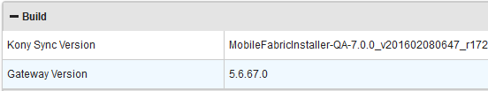
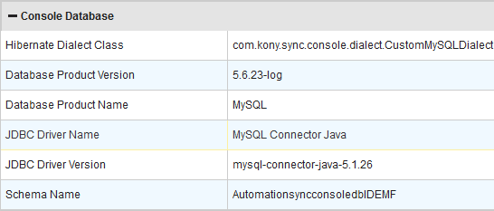
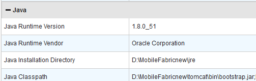
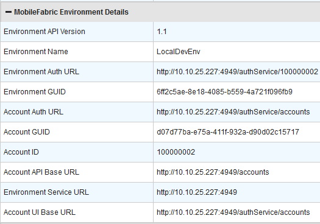
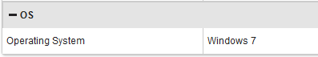

                           

Environment Details
-------------------

The Environment Details of Volt MX Foundry Sync Console enables you to view the details of the environment. The environment details are divided into the following sections:

*   [Build](#build)
*   [Console Database](#console-database)
*   [Java](#java)
*   [VoltMX Foundry Environment Details](#volt-mx-foundry-environment-details)
*   [OS](#os)

Each section displays the related details.

### Build

The Build section displays the current version of Volt MX Foundry Sync and gateway that are in use.

> **_Note:_** The Build, Console Database, Java, Volt MX Foundry Environment Details, and OS sections have predefined information and do not allow modifications.

### Console Database

The Console Database section contains details about the database configurations.

### Java

The Java section contains details of Java configurations.

### Volt MX Foundry Environment Details

The Environment Details section displays the environment details of Volt MX Foundry.

### OS

The OS section contains configuration details of the operating system.

