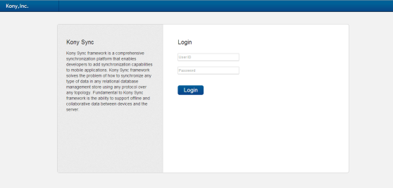
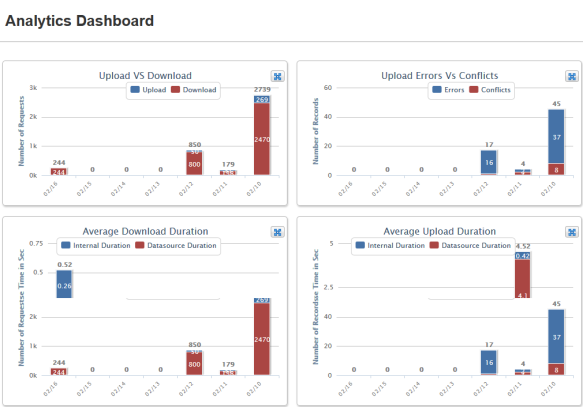
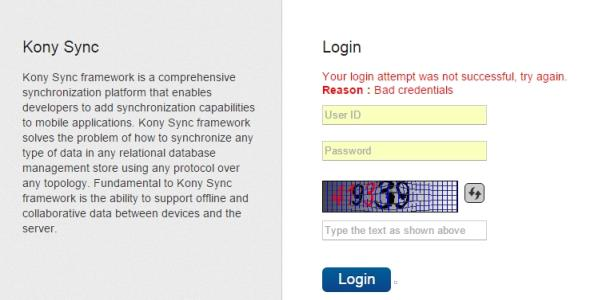

                           

Login
-----

Volt MX  Foundry Sync Console provides ability to login to the application using the credentials provided. Various users can login to the Management Console as Volt MX Foundry Sync Admin, User, and Report Viewer.

To login to the Volt MX Foundry Sync Console, follow these steps:

1.  Navigate to http://<IP address of the machine on which console is installed>/syncconsole. The Volt MX Foundry Sync Console login window appears.
2.  Enter the **User ID** and **Password**. These details are delivered along with the product Volt MX provided.
3.  Click **Login**.
    
      
    
4.  After successful logon, the **Analytics Dashboard** screen appears.
    
    
    
    > **_Note:_** You cannot view the graphs when the respective tabs are not populated with data.
    
5.  **Captcha Implementation**: In Sync Console login page, a captcha image is added after three consecutive failed login attempts to avoid brute-force attack.

> **_Note:_** By default, the size of captcha image is six letters.

### Role Based Access

Volt MX  Foundry Sync Console application restricts access to the modules based on the user login.T he system controls access privileges of the application features based on the login role. There are two user login roles: **Admin User** and **Report Viewer**. You can login to the application based on your role. You can categorize and assign role for each user as needed.

*   **Admin User:**The admin user can access all the modules in the Management Console.
*   **Report Viewer:** Report viewers can access only Monitoring Modules.

### **Log out**

Click **Log out** from top right corner of the screen to log out from Volt MX Foundry Sync Console.

> **_Note:_** The logout option is available in all the screens of the application.
