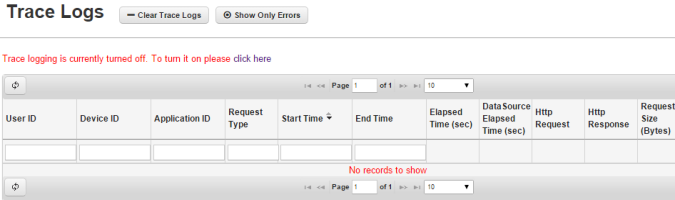
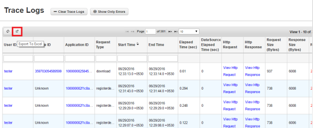
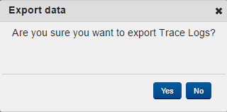
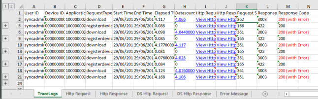
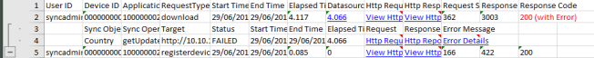
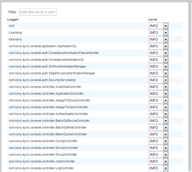
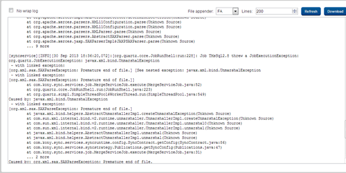
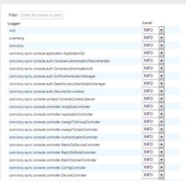
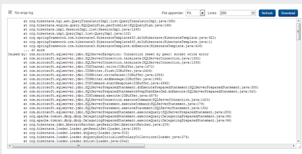

                           

Logs
====

Logs section enables you to view data sync between the devices of the client and the Enterprise Datasource server.

Trace Log
---------

> **_Note:_** The **Trace Log Level** is _OFF_ initially when you install Volt MX Sync Server. On the Trace Logs page, click the **click here** link to navigate to the **Configuration** tab. You may select _ON_ from the **Trace Log Level** drop-down to turn on the trace logs.

Trace Log feature enables you to view request and response data between the clients and Enterprise Datasource Server for a particular Application, User, Device and Time combination.

You may click **Clear Trace Logs** to clear the trace logs, and may click **Show Only Errors** to show only error logs.

### Export to Excel

You can export the logs from the Console database to an Excel file format. To export the logs, follow these steps:

1.  Click the **Export to Excel** button to export the log data to Excel.

3.  The following pop-up window is displayed.

5.  Click **Yes** to export the logs to Excel. Otherwise, click **No**.
6.  Click on **Yes** button. The **Trace Logs** Excel file is downloaded to your system. The following table describes the outcome of the data exported.

8.  Click on the hyperlink displayed against each field in the **Http Request**, **Http Response**, **DS Http Request**, **DS Http Response** and **Error Message** columns to view the complete details of the selected field.
9.  Click on the plus symbol on the right of each log displayed for additional details.

11.  If the export operation fails because of an error, the console displays a message explaining the cause of the error.
12.  If you do not have any logs to export, console displays a message as there are no records to export.
    
    
    

Volt MX  Foundry Sync Services Log
-----------------------------

Volt MX  Foundry Sync Services log feature enables you to view various levels of the Volt MX Foundry Sync Server Services and Volt MX Foundry Sync Console log data like DEBUG, INFO and ERROR on UI.

### Configuration

Using Configuration UI, Administrator can configure the level data that is required to monitor the logged data on the Volt MX Foundry Sync services server.

### Log

Log feature enables you to download the log file, view the number of lines in the log file that helps in quickly viewing the logs from UI, especially the exceptions and followed by quick resolutions.

Volt MX  Foundry Sync Console Log
----------------------------

Using Configuration helps you to configure the level data that is required to monitor the logged data on the Volt MX Foundry Sync console.

### Configuration

Using Configuration feature, an Administrator can configure the level data that is required to monitor the logged data on the Volt MX Foundry Sync services server.

### Log

Log feature enables the Administrator to download the log file, view the number of lines in the log file. This helps in quickly viewing the logs from UI, especially the exceptions followed by quick resolutions.

<table style="margin-left: 0;margin-right: auto;" data-mc-conditions="Default.HTML5 Only"><colgroup><col> <col> <col></colgroup><tbody><tr><td>Rev</td><td>Author</td><td>Edits</td></tr><tr><td>7.1</td><td>GS</td><td>GS</td></tr></tbody></table>
