                           

Monitoring
==========

Monitoring feature enables you to keep track of overall changes that occur at the Client and Enterprise Data Source server. In Monitoring, you can perform the following tasks:

*   [Synchronization](#viewing-synchronization)
*   [Synchronization Performance](#synchronization-performance)
*   [Merging Service](#merging-service)
*   [Replica Service](#replica-service)
*   [Upload Queue](#upload-queue)
*   [Persistent Databases](#persistent-databases)
*   [Conflicts](#conflicts)
*   [Change Replay](#change-replay)
*   [Sync Errors](#sync-errors)
*   [Security Audit](#security-audit)

Viewing Synchronization
-----------------------

Synchronization is the process of synchronizing information between client and Enterprise Data Source. This interface enables you to view all the detailed records of the synchronization.

View Synchronization feature enables you to view the synchronization details between client and Enterprise Data Source. If the records list is big, you can navigate to the required synchronization record of a User ID by using **Previous** or **Next** options, or by using the **Search** option. The search results display all User IDs which start with the User ID as entered in the search field.

For example: If the User ID “admin” is searched, the search results display admin1, admin2, admin3 and admin4 as per the ascending order alphanumerically.

To view Synchronization, follow these steps:

1.  On Volt MX Foundry Sync Console, go to **Monitoring** section > **Synchronization** view. The list of Synchronizations appear under the search fields.
    
    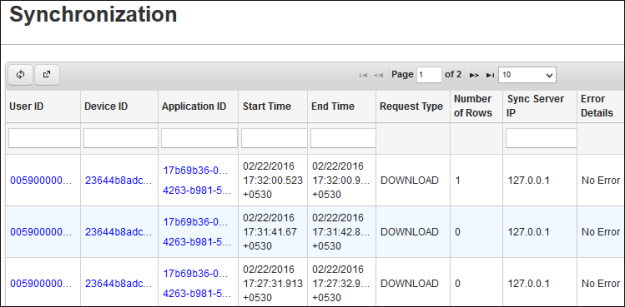
    

Synchronization Performance
---------------------------

Synchronization Performance view displays the average usage of a particular service. For example, If a user uses a service at three instances with the duration of one, two, and three minutes, the average usage time would be (one + two + three) / 3 = 2.

### Viewing the Synchronization Performance

Viewing the synchronization performance feature enables you to view the average usage of a particular service for each User ID. If the list is big, you can navigate to the required User ID record using **Previous** or **Next** options, or use the **Search** option. The search results display all User IDs that start with the User ID as entered in the search field.

For example: If the User ID “admin” is searched, the search results display admin1, admin2, admin3, and admin4 as per the ascending order alphanumerically.

To view Synchronization Performance, follow these steps:

1.  On Volt MX Foundry Sync Console, go to **Monitoring** section > **Synchronization Performance** view.  
    The list of Synchronization Performances appears under the search fields.
    
    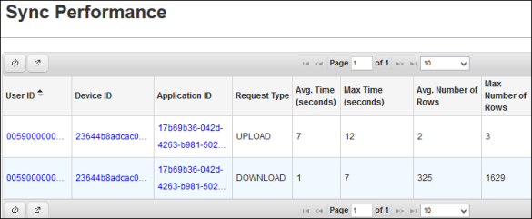
    

Merging Service
---------------

Merge Service consists of all the information between Upload Queue and Enterprise Data Source. You can monitor the merge status (Started, Processing Request, and Completed Request) per User and Application.

### Viewing Merge Service

From the list of records, you can navigate to the required **Application ID** record by using **Previous** or **Next** or by using a specific **Search** criteria based on **Start Date**, **Start Time**, **End Date**, **End Time**, **Current Status** and **Application**. The search results displays all Application ID records for each User ID that matches the search criteria.

**To view Merge Service, follow these steps:**

1.  On Volt MX Foundry Sync Console, go to **Monitoring** section > **Merge Service** view. The list of Merge Services appear under the search fields.  
    
    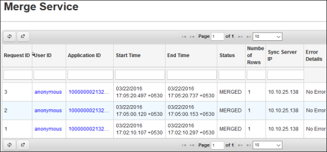
    

Replica Service
---------------

Replica service feature tracks all the changes in Enterprise Data Source that are to be sent to the Client. It exists between the Enterprise Data Source and the client.

### Viewing Replica of an Application

From the list of records, you can navigate to the required **Application ID** record by using **Previous** or **Next** options or by using a specific **Search** criteria based on **Start Date**, **Start Time**, **End Date**, **End Time**, **Current Status** and **Application**. All the Application ID records that match the search criteria appear.

**To view the replica of an application, follow the below step:**

1.  On Volt MX Foundry Sync Console, go to **Monitoring** section > **Replica Service view** tab. The list of Replica Services appears under the search fields.
    
    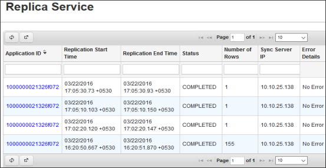
    

Upload Queue
------------

The Upload Queue is a queue that comprises of all the information from the client waiting to get updated at Enterprise Data Source server. You can add, delete or modify the information at the client side. It exists between the client and Enterprise Data Source.  

### Viewing the Upload Queue

From the list of records, you can navigate to the required **Device ID** record by using **Previous** or **Next** options or by using a specific Search criterion based on **Start Date**, **Start Time**, **End Date**, **End Time** and **Application**. The search results display all Device IDs that start with the ID as entered in the search field.

**To view the Upload queue, follow the below step:**

1.  On Volt MX Foundry Sync Console, go to **Monitoring** tab > **Upload Queue** view. The list of upload queues appears under the search fields.
    
    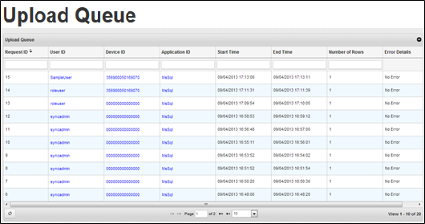
    

Persistent Databases
--------------------

Persistent Databases feature states the status (Success/failure) of the number of records merged/uploaded/downloaded. The **DB Name** lists the name (Replica/upload Queue database) of the database, **Status** lists the Success/failure status of the records, **Number of Tables** lists the number of tables, **Total Number of Rows** represent the number of rows that are uploaded/downloaded. Persistent Databases feature is applicable only for persistent configuration.

Conflicts
---------

The Conflicts view enables you to view the differences that occur due to inappropriate synchronization of the records between Client and Enterprise Data Source.

### Viewing Conflicts of a User and Device

From the list of records, you can navigate to the required User ID conflict record by using **Previous** or **Next** options or by using a specific **Search** criteria based on **Start Date**, **Start Time**, **End Date**, **End Time**, and **Application ID**. The search results displays all User IDs that start with the ID as entered in the search field.

For example: If you search for the User ID “admin”, the search results display admin1, admin2, admin3, and admin4 as per the ascending order alphanumerically.  

To view Conflicts, follow these steps:

1.  On Volt MX Foundry Sync Console, go to **Monitoring** tab > **Conflicts** view. The list of upload queues appears under the search fields.
    
    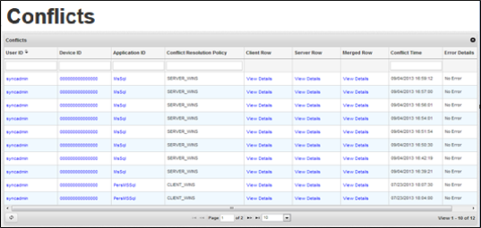
    

Change Replay
-------------

Change Replay feature of Volt MX Sync Console enables you to view the actions that the client performs that are updated at Enterprise Data Source based on Device ID.

### Viewing the Change Replay Process

From the list of records, you can navigate to required action by using **Previous** or **Next** options or by using a specific Search criteria such as **User ID**, **Device ID**, **Application**, **Sync Object** and **Change Type**. The search results displays all User IDs or Device IDs that start with the ID that you enter in the search field.

For example: If you search for the User ID “admin”, the admin1, admin2, admin3, and admin4 search results appear as per the ascending order alphanumerically.

To view the change replay process, follow the below step:

1.  On Volt MX Foundry Sync Console, go to **Monitoring** tab > **Synchronization** view. The list of change replays appears under the search fields.
    
    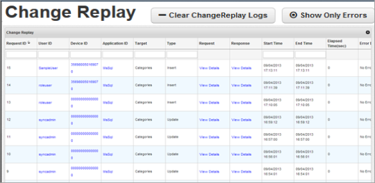
    
2.  Click **Clear ChangeReplay Logs** to clear the logs.
3.  Click **Show All Logs** to show all the logs.

Sync Errors
-----------

Sync Errors feature lists down all the errors that occur while you perform any sync operation ( download/upload/replica merge service), Error Details list downs the details of the error. You can search by column using the User ID, Application ID, Sync Operation, Date Time and Sync Server IP.

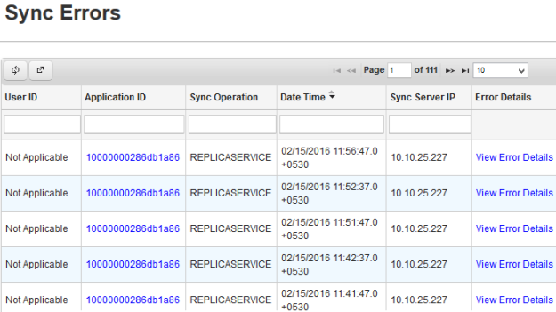

### Export to Excel

You can export the sync errors from the Console database to an Excel file format. To export the sync errors, follow these steps:

1.  Click the **Export to Excel** button to export the log data to Excel.
    
    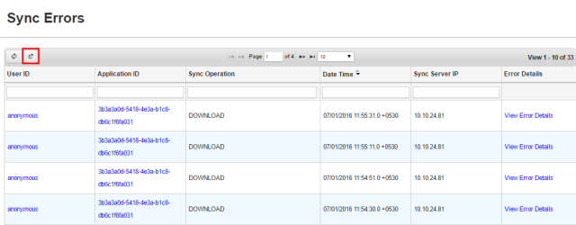
    
2.  The following pop-up window is displayed.
    
    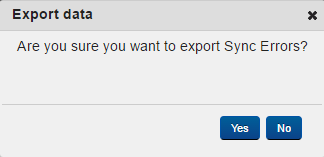
    
3.  Click the **Yes** button to export the logs to Excel. Otherwise, click **No**.
4.  Click the **Yes** button. The **Sync Errors** Excel file is downloaded to your system. The following table describes the outcome of the data exported.
    
    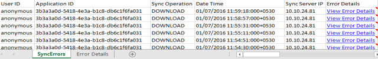
    
5.  Click the hyperlink displayed against each field in the **Error Details**to view the complete description of the selected error message.
    
    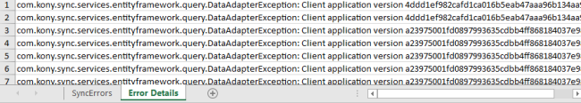
    
6.  If the export operation fails because of an error, the console displays a message explaining the cause of the error.
7.  If you do not have any logs to export, the console displays a message as there are no records to export.

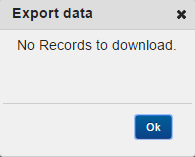

Security Audit
--------------

Security Audit user feature enables you to view all the changes that the client makes and that are updated at Enterprise Data Source server.

### Viewing Modifications

From the list of records, you can move to the required record using **Previous** or **Next**.

**To view modifications, follow below step:**

1.  On Volt MX Foundry Sync Console, go to **Monitoring** tab > **Security Audit** view. The list of Security Audit appears under the search fields.
    
    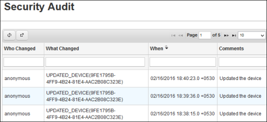
    

<table style="margin-left: 0;margin-right: auto;" data-mc-conditions="Default.HTML5 Only"><colgroup><col> <col> <col></colgroup><tbody><tr><td>Rev</td><td>Author</td><td>Edits</td></tr><tr><td>7.1</td><td>GS</td><td>GS</td></tr></tbody></table>
