                           

Runtime Configuration
---------------------

The runtime configuration details of Volt MX Foundry Sync Console enables you to view the configuration settings. The configuration details are divided into the following sections:

*   [Log Configuration](#log-configuration)
*   [Sync Services Properties](#sync-service-properties)
*   [Server Async Properties (Tomcat)](#server-async-properties-tomcat)
*   [Persistent Database Configuration](#persistent-database-configuration)
*   [Persistent Connection Pool Properties](#persistent-connection-pool-properties)
*   [Enterprise Connection Pool Properties](#enterprise-connection-pool-properties)
*   [Scheduler Properties](#scheduler-properties)
*   [Http Proxy Properties](#http-proxy-properties)
*   [Sync Console Properties](#sync-console-properties)

Each section displays the related settings.

### Log Configuration

The **Log Configuration** section displays the general configuration settings of an application. You can modify the settings of each feature displayed from the drop-down list using the available options. The following image displays different options in the **Log Configuration** section.

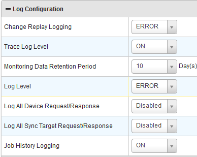

You can configure the following features in the section.

*   **Change Replay Logging**: The change replay logging allows you to configure log levels for the **Change replay** tab. The options to configure this feature are:
    
    *   **ON**: Select the option to log all the change replay actions.
    *   **OFF**: Select the option to disable logging on the **Change replay** tab.
    *   **ERROR**: Select the option to display only error logs on the **Change replay** tab.
    
    > **_Note:_** By default, Change Replay Logging is configured to **ERROR**.
    
*   **Trace Log Level:**The trace log feature helps you to track logs that appear on the trace logs screen. The options to configure this feature are:
    
    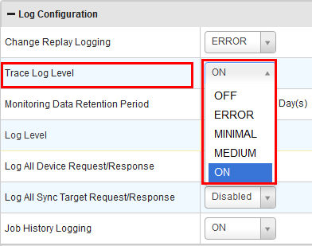
    
    *   **OFF**: Set the feature to **OFF**, to disable the application from capturing the logs.
    *   **ERROR**: When you select the option, the trace log entries are only error logs.
    *   **MINIMAL**: When you select this option, only the trace log entries only with the status (Success / Failed) are logged. The request/response headers and payloads are not logged.
    *   **MEDIUM**: When you select this option, only the trace log entries with request/response headers are logged.
    *   **ON**: You can set the feature to **ON** from the drop-down list, to capture all the logs.
        
        > **_Note:_** By default, the feature is set to **OFF**. To capture the logs in the [Logs](Logs.html) module, you should set this feature to **ON**. For more information on Trace Logs, refer [Trace Log](Logs.html#trace-log) section.
        
*   **Monitoring Data Retention Period**: You can define the number of days to retain the data that appears on the **Monitoring** tab.
*   **Log Level**: You can set the levels of log4j logging by selecting the following options from the drop-down list. You can also disable log level by selecting the option **OFF**.
    *   **TRACE**: Select the option to set the log4j log level to log all the traces .
    *   **DEBUG**: Select the option to set the log4j log level to log all the debug entries.
    *   **INFO**: Select the option to set the log4j log level to log the "INFO" tagged logs.
    *   **WARN**: Select the option to set the log4j log level to log all the warnings.
    *   **ERROR**: Select the option to set the log4j logs level to log all the errors.
    *   **FATAL**: Select the option to set the log4j log level to log all the fatal errors.
*   **Log All Device Request/Response**: Set the option to **Enabled** to log all the device request/response. Select **Disabled** to disable this feature.
*   **Log All Sync Request/Response**: This feature logs all the sync request/response by selecting **Enabled** from the drop-down. You can disable this feature by selecting **Disabled**.
*   **Job History Logging**: The Job History Logging feature helps you to set the log level of the job history screen. The following options are available to set the feature from the **Configuration** screen.
    
    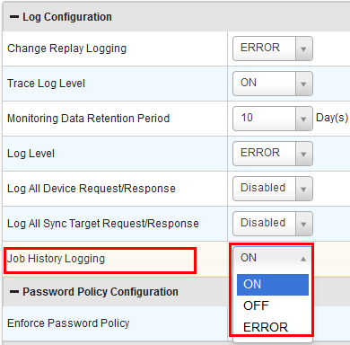
    
    *   **ON**: Select the option from the drop-down list to log the job history from the [Scheduled Jobs](Scheduled_Jobs.html) window.
        
        > **_Note:_** By default, the job history logging feature is set to **ON**.
        
    
    *   **OFF**: Select the option to disable the job history logging.
    *   **ERROR**: Select the option to log the errors in the job history.
*   Upon updating each property the following pop-up window is displayed.
    
    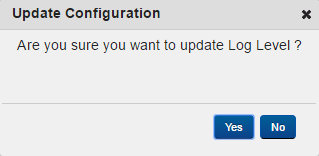
    
*   Click **Yes** to auto save the property changes. Otherwise, click **No**.

### Sync Service Properties

This section displays the properties of Sync Services.

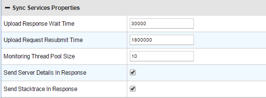

### Server Async Properties (Tomcat)

This section displays the Async properties of Sync on Tomcat server.

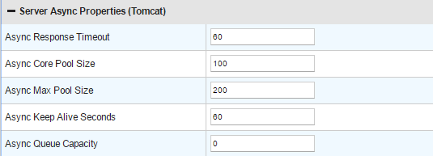

### Persistent Database Configuration

The Persistent Database Configuration section contains details about persistent database.

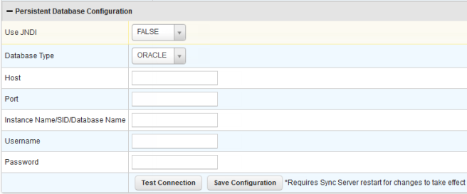

*   The **Use JNDI** field is configured as _FALSE_ always. To configure as **TRUE**, configure JNDI Datasources as jdbc/<appid>\_UploadQueue and jdbc/<appid>\_Replica for persistent sync configurations in the `syncservice.properties` file.
*   Select the required database type, _MSSQLSERVER_/ _MYSQL_/_ORACLE_/ _DB2_/_POSTGRESS_ from the **Database Type** drop-down. Enter the required details in **Host**, **Port**, **Instance Name/SID/Database Name** (if required), **Username** and **Password**.
*   Click **Test Connection** to verify the connection details.

*   Click **Save Configuration** to save all the properties.
    
    > **_Note:_** Restart Volt MX Foundry Sync Server for the changes to take effect.
    

### Persistent Connection Pool Properties

This section displays the properties of the persistent connection pool.

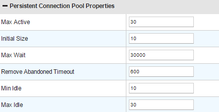

### Enterprise Connection Pool Properties

This section displays the properties of an enterprise connection pool.

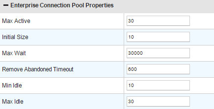

### Scheduler Properties

This section displays the properties of a scheduler.

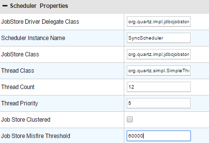

### Http Proxy Properties

This section displays the properties of Http proxy.

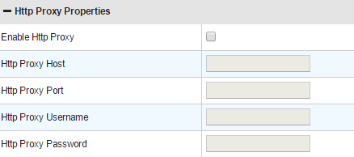

### Sync Console Properties

This section displays the properties of Sync Console.

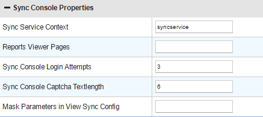

> **_Important:_** For the groups which do not have the **Save Configuration** button, a pop-up window is displayed. Click **Yes** button for the property changes to be auto-saved.  
  
Properties can also be updated directly in the database. Property value and updateTimeStamp of the property must be updated for the changes to reflect in run time.  

After the changes are complete, below properties require restart of the server for the changes to get affected.

*   All Persistent Connection Pool Properties Group
    
*   All Http Proxy Properties Group
    
*   All Enterprise Connection Pool Properties Group
*   All Scheduler Properties Group
    
*   Sync Log Location Property
*   Sync Log Option Property
    

 

<table style="margin-left: 0;margin-right: auto;" data-mc-conditions="Default.HTML5 Only"><colgroup><col><col><col></colgroup><tbody><tr><td>Rev</td><td>Author</td><td>Edits</td></tr><tr><td>7.1</td><td>GS</td><td>GS</td></tr></tbody></table>
