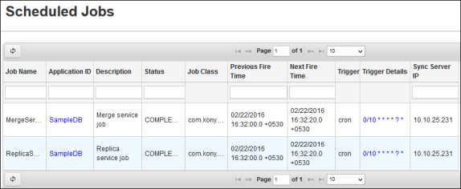
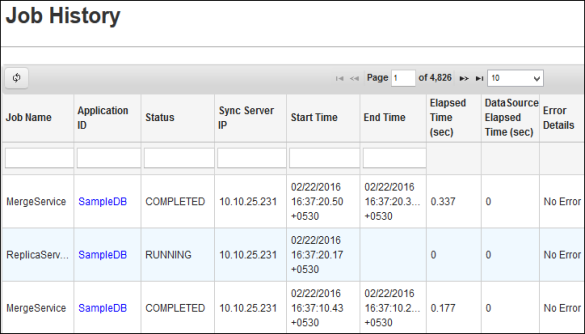

                            

Scheduled Jobs
==============

Scheduled Jobs view enables you to view the list of jobs that run at specific intervals and Job History. The number of scheduled jobs to view is 10, by default. You may change the number of scheduled jobs to view by selecting from the drop-down corresponding to **Page**.

The Scheduled Jobs view enables you to review the CRON jobs that are scheduled in the system. You have flexibility to edit CRON expression. You can modify to any interval; once a week, once a month, and as on. You can have a format of adding specified interval.

For example:

0 0 12 \* \* ? Fire at 12 pm (noon) every day

0 15 10 ? \* \* Fire at 10:15 am every day

0 15 10 \* \* ? Fire at 10:15 am every day

For more information on **Triger Details**, refer to **Cron Expressions** section in [http://www.quartz-scheduler.org/documentation/quartz-1.x/tutorials/TutorialLesson06](http://www.quartz-scheduler.org/documentation/quartz-1.x/tutorials/TutorialLesson06) and [http://www.quartz-scheduler.org/generated/2.2.2.html/qtz-all#page/quartz-scheduler-webhelp/co-trg\_crontriggers.html#](http://www.quartz-scheduler.org/generated/2.2.2.html/qtz-all#page/quartz-scheduler-webhelp/co-trg_crontriggers.html#).

View the Scheduled Jobs
-----------------------

The Scheduled Jobs feature enables you to view another list of Scheduled jobs.

To view the scheduled jobs, follow the below step:

1.  On Volt MX Foundry Sync Console, click the **Scheduled Jobs** tab. The Scheduled Jobs view appears with details such as **Job Name**, **Application ID**, **Description**, **Status**, **Job Class**, **Next Fire Time**, **Previous Fire Time**, **Trigger**, **Trigger Details**, and **Server IP**.
    
    
    

View the Job History
--------------------

View the Job History feature enables you to view the job history of various services.

To view the Job History, follow the below step:

1.  On Volt MX Foundry Sync Console home page, click **Scheduled Jobs** section > **Job History** tab. The **Job history** view appears.
    
    
