                           

Sync Configuration
==================

The **Sync Configuration** section enables you to perform various tasks such as viewing an application and its configuration file, adding, editing and deleting an application.

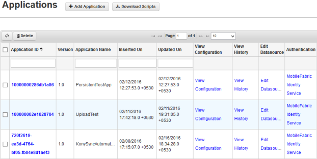

Following actions can be performed in this screen:

*   [Add Application](#add-application)
*   [View Configuration](#view-configuration)
*   [Change Configuration](#change-configuration)
*   [Delete Application](#delete-application)
*   [Edit Datasources](#edit-datasources)
*   [Assign Authentication Profile to Application](#assign-authentication-profile-to-application)
*   [Generate Upload and Replica DB Scripts](#Generating_Upload_and_Replica_DB_Scripts)
*   [Pagination](#Pagination)

Add Application
---------------

Volt MX  Foundry Sync Console enables you to add an application when needed.

To add an application, follow these steps:

1.  Click **Add Application** to add a new application in the **Applications** screen. The **Add New Application** view appears.
    
    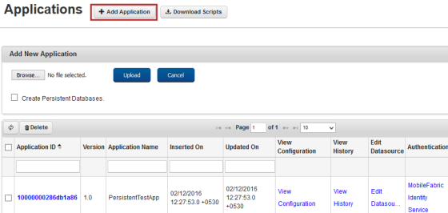
    
2.  Click **Browse** to get the configuration file and then click **Upload**.  
    After successfully uploading the configuration file, a confirmation message, **Application Configuration uploaded successfully** appears. The added application appears under the Applications list.
    
    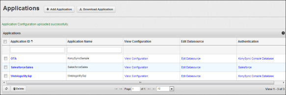
    

View Configuration
------------------

You can view the configuration file to know about the various configurations.

*   Click **View Configuration** link of the Application ID column. The configuration file for the selected Application ID appears.
    
    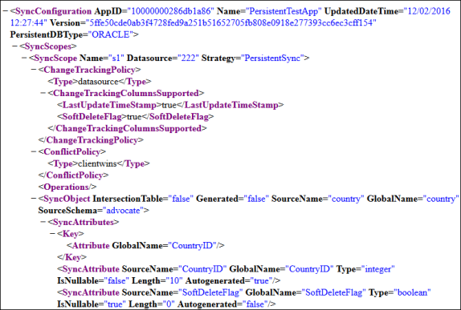
    

Change Configuration
--------------------

Volt MX  Foundry Sync Console provides you an option to change the configuration file when needed.

To change the configuration file of an application, follow these steps:

1.  Click the desired **Application ID**. The **Edit Application** view appears with an option to browse for the configuration file.
    
    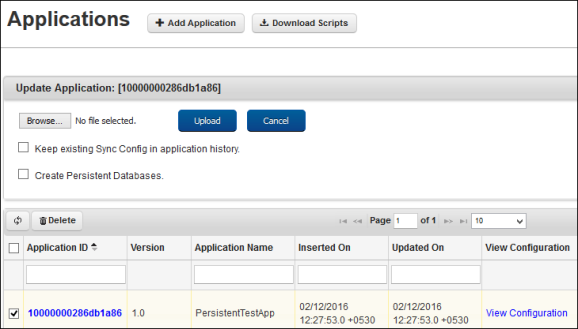  
    
2.  Click **Browse** to browse the required new configuration file and click **Upload**. After the successful update, a confirmation message, **Updated the Application successfully** appears.
3.  Click **Cancel** to abort the operation.

Delete Application
------------------

You can either delete a single application or multiple applications.

To delete an application, follow these steps:

1.  On Volt MX Foundry Sync Console, under **Configurations**, click the **Sync Configurations** tab to view the list of applications available.
    
    
    
2.  Click an **Application ID** checkbox to delete and click **Delete**.
    
    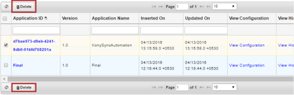
    
3.  A confirmation message, **Are you sure you want to delete selected Application(s)?** appears:
    
    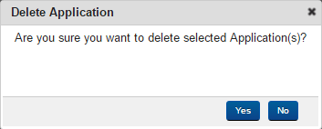  
    
4.  Click **Yes** to delete the selected application.  
    After successful deletion, a confirmation message, **Application(s) deleted successfully** appears.
    
    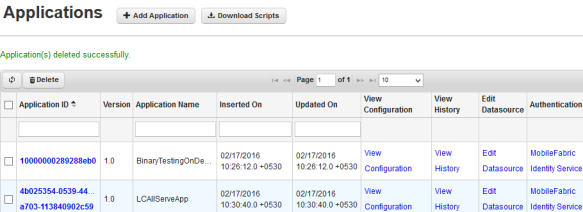  
    

Edit DataSources
----------------

Volt MX  Foundry Sync Console provides you an option to edit the datasources of a sync console application.

To edit the datasources of an application, follow these steps:

1.  Click **Edit DataSources** of the desired application from the list of applications displayed. The **Edit DataSource** dialog appears with an option to update the connection parameters. You can use the same page to modify all the supported datasources such as Middleware Database or Web service Endpoint.
    
    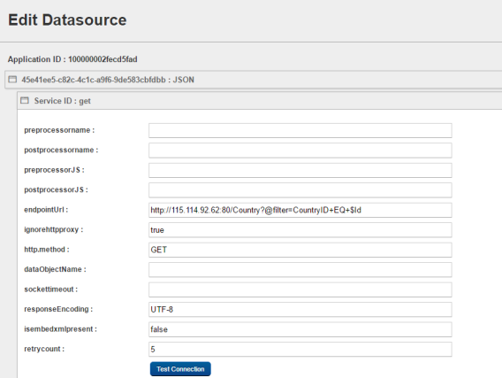
    
2.  You can test the latency and connectivity during customer ticket debugging by providing the valid database details and clicking on **Test Connection**. A message will be displayed as **Test Connection Successful**.
3.  Click **Update** to update the modifications.
4.  Click **Reset** to reset the updated changes .
5.  Click **Cancel** to abort the operation.

Assign Authentication Profile to Application
--------------------------------------------

Volt MX  Foundry Sync Console provides you an option to assign Authentication profiles (created in **User Management** > **Authentication** tab) to an application.

> **_Note:_** You may refer to [Authentication](User_Management.html#authentication) for detail information on authentication.

To assign or change the authentication profile of an application, follow these steps:

1.  On Volt MX Foundry Sync Console, under **Configurations**, click the **Sync Configurations** tab to see the list of available applications.
    
    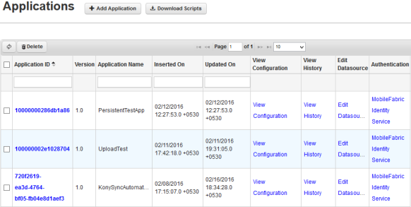
    
2.  Click the hyperlink under **Authentication** column of the desired application.  
    The **Assign Authentication** dialog appears.
    
    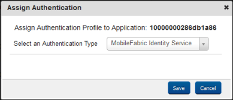
    
3.  Select an authentication type from the authentication types drop-down and click **Save**.

> **_Note:_** In Volt MX Sync 5.0, you should assign custom authentication as mentioned in [Custom Authentication Manager](Paas.html).

Generate Upload and Replica DB Scripts
--------------------------------------

Volt MX  Foundry Sync Console provides you an option to generate upload and replica DB scripts while adding the application itself.

To create the DB scripts, while adding the application, follow these steps:

1.  On Volt MX Foundry Sync Console, under **Configurations**, click the **Sync Configurations** tab to see the list of available applications.
    
    
    
2.  Click **Add Application** to add a new application. The **Add New Application** view appears.
    
    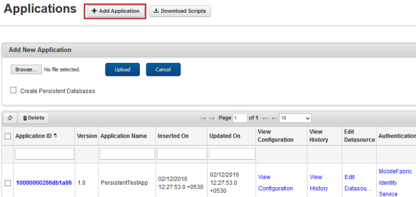
    
3.  Click **Browse** to get the configuration file.
    
    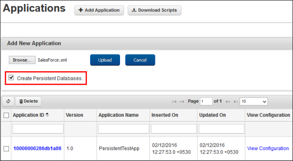
    
4.  Select the **Create Persistent Databases** checkbox and then click **Upload**.
    
    The next screen shows the configuration details that are captured from the configuration file:
    
    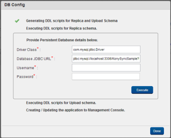
    
5.  Enter the username and password of the database and click **Execute** for both Replica and Upload schema.
    
    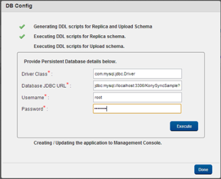
    
    After the successful uploading of DB scripts, a confirmation message, **Updated the Application successfully** appears.  
    
6.  Click **Done**.  
    The added application appears in the grid.
    
    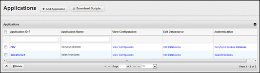
    
7.  To download DB scripts, you can select the application and click **Download Scripts**.
    
    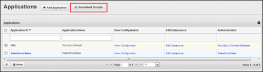
    
    > **_Note:_** You can download only those applications that are added using the **Create Persistent Databases** checkbox.
    

<table style="margin-left: 0;margin-right: auto;" data-mc-conditions="Default.HTML5 Only"><colgroup><col style="width: 37px;"> <col> <col></colgroup><tbody><tr><td>Rev</td><td>Author</td><td>Edits</td></tr><tr><td>7.1</td><td>GS</td><td>GS</td></tr></tbody></table>
