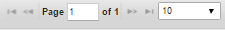

                           

Sync Console
------------

The Sync Console provides the ability to monitor and configure Volt MX Foundry Sync Framework. It provides an easy-to-use web-based user interface for diagnosing issues at run-time and monitor the system performance.

### Modules

The following modules are available in the Sync Console.

*   [Login](Login.html)
*   [Analytics Dashboard](Analytics_Dashboard.html)
*   [User Management](User_Management.html#user)
*   [Role based Access](Login.html#role-based-access)
*   [Application Management](Management_Console.html#application-management)
*   [Device Management](Devices.html#Device)
*   [Configuration](Config.html#Configuration)
*   [Monitoring](Management_Console.html#monitoring)
*   [Scheduled Jobs](Management_Console.html#scheduled-jobs)

### Pagination

If the number of applications is more than 10, you can use **Next** or **Previous** links to move to more applications. You may change the number of applications to view by selecting from the drop-down corresponding to **Page**.

