                           

User Management
===============

You can view the users of Volt MX Foundry Sync Console under **User Management** tab. This module consists of four sub-modules. They are **[User](#user)**, **[Role](#role)**, **[Group](#group)** and **[Authentication](#authentication)**.

> **_Note:_** By default, the list of 10 users are displayed. You can change the number of users to view by selecting from the drop-down corresponding to **Page**.

User
----

The **Users** tab enables you to view the list of users and manage them. You can perform the following tasks:

*   [Searching a User](#searching-a-user)
*   [Adding a User](#adding-a-user)
*   [Updating User Details](#updating-user-details)
*   [Deleting a User](#deleting-a-user)
*   [Enabling a User](#enabling-a-user)
*   [Disabling a User](#disabling-a-user)
*   [Assigning a User to Group](#assigning-a-user-to-a-group)
*   [Unassigning a User to Group](#unassigning-a-user-from-a-group)
*   [Assigning a Device to the User](#Assign2)

### Searching a User

Searching a User feature enables you to search for a user. This feature displays the User ID details such as **User Name**, **Email**, **Mobile**, **Status**, **Inserted On**, **Updated On**, **Group Name** and **Device ID**. The search results displays all User IDs that start with the User ID as entered in the search field. For example: If you enter the User ID _admin_ in **Search** field, the search results displays admin1, admin2, admin3 and admin4 in the ascending order alphanumerically.

To search for a user, follow these steps:

1.  Go to the **Users** tab in **User Management** section. The list of users appears.
    
    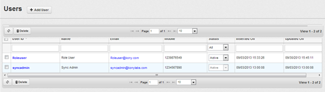
    
2.  Enter the desired **User ID** and click **Enter**. The User ID information appears.
    
    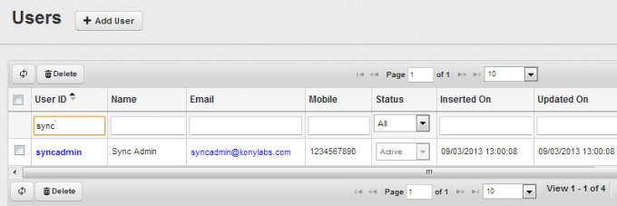  
    

### Adding a User

Adding a User feature enables you to add a user to the existing user list. Only System Administrator has the privilege to add a user. To add a user, follow these steps:

1.  Go to the **Users** tab in **User Management** section. The list of users appears on the screen.
    
    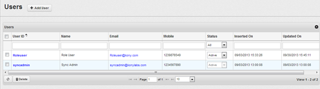  
    
2.  Click Add User to add a new user. The **Add User** view appears.
    
    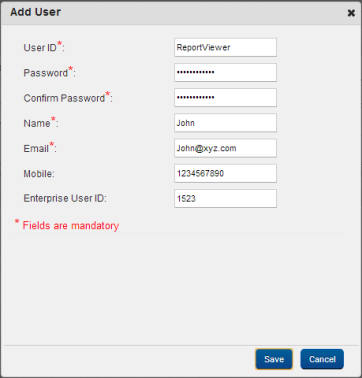
    

1.  **User ID:** The length of the User Id for alpha numeric characters should range from 8-100 without spaces. The special characters that you can use are Period (".") and Underscore ("\_"). The starting character for a User ID can be alphabet, number, period or Underscore.
2.  **Password:** The length of the password should vary between 8-200 characters and must contain at least one alphabetical and one numerical character without spacing. User ID should not be a password. The starting character for a password can be alphabet, number, period, or Underscore.
3.  **Confirm Password:** Re-enter the password.
4.  **User Name:** The length of the User Name may range from 3-1000 characters. The User Name can include alphabets and numbers.
5.  **Email:** The maximum length of email ID can be 200 characters.
6.  **Mobile:** Mobile Number should be numerical with length 10-15 characters.
7.  **Enterprise User ID:** Enterprise User ID length should be between 8-1000 characters. The Enterprise User ID can include alphabets and numbers.

3\. Click **Save**. After the user adds to the existing list, a confirmation message, “User <id> added successfully” appears on the window.

### Updating User Details

Updating User Details feature enables you to view and update the details of a user. From the list of users, you can locate the User ID record manually by using **Previous** or **Next** or by using **Search** option. To update the user details, follow these steps:

1.  Go to the **Users** tab in the **User Management** section. The list of User IDs appears, locate the User ID record manually by using **Previous** or **Next** options or by using **Search** option.
    
    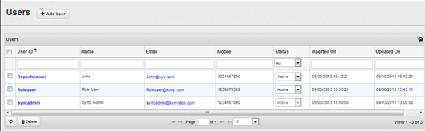  
    
2.  Click the **User ID**. The **Edit User** dialog appears.
    
    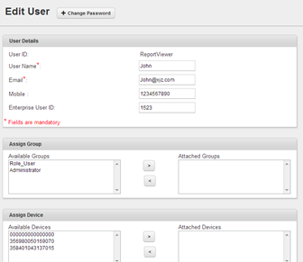
    
3.  Make the desired changes and click **Save**. After the changes are updated, a confirmation message, “User edited successfully” appears and the changes made to the User ID are reflected on the existing users view.
4.  In the above screen the user can also change his password by clicking **Change Password**. The **Change Password** dialog appears:
    
    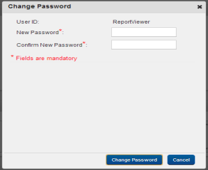  
    

### Deleting a User

Deleting a User feature enables you to delete a single User ID or multiple User IDs from the existing User ID list. You can locate a User ID record manually by using **Previous** or **Next** options or by using **Search** option.

To delete a user, follow these steps:

1.  Go to the **Users** tab in the **User Management** section. The list of users appears.
    
    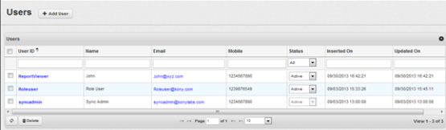
    
2.  Select the **User ID**s to delete.  
    
    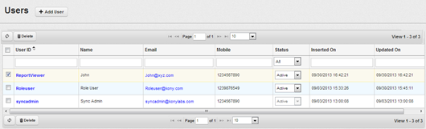
    
3.  Click **Delete**.  
    A confirmation message, "Are you sure you want to delete selected Users?" appears.  
    
4.  Click **Yes**.  
    The selected User ID profiles are deleted from the existing _Users_ list.

### Enabling a User

Enabling a privilege to a user feature helps you to enable a single or multiple users as required. The feature enables a user to gain access to Volt MX Foundry Sync Console.

To enable a privilege to a user, follow these steps:

1.  Go to the **Users** tab in **User Management** Section. The list of users appears.
    
    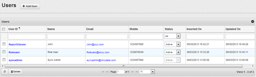
    
2.  Change **User Status** from **Inactive** to **Active**.
    
    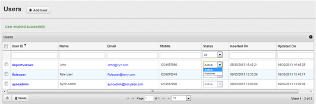
    

### Disabling a User

Disabling a user feature allows you to disable a single user or multiple users as required. It disables a user from gaining access to Volt MX Foundry Sync Console.

To disable a privilege to an user, follow these steps:

1.  Navigate to the **Users** tab in the **User Management** section. The list of users appears.
    
    
    
2.  Change **User Status** from **Inactive** to **Active**. The below confirmation message appears.
    
    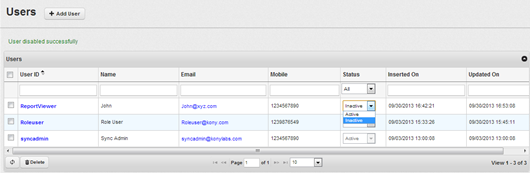
    

### Assigning a User to a Group

Assigning a user to a Group feature enables you to assign a User ID to a Group. You can assign single or multiple groups at a single instance.

**To assign a user to a Group, follow these steps:**

1.  Go to the **Users** tab in **User Management** section. The list of users appears.
    
    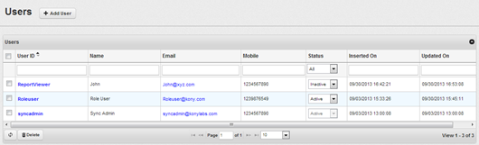
    
2.  Click the User ID of the required User to assign. The **Edit User** dialog appears.
    
    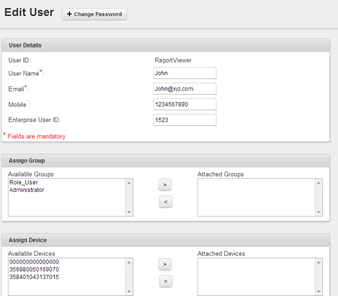
    
3.  From the list of **Available Groups**, select the required group and click the right arrow. The selected Group moves to **Attached Groups** section.
    
    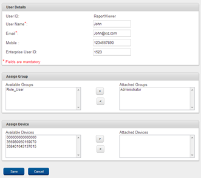
    
4.  Click **Save**. The User ID is assigned to the selected user Group and you can view the user under the Group Name of the users list.
    
    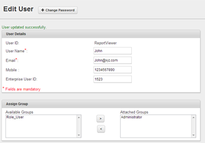
    

### Unassigning a User from a Group

You can unassign a User ID from a Group at a single instance. To unassign a user, follow these steps:

1.  Go to the **Users** tab under **User Management** section.
    
    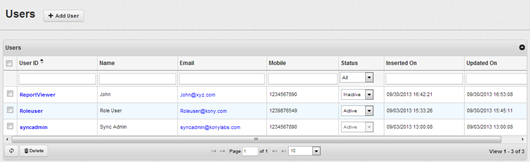
    
2.  Click **Group Name** of the corresponding **User ID** to unassign. The below **Assign Group** dialog appears.
    
    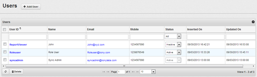
    
3.  From the **Attached Groups** section, select the Group Name to undo the assignment and click green back arrow. The selected Group is removed from the **Attached Groups** section.
    
    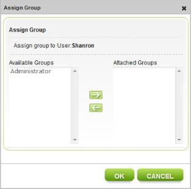
    
    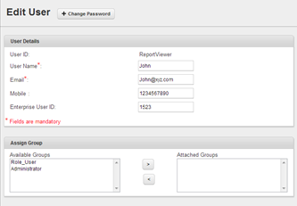
    
4.  Click **OK**. As the selected User ID is unassigned from the Group, the pre-assigned Group Name disappears for the corresponding unassigned user. If no groups are assigned, the **Assign Group** link appears under the Group Name for the corresponding User ID.

### Assigning a Device to a user

You can assign devices to the created / existing users.

To assign a device, follow these steps:

1.  Click **User** tab under **User Management** section.
    
    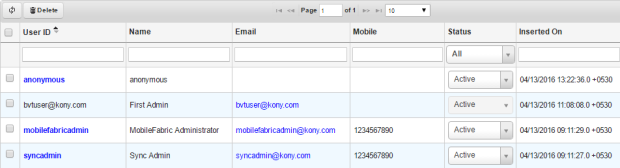
    
2.  Click the User ID of a user from the list displayed. The Edit User dialog appears.
    
    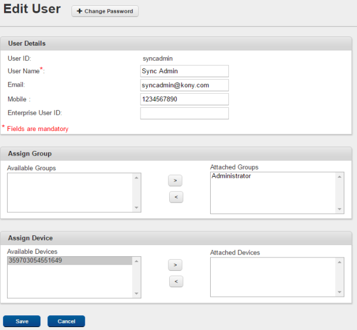
    
3.  From the available devices, select a device and click  to attach the device to the selected user.
4.  The selected device will be attached to the user.

### Removing Assigned Device of a User

You can unassign a device to a user as required.

To unassign a device to a user, follow these steps:

1.  Go to the **User** tab under **User Management** section.
    
    
    
2.  Click the User ID for a desired user. The **Edit User** dialog appears.
    
    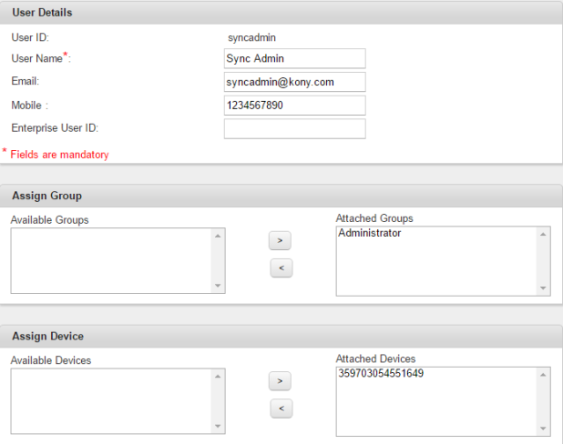
    
3.  From the **Attached Devices** section, select the device to undo the assignment and then click the  arrow. The selected device is removed.

Role
----

The Roles feature enables you to view the description of the existing User ID roles in the Volt MX Foundry Sync Console.

### Viewing the Role

To view the Roles, follow these steps:

1.  Go to the **Roles** tab in the **User Management** section.
    
    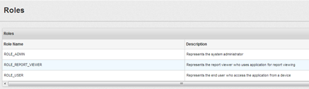
    

Group
-----

Groups view enables you to view the list of Groups that a device and a user are assigned to and manage group. You can also create a Group and assign users and devices to that Group. The UI also provides you with an option to edit and delete a Group. If the number of Groups is more than 10, you can use the **Next** or **Previous** to move to the corresponding list of Groups. You can perform the following tasks:

*   [Creating a Group](#creating-a-group)
*   [Editing a Group](#editing-a-group)
*   [Deleting a Group](#deleting-a-group)
*   [Assigning a Role to a group](#assigning-a-role-to-a-group)
*   [Assigning an Application to a group](#assigning-an-application-to-a-group)

### Creating a Group

Creating a Group feature enables you to create a Group. You can enter name of the Group and its details in the respective fields while creating a Group.

To create a Group, follow these steps:

1.  Go to **Groups** tab under **User Management** section.  
    
    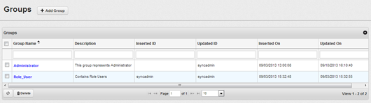
    
2.  Click **Add**. The **Add Group** dialog appears.

1.  Enter name of the group in **Group Name**.
2.  Enter details of the group in **Details**.
    
    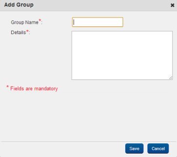
    

1.  Click **Save**. A confirmation message, “Group <groupname> added successfully” appears. The created group name appears in Groups view.

### Editing a Group

Editing a group feature enables you to edit the group name and its details.

To edit a group, follow these steps:

1.  Go to the **Groups** tab in **User Management** section.  
    
    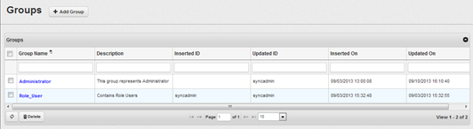
    
2.  Click **Group** **Name** to edit. The **Edit Group** dialog appears.  
    
    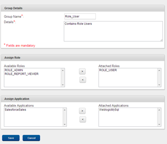
    
3.  Edit the details and click **Save**. After successful update, a confirmation message, “Group edited successfully” appears.

### Deleting a Group

Deleting a group feature allows you to delete a group that is already available in the list of groups. If a group that is assigned to a user is deleted, the user automatically gets unassigned from the deleted group. You can either delete a single group or multiple groups as required.

To delete a Group, follow these steps:

1.  Navigate to the **Groups** tab under the **User Management** section.  
    
    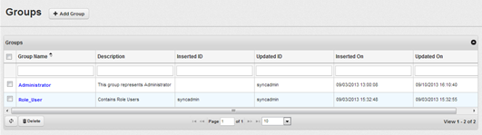
    
2.  Select a group name, and then click **Delete**.  
    A delete confirmation message, “Are you sure you want to delete selected Groups?” appears.  
    
3.  Click **Yes**.  
    The selected group is deleted.

### Assigning a Role to a Group

Assigning a role to a group feature enables you to assign a role or multiple roles to a group.

To assign a role to a group, follow these steps:

1.  Go to the **Groups** tab under **User Management** section.
    
    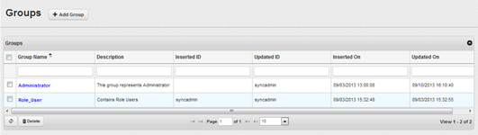
    
2.  Click **Group name** of the corresponding Group. The **Edit Group** page appears.
    
    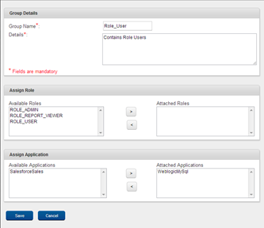
    
3.  Select a Role from the **Available Roles** and click the green forward arrow. The selected role appears under **Attached Roles**.
    
    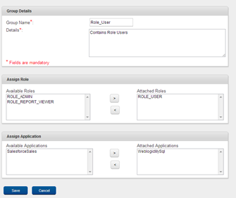
    
4.  Click **Save**.  
    The Group is assigned to the selected Role.

### Assigning an Application to a Group

Assigning an application to a group feature enables you to assign a single or multiple applications to a Group.

To assign an application to a group, follow these steps:

1.  Go to the **Groups** tab in **User Management** section.
    
    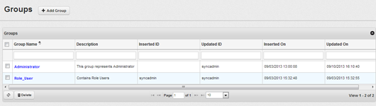
    
2.  Click group name of the corresponding group. The **Edit Group** page appears.
    
    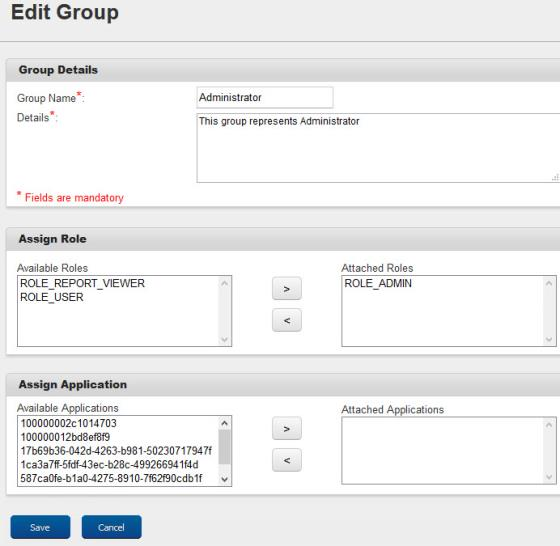
    
3.  Select the desired application from the list of Available Applications and then click the forward arrow.  
    The selected application appears under **Attached Applications**.
4.  Click **Save**.  
    You can view the group to which the application is assigned under **Name** section on the Groups list.

Authentication
--------------

Authentication view enables you to create authentication profiles. Authentication profiles are assigned to applications. All device users of an application are authenticated with the assigned profile. After creating a profile, the Test Connection option validates the profile before assigning it to applications.

*   [Default Authentication Mode](#default-authentication-mode-volt-mx-sync-console-database)
*   [Creating an Authentication Profile](#creating-an-authentication-profile)
*   [Viewing errors of Authentication Profiles](#viewing-errors-of-authentication-profiles)

### Default Authentication Mode - Volt MX Sync Console Database

The default authentication mode is Volt MX Sync Console Database. Once an application is uploaded, the authentication mode is set to Volt MX Sync Database.

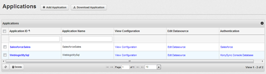

### Creating an Authentication Profile

To create an authentication profile other than Volt MX Sync Database, follow these steps:

1.  Click the **User Management** section > **Authentication** tab.
    
    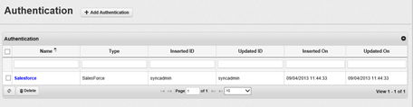
    
2.  Click **Add Authentication**. The **Add Authentication Profile** dialog appears.
    
    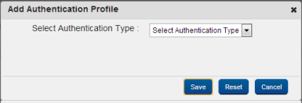
    
3.  You may create any one of the below types of authentication profiles:
    
    *   Select _Open LDAP_ from the drop-down to create an open LDAP authentication type.
        1.  Enter LDAP details and click **Test Connection** to verify the connectivity of LDAP.
            
            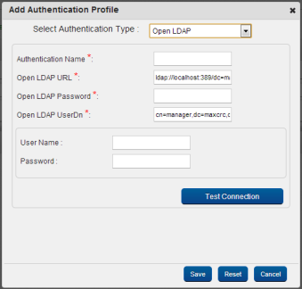
            
    *   Select _Microsoft ADS_ from the drop-down to create a Microsoft ADS authentication type.
        1.  Enter Microsoft ADS details and click **Test Connection** to verify the connectivity of Microsoft ADS.
            
            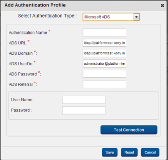
            
    
    *   Select _SalesForce_ from the drop-down to create a SalesForce authentication type.
        1.  Enter SalesForce details and click **Test Connection** to verify the connectivity of SalesForce.
            
            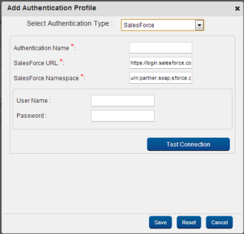
            
    
    *   Select _Custom_ from the drop-down to create a Custom authentication type.
        1.  Enter Custom details and click **Save**.
            
            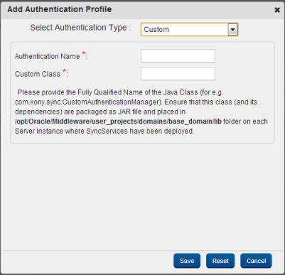
            

### Viewing Errors of Authentication Profiles

To view the errors while adding authentication profiles, follow these steps:

1.  Click the **User Management** section > **Authentication** tab.
2.  In the **Add Authentication Profile** dialog, click **Click here to view logs** hyperlink to view the errors.
3.  Click **Add Authentication**. The **Add Authentication Profile** dialog appears.
    
    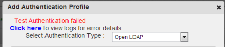
    
4.  The Tracker view appears with the logged errors.
    
    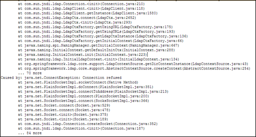
