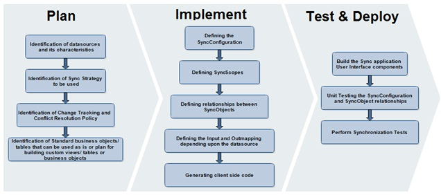

                    

Application Development
=======================

Data Synchronization application development is not different from the normal software development. Therefore, the best practices for a successful software development also apply to Data Synchronization application development. However, it is also useful to be aware of the additional best practices for the effective and efficient Volt MX Foundry Sync application development. The key factors for a successful Volt MX Foundry Sync application development are as follows:

*   Design the SyncObjects used in an application based not only on the client application requirements but also on the business objects available in the target backend system(s)
*   Design the SyncObjects to only capture the data to show on the device or drive the UI logic on the client side.
*   Be aware of the dependencies if developing client- and server-side components in parallel
*   Plan short iterative development cycles to ensure that the application is always integrated and that risks are identified and handled as early as possible.

Planning Phase
--------------

Some of the most important artifacts in the planning phase are as follows:

*   SyncObjects required in the application are identified and verified that you can map them to the business objects in a backend system as well as they are sufficient to realize the client-side requirements.
*   Client GUI design and navigation model are determined and agreed by the stakeholders
*   Use cases covered in each iterative cycle in the implementation phase are determined

One of the key decisions in the planning phase is to identify the business objects in the backend system and to decide how they are represented in the client application. Since one of the core functions of an Volt MX Foundry Sync application is that the business objects updated on a client device is successfully uploaded to a backend system and vice versa, it is very important to identify which business object in a backend system can be used and to identify the dependencies of the business objects on other objects. The identification of the business objects is typically followed by the identification of existing Database Tables, Web Service End Points or SAP BAPIs.

On the client side, the same business object identification process is required based on the requirements. It is especially important to identify whether the downsized or merged version of the business objects in a backend system can be used.

In most cases, the backend wrappers are responsible for absorbing the differences between the client-side business objects and those in a backend system. However, if they are greatly different, it should be carefully investigated whether backend wrappers can really absorb the differences.

Since the GUI requirements of client applications can differ greatly from an application to another depending on the target application users, it is advisable to conduct a preliminary usability test with potential users of the application and to agree on the GUI design and navigation model used in the application as early as possible.

Finally, before moving on to the first development cycle, it is worth planning which use cases will be covered in each development cycle (For more information, refer to Iterative / Use Case Driven Development).

Implementation Phase
--------------------

In each development cycle in the implementation phase, the client- and server-side components can be developed in parallel. However, it is important to be aware of the following dependencies:

*   To finalize the SyncObjects access logic in the client application, the definition of SyncObjects needs to be completed and the changes in SyncObject definition can affect the client SyncObject access logic.
*   When SyncObjects are defined and backend wrappers are implemented, sample data from a backend system can be used for client application standalone testing; before that, test data must be created within the test code of the client application

For efficient parallel development, therefore, it is important to plan the activities accordingly taking these dependencies into account.

Test / Deployment Phase
-----------------------

At the end of each development cycle, it is important to conduct the integration / synchronization test, which should include the following:

*   Synchronization performance benchmark with various data volume
*   Performance benchmark of the client application on a target client device
*   Application deployment test

Performing the integration / synchronization test at the end of each development cycle is beneficial because it makes it possible to identify issues and risks that should be addressed in the next development cycle.

After the completion of all the development cycles and testing, SyncObjects and backend wrappers are moved to the production system.

Below are the test case scenarios that need to be covered for each of the SyncObjects

*   **Initial Data Download Test** (This test simulates the handling of a download service request sent from a client device)
*   **Create Test** (After performing the initial download test, the create test should be performed to create a SyncObject instance / record on the client and ensure that the new record does appear in the backend after a successful sync operation)
*   **Update Test** (The update test should be performed to modify a SyncObject instance / record on the client and ensure that the update record does appear in the backend after a successful sync operation)
*   **Delete Test** (The delete test should be performed to delete a SyncObject instance / record on the client and ensure that the deleted record does get deleted in the backend after a successful sync operation)
