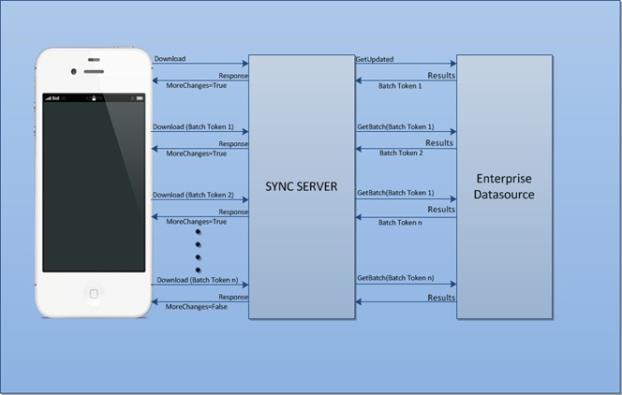

                    

Batching in Webservices
=======================

The below diagram depicts the high level representation of the download service call with batching from the device to datasource in OTASync.

1.  When user does a sync from device, “upload” and “download” service calls are invoked from device to Sync .
2.  In “download” service call, Sync invokes the service mapped for the “Getupdated” operation, enterprise datasource returns the first batch data along with token that is needed to get the next batch.
3.  Sync adds the batch token along with other context parameters into the response, so that Sync knows next time it has to get the next batch instead starting the download from the beginning.
4.  Device keeps on invoking the “download” until “more change available” flag is _false_. Device sends the batch context received in the response from the Sync in the next request.
5.  If the batch context is available in the download request, then Sync invokes the “GetBatch” operation to get the next batch.
