                    

DataSources
===========

Databases
---------

### Sample XML tags for MySQL, Oracle, MSSQL, PostgreSQL, and DB2 server

Below are the XML tag examples for various databases that are useful to define the database datasource in the Sync Configuration file.

**MS SQL Server**

<DataSource ID="VoltMXSyncSample" Type="database" Class="com.voltmx.sync.services.datasource.jdbc.JDBCDatasource2">	
          <Database Name="VoltMXSyncSampleConfig" Type="MSSQLSERVER" IsJNDIDataSource="false" 
           JndiORJdbcURL="jdbc:sqlserver://localhost:1433;databaseName=VoltMXSyncSample;user=sa;password=voltmx123!" 
           DriverName="com.microsoft.sqlserver.jdbc.SQLServerDriver"/>
</DataSource>



**Oracle**

<DataSource ID="VoltMXSyncSample" Type="database" Class="com.voltmx.sync.services.datasource.jdbc.JDBCDatasource2">
	<Database Name="VoltMXSyncSampleConfig" Type="ORACLE" IsJNDIDataSource=
        "false" 
        JndiORJdbcURL="jdbc:oracle:thin:system/voltmx123!@localhost:1521:xe" 
        DriverName="oracle.jdbc.driver.OracleDriver"/>
</DataSource>


**MySQL**

<DataSource ID="VoltMXSyncSample" Type="database" Class="com.voltmx.sync.services.datasource.jdbc.JDBCDatasource">
	<Database Name="VoltMXSyncSampleConfig" Type="MYSQL" IsJNDIDataSource=
        "false" 
        JndiORJdbcURL="jdbc:mysql://localhost:3306/voltmxsyncsample?user=root&amp;password=voltmx123!" 
        DriverName="com.mysql.jdbc.Driver"/>
</DataSource>



**PostgreSQL**

<DataSource ID="VoltMXSyncSample" Type="database" Class="com.voltmx.sync.services.datasource.jdbc.JDBCDatasource">
        <Database Name="VoltMXSyncSampleConfig" Type="POSTGRESQL" IsJNDIDataSource="false" JndiORJdbcURL="jdbc:postgresql://localhost:5432/voltmxunittestdatabase?user=postgres&amp;password=voltmx123!" DriverName="org.postgresql.Driver"/>
   </DataSource>



**DB2**

<DataSource Class="com.voltmx.sync.services.datasource.jdbc.JDBCDatasource2" ID="db2" Type="database">
     <Database DriverName="com.ibm.db2.jcc.DB2Driver" IsJNDIDataSource="false"
     JndiORJdbcURL="jdbc:db2://localhost:50000/SYNCDB:currentSchema=VOLTMXSYNCSAMPLE;"
     Name="dbclient" Password="voltmx123" Type="DB2" UserName="db2admin">
		<ConnectionProps/>
	    </Database>
</DataSource>



Other Datasources
-----------------

### Operations

**Create:** This operation is required when user creates new records from the device. When the change type from the device for a row is “insert”, sync engine invokes the service that is mapped for Create operation.

**Update:** This operation is required when user updates records from the device. When the change type from the device for a row is “update”, sync engine invokes the service that is mapped for Update operation.

**Delete:** This operation is required when user deletes records from the device. When the change type from the device for a row is “delete”, sync engine invokes the service that is mapped for Delete operation.

**Get:** Sync engine uses this operation to fetch the latest data from the datasource. Before invoking the Update / Delete on datasource, Get is invoked to check whether there are any conflicts. If Get operation is not defined, then conflicts are not supported. Sync engine will also use this operation during download to fetch the data from the datasource for each row when "getUpdated" operation does not return all the column data.

For example, if "getUpdated" operations returns only the list of primary keys, then sync engine will internally invoke the ‘get’ operation for each primary key and accumulate all the data and send it device.

**GetUpdated:** This operation is invoked to download the data from datasource to the device/replica. This operation has to accept the LAST\_SYNC\_TIMESTAMP from the context variables to get the incremental updates.

**GetDeleted:** This operation is invoked to download the data that is marked as deleted in the datasource to the device / replica. This is an optional operation, and it is not needed when datasource has no delete functionality. If SoftDeleteFlag mapped in “getUpdated” operation output mapping, then also it is not required to define the “getDeleted” operation.

**GetAll:** Sync engine uses this operation to get all the data for the sync object when the datasource is unprovisioned.

**GetBatch:** Sync engine invokes this operation to fetch the data from the datasource in batches.

**BATCH\_OFFSET**: Sync engine sets this context parameter into the context for the input mapping. This value contains an integer value indicating the number of rows downloaded so far in the current sync object. This parameter can be mapped when backend services are using pagination based batching (for example, batching with LIMIT and OFFSET). In case of pagination batching you can map the BATCH\_SIZE to LIMIT and BATCH\_OFFSET to OFFSET.

### Bulk Upload Operation

While uploading the data from device voltmx sync has capability to upload the rows in batches. But using normal create/update/delete operations, sync server will upload single row in each service call to back-end data source, which is causing delay (Sometimes leading to Time Out issue) in uploading the device data and increasing the overall sync time. So to overcome this limitation we have provided bulk upload capability from sync server to back-end data source.

Sync server can upload the multiple rows through single service to the back-end data source when the back-end service supports the multiple rows during uploads. This is applicable only for SOAP/XML/JSON services only.

To achieve this you need to map the ‘Bulk’ operations with the services which accepts multiple rows. Sync server will consolidate the rows which belongs to one sync object and same change type (create, update, delete) into a collection of records and invoke the configured bulk service with that collection.

**Example**: If the device upload request has an update to ‘Account’ row and ‘BulkUpdate’ operation is configured at ‘Account’ sync object, then sync server will look for other ‘Account’ rows in the device upload request which has same change type as ‘Update’, and create a collection of records and invoke the configured ‘BulkUpdate’ service.

As service need to accept multiple rows, its input parameter should be of type **collection** and you should have defined the request template with ‘#foreach’ and used the sync attribute names as inner parameters with in ‘#foreach’ block.

For more information on **Collection** datatype, refer [Adding a collection to SOAP Service](http://docs.voltmx.com/voltmxonpremises#../Subsystems/Studio_User_Guide/Content/Collection.html).

> **_Note:_** Configured service should expect the ‘collection’ primary keys and return the rows which matches the input primary keys.

### Bulk Create Operation

The **BulkCreate** operation is used when developer wants to upload all the records with change type as ‘insert’ from the device. The request should go to back-end datasource with a single service invocation.

The following example for all operations, we take Salesforce as back-end with OTA Sync Strategy for Account sync object.

**Example**:

*   Service configuration (Account\_Bulkcreate ) for BulkCreate operation of Account sync object.
    
    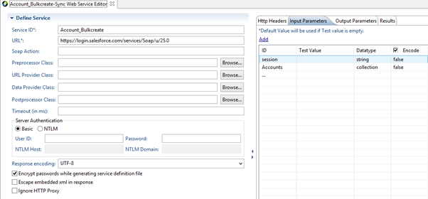
    
    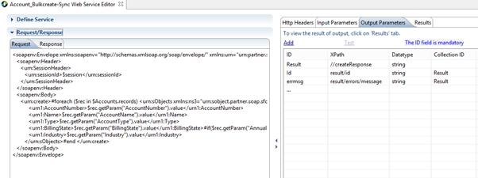
    
*   Mapping BulkCreate operation with Account\_Bulkcreate service for Account Sync object.
    
    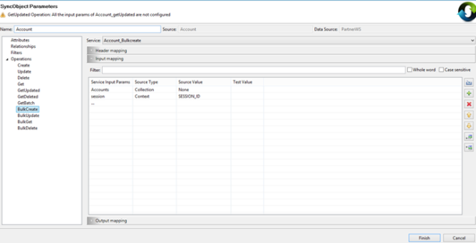
    
    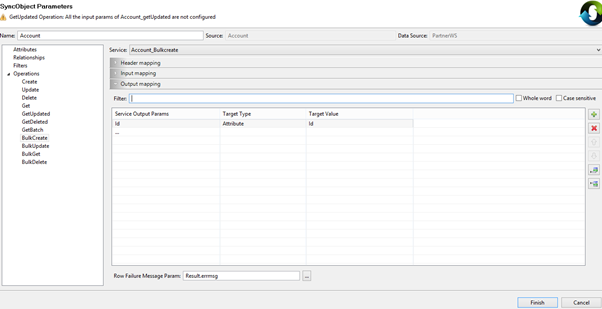
    

### BulkUpdate Operation

This **BulkUpdate** operation is used when developer want to upload all the records with change type as ‘update’ from the device. The request should go to back-end data source with a single service invocation.

**Example**:

*   Service configuration (Account\_Bulkupdate) for BulkUpdate operation of Account sync object.
    
    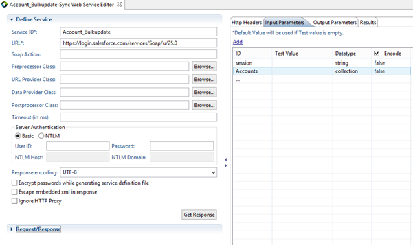
    
    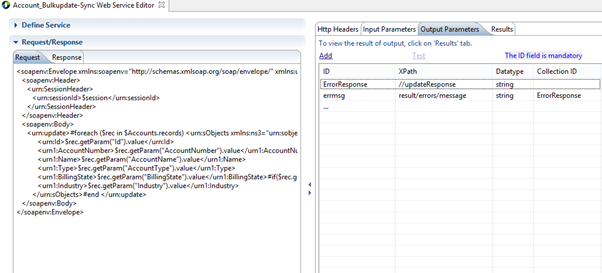
    
*   Mapping BulkUpdate operation with Account\_Bulkupdate service for Account Sync object.
    
    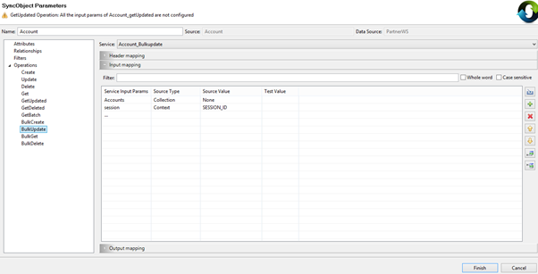
    

### BulkDelete Operation

This operation is required when developer wants to upload all the records with change type as ‘delete’ from the device. The request should go to back-end data source with a single service invocation.

**Example**:

*   Service configuration (Account\_Bulkdelete) for BulkDelete operation of Account Sync object.
    
    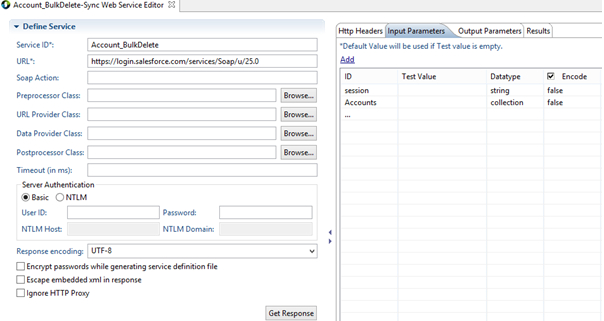
    
    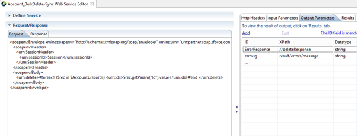
    
*   Mapping BulkDelete operation with Account\_Bulkdelete service for Account Sync object.
    
    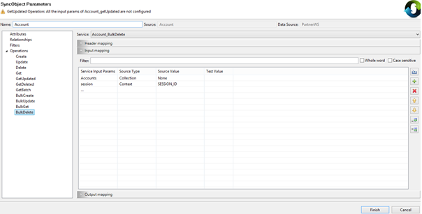
    

### BulkGet Operation

Sync engine uses this operation to fetch the latest data from the datasource during the **BulkUpload** phase. Before invoking the BulkUpdate / BulkDelete on data source, BulkGet is invoked to check whether there are any conflicts. If BulkGet operation is not defined, then sync engine will fall back to ‘Get’ operation and invokes the service for each individual primary key.

**Example**:

*   Service configuration (Account\_Bulkget ) for BulkGet operation of “Account” sync object.
    
    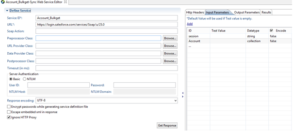
    
    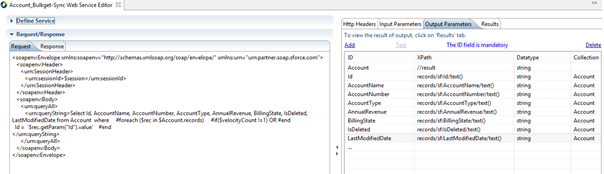
    
*   Mapping BulkGet operation with Account\_Bulkget service for Account Sync object.
    
    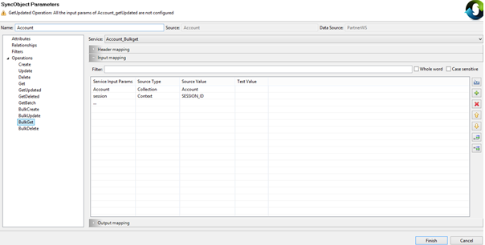
    
    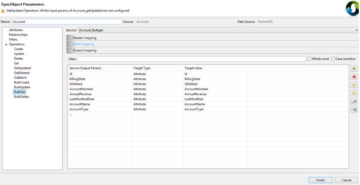
    

### Use Cases for Bulk Operations

*   **Parent-child rows**
    *   All parent rows through one service and all child rows through one service.
    *   Create a child row in existing parent row, create a new parent and child
    *   Delete parent with cascade delete, delete another parent with cascade delete.
*   **Self-referencing objects**
    *   Person-Person, when we upload parent person & child person.
        

### Error Handling During Bulk Uploads

During the bulk uploads, there can be a case where few records are failed at the back-end service logic due to business validations. To handle such failures in Volt MX Sync, user need to map the “Row Failure Message Param” in the output mapping in each of the bulk operation to the service output parameter which indicate the error.

Volt MX  Sync expects the error messages order to be same as input record order. For example, if we are uploading 4 rows and records at 2nd and 4th rows are failed, then the response should look similar to below, where "/error/message" is present only in 2nd and 4th rows and not in 1st and 3rd. Based on this mapping, Volt MX sync server will consider 2nd and 4th rows are failed and 1st and 3rd are successful.

<createResponse>
    <result>
       <id>0039000001c3VgeAAE</id>
       <success>true</success>
     </result>
     <result>
       <errors>
          <fields>LastName</fields>
          <message>Required fields are missing: \[LastName\]</message>
          <statusCode>REQUIRED\_FIELD\_MISSING</statusCode>
        </errors>
        <id xsi:nil="true"/>
        <success>false</success>
      </result>
      <result>
        <id>0039000001c3VgfAAE</id>
        <success>true</success>
      </result>
      <result>
         <errors>
               <fields>LastName</fields>
               <message>Required fields are missing: \[LastName\]</message>
               <statusCode>REQUIRED\_FIELD\_MISSING</statusCode>
          </errors>
            <id xsi:nil="true"/>
            <success>false</success>
       </result>
</createResponse> 


### Context Variables

**USER\_ID:** Sync engine sets this variable into the context. This variable contains the user id of the user who initiated the sync.

**LAST\_SYNC\_TIMESTAMP:** Sync engine sets this variable into the context. Last update time stamp is sent from the device for each sync. Server sends the updated last sync time in the response. You have to map this variable in 'getUpdated' operation to get incremental updates.

**CURRENT\_TIMESTAMP:** The current time of the server. If 'getServerTimne' is defined in the sync configuration, then this value contains the datasource current time as returned by the 'getServerTimne' service, otherwise value contains the Sync local current time.

**MORE\_CHANGES\_AVAILABLE:** You need to map this context parameter in the 'getUpdated' operation output mapping for batch processing. If the value is evaluated to true, then 'getBatch' operation is invoked for the next batch. If this context variable is not mapped, then more changes available are considered as false.

**PENDING\_BATCHES:** You need to map this context parameter to indicate the pending number of batches. This is optional, if not mapped then pending batches are '0'.

**BATCH\_SIZE:** Sync engine sets this context parameter into the context for the input mapping. Operations like 'getUpdated' and 'getBatch' can map this in the input mapping.

There is no guarantee that the requested batch size is the actual batch size. Actual batch size is closer to the specified batch size.

> **_Note:_** While specifying the Batch size from the device, please make sure that it is a valid value for enterprise datasource. For example: Salesforce throws an error for batch size more than 2000.

**SESSION\_ID:** You can set this context variable in the custom authentication manager class for session based batching. If SESSION\_ID is set in the context, only for the first time, the user is authenticated in the batch processing, in the subsequent calls, you just verify if the SESSION\_ID is valid or not. Once batch processing is over, SESSION\_ID is cleared.

You can map this context variable in operation input mapping when service needs session id.
