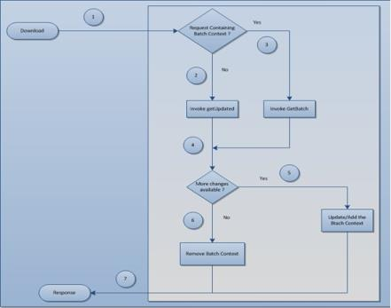

                    

Flow Diagram of Batching logic
------------------------------

The below diagram shows the batching logic applied when datasource supports the batching.

If download request from the device specifies the batch size, then device will receive the data in multiple batches depending on the batch size. There is no guarantee that the requested batch size will be the actual batch size. Actual batch size will be closer to the specified batch size.

For tracking the download status, sync engine will maintain the state in the batch context, which will be exchanged during request/response from the device to Sync .

### **Flow of Download Service**

1.  After receiving the download request from device, sync engine verifies whether batch context is present in the request.
2.  If batch context is not available, then sync engine will invoke “GetUpdated” operation to start batching.
3.  If batch context is available, sync engine will continue to fetch the next batch using batch context by invoking the “GetBatch” operation.
4.  After fetching the results from GetBatch/GetUpdated, sync engine will check for the value of MORE\_CHANGES\_AVAILABLE context variable to know whether there are any more batches.
5.  If the value of context variable is “true”, then batch context will be updated and included in the response.
6.  If there are no more updates, then batch context will not be included in the response.

The above flow repeats from the device till the more changes available flag is _false_.

> **_Note:_** In case of Webservice as Datasource, when errors are reported in SOAP response instead of SOAP Faults, then add the below param in the `Synconfig` file under each service output param to catch the exact error.

For example: To use salesforce webservice, add as shown below:

<Param Name="errmsg" Expression="//errors/message/text()" Datatype="string"/>

