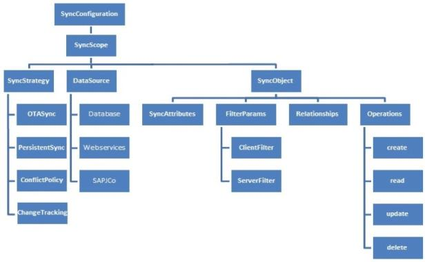

                    

Sync Configuration
==================

A Sync Configuration captures details of the data synchronization characteristics of an application. These details are captured in a file typically referred to `SyncConfig.xml` (the name really does not matter) adhering to the `SyncConfig.xsd` schema. A `SyncConfig.xml` represents the below structure.

The two most important elements of this schema are:

SyncObject
----------

Conceptually, you can consider a SyncObject as a business object that has some public attributes and some methods. The public attributes correspond to the fields visible to client devices, and they are used for synchronization. The methods correspond to the CRUD operations that map to the backend services exposed for the object. The parameter values methods /operations based on both public attribute values.

A SyncObject is meta-data:

*   Defining the business object model of an application.
*   Defining the way data is exchanged between mobile devices and backend.

A SyncObject is data:

Sync Object data is a business object instance exchanged between client and server.

SyncScope
---------

A SyncScope groups together the SyncObjects that share common synchronization characteristics like SyncStrategy, Datasource and so on.

A SyncConfiguration can have multiple SyncScopes. It is not possible to define relationships between SyncObjects belonging to different SyncScopes.
