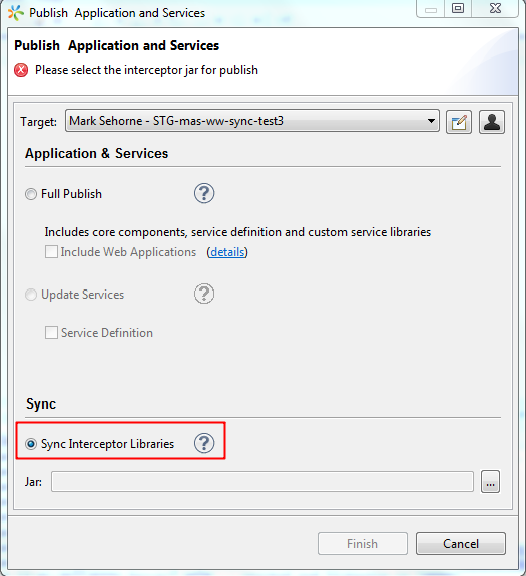

                    

Using Interceptors
==================

The Interceptor interface provides callbacks capability from the Volt MX Foundry Sync to the application, allowing the application to inspect and / or manipulate properties of a sync object before it is inserted, updated, deleted, or loaded.

Interceptors can execute code before and after an Action (Upload, Download, and Merge) is invoked. Interceptor classes contain methods that are invoked in conjunction with the methods or life cycle events of the sync services.

Volt MX  Foundry Sync Interceptors
-----------------------------

### Upload Interceptors

Using these interceptors custom implementation can manipulate the upload requests from the device and responses to the device.

**Methods:**

1.  **processRequest**
    
    This method invokes by the sync services for each request from the client. Custom code can modify the properties of the incoming entities, or add/remove the new entities.
    
2.  **processResponse**
    
    This method invokes by the sync services before sending the response to the client. Custom code can modify the response text by adding any information along with sync response and handle appropriately on client side.
    

### Download Interceptors

Using these interceptors custom implementation can manipulate the download requests from the device and responses to the device.

**Methods:**

1.  **processRequest**
    
    The sync services invokes this method for each request from the client. Custom code can modify the request coming from the client.
    
2.  **processResponse**
    
    The sync services invokes this method before sending the response to the client. Custom code can modify the outgoing response string based on the business logic.
    

### Merge Interceptors

Using these interceptors custom implementation can manipulate data in the merge process.

**Methods:**

**processEvent**

Merge service invokes this method at various phases while applying the changes to datasource.

### Replicate Interceptors

Using these interceptors custom implementation can manipulate data in the replicate process.

Methods:

**process Event**

The replica service invokes this method at two places.

### Notification Interceptors

Using these interceptors custom implementation can manipulate data in the notification events from the Enterprise Datasource.

**Methods:**

**formatNotification**

The sync services invokes this method when there a RCT notification from the Datasource.

### Conflict Resolution Interceptor

Using these interceptors, you can implement custom conflict resolution at the sync scope level.

**Methods:**

**Resolve Conflict**

Method to resolve the conflict

### Configuring Interceptors

After the custom logic is implemented, follow these steps to configure the interceptor with sync services: 

*   Make a jar file with all the interceptor implementation class files along with dependent files
*   Place the jar file under the `<sync.home>\apache-tomcat-7.0.52\webapps\syncservice\WEB-INF\lib` folder.
*   Restart the application server(tomcat/weblogic)
*   For cloud, configure your cloud account in Volt MX Iris. While publishing the app, choose the **Sync Interceptor Libraries** option to upload the jar file.
    
    
    

#### Example for Interceptor in Sync Configuration File

<SyncInterceptors>
	<UploadInterceptors>
		<Interceptor ClassName="com.voltmx.sync.interceptors.logging.LoggingUploadInterceptor"/>
	</UploadInterceptors>
       <DownloadInterceptors>
		<Interceptor ClassName="com.voltmx.sync.interceptors.logging.LoggingDownloadInterceptor"/>	
       </DownloadInterceptors>
       <MergeInterceptors>
		<Interceptor ClassName="com.voltmx.sync.interceptors.logging.LoggingMergeInterceptor"/>
       </MergeInterceptors>
	<ReplicaInterceptors>
		<Interceptor ClassName="com.voltmx.sync.interceptors.logging.LoggingReplicaInterceptor"/>
	</ReplicaInterceptors>
	<NotificationInterceptors>
		<Interceptor ClassName="com.voltmx.sync.interceptors.logging.LoggingNotificationInterceptor"/>	
       </NotificationInterceptors>
</SyncInterceptors>



#### Example for Conflict Interceptor in Sync Configuration

<ConflictPolicy>
	<Type>custom</Type>
	<ProvisioningColumnsSupported>
		<UpdateUserID>false</UpdateUserID>	
	</ProvisioningColumnsSupported>
       <ConflictInterceptor ClassName="com.voltmx.sync.interceptors.logging.ConflictInterceptorImpl"/>
</ConflictPolicy>


