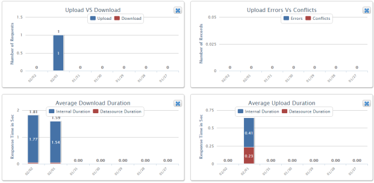
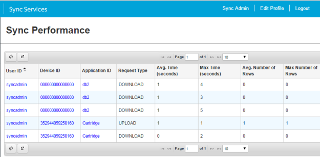
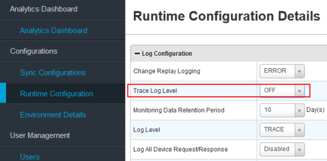

                           

Monitor and Tune Volt MX Foundry Sync Server Performance
====================================================

Volt MX  Foundry Sync Server deployment environment changes over time. User populations grow, processing requests tend to increase in number and complexity, and network capacity and other aspects of infrastructure may be modified.

These changes can affect Volt MX Foundry Sync Server performance. As a result, it is important to monitor and tune performance regularly.

Monitoring performance means checking status of your Volt MX Foundry Sync Server and its resources regularly. Volt MX Foundry Sync Server provides metrics for checking the performance of the system and services.

Volt MX  Foundry Sync Console provides a view of the requests that the server received and time it took to execute those requests. These requests are either for downloading the delta dataset or for uploading changes from device to the enterprise datasource.

Tuning can involve adjustments in the following areas:

*   Volt MX Foundry Sync Server: Adjust your application server memory and connection settings as required for better performance.
*   Databases: Keep your databases optimized for querying and reporting.

Tune Volt MX Foundry Sync Server Installation
-----------------------------------------

*   Enable GZIP Compression
    
    Compression is a simple, effective way to save bandwidth and speed up the bulk download response times. Simply put gzip compression works by finding similar strings within a text file, and replacing those strings temporarily to make the overall file size smaller. This form of compression is particularly well-suited for the Volt MX Foundry Sync responses.
    
    For more information on minimum size of compression, refer to **compressionMinSize** in the following URL: [https://tomcat.apache.org/tomcat-7.0-doc/config/http.html](https://tomcat.apache.org/tomcat-7.0-doc/config/http.html).
    
    To ensure that GZIP compression is turned for Tomcat make sure you see similar tag in `<TOMCAT_INSTALL_DIR>\conf\server.xml`.
    
    <Connector port="8080" protocol="HTTP/1.1" connectionTimeout="20000" redirectPort="8443" compression="on" compressionMinSize="512"  noCompressionUserAgents="gozilla, traviata compressableMimeType="text.html,text/xml,text/css,text/plain,text/javascript,application/x-javascript,application/javascript,application/json,application/xml"/>
    
    
    For other application servers please refer to the Server Configuration/Administration Guide for enabling GZIP compression.
    
*   Disable DEBUG logging in Production Environments
    
    A debug log records database operations, system processes and errors that occur when executing a transaction during development lifecycle. The system generates a debug log for a user every time that user executes requests for an upload or download operation (or even device registration).
    
    Debug logs slow down the application performance as the server spends a lot of time performing the input and output (I/O) operations to capture the LOG statements. In a production environment, the user is typically interested to know only runtime errors and do not need a complete log trace for every user.
    
    Ensure that below logger is set to ERROR in `log4j.properties` file.
    
    For Volt MX Sync 5.0.X, the `log4j.properties` file is located at:
    
    `<sync.home>/apache-tomcat-7.0.26/webapps/syncconsole/WEB-INF/classes/log4j.properties`
    
    `<sync.home>/ apache-tomcat-7.0.26/webapps/syncservice/WEB-INF/classes/log4j.properties`
    
    For Volt MX Sync 5.5.X, the `log4j.properties` file is located at:
    
    `<sync.home>/conf/console-log4j.properties`
    
    `<sync.home>/conf/services-log4j.properties`
    
    > **_Note:_** Once you modify the `log4j properties` file, you need to remove `syncconsole.war` and `syncservice.war` from `webapps` folder, otherwise it gets overridden again on tomcat start.
    
*   Disable Trace Logs in Production Environments
    
    Tracelogs enable the administrator to view incoming HTTP requests and responses. This is very useful to debug issues during development. It impacts the application server performance. So unless you debug an issue, you should turn off the Tracelogs.
    
    To turn off the trace logs follow these steps:
    
    1.  Log on to Volt MX Foundry Sync Management Console.
    2.  Click **Configurations** > **Runtime Configuration**.
    3.  In **Log Configuration**, select _OFF_ from the **Trace Log Level** checkbox as follows:
        
        
        

Tune Database
-------------

Volt MX  Foundry Sync implementation uses a relation database (Microsoft SQL Server or Oracle) to store user information and log performance metrics. To ensure that Volt MX Foundry Sync implementation continues to perform well, it is important to maintain the performance of your database.

This means optimizing it for querying, reporting, and analyzing. If Volt MX Foundry Sync and other applications demand more of a database than it can provide, or if queries are too large for a database to handle efficiently, you may experience increased response times and degradation in Volt MX Foundry Sync performance and scalability.

For information about tuning your database, see its documentation.
