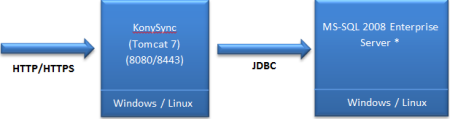
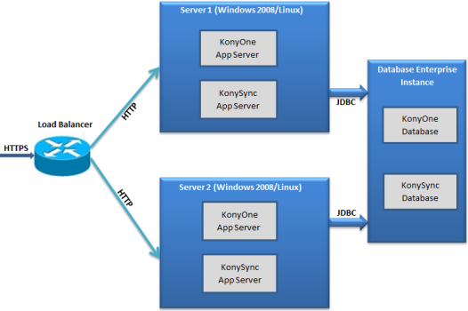
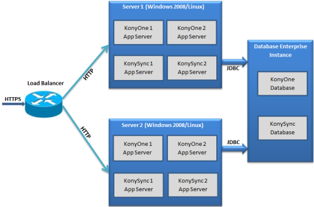

                            

Volt MX  Foundry Sync Server Installation Options
============================================

You need to decide how you want to install and configure it to provide the best possible performance before you develop an application that accesses Volt MX Foundry Sync Server. The installation and configuration choices that produce the best performance depend on your reporting requirements, resources, and preferences. Below are the typical installations for a Development, Quality Assurance (QA) and Production environments.

In the below environment setups, you can see how Volt MX Server (VoltMX Middleware) can be deployed alongside the Volt MX Foundry Sync Server. There is no dependency between these Servers but the diagram just illustrates a possible scenario when you deploy both in the same environment.

With respect to the database setup (especially in case of persistent Volt MX Foundry Sync strategy), the Console Database and Enterprise Database can be hosted on the same physical hardware or different hardware. They can even be co-located in the same physical database instance (as separate schemas). You can decide to host them as separate instances or in same schemas on a case by case basis.

Standard Development Environment Setup
--------------------------------------

Install all components on one computer only for a single developer or proof of concept or in demonstration environments where the user load is small. In this setup both the Database and Volt MX Foundry Sync Server are installed on the same computer.

**Hardware configuration for Application and Database Servers**

  
| Operating System | Specification per Instance |
| --- | --- |
| Windows | Windows Server 2008 / Windows 10 / Windows 8 Professional / Windows 7 Professional, 64-bit, 4 Core |
| Linux | CentOS 6.5, Red Hat Linux Enterprise 6.0, 64-bit, 4 Core |
| Minimum Recommended RAM | 8 GB or more |
| Minimum Recommended Hard Disk Space | 40 GB or more |

Standard QA or Certification Environment Setup
----------------------------------------------

A QA environment represents a very close replica of the actual production environment setup except that the number of server instances and the capacity of each of the instances are lesser than those in Production Environment setup. In this setup, Volt MX Foundry Sync Server and the Database are installed on separate computers.

> **_Note:_** The below figure indicates that the Secure Socket Layer (SSL) termination that happens at the load balancer level. This is a recommended setup for the Volt MX Foundry Sync server installation. If the Enterprise policies mandate that SSL terminates at individual Tomcat / Application server instance, then you need to setup SSL certificate accordingly for each server.

**Hardware configuration for Application and Database Servers**

  
| Operating System | Specification |
| --- | --- |
| Windows | Windows Server 2008 / Windows 10 / Windows 8 Professional / Windows 7 Professional, 64-bit, 4 Core |
| Linux | CentOS 6.5, Red Hat Linux Enterprise 6.0, 64-bit, 4 Core |
| Minimum Recommended RAM | 16 GB or more |
| Minimum Recommended Hard Disk Space | 40 GB or more |

Standard Production Environment Setup
-------------------------------------

A production environment represents the setup that live / actual users access. The capacity of the servers is definitely much more than Development or QA setup. The number of instances also vary or may be more, depending upon the number of concurrent users the system plans to support.

> **_Note:_** The below figure indicates that the Secure Socket Layer (SSL) terminates at the load balancer level. This is a recommended setup for the Volt MX Foundry Sync server installation. If the Enterprise policies mandate that SSL terminates at individual Tomcat / Application server instance, then you need to setup SSL certificate accordingly for each server.

**Hardware configuration for Application and Database Servers**

  
| Operating System | Specification per Instance |
| --- | --- |
| Windows | Windows Server 2008 / Windows 10 / Windows 8 Professional / Windows 7 Professional, 64-bit, 4 Cores |
| Linux | CentOS 6.5, Red Hat Linux Enterprise 6.0, 64-bit, 4 Core |
| Recommended RAM | 32 GB or more |
| Minimum Recommended Hard Disk Space | 80 GB or more |
