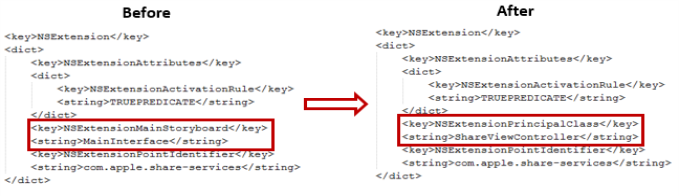

                             

voltmx.shareExtensions Namespace
==============================

The voltmx.shareExtensions Namespace implements the iOS Share extension, which is a type of app extension.

The Share app extension is one of the types of app extensions provided by Apple for iOS apps. The Share app extension allows the app users to share information from the current context with other entities, such as social media, apps, and services. For example, a Share app extension can be used to share photos directly from the Image Gallery with the social media.

The share extension app can be accessed by tapping an action button provided in an app to display the activity view. The activity view contains extensions relevant to the current context.

Volt MX  Irisprovides integrated support for developing Share app extensions for iOS apps. You develop Share extensions and package them into your app in the same way you do for other types of app extensions. For more information, refer [App Extension API for iOS](app-extension-ios.html).

For more information about what the Share app extension is and what you can do with it, refer the [Apple developer documentation](app-extension-ios.html).

A Share extension can use the default UI provided by Apple or a custom UI that you create. When you create a share extension using the Default GUI, a standard compose view UI is used as shown in the figure below.

The implementation of the voltmx.shareExtensions Namespace provides you with what you need to add your own business logic using the Native Function API in callback handlers.

If you create your own custom UI, you must use the Native Function API and then add your business logic according to your needs. The Info.plist file generated when you create a Share app extension from Xcode is configured to use the Default UI by default. To make use of the custom UI for your app extension, you need to perform the following steps.

1.  Open the Info.plist file of the Share app extension for which you want to develop a custom UI.
2.  Find and replace the `NSExtensionMainStoryboard` key with `NSExtensionPrincipalClass`, and also replace its value, `MainInterface` with `ShareViewController`. The figure below shows difference in the Info.plist file before and after modification.
    
    
    
3.  Save and close the file.

When you develop a Share extension, you put your business logic into a specific set of callback functions. Your app must set these callback function by invoking the [voltmx.shareExtensions.setExtensionsCallbacks](#setExtensionsCallbacks) function.

Properties
----------

The voltmx.shareExtensions Namespace provides the following properties.

;)[voltmx.shareExtensions.charactersRemaining](javascript:void(0);)

* * *

Sets an initial value to be displayed as the number of characters remaining in the placeholder.

Syntax

voltmx.shareExtensions.charactersRemaining;

Example

//Sample code  
voltmx.shareExtensions.charactersRemaining = 100;


Type

Number

Read/Write

Read and write.

Remarks

This property is accessible only in the default GUI mode.

Platform Availability

iOS

;)[voltmx.shareExtensions.contentText](javascript:void(0);)

* * *

Contains the text from the current textView.

Syntax

voltmx.shareExtensions.contentText;

Example

//Sample code  
var text = voltmx.shareExtensions.contentText;


Type

String

Return Values

text

Remarks

This property is only available in the default GUI mode.

Platform Availability

iOS

;)[voltmx.shareExtensions.extensionContext](javascript:void(0);)

* * *

Returns the current extension context.

Syntax

voltmx.shareExtensions.extensionContext;

Example

//Sample code  
var Context = voltmx.shareExtensions.extensionContext;
Context.extensionContext.completeRequestReturningItemsCompletionHandler([], );


Type

Object

Read/Write

Read only

Platform Availability

iOS

;)[voltmx.shareExtensions.placeholder](javascript:void(0);)

* * *

Sets the text for the share app extension in the placeholder.

Syntax

voltmx.shareExtensions.placeholder;

Example

//Sample code  
voltmx.shareExtensions.placeholder = "write here";


Type

String

Read/Write

Read and write.

Remarks

The API works only in default GUI mode.

Platform Availability

iOS

;)[voltmx.shareExtensions.view](javascript:void(0);)

* * *

Holds the current extension view.

Syntax

voltmx.shareExtensions.view;

Example

//Sample code  
var myView = voltmx.shareExtensions.view;
myView.addSubView(button);


Type

UIView

Read/Write

Read only.

Platform Availability

iOS

Functions
---------

The voltmx.shareExtensions Namespace provides the following function.

;)[voltmx.shareExtensions.popConfigurationViewController](javascript:void(0);)

* * *

Dismisses the current configuration view controller.

Syntax

voltmx.shareExtensions.popConfigurationViewController()

Example

//Sample code  
voltmx.shareExtensions.popConfigurationViewController();


Parameters

None.

Return Values

None.

Remarks

The function works only in the default GUI mode.

Platform Availability

iOS.

;)[voltmx.shareExtensions.pushConfigurationViewController](javascript:void(0);)

* * *

Displays a configuration view controller.

Syntax

voltmx.shareExtensions.pushConfigurationViewController(UIVController)

Input Parameters

| Parameter | Description |
| --- | --- |
| UIViewController | A UIViewController that your app creates using the Native Functions. |

 

Example


var UIVC = //native bindings code to create UIViewController  
 voltmx.shareExtensions.pushConfigurationViewController(UIVC);


Return Values

None.

Remarks

The function works only in the default GUI mode. The configuration view controller is called from a configuration item's tabHandler. Only one configuration view controller is allowed at a time. The pushed view controller should set `preferredContentSize` appropriately. The `SLComposeServiceViewController` observes changes to that property and animates sheet size changes as necessary.

Platform Availability

iOS.

;)[voltmx.shareExtensions.setExtensionsCallbacks](javascript:void(0);)

* * *

Allows your app to set callback event handlers for a Share extension.

Syntax

voltmx.shareExtensions.setExtensionsCallbacks(  
    callbacks)

Input Parameters

callbacks {Object}

Contains an object with key-value pairs where the key specifies the extension state and the value is a callback function. The following are the possible keys.  

| Key | Description |
| --- | --- |
| configurationItems | Enables the user to add configuration options via table cells at the bottom of the sheet, Returns an array of SLComposeSheetConfigurationItem objects. Only available in default GUI mode. |
| didSelectCancel | The user clicked the Cancel button. Only available in default GUI mode. |
| didSelectPost | The user clicked the Post button. Only available in default GUI mode. |
| isContentValid | Determines whether or not the content is valid. Only available in default GUI mode. Invalid content disables the Post button. Valid content enables it. |
| loadView | Loads the view into memory. |
| presentationAnimationDidFinish | The sheet presentation animation is finished. Only available in default GUI mode. |
| viewDidAppear | The view was just displayed. |
| viewWillAppear | The view controller's view is about to be added to a view hierarchy. |
| viewDidDisappear | The view has just been removed from the view hierarchy. |
| viewWillDisappear | The view is about to be removed from the view hierarchy. |

Example

var callbackEvents = {
    didSelectCancel: function() {
        voltmx.shareExtensions.extensionContext.cancelRequestWithError(undefined);
    },
    isContentValid: function() {
        var input = voltmx.shareExtensions.contentText;
        if (input.length < 100) {
            voltmx.shareExtensions.charactersRemaining = 100 - input.length;
            return true;
        } else {
            return false;
        }
    },
    configurationItems: function() {
        return [ConfigurationItem1, ConfigurationItem2];
    },
    viewDidLoad: function() {
        voltmx.shareExtensions.charactersRemaining = 100;
    }
};

voltmx.shareExtensions.setExtensionsCallbacks(callbackEvents);


Example: configurationItems

function configurationItems() {
    var returnarray = native bindings code to
    return array of SLComposeSheetConfigurationItem
    return returnarray;
}
voltmx.shareExtensions.setExtensionsCallbacks({“
    configurationItems”: configurationItems
});


Example: didSelectCancel

function didSelectCancelcallback() {
    // native bindings code
}
voltmx.shareExtensions.setExtensionsCallbacks({“
    didSelectCancel”: didSelectCancelcallback
});


Example: didSelectPostcallback

function didSelectPostcallback() {
    // native bindings code
}

voltmx.shareExtensions.setExtensionsCallbacks({“
    didSelectPost”: didSelectPostcallback
});


Example: isContentValid

function isContentValid() {
    if ( //check the validity of the input using native 						bindings code)
        {
            return true; //will enable the post button. 
        }
        return false; //will disable the post button.
    }
    voltmx.shareExtensions.setExtensionsCallbacks({“
        isContentValid”: isContentValid
    });


Example; loadView

function loadView() {
    //native bindings code
}
voltmx.shareExtensions.setExtensionsCallbacks({“
    loadView”: loadView
});


Example: presentationAnimationDidFinish

function presentationAnimationDidFinish() {
    //native bindings code
}
voltmx.shareExtensions.setExtensionsCallbacks({“
    presentationAnimationDidFinish”: presentationAnimationDidFinish
});



Example: viewDidAppear

function viewDidAppear() {
    //native bindings code
}
voltmx.shareExtensions.setExtensionsCallbacks({“
    viewDidAppear”: viewDidAppear
});


Example: viewWillAppear

function viewWillAppear() {
    //native bindings code
}
voltmx.shareExtensions.setExtensionsCallbacks({“
    viewWillAppear”: viewWillAppear
});



Example: viewDidDisappear

function viewDidDisappear() {
    //native bindings code
}
voltmx.shareExtensions.setExtensionsCallbacks({“
    viewDidDisappear”: viewDidDisappear
});


Example: viewWillDisappear

function viewWillDisappear() {
    //native bindings code
}
voltmx.shareExtensions.setExtensionsCallbacks({“
    viewWillDisappear”: viewWillDisappear
});


Return Values

None.

Platform Availability

iOS.

