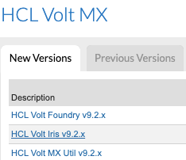

                        

Download Links
==============

<!-- To download any of VoltMX's products, visit [community.hclvoltmx.com/downloads](http://community.hclvoltmx.com/downloads). -->

Volt Iris can be downloaded for Mac or Windows.

<ul>
<li>Existing customers can download the latest version of Volt Iris from the <a href="https://hclsoftware.flexnetoperations.com/flexnet/operationsportal/startPage.do">HCL License and Download Portal</a>.</li>
<ul>
    <li>Select <b>Downloads</b> in the top navigation bar after login, select <b>List Downloads</b> and choose <b>HCL Volt MX.</b></li>
    <li>Select <b>HCL Volt Iris v9.2.x</b> and choose appropriate installer for Mac/Windows.</li>
    
</ul>
</ul>
<ul>
<li>Volt MX trial users can download Volt Iris from links provided in registration emails, or directly from our <a href="https://community.demo-hclvoltmx.com/downloads">demo download site</a>.</li>
</ul>