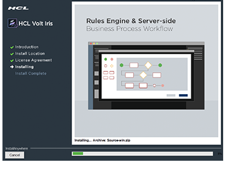

- [Prerequisites](Prerequisites.html#prerequisites)
  - [System Requirements](Prerequisites.html#system-requirements)
  - [Download Volt MX Iris](Prerequisites.html#download)
- [Install Volt MX Iris](Installing VoltMX Iris.html#installing)
  - [Configuring Volt MX Iris to use a Proxy server](Installing VoltMX Iris.html#configuring-to-use-a-proxy-server)
    - [Basic Proxy](Installing VoltMX Iris.html#basic-proxy)
    - [NTLM Proxy](Installing VoltMX Iris.html#ntlm-proxy)
    - [Custom NTLM Proxy](Installing VoltMX Iris.html#custom-ntlm-proxy)
    - [White-list Essential Domains](Installing VoltMX Iris.html#white-list-essential-domains)
- [Post Installation Tasks](Launching VoltMX Iris.html#post-installation-tasks)
  - [Launching Volt MX Iris](Launching VoltMX Iris.html#launching)
- [Update Volt MX Iris](Upgrade.html)
- [FAQs](StudioInstallation_FAQs.html#appendix-frequently-asked-questions-faqs)

- All Files

You are here: [Install Volt MX Iris](#installing) > [Configuring Volt MX Iris to use a Proxy server](#configuring-to-use-a-proxy-server) > Basic Proxy

# Installing Volt MX Iris

To install Volt MX Iris on your Mac computer, follow these steps:

You must have administrative rights on your computer to install Volt MX Iris.

1.  Navigate to the location of the downloaded installer file.
2.  Extract the contents of the zip file.
3.  Double-click the installer.  
    The Volt MX Iris installation window appears.
4.  Click **Next**.

    

    The **Select Installation Folder** pane appears

5.  Click **Choose** to select a folder on the drive where you want to install Volt MX Iris.  
    Click **Restore Default Folder** to reset the default installation folder.

    

    > **_Note:_** The Workspace folder contains all your Volt MX Iris projects.

6.  Click **Next**.  
    The **Select Workspace Folder** pane appears.
7.  Click **Choose** to select a folder on the drive to be used as Iris workspace.  
    Click **Restore Default Folder** to reset the default Iris workspace.

    

    > **_Note:_** The Workspace folder holds all your Iris projects.

8.  Click **Next**.  
    The **License Agreement** pane appears.
9.  Read the License Agreement carefully. If you accept the terms of the agreement, click the **I Accept the terms of the License Agreement** option, and then click **Install**.  
    The **Installing** Volt MX Iris page appears, and the installation begins.

    

10. After the installation is complete, the **Install Complete** window appears.

11. The pane provides a QR code to download the Volt MX Iris App. Scan the QR code to download the app.

    > **_Note:_** The QR code is developed using a third party library, QRCode.js (version 0.0.1 & [license](https://github.com/davidshimjs/qrcodejs/blob/master/LICENSE)). This is not bundled with the app. This library is bundled with Volt MX Iris Installer.

12. You can choose to select **Launch Volt MX Iris** and click **Done**. Volt MX Iris sends anonymous usage data to Volt MX. The intent is to use this data to help Volt MX better understand how the application is being used. To turn off anonymous usage data collection in Iris, deselect the necessary check box under **Iris**\>**Preferences**\>**General**.

# Configuring Volt MX Iris to Use a Proxy Server

> **_Note:_** If your computer is not configured behind a proxy server, you can skip this section and move onto the next section: [Launching Volt MX Iris](Launching VoltMX Iris.html).

When your system is a part of an internal network and connects to the internet using a proxy server, you need to modify the Volt MX Iris configuration settings to bypass proxy server and access internet.

You can use one of the following methods to configure Volt MX Iris to use a proxy server:

- [Basic Proxy](#basic-proxy): Provides steps to configure your basic proxy settings to allow Iris access the Internet.
- [NTLM Proxy](#ntlm-proxy): Provides steps to configure your proxy settings to allow Iris access internet.
- [Custom NTLM Proxy](#custom-ntlm-proxy): Provides steps to customize and configure proxy settings to allow Iris access internet.

## Basic Proxy

For enabling Iris to use a Basic proxy, follow these steps:

1.  In Volt MX Iris, click **Edit** > **Preferences**.  
    The **Iris Preferences** window appears.  
    
2.  Click the **Proxy** tab.
3.  Under the **Proxy Settings** section, select the **Enable Proxy** check box.
    
4.  From the **Proxy Type** list, select the type of the Proxy Service that you want to configure, either Basic or NTLM.

    > **_Note:_** You can only configure a BASIC Proxy.

5.  In the **Proxy Host** text box, enter the value of the proxyHost.
6.  In the **Proxy Port** text box, enter the value of the proxyPort.
7.  In the **Proxy Username** text box, enter the username to sign in to the Proxy Server.
8.  In the **Proxy Password** text box, enter the password to sign in to the Proxy Server.
9.  In the **No Proxy Hostnames** text box, enter the URL of the domain that must bypass the Proxy server. You can also provide a list of URLs separated by commas.
10. After you provide all the inputs, click **Validate** to verify the connection.  
    Once all the details are validated, the Done button is enabled.
11. Click **Done**.

## NTLM Proxy

To configure Iris to use an NTLM proxy, follow these steps:

1.  Navigate to the **VoltMX Iris** installation folder > **Config** folder (ex. Applications/VoltMXIris/Config).
2.  Open the _proxy_config.js_ file.
3.  Edit the following details between the comments : "USER EDITABLE SECTION START" and "USER EDITABLE SECTION END":

    //USER EDITABLE SECTION START  
     /\*  
    In case of NTLM custom config only PROXY_TYPE and CNTLM_PORT ProxyConfig paramaters
    are required. Rest can be left undefined.Custom CNTLM config can also be generated by
    using cntlmconf.sh on mac  
     e.g.  
    ./cntlmconf.sh -u NTLMUSER -d DOMAIN -s PROXY-IP:PROXY-PORT

    \*/  
    //_To enable proxy, change the following value to_ **true**.  
    var ENABLE_PROXY = false;

    _//Provide Proxy IP address._  
    var PROXY_IP = 'XXX.XXX.XXX.XXX';

    _//Provide NTLM Domain address._  
    var NTLM_DOMAIN = XXXXXXX.com';

    _//Provide NTLM server port number._  
    var PROXY_PORT = 8080;

    _/\*Provide your username.
    Note: Do not provide the domain name in the username. For example, if your username
    is user@domain.com, enter the username as user._
    \*/  
    var PROXY_USER = 'XXXXXX';

    _//Provide your password._  
    var PROXY_PWD = 'XXXXXX';

    //If the type of proxy used is basic, replace NTLM_PROXY with BASIC_PROXY.  
    var PROXY_TYPE = PTYPE.NTLM_PROXY;

    //USER EDITABLE SECTION END

    

4.  Save the _proxy_config.js_ file.

## Custom NTLM Proxy

To configure Iris to use a custom NTLM proxy, follow these steps:

1.  Navigate to the **VoltMX Iris** installation folder > **Config** folder (ex. Applications/Iris/Config).
2.  Open the _proxy_config.js_ file.
3.  Edit the following details between the **USER EDITABLE SECTION START** and **USER EDITABLE SECTION END**://USER EDITABLE SECTION START  
     /\*  
    In case of NTLM custom config only PROXY_TYPE and CNTLM_PORT ProxyConfig paramaters
    are required. Rest can be left undefined.Custom CNTLM config can also be generated by
    using cntlmconf.sh on mac  
     e.g.  
    ./cntlmconf.sh -u NTLMUSER -d DOMAIN -s PROXY-IP:PROXY-PORT

    \*/  
    //_To enable proxy, change the following value to_ **true**.  
    var ENABLE_PROXY = false;

    _//Type Proxy IP address._  
    var PROXY_IP = 'XXX.XXX.XXX.XXX';

    _//Type NTLM Domain name._  
    var NTLM_DOMAIN = 'XXXXXXX.com';

    _//Type NTLM server port number._  
    var PROXY_PORT = 8080;

    _/\*Type your username.
    Note: If your username is user@domain.com, enter the username as user only.
    Domain name is not required._
    \*/  
    var PROXY_USER = 'XXXXXX';

    _//Type your password._  
    var PROXY_PWD = 'XXXXXX';

    //If the type of proxy used is basic, replace NTLM_PROXY with BASIC_PROXY.  
    var PROXY_TYPE = PTYPE.NTLM_PROXY;  
    //Change the value to false  
    var GENERATE_NTLM_CONF = false;  
    //USER EDITABLE SECTION END

    

4.  Save and close the _proxy_config.js_ file.
5.  Navigate to the **Iris** installation folder > **nw** folder> **nw-mac** folder (ex. Applications/VoltMXIris/nw/nw_mac).

    > **_Note:_** For some NTLM v1 and v2 configurations, the default generated cntlm.conf file may not work. In such cases, you need to customize your proxy settings.

6.  Open the _cntlm.conf_ file.
7.  Modify the following parameters:Username _my_proxy_user_;  
    Domain _my_proxy_domain.com_;  
    Proxy _my_proxy_server:8080_;

    

8.  Save and close the _cntlm.conf_ file.
9.  To generate the profile, follow these steps:
    1.  Open a Command Prompt window in the current folder.
    2.  Execute _cntlm.exe -c cntlm.conf -I -M http://xxxx.com_.
    3.  Type your NTLM password, if requested, to generate a profile.
    4.  Copy the generated profile.
10. Reopen th e*cntlm.conf* file.
11. Append the profile details (copied from step 9). A portion of the _cntlm.conf_ file after appending the parameters is shown below:

    Username my_proxy_user
    Domain my_proxy_domain.com
    Proxy my_proxy_server:8080
    NoProxy localhost, 127.0.0.\*, 10.\*, 192.168.\*
    Gateway no
    Listen 3128
    Auth NTLMv2
    PassNTLMv2 XXXXXXXXXXXXXXXXXXXXXXXXXXXXXXXX

12. Save the _cntlm.conf_ file.
13. Move the _cntlm.conf_ file to User Profile folder/user name/Iris/irisdata (for example, /Users/<User name>/Iris/irisdata).

## White-list Essential Domains

Ensure that you contact your system administrator and white-list the following domain URLs:

- https://manage.hclvoltmx.com
- https://api.voltmx.com
- https://visualization.voltmx.com
- https://prototypetransit.voltmx.com.s3.amazonaws.com
- https://accounts.auth.voltmxcloud.com

- [Prerequisites](Prerequisites.html#prerequisites)
  - [System Requirements](Prerequisites.html#system-requirements)
  - [Download Volt MX Iris](Prerequisites.html#download)
- [Install Volt MX Iris](#installing)
  - [Configuring Volt MX Iris to use a Proxy server](#configuring-to-use-a-proxy-server)
    - [Basic Proxy](#basic-proxy)
    - [NTLM Proxy](#ntlm-proxy)
    - [Custom NTLM Proxy](#custom-ntlm-proxy)
    - [White-list Essential Domains](#white-list-essential-domains)
- [Post Installation Tasks](Launching VoltMX Iris.html#post-installation-tasks)
  - [Launching Volt MX Iris](Launching VoltMX Iris.html#launching)
- [Update Volt MX Iris](Upgrade.html)
- [FAQs](StudioInstallation_FAQs.html#appendix-frequently-asked-questions-faqs)
