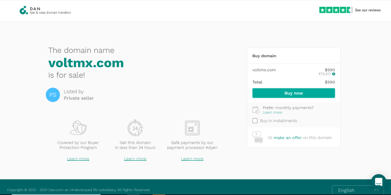
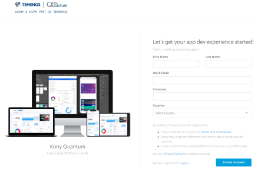
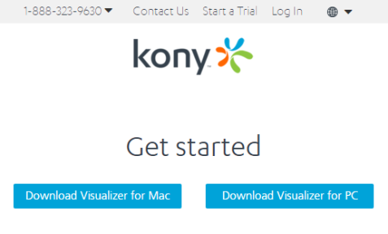
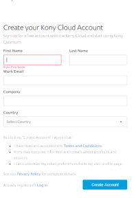
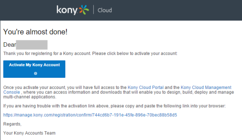
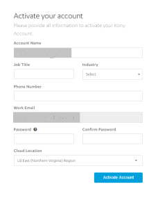
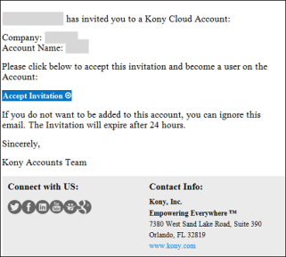
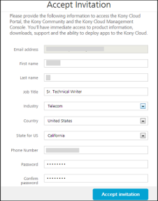
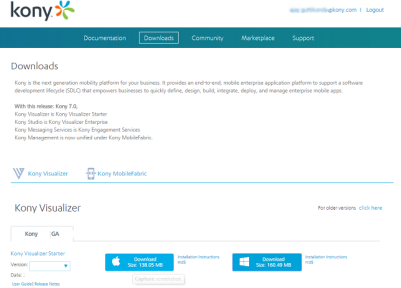

                                     
<!--

*   [Prerequisites](Prerequisites.html#prerequisites)
    *   [System Requirements](Prerequisites.html#system-requirements)
    *   [Download Volt MX Iris](Prerequisites.html#download)
*   [Install Volt MX Iris](Installing VoltMX Iris.html#installing)
    *   [Configuring Volt MX Iris to use a Proxy server](Installing VoltMX Iris.html#configuring-to-use-a-proxy-server)
        *   [Basic Proxy](Installing VoltMX Iris.html#basic-proxy)
        *   [NTLM Proxy](Installing VoltMX Iris.html#ntlm-proxy)
        *   [Custom NTLM Proxy](Installing VoltMX Iris.html#custom-ntlm-proxy)
        *   [White-list Essential Domains](Installing VoltMX Iris.html#white-list-essential-domains)
*   [Post Installation Tasks](Launching VoltMX Iris.html#post-installation-tasks)
    *   [Launching Volt MX Iris](Launching VoltMX Iris.html#launching)
*   [Update Volt MX Iris](Upgrade.html)
*   [FAQs](StudioInstallation_FAQs.html#appendix-frequently-asked-questions-faqs)

*   All Files
-->
You are here: [Prerequisites](#prerequisites) > System Requirements

Volt MX  Iris V9 Windows Install Guide
===========================================

This document provides details of how to install Volt MX Iris on a Windows machine.

*   [Prerequisites](#prerequisites)
*   [Install Iris](Installing VoltMX Iris.html#installing)
*   [Post Installation Tasks](Launching VoltMX Iris.html#post-installation-tasks)

Prerequisites
=============

Following are the prerequisites to install and run Volt MX Iris:

System Requirements
-------------------

This section helps you to understand the system requirements and necessary software before installing Volt MX Iris.

### Software Requirements

  
| Operating System | Software Requirements |
| --- | --- |
| Windows 10, Windows 8.1 Update. Supports 64-bit Operating Systems | Installer File (Mandatory) |

### Hardware Requirements

  
| Component | Requirement |
| --- | --- |
| Processor and Architecture | Dual Core processor, 64-bit |
| RAM | 8 GB |
| Internal Storage | 24 GB |
| Network | Ethernet Port |

Download Volt MX Iris
---------------------------

The following section explains how to download Volt MX Iris:

*   [Without a Volt MX Account](#downloading-without-a-account)
*   [With a Volt MX Account](#downloading-with-a-account)

### Downloading Volt MX Iris without a Account

1.  Go to [http://www.voltmx.com/products/iris](http://www.voltmx.com/products/iris).  
    The Iris page appears.  
    
2.  Click **Download for free**.  
    You will be navigated to a Downloads page.  
    
3.  Fill in the required details to create a Volt MX account, and then click **Create Account**.
    
    **Download now**.
    
    Volt MX Iris download page appears.
    
    
    
4.  Click **Download Iris for PC**.  
    Iris is downloaded onto your system.

### Create Volt MX Account

Before downloading the Iris installer, you must create an account. There are two ways of creating a account.

*   [Self-Registration](#self-registration): Go to the Volt MX website and create a new account.
*   [Receive an Invitation](#receive-an-invitation): Receive an invitation to register with VoltMXfrom an existing VoltMXuser.

### Self-Registration

To self-register, follow these steps:

1.  Go to [http://community.hclvoltmx.com](http://community.hclvoltmx.com/).  
    Community page appears.
2.  Click **Log In**.
    
    
    
3.  Click **Create a free account**.
    
    
    
    The **Create your Volt MX Cloud Account** page appears.
    
4.  Provide the required details, and then click **Create your account**.
    
    
    
    A message appears confirming that your request for registration is accepted.
    
    
    
5.  You will receive an email from the **VoltMX Accounts** with an activation link. Click **Activate My Volt MX Account**.
    
    
    
    The **Activate Your Account** page appears.
    
    3
    
6.  Provide the required details, and then click **Create Account**.
    
    Your account is activated, and the dashboard of Volt MX Cloud appears.
    

### Receive an Invitation

The owner of a Volt MX cloud account sends an invite to allow you access to the cloud. You receive an email with a Volt MX account registration link.

To create a Volt MX account after receiving an invitation, follow these steps:

1.  In the invitation mail, click **Accept Invitation**.
    
    
    
    The **Accept Invitation** page appears.
    
2.  Provide the required details, and then click **Accept invitation**.
    
    
    
    Your account is activated, and the dashboard of Volt MX Cloud appears.
    
    ### Downloading with a Volt MX Account
    
    To download Volt MX Iris, follow these steps:
    
    You must have administrative rights on your computer to install Volt MX Iris.
    
    1.  Go to [community.hclvoltmx.com/downloads](http://community.hclvoltmx.com/downloads).
    2.  Type your email address and password, and then click **Sign in**.
        
        
        
        The **Downloads** page appears.
        
    3.  Under **VoltMX Iris**, click the **Download** button for Installer\_Windows.
        
        
        
        The installer is downloaded to your computer.
-->
You can view the [Preface](Revision History.html) and [Revision History](homepage.html)

<!--
*   [Prerequisites](#prerequisites)
    *   [System Requirements](#system-requirements)
    *   [Download Volt MX Iris](#download)
*   [Install Volt MX Iris](Installing VoltMX Iris.html#installing)
    *   [Configuring Volt MX Iris to use a Proxy server](Installing VoltMX Iris.html#configuring-to-use-a-proxy-server)
*   [Post Installation Tasks](Launching VoltMX Iris.html#post-installation-tasks)
    *   [Launching Volt MX Iris](Launching VoltMX Iris.html#launching)
*   [Update Volt MX Iris](Upgrade.html)
*   [FAQs](StudioInstallation_FAQs.html#appendix-frequently-asked-questions-faqs)

-->