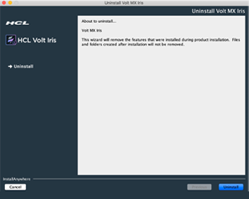
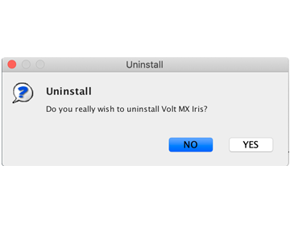
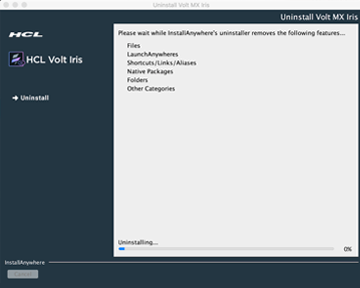
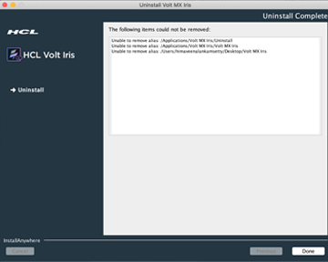

                                   

*   [Prerequisites](Prerequisites.html#prerequisites)
    *   [System Requirements](Prerequisites.html#system-requirements)
    *   [Download Volt MX Iris](Prerequisites.html#download)
*   [Install Volt MX Iris](Installing VoltMX Iris.html#installing)
    *   [Configuring Volt MX Iris to use a Proxy server](Installing VoltMX Iris.html#configuring-to-use-a-proxy-server)
        *   [Basic Proxy](Installing VoltMX Iris.html#basic-proxy)
        *   [NTLM Proxy](Installing VoltMX Iris.html#ntlm-proxy)
        *   [Custom NTLM Proxy](Installing VoltMX Iris.html#custom-ntlm-proxy)
        *   [White-list Essential Domains](Installing VoltMX Iris.html#white-list-essential-domains)
*   [Post Installation Tasks](Launching VoltMX Iris.html#post-installation-tasks)
    *   [Launching Volt MX Iris](Launching VoltMX Iris.html#launching)
*   [Update Volt MX Iris](Upgrade.html)
*   [FAQs](StudioInstallation_FAQs.html#appendix-frequently-asked-questions-faqs)

*   All Files

Uninstalling Volt MX Iris
===============================

To uninstall Volt MX Iris, follow these steps:

1.  Use one of the following options to open the **Uninstall Volt MX Iris** window:
    
    1.  Navigate to the folder where Volt MX Iris is installed. For example, `<Install Drive>:\iris_installation`. Double-click the **Uninstall** shortcut.
        
    2.  Navigate to **Start** > **Control Panel** > **Programs and Features**. From the list of programs, select **Iris** and then click **Uninstall**.
        
    
    
    
    The **Uninstall Volt MX Iris** window appears.
    
2.  Click **Uninstall**.
    
      
    The **Uninstall** confirmation window appears.
    
3.  Click **Yes**.
    
    
    
    The **Uninstall Complete** pane appears.
    
4.  Click **Done** to close the **Uninstall** window.
    
    
    
    > **_Note:_** The uninstaller cannot remove the files or folders that were not installed or copied by the installer. These include files or folders that are created as you use Volt MX Iris (for example, log files). You need to manually delete those files.
    

*   [Prerequisites](Prerequisites.html#prerequisites)
    *   [System Requirements](Prerequisites.html#system-requirements)
    *   [Download Volt MX Iris](Prerequisites.html#download)
*   [Install Volt MX Iris](Installing VoltMX Iris.html#installing)
    *   [Configuring Volt MX Iris to use a Proxy server](Installing VoltMX Iris.html#configuring-to-use-a-proxy-server)
*   [Post Installation Tasks](Launching VoltMX Iris.html#post-installation-tasks)
    *   [Launching Volt MX Iris](Launching VoltMX Iris.html#launching)
*   [Update Volt MX Iris](Upgrade.html)
*   [FAQs](StudioInstallation_FAQs.html#appendix-frequently-asked-questions-faqs)
