                            

Basic Account Setup and App Preview
===================================

You will first get the Volt MX account setup, download Iris, and install the app preview app on a device.

Your VoltMX.com Cloud Credentials
-------------------------------

If you already have a Volt MX cloud account, skip this section. You should have received an invitation to a Volt MX cloud as seen below, select **Accept Invitation** to initialize your cloud user ID. 

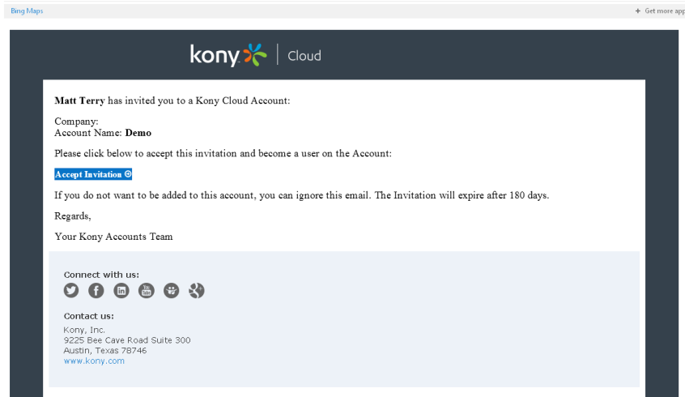

This user ID and password will be used to access:

*   Downloads
*   Foundry Management Console
*   Iris Enterprise Login
*   Iris Starter Cloud Functions (Publish, Share)
*   Iris App Preview

Download and Install Iris Enterprise
------------------------------------------

Download Iris Enterprise from the Volt MX download portal [http://community.hclvoltmx.com/downloads.](http://community.hclvoltmx.com/downloads)

You will need to provide your VoltMX.com cloud credentials.  Download Iris Enterprise 7.2.0.2 for either Mac or Windows, depending on preference.

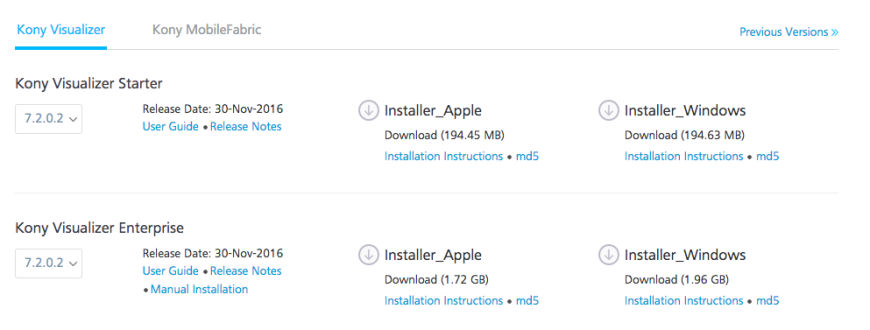

Complete the installation of Iris Enterprise.  You may be asked to provide a path to the Android SDK.  If you don’t know or don’t have an installed SDK, skip this step. If you install Iris Enterprise on a Mac, you can easily setup your Xcode environment later.

Install the Iris Preview App and Run the Preview
------------------------------------------------------

### Install and Log In to the Iris App Preview

Navigate to the Apple or Android app store and search for **VoltMX Iris**.  Download the Iris App Preview App.

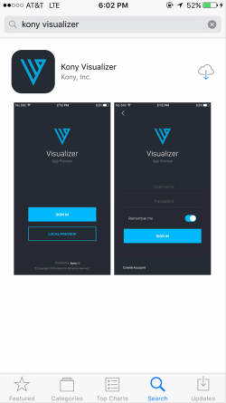

Install the app and login.  Your credentials will be identical to the credentials you created when initializing your Volt MX cloud account.

### Launch the Preview Code

To launch the sample Saleforce Pipeline App, select the **Cloud** option on the app menu, and then enter the following App Preview ID **S88G8**.

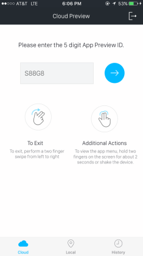

### Exploring the App Preview App

Once the Preview App launches, you will be in **Child App** mode.  To exit at any time, shake the device, and select **Exit**, or use two fingers and swipe from left to right.

App preview: Sample Salesforce Pipeline App

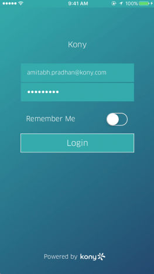

The following is a video of the app as it should appear on your device:

[https://youtu.be/mmF05Iuetsw](https://youtu.be/mmF05Iuetsw)

The app consists of the following **views** or **forms**:

1.  Login
2.  Dashboard
3.  Menu
4.  Accounts Listing
5.  Account Detail
6.  Opportunities Listing
7.  Opportunities Detail

This app makes use of the Foundry integration and identity services, along with many of the features of the Iris Enterprise app design and development toolset.

Iris Application Tour
===========================

Next, we will launch the application in Iris, and take a tour of all of the basic components that make up a Iris app.

Launch Iris Enterprise and Import the Sample App
------------------------------------------------------

*   Once Volt MX Iris Enterprise launches, you will be prompted to login using your Volt MX cloud credentials. 
*   Once Iris has been launched, and you have created a workspace folder, select **File** >**Import** > **Cloud**
*   You should see the **Pipeline Manager** app.  Select the app and import.  This app will now be added to your local Iris workspace.  
    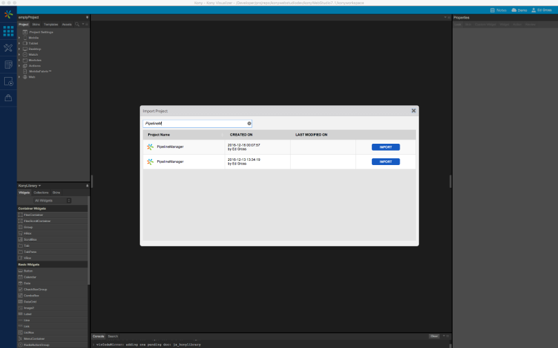  
    

Exploring the App: Forms
------------------------

Once the app is opened, you will notice that there are several forms under the **Mobile** category in the project explorer.  The project explorer is the outline of your project’s forms, resources, skins, actions, and JS Modules.

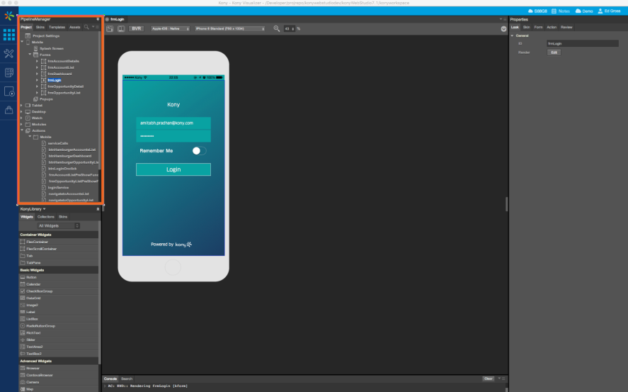

Select the form **frmLogin**.  The form will open in the Iris app canvas.  Select some other forms.  They will open up as tabs in the Iris canvas palette.

To open up multiple windows, select **Window** > **Arrange**\> **Side by Side**.  You can then drag canvas tabs from one window to another:

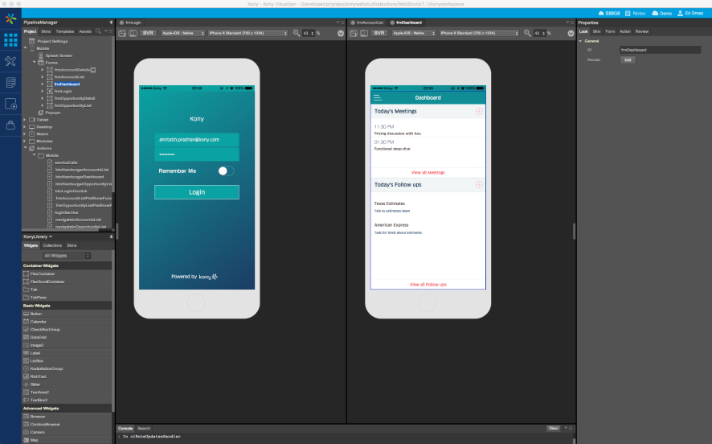

Exploring the App: Widgets and Skins
------------------------------------

Iris provides a wide array of app design capabilities with skins and themes.  On the form **frmLogin**, select the Login button in the Iris canvas.  Then, on the right panel (the properties editor), select the **Skin** tab.  Notice all of the various widget design properties available.  All of these properties map back to native drawing properties in the underlying operating systems (iOS, Android, Windows, and HTML5)

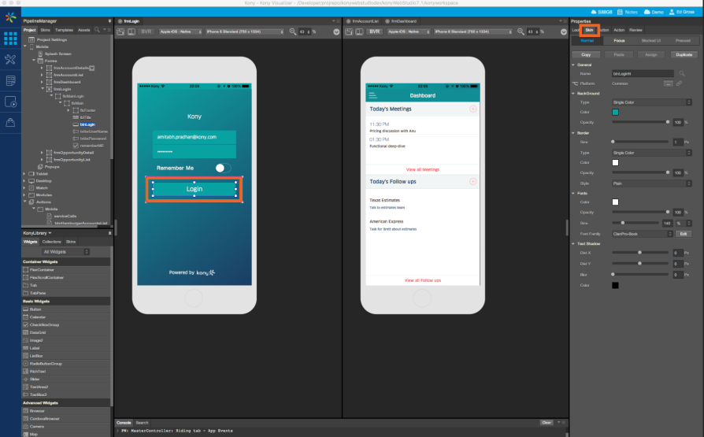

Exploring the App: Actions
--------------------------

The application workflow and logic is defined through ACTIONS in Iris.  To access the actions for the selected login button, select the Login button, and then select the **Actions** tab in the property editor on the right.

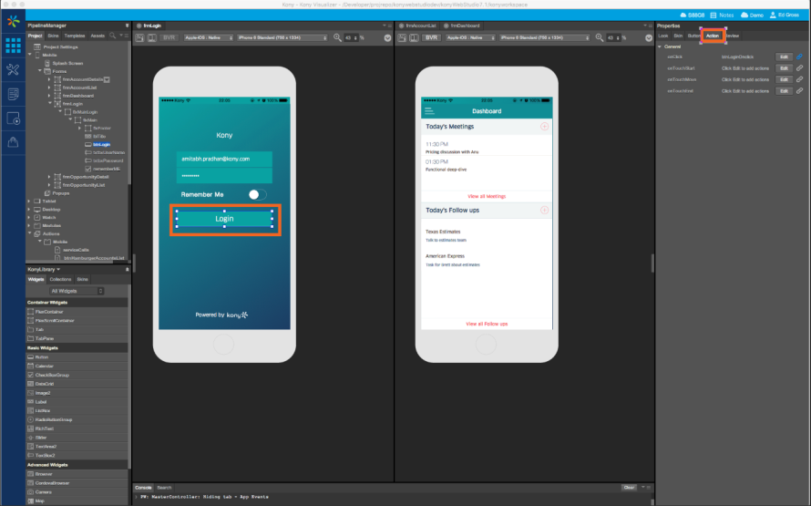

You will notice that the button has Actions for each Event.  Notice that the **link** icon in the property editor is BLUE, indicating that there is already an Action Sequence assigned for this action of the button.

Select the **Edit** button.  This will open the associated action sequence in a new tab.

This action sequence executes the following:

1.  Initializes the Salesforce Identity service through Foundry
2.  Check to see if the fields are properly populated (basic field validation)
3.  Validate the username and password
4.  If the username and password are correct,
    1.  Navigate to the form **frmDashboard**
5.  If the username and password are not correct,
    
    1.  Show an alert (native alert)
    
    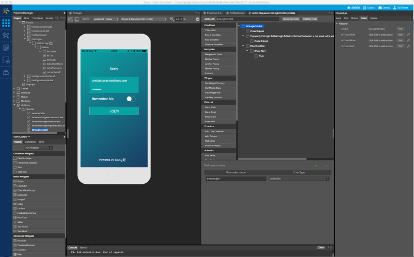
    
6.  Next select the line beginning with **If property frmLogin.flxMainLogin.txtbox…** – this is known as a **conditional operation**.  This enables users who are unfamiliar with Javascript to create more complex business logic through a point and click editor.  
    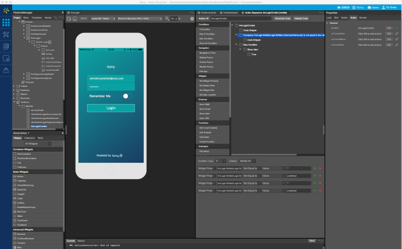  
    
7.  Next select the second **Code Snippet** line.  This illustrates how Javascript and the full Volt MX development platform can also be accessed from within Action Editor.  
    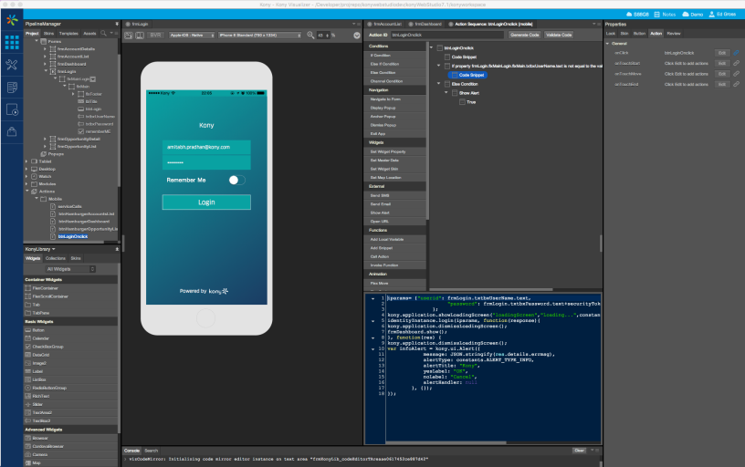

Exploring the App: Action Editor and Foundry Integration
--------------------------------------------------------------

Next, we will see how using Action Editor, the user can invoke a Foundry integration service, which has been pre-configured, and map the return data to the UI in Iris.

1.  First, open the form **frmDashboard**.
2.  Then, select the **Actions** tab in the property editor.
3.  Select the **Edit** icon on the **postShow** event of the form.  
    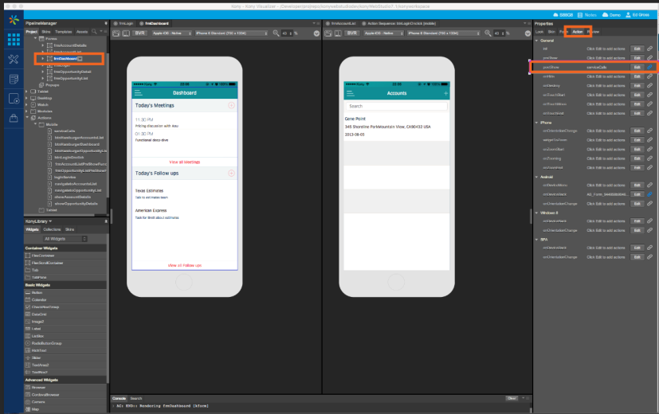
4.  This will open the Action Sequence associated with the **postShow** event for the form **frmDashboard**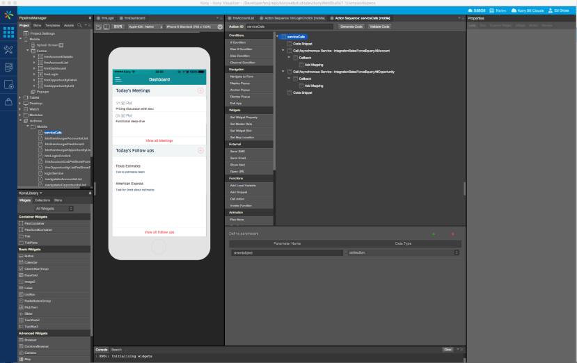
5.  Select the first or second **Add Mapping** entry in the Action Sequence.  This will present the Foundry mapping editor in Iris, which enables users to map all of the service data to the UI without writing a single line of code.  In the example below, the Salesforce integration service for opportunities is being mapped to a Segment widget (a list of entries) on the form **frmOpportunitiesLis.**

Recap: Volt MX Iris
----------------------

So far, we have seen in this example app, integrated with Salesforce through Volt MX Foundry, utilizes the tools in Iris, both through point and click editors like Action Editor, and the design canvas, and through Javascript, to create an end to end Enterprise application.  Next, we will dive into Foundry.

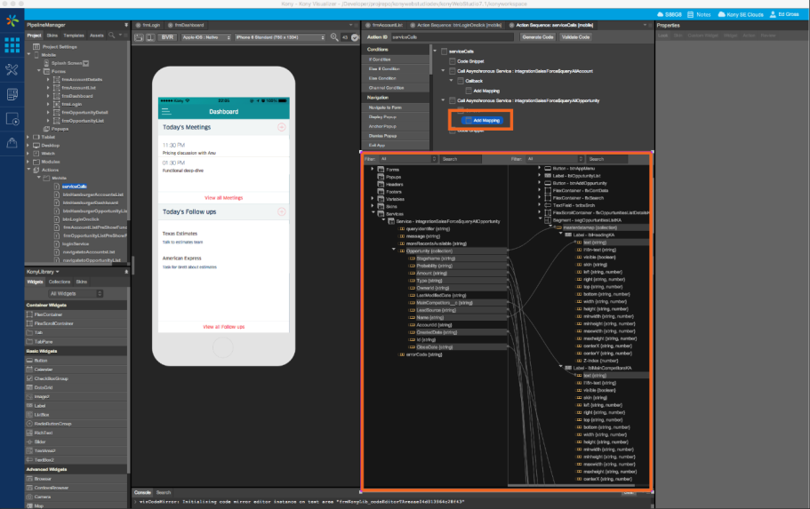

Tour of Foundry Components
===============================

Next, we will take a tour of all of the Foundry components that make up the back end of the application. If you would only like to further explore the front end of the application, you may stop here.

Review of Foundry’s Identity and Integration services of SF Pipeline App
-----------------------------------------------------------------------------

This section discusses the details of the identity and integration services that are pre-configured in the Foundry for the SF Pipeline application. The identity service allows the SF Pipeline application to authenticate against the SalesForce identity infrastructure and the integration services use the capabilities of the Foundry to discover the metadata of the objects that are exposed by SalesForce.

### Review Identity Services Used in SF Pipeline Application

The identity service of the Foundry in this test drive allows the SF Pipeline application to authenticate against the SalesForce identity infrastructure.

To review the identity service that is already set up in the Foundry, follow the following steps:

1.  From Iris, in the project explorer, select the Foundry line in the project explorer
    
    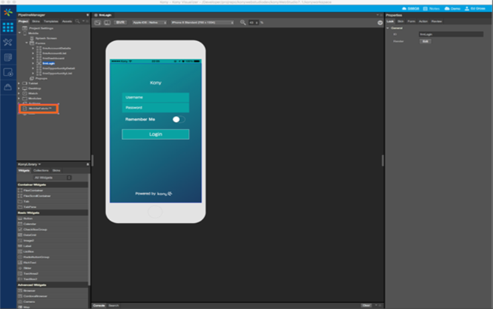
    
2.  Once logged in successfully, click on **Apps** on the left side to review all the apps that are installed.  
    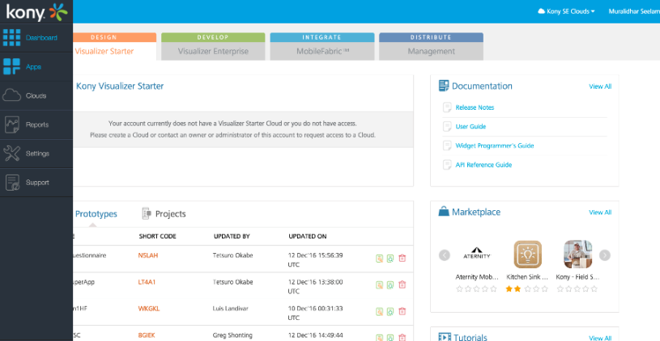  
    
3.  Click on **SF Pipeline** app in the list apps as shown below. This will display the details of this application.  
    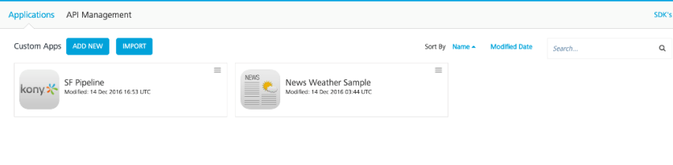
4.  Once the **SF Pipeline** App is clicked, you will see that **Identity** tab under **Configure Services** is selected by default.  
      
    The **Name** refers to the name of the identity service. The **URL** indicates the callback URL for this identity service and the **Type** refers to the backend system that the identity service communicates with, which in this case is **SalesForce**. The **SSO** column indicates if the single sign-on mechanism is enabled.  
      
    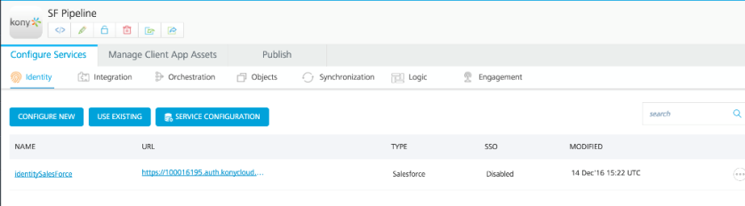
5.  Next, click on the **identitySalesForce** to see the details of the service. As you can see from the screen below, the **Type of Identity** is SalesForce as this identity service will be used to discover the metadata of SalesForce. The **Auth Mode** for this identity service is username/password hence the client id and the client secret of the SalesForce account need to be entered in the **SalesForce ClientId** and  **SalesForce ClientSecret** fields respectively. This identity service will be used with the integration services that will discover and expose the SalesForce data, as we will see in the next steps.  
    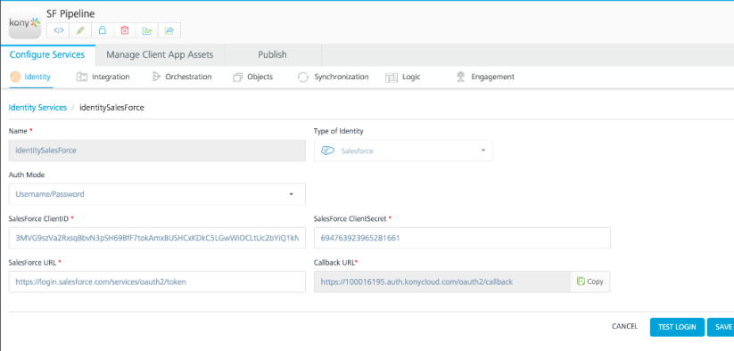

### Review Integration Services Used in SF Pipeline Application

This section discusses the integration services that are preconfigured in the Foundry instance and are used by the SF Pipeline Application. This application has one integration service called as **integrationSalesForce**. This integration service will be invoked by the client application to display the SalesForce data on the mobile screens.

To review the **integrationSalesForce** service of Foundry, follow the following steps

1.  After logging into Foundry, click on the integration tab to view all the integration services that are setup in the Foundry. You will see all the service names in the **Name** column. The **ServiceType** indicates the type of the identity services that are used and this case it is **SalesForce**. The **Version** indicates the versions of the services.  
    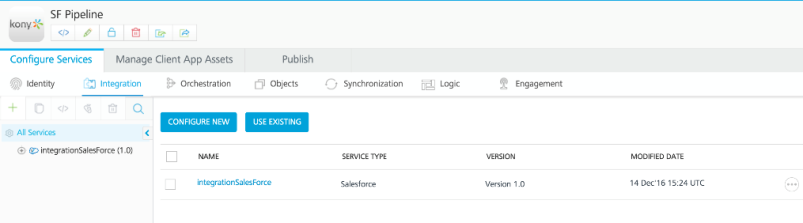
2.  Click  **integrationSalesForce** to look at the service definition and the operations list of this service.  
      
    In the **Service Definition** section, you will see all the details of the service. You will see that the **Service Type** of this service is **SalesForce** and we using the already created **identitySalesForce** as the identity provider.
    
    In the **UserId** and **Password** fields, the userId and password of SalesForce account are entered.  
    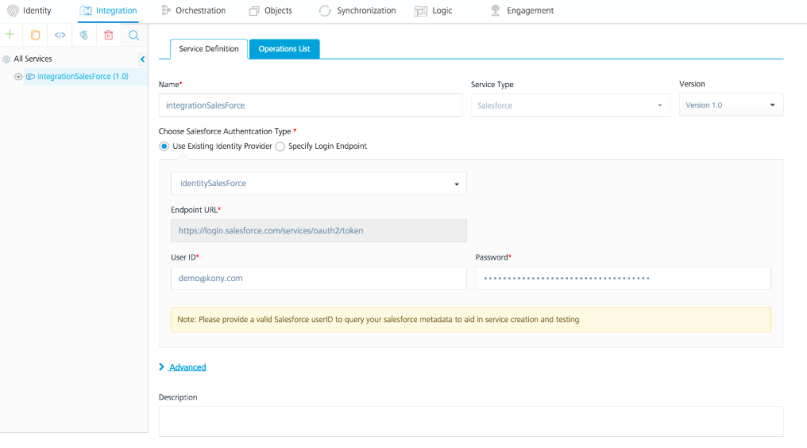
    
3.  Next, click on the **Operations List** tab to see all the operations of the **integrationSalesForce** service. You will see that this service was created with two operations, which are **queryAllAccount** and **queryAllOpportunity**.  
      
    You will also notice there are two drop-down lists i.e. **Object** and **Operation Name** on the page. The  **Object** drop-down is automatically populated by Foundry with all the SalesForce exposed objects.  Choosing an object in the **Object** drop-down will cause Foundry discover and load the exposed operations in the **Operation Name** dropdown.  
      
    This **queryAllAccount** operation was created by choosing the **Contact** object from the drop down and then choosing the exposed **queryAllAccount** operation of SalesForce. Similarly, the **queryAllOpportunity** operation was created by choosing the **Opportunity** object from the drop down. These two operations were selected as they are used by the client side application to display the mobile pages.  
    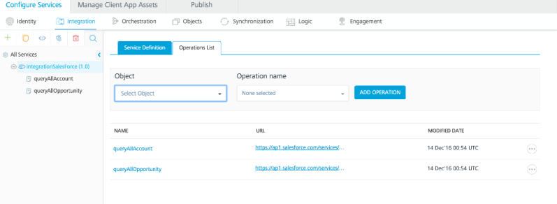  
      
    
4.  Next, click on the **queryAllAccount** operation to look at the details of the operation. The Foundry populates the **Operation Path** by default as it performs the discovery of the exposed SalesForce data using the inbuilt business connectors.  
      
    The **queryString** in the **Request Input** section has a test SAL that can be used to test the operation. The value of this **queryString** is appended to the URL of the operation path as can be seen in the **Operation Path** field. The **queryString** is passed by the client application to display the required data on the mobile pages.  
    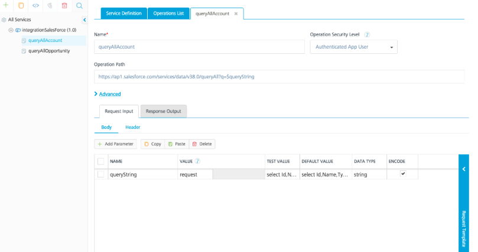  
    
5.  Next, click on **Response Output** tab. This displays all the XPath mappings that are created to retrieve the applicable data from the response that is received from SalesForce.  The data that is retrieved from the response is mapped to the output data with meaningful names. These XPath transformations also reduce the amount of code on the client side of the application.  
    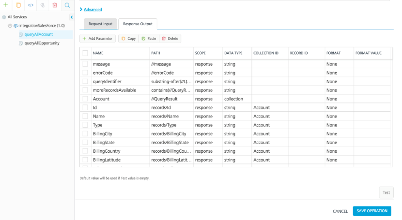
6.  Next, click on **Test** to test this operation. This will execute the test SQL that was discussed previously and will invoke the SalesForce object. The response data will be displayed as shown below.  
    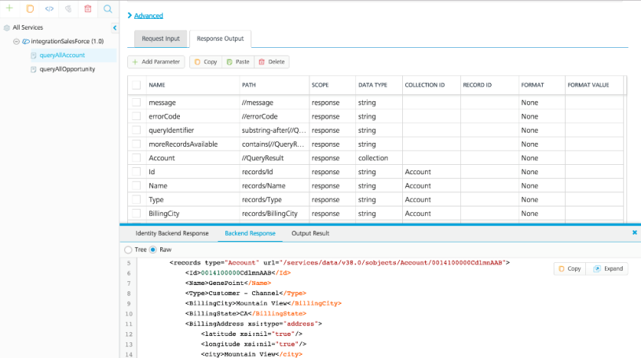
7.  The details of the **queryAllOpportunity** operation as similar to **queryAllAccount** hence are not discussed in detail.

Configuring Foundry for a Custom Salesforce Instance
=========================================================

This section is for advanced users that would like to configure the Foundry app to point to a custom or personal Salesforce instance.

Creating SalesForce Trial Account and Connected App
---------------------------------------------------

This section of the guide discusses the steps that are involved in the creation of a new SalesForce developer trial account and the creation of a connected app.  These account and connected app details are needed to configure Foundry’s identity and integration services. These identity and integration services discover the exposed metadata of the SalesForce objects and will be used for the **online** functionality of the SF Pipeline Application.

1.  Log on to developer.salesforce.com and click on **Sign Up** in the top right corner.  
    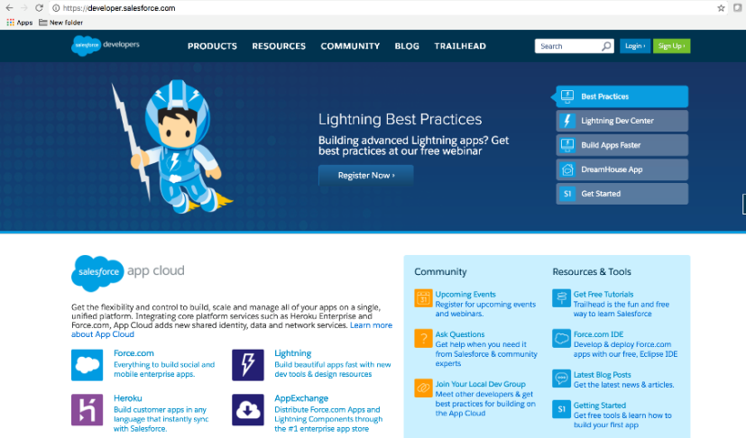
2.  Enter the information that is needed and click on **Sign me up** . This will check to see if the user id chosen is available and will send an email to the email address provided to set the password.  
    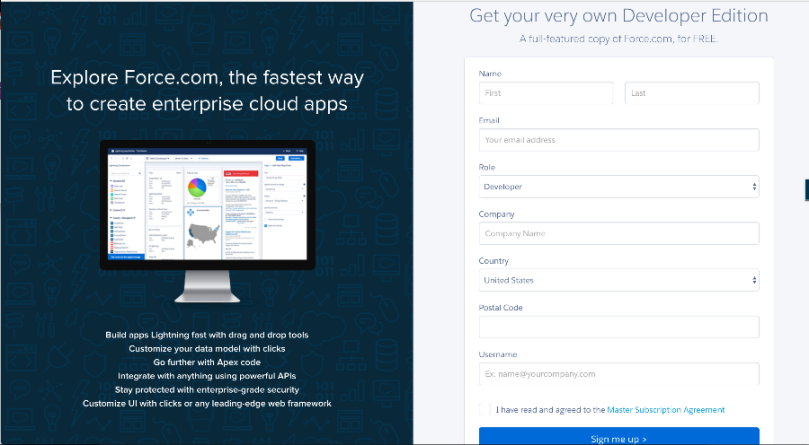
3.  Once you sign in for your account, a screen shown as below is seen and an email will be sent to setup your password.  
    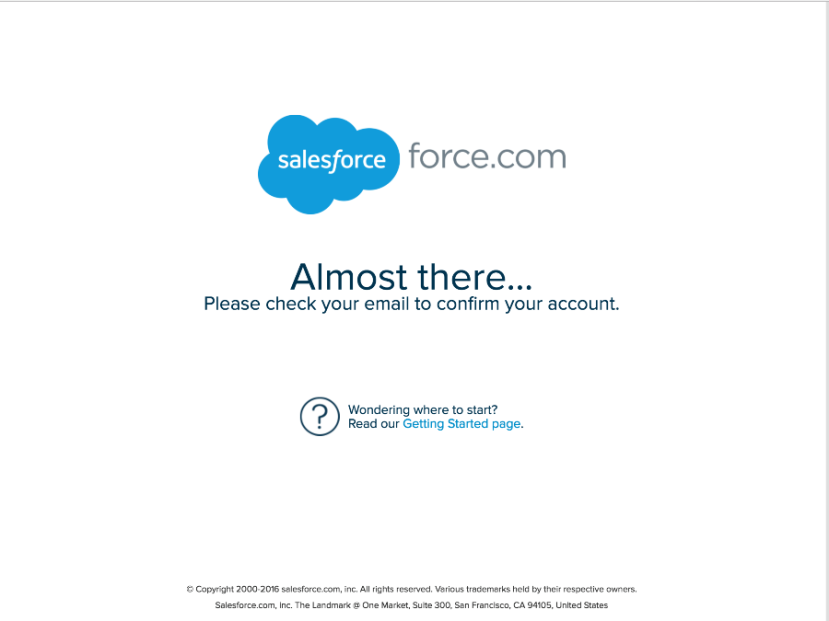
4.  Click on the link to set up the password in the email that is sent. The email with the password link as shown below.  
    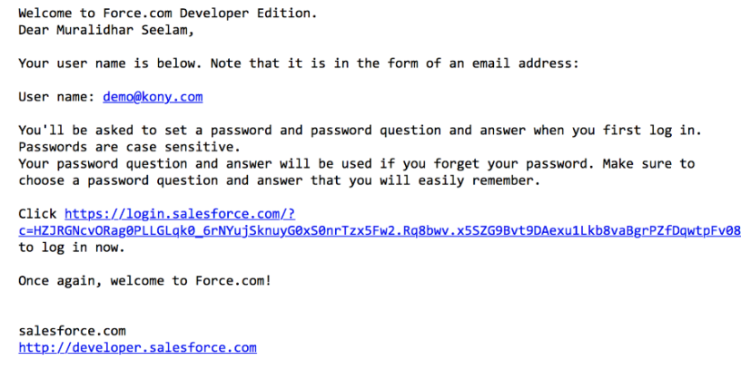
5.  Clicking on the URL that is sent in the email, will display the screen as shown below which will need to be used to set up the password.  
    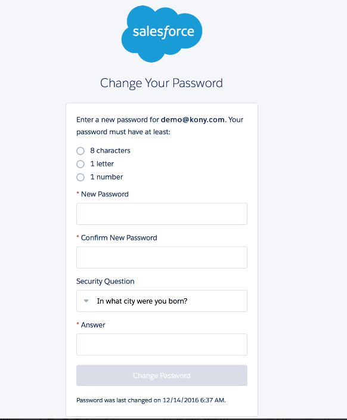
6.  Login into the [developer.salesforce.com](http://developer.salesforce.com/) account with the credentials that were set up. Click on **My Settings** in the drop-down list to start the creation of the **Security Token**. Please note that the combination of the security token and the password will be needed to configure the integration services in Foundry.  
    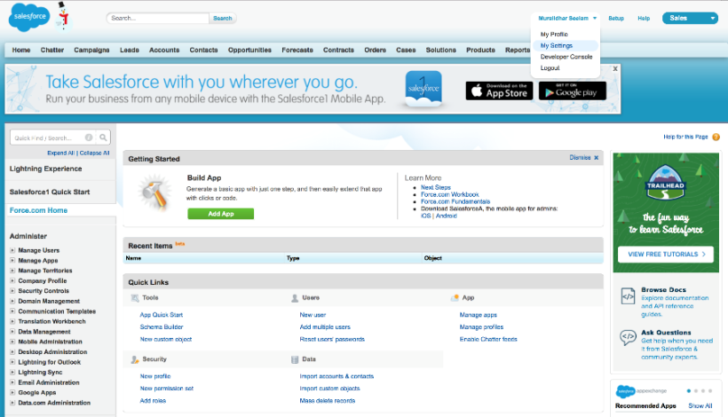
7.  Click on **Reset my Security Token** option on the left side to create the security token. This will cause the token to be mailed to the email that has been set up with the account.  
    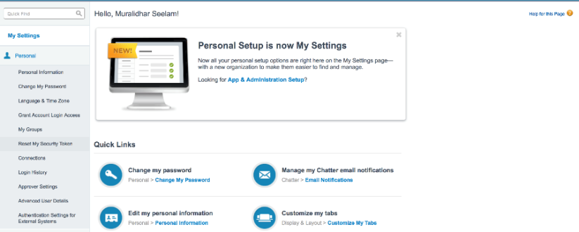
8.  After the security token creation has been initiated a screen like below will be shown. Click on **Reset Security Token** to finish the creation of the token.  
    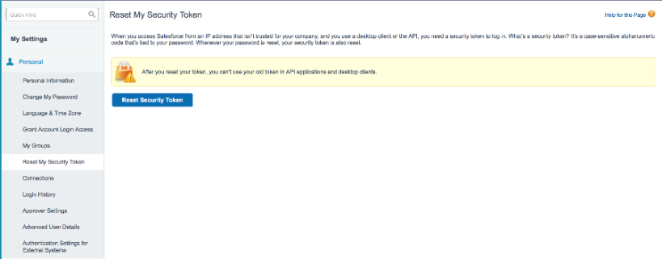
9.  Next, click on the **Setup** in the menu above to view the screen to create a new app.  
    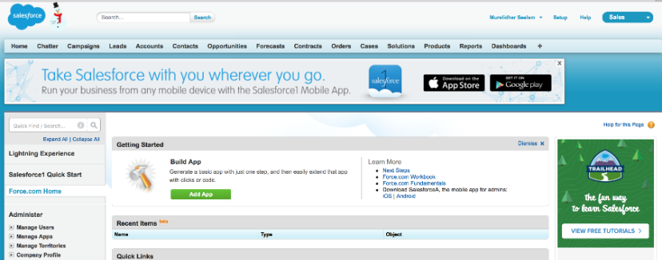
10.  Click on the **Build** > **Create** > **Apps** to begin the creation of the new connected app. This creation of the connected app will provide with customer key and customer secret which you will need to configure the identity service in Foundry.  
    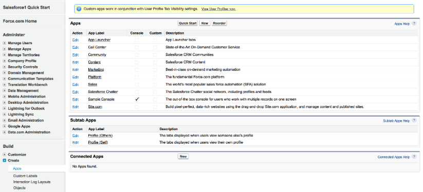
11.  Click on **New** in the **Connected Apps** section to continue the creation of the new connected app.  
    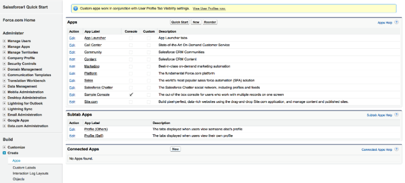
12.  To configure the new app that you will be creating, you will need the **Callback URL** for that app. The **Callback URL** will need to be retrieved from the services that are set up in Foundry. Login into the Foundry using your login credentials. Click on **Apps** on the left to display the list of all apps that are installed.  
    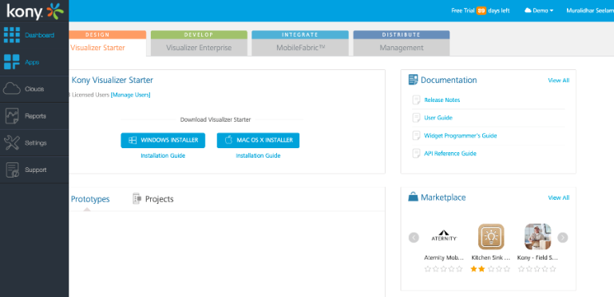
13.  Click on **SF Pipeline** App in the list of apps that are displayed.  
    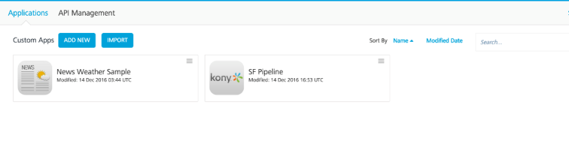
14.  By default, the list of identity services of the application is displayed as shown below. Click on **identitySalesForce** to see the details of the identity service.  
    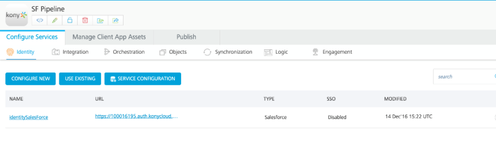
15.  In the details screen as shown below, you will see the **Callback URL** field with the callback URL. Please note this callback URL as this will be needed to configure the application.  
    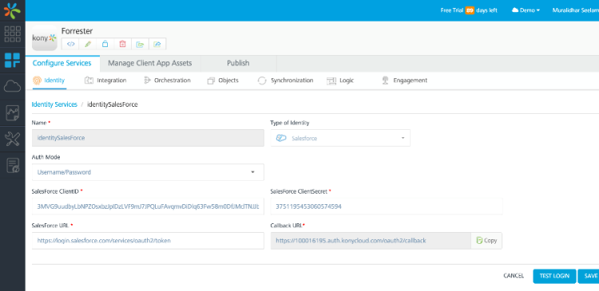
16.  In the **Basic Information** section, enter the **Connected App Name** and **Contact Email** information at a minimum.  In the **API** (**Enable OAuth Settings**) section, select the **Enable OAuth Settings** and enter the **Callback URL** and select all the **Available OAuth Scopes**. Enter the callback URL as noted from the earlier steps into the **Callback URL** field. Click on **Save** to generate the **Consumer Key** and **Consumer Secret**.  
      
    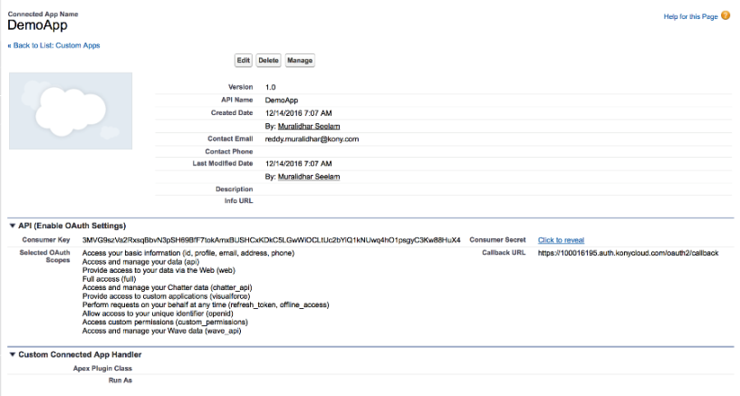

Configure and Publish Identity and Integration Services in Foundry
-----------------------------------------------------------------------

This section discusses the details of the configuration changes that are to be performed in the identity and integration services of the Foundry that were set up for the SF Pipeline application. These configuration changes are needed, to use the newly created, your own, SalesForce account credentials.

### Configure and Publish Identity and Integration Services of SalesForce Pipeline App

1.  After successfully logging into Foundry, you will see that **Identity** tab under **Configure Services** is selected by default. This page displays all the identity services that are currently set up. Click on **identitySalesForce** service, under the **Name** column, to modify the existing configuration.  
    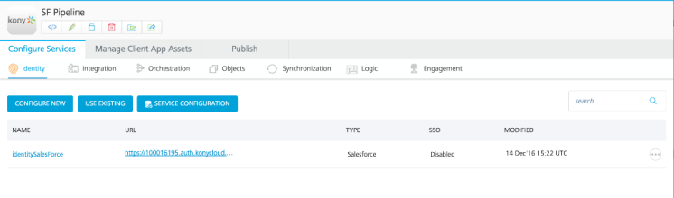
2.  Modify the **SalesForce ClientId** and **SalesForce ClientSecret** data with the  **Consumer Key** and **Consumer Secret**  values that were generated when a new app was created in SalesForce you’re your login and password. Click on **Save** to save the modified identity service.  
    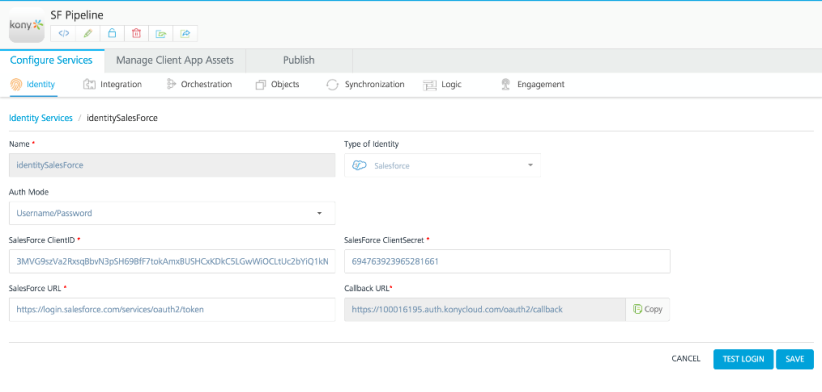
3.  Next, click on the **Integration** tab under **Configure Services**. This will list all the integration services that are preconfigured and will be invoked by the SF Pipeline client application to display the data.   
    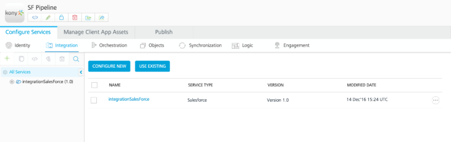
4.  Click on **integrationSalesForce** service under the **Services** column to see the details of the integration service. Modify the  **User Id** and enter your SalesForce user id. In the **Password** field you will need to enter the concatenated value of the password and the security token that was generated with your developer account. Click on **Save** to save the changes made.  
    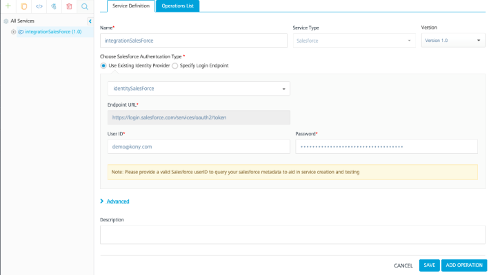
5.  The next step will be to test the operations of the services that are already set up. Click on the **queryAllAccount** operation to see all the details of the operation. The operation name can be seen in the **Name** field. The **OperationPath** has the SalesForce URL that is invoked along with the **queryString** appended.  
    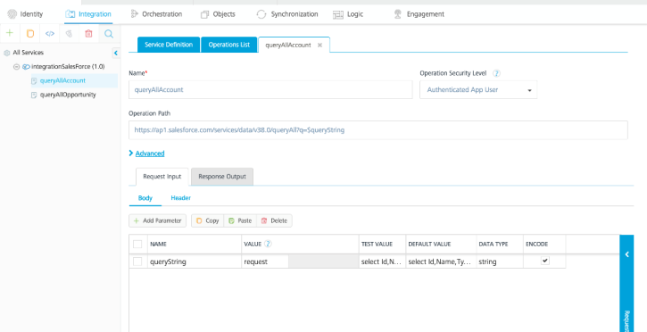
6.  Click on **Fetch Operation** to execute the SQL in the **Test Value** column.   
    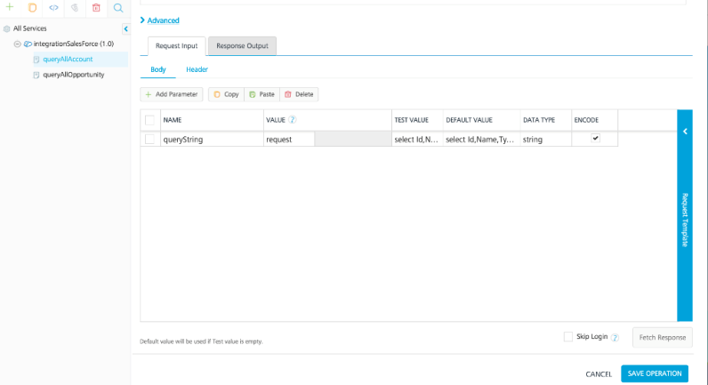
7.  After the SQL is successfully executed, the response from SalesForce, which contains the Account details, is shown in the Foundry as below.  
    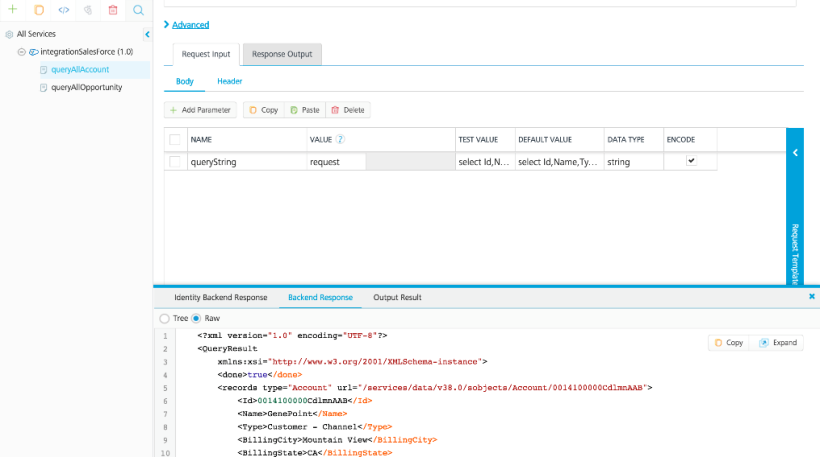
8.  Next, we will review the second operation called as **queryAllOpportunity**.  Click on the **queryAllOpportunity** operation on the left to display all the details of the operation. The operation name can be seen in the **Name** field. The **OperationPath** has the SalesForce URL that is invoked along with the **queryString** appended.  
    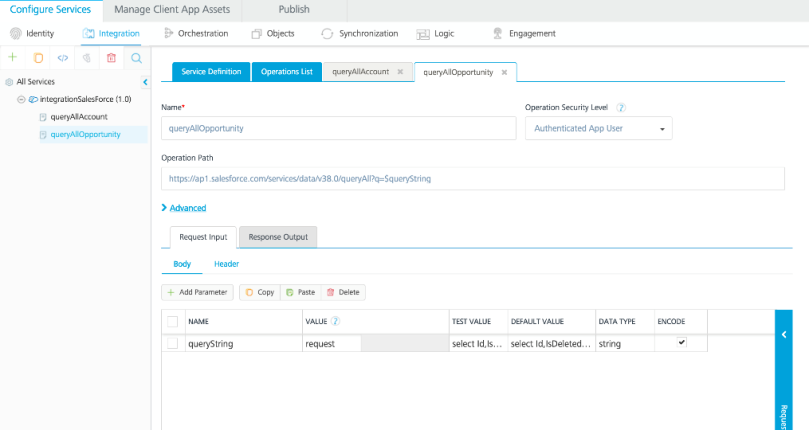
9.  The details of the **queryAllOpportunity** operation are similar to **queryAllAccount** operation hence is not covered in detail in this user manual. Please feel free to navigate and test this operation in Foundry to understand these better.  
      
    Similar to the **queryAllAccount** operation that was discussed before, to test the **queryAllOpportunity** operation, click on **Fetch Operation** to execute the SQL in the **Test Value** column.
10.  After the identity and integration services are configured with your SalesForce account login and password, the application will need to be published so that it can be invoked by the client application.  Click on the **Publish**tab in the screen below to begin the process of publish.  
    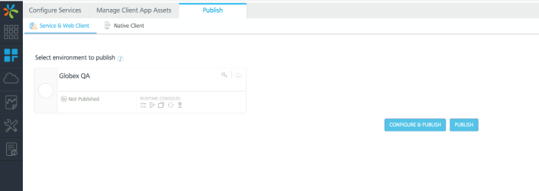
11.  Select the **Globex QA** environment to publish.  Click **Publish** to continue the publishing process.  
    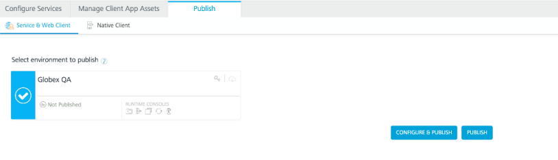
12.  A message pop up with the various steps of publishing along with the status is shown after publishing is complete.  
    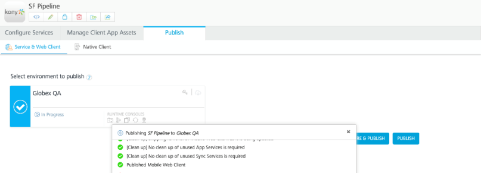

