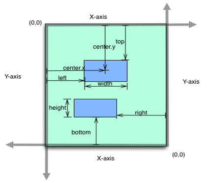

                                  

FlexScrollContainer Properties
==============================

The FlexScrollContainer widget provides the following properties.

* * *

;)[accessibilityConfig Property](javascript:void(0);)

* * *

Enables you to control accessibility behavior and alternative text for the widget.

For more information on using accessibility features in your app, see the [Accessibility]({{ site.baseurl }}/docs/documentation/Iris/iris_user_guide/Content/Accessibility_Overview.html) appendix in the Volt MX IrisUser Guide.

Syntax

accessibilityConfig

Type

Object

Read/Write

Read + Write

Remarks

*   The accessibilityConfig property is enabled for all the widgets which are supported under the Flex Layout.

> **_Note:_** From Volt MX Iris V9 SP2 GA version, you can provide i18n keys as values to all the attributes used inside the `accessibilityConfig` property. Values provided in the i18n keys take precedence over values provided in `a11yLabel`, `a11yValue`, and `a11yHint` fields.

The accessibilityConfig property is a JavaScript object which can contain the following key-value pairs.

  
| Key | Type | Description | ARIA Equivalent |
| --- | --- | --- | --- |
| a11yIndex | Integer with no floating or decimal number. | This is an optional parameter. Specifies the order in which the widgets are focused on a screen. | For all widgets, this parameter maps to the `aria-index`, `index`, or `taborder` properties. |
| a11yLabel | String | This is an optional parameter. Specifies alternate text to identify the widget. Generally the label should be the text that is displayed on the screen. | For all widgets, this parameter maps to the `aria-labelledby` property of ARIA in HTML. > **_Note:_** For the Image widget, this parameter maps to the **alt** attribute of ARIA in HTML. |
| a11yValue | String | This is an optional parameter. Specifies the descriptive text that explains the action associated with the widget. On the Android platform, the text specified for a11yValue is prefixed to the a11yHint. | This parameter is similar to the a11yLabel parameter. If the a11yValue is defined, the value of a11yValue is appended to the value of a11yLabel. These values are separated by a space. |
| a11yHint | String | This is an optional parameter. Specifies the descriptive text that explains the action associated with the widget. On the Android platform, the text specified for a11yValue is prefixed to the a11yHint. | For all widgets, this parameter maps to the `aria-describedby` property of ARIA in HTML. |
| a11yHidden | Boolean | This is an optional parameter. Specifies if the widget should be ignored by assistive technology. The default option is set to _false_. This option is supported on iOS 5.0 and above, Android 4.1 and above, and SPA | For all widgets, this parameter maps to the `aria-hidden` property of ARIA in HTML. |
| a11yARIA | Object | This is an optional parameter. For each widget, the key and value provided in this object are added as the attribute and value of the HTML tags respectively. Any values provided for attributes such as `aria-labelledby` and `aria-describedby` using this attribute, takes precedence over values given in `a11yLabel` and `a11yHint` fields. When a widget is provided with the following key value pair or attribute using the a11yARIA object, the tabIndex of the widget is automatically appended as zero.`{"role": "main"}``aria-label` | This parameter is only available on the Desktop Web platform. |

Android limitations

*   If the results of the concatenation of a11y fields result in an empty string, then `accessibilityConfig` is ignored and the text that is on widget is read out.
*   The soft keypad does not gain accessibility focus during the right/left swipe gesture when the keypad appears.

SPA/Desktop Web limitations

*   When `accessibilityConfig` property is configured for any widget, the `tabIndex` attribute is added automatically to the `accessibilityConfig` property.
*   The behavior of accessibility depends on the Web browser, Web browser version, Voice Over Assistant, and Voice Over Assistant version.
*   Currently SPA/Desktop web applications support only a few ARIA tags. To achieve more accessibility features, use the attribute a11yARIA. The corresponding tags will be added to the DOM as per these configurations.

Example 1

This example uses the button widget, but the principle remains the same for all widgets that have an accessibilityConfig property.

//This is a generic property that is applicable for various widgets.
//Here, we have shown how to use the accessibilityConfig Property for button widget.
/*You need to make a corresponding use of the accessibilityConfig property for other applicable widgets.*/

Form1.myButton.accessibilityConfig = {
    "a11yLabel": "Label",
    "a11yValue": "Value",
    "a11yHint": "Hint"    
};


Example 2

This example uses the button widget to implement internationalization in `accessibilityConfig` property, but the principle remains the same for all widgets.

/*Sample code to implement internationalization in accessibilityConfig property in Native platform.*/

Form1.myButton.accessibilityConfig = {
    "a11yLabel": voltmx.i18n.getLocalizedString("key1")     
};  
/*Sample code to implement internationalization in accessibilityConfig property in Desktop Web platform.*/

Form1.myButton.accessibilityConfig = {
    "a11yLabel": "voltmx.i18n.getLocalizedString(\"key3\")"
};


Platform Availability

*   Available in the IDE
*   iOS, Android, SPA, and Desktop Web

* * *

;)[allowHorizontalBounce Property](javascript:void(0);)

* * *

Specifies whether the scroll bounce is enabled or disabled in the horizontal direction.

From V9 SP1 release, this property is supported in the Android platform. To use this property in Android platform, you must set the value of [overScrollX](#overScrollX) property as `constants.OVER_SCROLL_ENABLE` or `constants.OVER_SCROLL_DISABLE`.

Syntax

allowHorizontalBounce

Type

Boolean

Read/Write

Read + Write

Remarks

The default value for this property is true (the scroll bounce is enabled in horizontal direction).

> **_Note:_** The **bounces** property takes precedence over this property.

Example

Setting the allowHorizontalBounce property on an existing widget:

Form1.flxScroll.allowHorizontalBounce = true;


Platform Availability

Available in the IDE.

*   iOS, Android, and SPA

* * *

;)[allowVerticalBounce Property](javascript:void(0);)

* * *

Specifies whether the scroll bounce is enabled or disabled in the vertical direction.

From V9 SP1 release, this property is supported in the Android platform. To use this property in Android platform, you must the value of [overScrollY](#overScrollY) property as `constants.OVER_SCROLL_ENABLE` or `constants.OVER_SCROLL_DISABLE`.

Syntax

allowVerticalBounce

Type

Boolean

Read/Write

Read + Write

Remarks

The default value for this property is true (the scroll bounce is enabled in vertical direction).

> **_Note:_** The **bounces** property takes precedence over this property.

Example

Setting the allowVerticalBounce property on an existing widget:

Form1.flxScroll.allowVerticalBounce = true;


Platform Availability

Available in the IDE.

*   iOS, Android, and SPA

* * *

;)[animateIcons Property](javascript:void(0);)

* * *

When the value of this property is set as **true**, the **[pullToRefreshIcon](#pullToRefreshIcon)** and **[pushToRefreshIcon](#pushToRefreshIcon)** icons rotate by 180 degrees.

Syntax

animateIcons

Type

Boolean

Read/Write

Read + Write

Remarks

The default value for this property is false.

Example

Setting the animateIcons property on an existing widget:

Form1.flxScroll.animateIcons= true;


Platform Availability

*   Android
*   iOS
*   Windows
*   SPA

* * *

;)[anchorPoint Property](javascript:void(0);)

* * *

Specifies the anchor point of the widget bounds rectangle using the widget's coordinate space.

Syntax

anchorPoint

Type

JSObject

Read/Write

Read + Write

Remarks

The value for this property is a JavaScript dictionary object with the keys "x" and "y". The values for the "x" and "y" keys are floating-point numbers ranging from 0 to 1. All geometric manipulations to the widget occur about the specified point. For example, applying a rotation transform to a widget with the default anchor point causes the widget to rotate around its center.

The default value for this property is center ( {"x":0.5, "y":0.5} ), that represents the center of the widgets bounds rectangle. The behavior is undefined if the values are outside the range zero (0) to one (1).

Example

Form1.widget1.anchorPoint = {
    "x": 0.5,
    "y": 0.5
};


Platform Availability

*   iOS, Android, Windows, and SPA

* * *

;)[backgroundColor Property](javascript:void(0);)

* * *

Specifies the background color of the widget.

Syntax

backgroundColor

Type

Color constant or Hexadecimal number

Read/Write

Read + Write

Remarks

*   The initial value of backgroundColor has to be specified explicitly. If not, Iris will not deduce the values from the existing skin and this will lead to undefined behavior.
*   Colors can be specified using a 6 digit or an 8-digit hex value with alpha position. For example, ffff65 or ffffff00.
*   When the 4-byte color format (RGBA) string is used, an alpha (A) value of 65 specifies that the color is transparent. If the value is 00, the color is opaque. The Alpha value is in percentage and must be given in the hexadecimal value for the color (100% in hexadecimal value is 65).  
    For example, red complete opaque is FF000000. Red complete transparent is FF000065. The values 0x and # are not allowed in the string.
*   A color constant is a String that is defined at the theme level. Ensure that you append the **$** symbol at the beginning of the color constant.
*   This property does not have a default value.
*   This property has more priority than (and overrides) the background property of the configured skin. Even if there is no skin configured for the widget, this property updates the skin.
*   The backgroundColor, backgroundColorTwoStepGradient, backgroundColoMultiStepGradient, and backgroundImage properties are mutually exclusive. The property that was set most recently is given higher priority over other properties.

Example

This example uses the button widget, but the principle remains the same for all widgets that have the backgroundColor property.

Form1.btn1.backgroundColor = "ea5075";



Platform Availability

*   Android
*   iOS
*   Desktop Web (Not available on Desktop Web Legacy SDK)

* * *

;)[blur Property](javascript:void(0);)

* * *

You can enable or disable a blur-effect for a widget(for example, a FlexContainer) by making use of a constructor-level property, called **blur**. The **blur** property accepts a dictionary that contains the following keys: enabled, value and style. You must specify an appropriate value for the dictionary keys, otherwise the property will not be valid.

Syntax

blur

**Input Parameters**

*   _enabled_: Accepts a Boolean value that basically decides whether to enable or disable the blur-effect for the widget. This is a mandatory attribute.
*   _value_: Level of the blur-effect that needs to be set for the widget. It should ideally be between 0 to 100. If the level is set as 0 no blur is set, even when the enabled property is set as true. This is a mandatory attribute. Even when the _enabled_ attribute is set as false, you need to specify a numerical value to this attribute.
    
*   _style_: Specifies the style in which the blur property can be applied to a widget. This is an optional parameter specific to iOS. The default value of this parameter is constants.BLUR\_EFFECT\_LIGHT. You can specify any of the following values to this parameter:  
    *   constants.BLUR\_EFFECT\_NONE
    *   constants.BLUR\_EFFECT\_EXTRALIGHT
        
    *   constants.BLUR\_EFFECT\_LIGHT (default)
    *   constants.BLUR\_EFFECT\_DARK
        
    *   constants.BLUR\_EFFECT\_REGULAR
        
    *   constants.BLUR\_EFFECT\_PROMINENT
        

Read/Write

Read + Write

Remarks

*   If you set _enabled_ as true, the blur-effect for the widget is enabled.
*   If you set _enabled_ as false, the blur-effect for the widget is disabled.
*   If you specify _value_ as less than 0, the value is taken as 0.
    
*   If you specify _value_ as greater than 100, the value is taken as 100.

Limitations

*   For Android:
    *   If a FlexContainer or a FlexScrollContainer contains a Map widget, the blur-effect is not applied to the map.
        
    *   If a FlexContainer or a FlexScrollContainer contains a Browser or Video widget, the blur-effect is applied but does not get updated. For example, when the video starts playing, the new rendered frame does not get displayed with the blur-effect.
        
    *   Even if you apply 100% blur for widgets that display any text( such as Label or Calendar widgets), the text on these widgets is not blurred. This is a Native Android limitation. To generate the blur effect for the text, apply a skin with darker background to the Label or Calendar widget. This is true even when the widgets are placed in a FlexContainer with blur effect and the widgets do not have a skin.
    *   Blur effect will not work on widgets added inside BOX containers.

Example 1

To dynamically set the blur-effect for any widget, such as a FlexContainer, use the following code.

//This is a generic property that is applicable for various widgets.
//Here, we have shown how to use the blur property for FlexContainer widget.
/*You need to make a corresponding use of the 
blur property for other applicable widgets.*/

Form1.myFlexContainer.blur = {
    "enabled": true,
    "value": 60
};



Example 2

To dynamically set the blur-effect for any widget, such as a FlexContainer in iOS, use the following code.

Form1.widget1.blur = {
    "enabled": true,
    "value": 60,
    "style": constants.BLUR_EFFECT_DARK
};


Platform Availability

*   Android, iOS, Windows, SPA , and Desktop web

 

* * *

;)[bottom Property](javascript:void(0);)

* * *

This property determines the bottom edge of the widget and is measured from the bottom bounds of the parent container.

The bottom property determines the position of the bottom edge of the widget’s bounding box. The value may be set using DP (Device Independent Pixels), Percentage, or Pixels. In freeform layout, the distance is measured from the bottom edge of the parent container. In flow-vertical layout, the value is ignored. In flow-horizontal layout, the value is ignored.

The bottom property is used only if the Height property is not provided.

Syntax

bottom

Type

String

Read/Write

Read + Write

Remarks

The property determines the bottom edge of the widget and is measured from the bottom bounds of the parent container.

If the layoutType is set as voltmx.flex.FLOW\_VERTICAL, the bottom property is measured from the top edge of bottom sibling widget. The vertical space between two widgets is measured from bottom of the top sibling widget and the top of the bottom sibling widget.

Example

//Sample code to set the bottom property for widgets by using DP, Percentage and Pixels.
frmHome.widgetID.bottom = "50dp";

frmHome.widgetID.bottom = "10%";

frmHome.widgetID.bottom = "10px";


Platform Availability

*   Available in the IDE
*   iOS, Android, Windows, SPA , and Desktop Web

* * *

;)[bounces Property](javascript:void(0);)

* * *

Specifies whether the scroll bounce is enabled or disabled.

From V9 SP1 release, this property is supported in the Android platform.  
To enable the rubber band effect in a FlexScrollContainer widget while scrolling horizontally, in Android platform , set the value of `bounce` property as `true` and the value of [overScrollX](#overScrollX) property as `constants.OVER_SCROLL_ENABLE` or `constants.OVER_SCROLL_DISABLE`.Similarly, to enable the rubber band effect in a FlexScrollContainer widget while scrolling vertically, in Android platform, set the value of `bounce` property as true and the value of [overScrollY](#overScrollY) as `constants.OVER_SCROLL_ENABLE` or `constants.OVER_SCROLL_DISABLE`.

Syntax

bounces

Type

Boolean

Read/Write

Read + Write

Remarks

The default value for this property is true (the scroll bounce is enabled).

Example

Form1.flxScroll.bounces = true;


Platform Availability

Available in the IDE.

*   iOS, Android, and SPA

* * *

;)[bouncesZoom Property](javascript:void(0);)

* * *

Specifies whether the scroll view animates the content scaling when the scaling exceeds the maximum or minimum limits. If the value is set to true, and zooming exceeds either the minimum or maximum limits for scaling, the scroll view temporarily animates the content scaling just past these limits before returning to them. If the property is set to false, zooming stops immediately as it reaches scaling limits.

Syntax

bouncesZoom

Type

Boolean

Read/Write

Read + Write

Remarks

The default value for this property is true.

Example

Form1.flxScroll.bouncesZoom = true;


Platform Availability

Available in the IDE.

This property is available on iOS platform.

* * *

;)[centerX Property](javascript:void(0);)

* * *

This property determines the center of a widget measured from the left bounds of the parent container.

The centerX property determines the horizontal center of the widget’s bounding box. The value may be set using DP (Device Independent Pixels), Percentage, or Pixels. In freeform layout, the distance is measured from the left edge of the parent container. In flow-vertical layout, the distance is measured from the left edge of the parent container. In flow-horizontal layout, the distance is measured from the right edge of the previous sibling widget in the hierarchy.

Syntax

centerX

Type

String

Read/Write

Read + Write

Remarks

If the layoutType is set as voltmx.flex.FLOW\_HORIZONTAL, the centerX property is measured from right edge of the left sibling widget.

Example

//Sample code to set the centerX property for widgets by using DP, Percentage and Pixels.
frmHome.widgetID.centerX = "50dp";

frmHome.widgetID.centerX = "10%";

frmHome.widgetID.centerX = "10px";


Platform Availability

*   Available in the IDE
*   iOS, Android, Windows, SPA, and Desktop Web

* * *

;)[centerY Property](javascript:void(0);)

* * *

This property determines the center of a widget measured from the top bounds of the parent container.

The centerY property determines the vertical center of the widget’s bounding box. The value may be set using DP (Device Independent Pixels), Percentage, or Pixels. In freeform layout, the distance is measured from the top edge of the parent container. In flow-horizontal layout, the distance is measured from the top edge of the parent container. In flow-vertical layout, the distance is measured from the bottom edge of the previous sibling widget in the hierarchy.

Syntax

centerY

Type

String

Read/Write

Read + Write

Remarks

If the layoutType is set as voltmx.flex.FLOW\_VERTICAL, the centerY property is measured from bottom edge of the top sibling widget.

Example

//Sample code to set the centerY property for widgets by using DP, Percentage and Pixels.
frmHome.widgetID.centerY = "50dp";

frmHome.widgetID.centerY = "10%";

frmHome.widgetID.centerY = "10px";


Platform Availability

*   Available in the IDE
*   iOS, Android, Windows, SPA, and Desktop Web

* * *

;)[clipBounds Property](javascript:void(0);)

* * *

Child widgets will be clipped to the bounds of the FlexScrollContainer if this property is set to true.

Syntax

clipBounds

Type

Boolean

Read/Write

Read + Write

Remarks

The default value for this property is True.

This behavior can be used to achieve a “Peek view” in the following way:

*   Make width of the FlexScrollContainer widget lesser than the FlexForms width.
*   Set “clipBounds” to false for FlexScrollContainer widget.
*   Set “pagingEnabled” to true for FlexScrollContainer widget.
*   Set the width of child widgets to exceed that of the FlexScrollContainer when you wish Peek view to be enabled.

Example

//Sample code to set the clipBounds property of a FlexScrollContainer widget.
//Here, the clipBounds property is used to clip the child widgets.
frmHome.flexScrContainer1.clipBounds = true;

//Here, the clipBounds property shows the child widgets outside the container's bounds.
frmHome.flexScrContainer1.clipBounds = false;



Platform Availability

Available in the IDE.

*   iOS
*   Android

* * *

;)[contentOffset Property](javascript:void(0);)

* * *

This property returns the current coordinates of the top left corner of the scrollable region in the item.

Syntax

contentOffset

Type

JavaScript Object

Read/Write

Read + Write

Remarks

Returns the following key:value pairs:

{x:valueInDP, y:valueInDP}

The values are numbers that represent device pixels (DP).

For android this property is disabled if any templates are marked as autogrow.

Example

Form1.widgetID.contentOffset = {
    "x": "3dp",
    "y": "4dp"
};


Platform Availability

*   Available in the IDE
*   iOS, Android, and Windows

* * *

;)[contentOffsetMeasured Property](javascript:void(0);)

* * *

Specifies the x and y coordinates of the top-left of the scrollable region measured in dp.

Syntax

contentOffsetMeasured

Type

JSObject ( possible keys x, y and the values are numbers specified in dp)

Read/Write

Read only

Example

 var offset = Form1.flxScroll.contentOffsetMeasured;
  voltmx.print("The content offset measured is:"+offset);


Platform Availability

Not available in the IDE.

*   iOS
*   Android
*   Windows

* * *

;)[contentSize Property](javascript:void(0);)

* * *

Specifies the width and height of the container to accommodate all the widgets placed in it. This will returns the values that developer has set, but never reflects the actual computed content size.

Syntax

contentSize

Type

JSObject (x and y values can be specified in dp, px, and %)

Read/Write

Read + Write

Example

Form1.flxScroll.contentSize={
   "width":"100%",
   "height":"100%"
 };


Platform Availability

Available in the IDE.

*   iOS
*   Android
*   Windows

* * *

;)[contentSizeMeasured Property](javascript:void(0);)

* * *

Specifies the width and height of the container measured in dp.

Syntax

contentSizeMeasured

Type

JSObject (width and height values are numbers specified in dp)

Read/Write

Read only

Example

var contentSize1 = Form1.flxScroll.contentSizeMeasured;
alert("content size measured of flex scroll container" + contentSize1);


Platform Availability

Not available in the IDE.

*   iOS
*   Android
*   Windows
*   SPA

* * *

;)[cursorType Property](javascript:void(0);)

* * *

In Desktop Web applications, when you hover the mouse over any widget, a mouse pointer appears. Using the cursorType property in Iris, you can specify the type of the mouse pointer.

Syntax

cursorType

Type

String.

You must provide valid CSS cursor value such as wait, grab, help, etc. to the cursorType property.

Read/Write

Read + Write

Remarks

To add the `cursorType` property using Volt MX Iris in a Desktop Web application, follow these steps.

1.  In Volt MX Iris, open the Desktop Web application. From the **Project** explorer, expand **Responsive Web/ Desktop**\> **Forms** and select the form to which you need to make the changes.
2.  On the canvas, select the widget for which you want to specify the cursor type. For example, button.
3.  From the **Properties** panel, navigate to the **Skin** tab > **Hover Skin** tab.  
    You will find that the details of the hover skin is not enabled here.
4.  Check the **Enable** option to add a hover skin to your widget.  
    The details and configurations of the hover skin is enabled.
5.  Under the **General** section, for the Platform option, click the ellipsis icon.  
    The **Fork Skin** window appears.
6.  In the **Fork Skin** window, for **Desktop**, check under **HTML5 SPA**.
7.  Click **Ok**. You have successfully forked your hover skin for Desktop Web application.  
    You can see that the **Cursor Type** property has been added under the **General** section.
8.  Select a value from the drop-down list to set the **Cursor Type** for the widget.

Example

 //This is a generic property and is applicable for many widgets.  
  
/*The example provided is for the Button widget. Make the required changes in the example while using other widgets.*/
  
frmButton.myButton.cursorType = "wait";



Platform Availability

*   Available in IDE
*   Desktop Web

* * *

;)[decelerating Property](javascript:void(0);)

* * *

Returns whether the content is moving in the scroll view after the user lifted their finger. True is returned, if the scroll container is decelerating as a result of flick gesture.

Syntax

decelerating

Type

Boolean

Read/Write

Read only

Example

Form1.flxScroll.decelerating = true;


Platform Availability

Not available in the IDE.

This property is available on iOS platform.

* * *

;)[disableZoom Property](javascript:void(0);)

* * *

This property allows you to enable or disable zooming the FlexScrollContainer.

Syntax

disableZoom

Type

Boolean

Read/Write

Read + Write

Remarks

The default value for this property is true. If set to _true,_ the zooming action on FlexScrollContainer is disabled. User cannot zoom the FlexScrollContainer. If set to _false,_ the zooming action on FlexScrollContainer is enabled. User can zoom the FlexScrollContainer.

Example

Form1.flxScroll.disableZoom = false;


Platform Availability

Available in the IDE.

Windows Tablet

* * *

;)[dragging Property](javascript:void(0);)

* * *

Specify whether the user has begun scrolling the content. True is returned, if the user's finger is in contact with the device screen and has moved.

Syntax

dragging

Type

Boolean

Read/Write

Read only

Example

Form1.flxScroll.dragging = true;


Platform Availability

Not available in the IDE.

This property is available on iOS platform.

* * *

;)[enable Property](javascript:void(0);)

* * *

The `enable` property is used to control the actionability of the widgets. In a scenario where you want to display a widget but not invoke any action on the widget, configure the `enable` property to false to achieve it.

This is a constructor level property and applicable for all widgets in Volt MX Iris.

Syntax

enable

Type

Boolean

Read/Write

Read + Write

Remarks

The default value of this property is true.

When `enable` property is configured to true, the action associated with a widget can be invoked by the user in the application.

When `enable` property is configured to false, the action associated with a widget cannot be invoked by the user in the application.

Example

//This is a generic property and is applicable for many widgets.  
  
/*The example provided is for the Button widget. Make the changes required in the example while using other widgets.*/
  
frmButton.myBtn.enable= true;


Platform Availability

*   Android, iOS, Windows, SPA, and Desktop web

 

* * *

;)[enableCache Property](javascript:void(0);)

* * *

The property enables you to improve the performance of Positional Dimension Animations.

Syntax

enableCache

Type

Boolean

Read/Write

Read + Write

Remarks

The default value for this property is true.

> **_Note:_** When the property is used, application consumes more memory. The usage of the property enables tradeoff between performance and visual quality of the content. Use the property cautiously.

Example

Form1.widgetID.enableCache = true;


Platform Availability

*   Available in the IDE.
*   Windows

* * *

;)[enableGpuScrolling Property](javascript:void(0);)

* * *

This property enables you to specify how most of the property updates and events for the FlexScrollContainer are handled.

When the enableGpuScrolling property is set to true, the system handles the scrolling events, and the scrolling is smooth. However, generation of scroll events with exact property updates such as content offset are not generated in regular intervals. Use the default value when the fine control of the scrolling is not required.

When this property is set to false, the scrolling events are handled by the widget. In this scenario, all events are generated with exact property updates. However, scrolling may not be as smooth as when the property is set to true. Set this property to false, when fine control on scrolling is required.

Syntax

enableGpuScrolling

Type

Boolean

Read/Write

Read + Write

Remarks

The default value for this property is true.

> **_Note:_** This property must be set in the Form's init or preshow. When the widget is created dynamically, this property must be set before the widget is added to the Form.

Example

//Sample code to enable GPU Scrolling in a FlexScrollContainer widget.
myForm.myflexScroll.enableGpuScrolling = true;


Platform Availability

Available in the IDE.

Windows

* * *

;)[enableOnScrollWidgetPositionForSubwidgets Property](javascript:void(0);)

* * *

This property enables the FlexScrollContainer widget to iterate into all the widgets that make use of the onScrollWidgetPosition event. The property is available for FlexForm and FlexScrollContainer widgets.

Syntax

enableOnScrollWidgetPositionForSubwidgets

Type

Boolean

Read/Write

Read + Write

Example

/*Sample code to set enableOnScrollWidgetPositionForSubwidgets property in a FlexScrollContainer widget as true*/
myForm.myfleScroll.enableOnScrollWidgetPositionForSubwidgets = true;


Platform Availability

*   Not available in the IDE
*   iOS
*   Android
*   Windows
*   SPA

* * *

;)[enableScrolling Property](javascript:void(0);)

* * *

Specifies whether the scrolling is enabled on the container or not.

Syntax

enableScrolling

Type

Boolean

Read/Write

Read + Write

Remarks

The default value for this property is true.

> **_Note:_** This property does not restrict the scrolling programmatically through scroll container properties and APIs.

Example

Form1.flxScroll.enableScrolling = true;


Platform Availability

Available in the IDE.

*   iOS, Android, Windows, SPA, and Desktop Web

* * *

;)[height Property](javascript:void(0);)

* * *

It determines the height of the widget and measured along the y-axis.

The height property determines the height of the widget’s bounding box. The value may be set using DP (Device Independent Pixels), Percentage, or Pixels. For supported widgets, the height may be derived from either the widget or container’s contents by setting the height to “preferred”.

Syntax

height

Type

Number, String, and Constant

Read/Write

Read + Write

Remarks

Following are the available measurement options:

*   %: Specifies the values in percentage relative to the parent dimensions.
*   px: Specifies the values in terms of device hardware pixels.
*   dp: Specifies the values in terms of device independent pixels.
*   default: Specifies the default value of the widget.
*   voltmx.flex.USE\_PREFERED\_SIZE: When this option is specified, the layout uses preferred height of the widget as height and preferred size of the widget is determined by the widget and may varies between platforms.

Example

/*Sample code to set the height property for a FlexScrollContainer widget by using DP, Percentage and Pixels.*/
frmFlexContainer.myFlexScrollContainer.height="50dp";

frmFlexContainer.myFlexScrollContainer.height="10%";

frmFlexContainer.myFlexScrollContainer.height="10px";



Platform Availability

*   Available in the IDE
*   iOS
*   Android
*   Windows
*   SPA

* * *

;)[horizontalScrollIndicator Property](javascript:void(0);)

* * *

Specifies whether the scroll indicator to be shown or not in the horizontal direction.

Syntax

horizontalScrollIndicator

Type

Boolean

Read/Write

Read + Write

Remarks

The default value for this property is true.

> **_Note:_** Scroll Indicators may not be shown permanently. But depending on the platform scroll indicators may appear only during scrolling.

Example

Formtest.flxScroll.horizontalScrollIndicator = true;


Platform Availability

Available in the IDE.

*   iOS
*   Android
*   Windows
*   SPA

* * *

;)[id Property](javascript:void(0);)

* * *

id is a unique identifier of form consisting of alpha numeric characters. Every FlexScrollContainer should have a unique id within an application.

Syntax

id

Type

String - \[Mandatory\]

Read/Write

Read only

Example

//Defining id property for FlexScrollContainer 
function addWidgetstestfrm() {
    var flexScrollContainer1 = new voltmx.ui.FlexScrollContainer({
        "id": "flexScrollContainer1",
        "top": "19dp",
        "left": "43dp",
        "width": "304dp",
        "height": "251dp",
        "zIndex": 1,
        "isVisible": true,
        "clipBounds": true,
        "layoutType": voltmx.flex.FREE_FORM
    }, {
        "padding": [0, 0, 0, 0]
    }, {});
    flexScrollContainer1.setDefaultUnit(voltmx.flex.DP);
    flexScrollContainer1.add();
    testfrm.add(
        flexScrollContainer1);
}


Platform Availability

Available in the IDE.

*   iOS
*   Android
*   Windows
*   SPA

* * *

;)[info Property](javascript:void(0);)

* * *

A custom JSObject with the key value pairs that a developer can use to store the context with the widget. This will help in avoiding the globals to most part of the programming.

Syntax

info

Type

JSObject

Read/Write

Read + Write

Remarks

> **_Note:_** This is a **non-Constructor** property. You cannot set this property through widget constructor. But you can read and write data to it.

Info property can hold any JSObject. After assigning the JSObject to info property, the JSObject should not be modified. For example,

var inf = {
    a: "hello"
};
widget.info = inf; //works
widget.info.a = "hello world";
//This will not update the widget info a property to hello world. 
//widget.info.a will have old value as hello.


Example

//Sample code to set info property for a FlexScrollContainer widget.

frmFlexContainer.myFlexScrContainer.info = {
    key: "FlexScrollContainerName"
};

//Reading the info of the FlexScrollContainer widget.
voltmx.print("FlexScrollContainer widget info:" +frmFlexContainer.myFlexScrContainer.info);


Platform Availability

Not available in the IDE.

*   iOS
*   Android
*   Windows
*   SPA

* * *

;)[isMaster Property](javascript:void(0);) 

* * *

Specifies whether the container is a master container.

Syntax

isMaster

Type

Boolean

Read/Write

Read Only after initialization.

Remarks

If the `isMaster` property is true, the current widget is a master container and all of the rules and limitations of master containers apply to it. For more information, please see [Masters](Masters.html) in the Overviews section of this guide, as well as [Using Masters]({{ site.baseurl }}/docs/documentation/Iris/iris_user_guide/Content/Introduction.html) in the [Iris User Guide]({{ site.baseurl }}/docs/documentation/Iris/iris_user_guide/Content/Introduction.html).

Your app can set the `isMaster` property in this container's constructor. After that, this property is read-only.

Example


Form1.flexScrollContainer1.isMaster = true;


* * *

;)[isVisible Property](javascript:void(0);)

* * *

This property controls the visibility of a widget on the FlexScrollContainer.

Syntax

isVisible

Type

Boolean

Read/Write

Read only

Example

Form1.flexScrollContainer1.isVisible = true;


Platform Availability

Available in the IDE.

*   iOS
*   Android
*   Windows
*   SPA

* * *

;)[layoutType Property](javascript:void(0);)

* * *

Specifies if the arrangement of the widgets either in free form or horizontal or vertical direction.

Syntax

layoutType

Type

Number

Read/Write

Read + Write

Remarks

The default value for this property is voltmx.flex.FREE\_FORM.

The available options are:

*   `voltmx.flex.FREE_FORM`: The calculations for free form layout type are:  
      
    *   left is measured from the left bounds of the parent, right is measured from the right bounds of the parent and centerX measured from the left bounds of the parent.
    *   top is measured from the top bounds of the parent, bottom is measured from the bottom bounds of the parent and centerY measured from the bop bounds of the parent.
    *   For x-axis values are width, left, right, centerX in case of % units are relative to parent's width.
    *   For y-axis values are height, top, bottom, centerY in case of % units are relative to parent's height.
*   `voltmx.flex.FLOW_HORIZONTAL`: The calculations for horizontal layout type are:  
      
    *   left is measured from right edge of the left sibling widget and right is measured from the left edge of the right sibling widget.
    *   horizontal space between two widgets is right of the left sibling widget + left of the right sibling widget.
    *   order of the widgets appearing in the flow is the order in which the widgets are added.
    *   top and bottom properties are measured from the boundaries of the parent.
*   `voltmx.flex.FLOW_VERTICAL`: The calculations for vertical layout type are:  
      
    *   top is measured from bottom edge of the top sibling widget and bottom is measured from the top edge of bottom sibling widget.
    *   vertical space between two widgets is bottom of the top sibling widget + top of the bottom sibling widget.
    *   order of the widgets appearing in the flow is the order in which the widgets are added.
    *   left and right properties are measured from the boundaries of the parent.
*   `voltmx.flex.RESPONSIVE_GRID`: When you assign the value of the layoutType property as `voltmx.flex.RESPONSIVE_GRID`, you can assign different layouts for different breakpoints. Here are the some of the things to consider when you assign the Responsive Grid layout.  
    *   Widgets are aligned from left to right with the span and offset values provided in the Look tab of the Properties panel.
    *   You can only provide FlexContainer widget as the direct child after assigning this value to the parent.
    *   The FlexScrollContainer cell respects height, minHeight, maxHeight property only.
    *   If the width of a child widget exceeds the width of the container widget, the next child widget is wrapped and placed in the next row.

Example

Form1.flexScrollContainer1.layoutType = voltmx.flex.FREE_FORM;


Platform Availability

Available in the IDE.

*   iOS
*   Android
*   Windows
*   SPA

* * *

;)[left Property](javascript:void(0);)

* * *

This property determines the lower left corner edge of the widget and is measured from the left bounds of the parent container.

The left property determines the position of the left edge of the widget’s bounding box. The value may be set using DP (Device Independent Pixels), Percentage, or Pixels. In freeform layout, the distance is measured from the left edge of the parent container. In flow-vertical layout, the distance is measured from the left edge of the parent container. In flow-horizontal layout, the distance is measured from the right edge of the previous sibling widget in the hierarchy.

Syntax

left

Type

String

Read/Write

Read + Write

Remarks

If the layoutType is set as voltmx.flex.FLOW\_HORIZONTAL, the left property is measured from right edge of the left sibling widget.

Example

//Sample code to set the left property for widgets by using DP, Percentage and Pixels.
frmHome.widgetID.left = "50dp";

frmHome.widgetID.left = "10%";

frmHome.widgetID.left = "10px";


Platform Availability

*   Available in the IDE
*   iOS, Android, Windows, SPA, and Desktop Web

* * *

;)[maxHeight Property](javascript:void(0);)

* * *

This property specifies the maximum height of the widget and is applicable only when the height property is not specified.

The maxHeight property determines the maximum height of the widget’s bounding box. The value may be set using DP (Device Independent Pixels), Percentage, or Pixels. The maxHeight value overrides the preferred, or “autogrow” height, if the maxHeight is less than the derived content height of the widget.

Syntax

maxHeight

Type

Number

Read/Write

Read + Write

Example

//Sample code to set the maxHeight property for widgets by using DP, Percentage and Pixels.
frmHome.widgetID.maxHeight = "50dp";

frmHome.widgetID.maxHeight = "10%";

frmHome.widgetID.maxHeight = "10px";


Platform Availability

*   Available in the IDE
*   iOS, Android, Windows, SPA, and Desktop Web

* * *

;)[maxWidth Property](javascript:void(0);)

* * *

This property specifies the maximum width of the widget and is applicable only when the width property is not specified.

The Width property determines the maximum width of the widget’s bounding box. The value may be set using DP (Device Independent Pixels), Percentage, or Pixels. The maxWidth value overrides the preferred, or “autogrow” width, if the maxWidth is less than the derived content width of the widget.

Syntax

maxWidth

Type

Number

Read/Write

Read + Write

Example

//Sample code to set the maxWidth property for widgets by using DP, Percentage and Pixels.
frmHome.widgetID.maxWidth = "50dp";

frmHome.widgetID.maxWidth = "10%";

frmHome.widgetID.maxWidth = "10px";


Platform Availability

*   Available in the IDE
*   iOS, Android, Windows, SPA, and Desktop Web

* * *

;)[maxZoomScale Property](javascript:void(0);)

* * *

Specifies the maximum scale factor that can be applied to the scroll view's content. The widgets cannot be zoomed beyond the maximum zoom value. The default value is 1.

Syntax

maxZoomScale

Type

Number

Read/Write

Read + Write

Remarks

For example, If you have a form with a flexScrollContainer and an image widget inside flexScrollContainer, when you pinch the screen on flexScrollContainer it will call the function configured using widgetToZoom event. If the function returns image, the image will be zoomed.

myForm.myflexScrollContainer.maxZoomScale = 10;



Platform Availability

Available in the IDE.

Available on iOS platform only

* * *

;)[minHeight Property](javascript:void(0);)

* * *

This property specifies the minimum height of the widget and is applicable only when the height property is not specified.

The minHeight property determines the minimum height of the widget’s bounding box. The value may be set using DP (Device Independent Pixels), Percentage, or Pixels. The minHeight value overrides the preferred, or “autogrow” height, if the minHeight is larger than the derived content height of the widget.

Syntax

minHeight

Type

Number

Read/Write

Read + Write

Example

//Sample code to set the minHeight property for widgets by using DP, Percentage and Pixels.
frmHome.widgetID.minHeight = "50dp";

frmHome.widgetID.minHeight = "10%";

frmHome.widgetID.minHeight = "10px";


Platform Availability

*   Available in the IDE
*   iOS, Android, Windows, SPA, and Desktop Web

* * *

;)[minWidth Property](javascript:void(0);)

* * *

This property specifies the minimum width of the widget and is applicable only when the width property is not specified.

The minWidth property determines the minimum width of the widget’s bounding box. The value may be set using DP (Device Independent Pixels), Percentage, or Pixels. The minWidth value overrides the preferred, or “autogrow” width, if the minWidth is larger than the derived content width of the widget.

Syntax

minWidth

Type

Number

Read/Write

Read only

Example

//Sample code to set the minWidth property for widgets by using DP, Percentage and Pixels.
frmHome.widgetID.minWidth = "50dp";

frmHome.widgetID.minWidth = "10%";

frmHome.widgetID.minWidth = "10px";


Platform Availability

*   Available in the IDE
*   iOS, Android, Windows, SPA, and Desktop Web

* * *

;)[minZoomScale Property](javascript:void(0);)

* * *

Specifies the minimum scale factor that can be applied to the scroll view's content. The widgets cannot be zoomed below the minimum zoom value. The default value is 1.

Syntax

minZoomScale

Type

Number

Read/Write

Read + Write

Remarks

For example, If you have a form with a FlexScrollContainer and an image widget inside FlexScrollContainer, when you pinch the screen on FlexScrollContainer it will call the function configured using widgetToZoom event. If the function returns image, the image will be zoomed.

myForm.myflexScrollContainer.minZoomScale = 1;


Platform Availability

Available in the IDE.

Available on iOS platform only.

* * *

;)[opacity Property](javascript:void(0);)

* * *

Specifies the opacity of the widget. The value of this property must be in the range 0.0 (transparent) to 1.0 (opaque). Any values outside this range are fixed to the nearest minimum or maximum value.

Specifies the opacity of the widget. Valid opacity values range from 0.0 (transparent), to 1.0 (opaque). Values set to less than zero will default to zero. Values more than 1.0 will default to 1. Interaction events set on a transparent widget will still be fired. To disable the events, also set the “isVisible” property to “false”.

Syntax

opacity

Type

Number

Read/Write

Read + Write

Remarks

> **_Note:_** This property has more priority compared to the values coming from the configured skin.

Example

//Sample code to make the widget transparent by using the opacity property.
frmHome.widgetID.opacity = 0;

//Sample code to make the widget opaque by using the opacity property.
frmHome.widgetID.opacity = 1;


Platform Availability

*   Not available in the IDE.
*   iOS, Android, Windows, SPA, and Desktop Web

* * *

;)[overScrollX Property](javascript:void(0);)

* * *

This property is used to implement over scrolling behavior in Android platform horizontally.

Over scrolling is the behavior in which a parent FlexScrollContainer widget scrolls when a child FlexScrollContainer widget reaches its horizontal or vertical boundary.

By default in Android platform, the parent FlexScrollContainer widget automatically scrolls once the child FlexScrollContainer widget has reached its boundary. However, from V9 SP1 release Volt MX Iris has introduced overScrollX and [overScrollY](#overScrollY) property to maintain consistency throughout various platforms. When you enable any of these properties, the parent FlexScrollContainer widget will start scrolling only after you lift your finger and scroll the child widget again.

> **_Note:_** `overScrollX` property is supported only when you set [enableScrolling](#enableSc) property to true.

Syntax

overScrollX

Type

Constants

The default value for this property is `constants.OVER_SCROLL_DEFAULT`.

The available options that you can assign to this property are:

*   `constants.OVER_SCROLL_DEFAULT`: When you assign this value to the `overScrollX` property, the FlexScrollContainer widget displays the native platform behavior.  
    In Android platform, when you assign this value, if the user continues scrolling the child FlexScrollContainer widget even after it reaches its boundary, the parent FlexScrollContainer widget will start scrolling automatically.
*   `constants.OVER_SCROLL_ENABLE`: When you assign this value to the `overScrollX` property, the parent FlexScrollContainer widget does not scroll automatically once the child FlexScrollContainer widget has reached its boundary. You must lift your finger and scroll the child widget again.
*   `constants.OVER_SCROLL_DISABLE`: When you assign this value to the `overScrollX` property, the over scrolling to the parent FlexScrollContainer widget is disabled. The parent container does not scroll even if you lift your finger and scroll the child widget again.

> **_Note:_** To get the rubber band effect in a FlexScrollContainer widget in the horizontal direction, you must set the value of overScrollX property to `constants.OVER_SCROLL_ENABLE` or `constants.OVER_SCROLL_DISABLE` and enable either the [bounces](#bounces) property or [allowHorizontalBounce](#allowHor) property.

Read/Write

Read + Write

Example

//Sample code to enable the overScrollX property in a Segment widget.
frmSegment.mySegment.overScrollX=constants.OVER_SCROLL_ENABLE;
   


Platform Availability

*   Android

* * *

;)[overScrollY Property](javascript:void(0);)

* * *

This property is used to implement over scrolling behavior in Android platform vertically.

Over scrolling is the behavior in which a parent FlexScrollContainer widget scrolls when a child FlexScrollContainer widget reaches its horizontal or vertical boundary.

By default in Android platform, the parent FlexScrollContainer widget automatically scrolls once the child FlexScrollContainer widget has reached its boundary. However, from V9 SP1 release Volt MX Iris has introduced [overScrollX](#overScrollX) and `overScrollY` property to maintain consistency throughout various platforms. When you enable any of these properties, the parent FlexScrollContainer widget will start scrolling only after you lift your finger and scroll the child widget again.

> **_Note:_** `overScrollY` property is supported only when you set [enableScrolling](#enableSc) property to true.

Syntax

overScrollY

Type

Constants

The default value for this property is `constants.OVER_SCROLL_DEFAULT`.

The available options that you can assign to this property are:

*   `constants.OVER_SCROLL_DEFAULT`: When you assign this value to the `overScrollY` property, the FlexScrollContainer widget displays the native Android behavior. That means that the parent FlexScrollContainer widget starts scrolling automatically after the child FlexScrollContainer widget has reached its boundary.
*   `constants.OVER_SCROLL_ENABLE`: When you assign this value to the `overScrollY` property, the parent FlexScrollContainer widget does not scroll automatically once the child FlexScrollContainer widget has reached its boundary. You must lift your finger and scroll again.
*   `constants.OVER_SCROLL_DISABLE`: When you assign this value to the `overScrollY` property, the over scrolling to the parent FlexScrollContainer widget is disabled. The parent container does not scroll even if you lift your finger and scroll the child widget again.

> **_Note:_** To get the rubber band effect in a FlexScrollContainer widget in the vertical direction, you must set the value of `overScrollY` property to `constants.OVER_SCROLL_ENABLE` or `constants.OVER_SCROLL_DISABLE` and enable either the [bounces](#bounces) property or [allowVerticalBounce](#allowVer) property.

Read/Write

Read + Write

Example

//Sample code to enable the overScrollY property in a Segment widget.
frmSegment.mySegment.overScrollY=constants.OVER_SCROLL_ENABLE;
   


Platform Availability

*   Android

* * *

;)[pagingEnabled Property](javascript:void(0);)

* * *

Specifies the whether the paging is enabled for the scroll container. If this property is set to true, the scroll view stops on multiples of the scroll view's bounds when the user scrolls.

Syntax

pagingEnabled

Type

Boolean

Read/Write

Read + Write

Example

Form1.flxScroll.pagingEnabled = true;


Remarks

The default value for this property is false.

Platform Availability

Available in the IDE.

*   iOS
*   Android
*   Windows

* * *

;)[parent Property](javascript:void(0);)

* * *

Helps you access the parent of the widget. If the widget is not part of the widget hierarchy, the parent property returns null.

Syntax

parent

Read/Write

Read only

Remarks

> **_Note:_** The property works for all the widgets inside a FlexForm, FlexContainer or FlexScrollContainer.

Example

function func() {

    voltmx.print("The parent of the widget" + JSON.stringify(Form1.widgetID.parent));

}


Platform Availability

*   Not available in the IDE
*   iOS, Android, Windows, SPA, and Desktop Web

* * *

;)[pullToRefreshI18NKey Property](javascript:void(0);)

* * *

This property specifies the i18N key for the "Pull to refresh" text when the FlexScrollContainer is pulled from the top. **pullToRefreshI18NKey** is applicable only when the value of the [scrollDirection](#scrollDi) Property is vertical.

Syntax

pullToRefreshI18NKey

Type

String

Read/Write

Read + Write

Example

Form1.flxScroll.pullToRefreshI18NKey= "Pull To Refresh";


Remarks

*   The default value of this key is **Pull to refresh**.
*   The value for the i18N key is got from the existing application locale specific i18N resource bundle. If the key is not found in the resource bundle, then the default (english locale) title text is used. For more internationalization APIs, refer the [Internationalization APIs]({{ site.baseurl }}/docs/documentation/Iris/iris_api_dev_guide/content/internationalization.html).
*   When the [scrollDirection](#scrollDi) Property of the **FlexScrollContainer** is set as vertical, the text provided in the **pullToRefreshI18NKey** and **[pushToRefreshI18NKey](#pushToRefreshI18NKey)** attributes takes precedence over the icons provided in **[pullToRefreshIcon](#pullToRefreshIcon)** and **[pushToRefreshIcon](#pushToRefreshIcon)**.
*   When the [scrollDirection](#scrollDi) Property of the **FlexScrollContainer** is set as horizontal, only the icons provided in **[pullToRefreshIcon](#pullToRefreshIcon)** and **[pushToRefreshIcon](#pushToRefreshIcon)** are displayed.

Platform Availability

*   iOS
*   Android
*   Windows
*   SPA

* * *

;)[pullToRefreshIcon Property](javascript:void(0);)

* * *

This property specifies the icon to be displayed when the FlexScrollContainer is pulled from the top.

Syntax

pullToRefreshIcon

Type

String

Read/Write

Read + Write

Example

Form1.flxScroll.pullToRefreshIcon = "topArrow.png";


Remarks

*   When the [scrollDirection](#scrollDi) Property of the **FlexScrollContainer** is set as vertical, the text provided in the **[pullToRefreshI18NKey](#pullToRefreshI18NKey)** and **[pushToRefreshI18NKey](#pushToRefreshI18NKey)** attributes takes precedence over the icons provided in **[pullToRefreshIcon](#pullToRefreshIcon)** and **[pushToRefreshIcon](#pushToRefreshIcon)**.
*   When the [scrollDirection](#scrollDi) Property of the **FlexScrollContainer** is set as horizontal, only the icons provided in **[pullToRefreshIcon](#pullToRefreshIcon)** and **[pushToRefreshIcon](#pushToRefreshIcon)** are displayed.

Platform Availability

*   iOS
*   Android
*   Windows
*   SPA

* * *

;)[pullToRefreshSkin Property](javascript:void(0);)

* * *

This property specifies the skin to be applied to the text that is displayed when the FlexScrollContainer is pulled from the top. **pullToRefreshSkin** property is applicable only when the value of the [scrollDirection](#scrollDi) Property is vertical and when the text is displayed.

Syntax

pullToRefreshSkin

Type

String

Read/Write

Read + Write

Example

Form1.flxScroll.pullToRefreshSkin = "pullSkin";


Platform Availability

*   iOS
*   Android
*   Windows
*   SPA

* * *

;)[pushToRefreshI18NKey Property](javascript:void(0);)

* * *

This property specifies the i18N key for the "Push to refresh" text when the FlexScrollContainer is pushed from the bottom. **pushToRefreshI18NKey** is applicable only when the value of the [scrollDirection](#scrollDi) Property is vertical.

Syntax

pushToRefreshI18NKey

Type

String

Read/Write

Read + Write

Example

Form1.flxScroll.pushToRefreshI18NKey= "Push To Refresh";


Remarks

*   The default value of this key is **Push to refresh**.
*   The value for the i18N key is got from the existing application locale specific i18N resource bundle. If the key is not found in the resource bundle, then the default (english locale) title text is used. For more internationalization APIs, refer the [Internationalization APIs]({{ site.baseurl }}/docs/documentation/Iris/iris_api_dev_guide/content/internationalization.html).
*   When the [scrollDirection](#scrollDi) Property of the **FlexScrollContainer** is set as vertical, the text provided in the **[pullToRefreshI18NKey](#pullToRefreshI18NKey)** and **[pushToRefreshI18NKey](#pushToRefreshI18NKey)** attributes takes precedence over the icons provided in **[pullToRefreshIcon](#pullToRefreshIcon)** and **[pushToRefreshIcon](#pushToRefreshIcon)**.
*   When the [scrollDirection](#scrollDi) Property of the **FlexScrollContainer** is set as horizontal, only the icons provided in **[pullToRefreshIcon](#pullToRefreshIcon)** and **[pushToRefreshIcon](#pushToRefreshIcon)** are displayed.

Platform Availability

*   iOS
*   Android
*   Windows
*   SPA

* * *

;)[pushToRefreshIcon Property](javascript:void(0);)

* * *

This property specifies the icon to be displayed when the FlexScrollContainer is pushed from the bottom.

Syntax

pushToRefreshIcon

Type

String

Read/Write

Read + Write

Example

Form1.flxScroll.pushToRefreshIcon = "downArrow.png";


Remarks

*   When the [scrollDirection](#scrollDi) Property of the **FlexScrollContainer** is set as vertical, the text provided in the **[pullToRefreshI18NKey](#pullToRefreshI18NKey)** and **[pushToRefreshI18NKey](#pushToRefreshI18NKey)** attributes takes precedence over the icons provided in **[pullToRefreshIcon](#pullToRefreshIcon)** and **[pushToRefreshIcon](#pushToRefreshIcon)**.
*   When the [scrollDirection](#scrollDi) Property of the **FlexScrollContainer** is set as horizontal, only the icons provided in **[pullToRefreshIcon](#pullToRefreshIcon)** and **[pushToRefreshIcon](#pushToRefreshIcon)** are displayed.

Platform Availability

*   iOS
*   Android
*   Windows
*   SPA

* * *

;)[pushToRefreshSkin Property](javascript:void(0);)

* * *

This property specifies the skin to be applied to the text that is displayed when the FlexScrollContainer is pushed from the bottom. **pushToRefreshSkin** property is applicable only when the value of the [scrollDirection](#scrollDi) Property is vertical and when the text is displayed.

Syntax

pushToRefreshSkin

Type

String

Read/Write

Read + Write

Example

Form1.flxScroll.pushToRefreshSkin = "pushSkin";


Platform Availability

*   iOS
*   Android
*   Windows
*   SPA

* * *

;)[releaseToPullRefreshI18NKey Property](javascript:void(0);)

* * *

This property specifies the i18N key for the "Release to refresh" text, when the FlexScrollContainer is pulled from the top. **releaseToPullRefreshI18NKey** is applicable only when the value of the [scrollDirection](#scrollDi) Property is vertical.

Syntax

releaseToPullRefreshI18NKey

Type

String

Read/Write

Read + Write

Example

Form1.flxScroll.releaseToPullRefreshI18NKey = "Release To Refresh";


Remarks

*   The default value of this key is **Release to refresh**.
*   The value for the i18N key is got from the existing application locale specific i18N resource bundle. If the key is not found in the resource bundle, then the default (english locale) title text is used. For more internationalization APIs, refer the [Internationalization APIs]({{ site.baseurl }}/docs/documentation/Iris/iris_api_dev_guide/content/internationalization.html).

Platform Availability

*   iOS
*   Android
*   Windows
*   SPA

* * *

;)[releaseToPushRefreshI18NKey Property](javascript:void(0);)

* * *

This property specifies the i18N key for the "Release to refresh" text, when the FlexScrollContainer is pushed from the bottom. **releaseToPushRefreshI18NKey** is applicable only when the value of the [scrollDirection](#scrollDi) Property is vertical.

Syntax

releaseToPushRefreshI18NKey

Type

String

Read/Write

Read + Write

Example

Form1.flxScroll.releaseToPushRefreshI18NKey = "Release To Refresh";


Remarks

*   The default value of this key is **Release to refresh**.
*   The value for the i18N key is got from the existing application locale specific i18N resource bundle. If the key is not found in the resource bundle, then the default (english locale) title text is used. For more internationalization APIs, refer the [Internationalization APIs]({{ site.baseurl }}/docs/documentation/Iris/iris_api_dev_guide/content/internationalization.html).

Platform Availability

*   iOS
*   Android
*   Windows
*   SPA

* * *

;)[retainContentAlignment Property](javascript:void(0);)

* * *

This property is used to retain the content alignment property value, as it was defined.

> **_Note:_** Locale-level configurations take priority when invalid values are given to this property, or if it is not defined.

The mirroring widget layout properties should be defined as follows.

function getIsFlexPositionalShouldMirror(widgetRetainFlexPositionPropertiesValue) {
    return (isI18nLayoutConfigEnabled &&
    localeLayoutConfig[defaultLocale]
    ["mirrorFlexPositionalProperties"] == true &&
    !widgetRetainFlexPositionPropertiesValue);
}


The following table illustrates how widgets consider Local flag and Widget flag values.

  
| Properties | Local Flag Value | Widget Flag Value | Action |
| --- | --- | --- | --- |
| Mirror/retain FlexPositionProperties | true | true | Use the designed layout from widget for all locales. Widget layout overrides everything else. |
| Mirror/retain FlexPositionProperties | true | false | Use Mirror FlexPositionProperties since locale-level Mirror is true. |
| Mirror/retain FlexPositionProperties | true | not specified | Use Mirror FlexPositionProperties since locale-level Mirror is true. |
| Mirror/retain FlexPositionProperties | false | true | Use the designed layout from widget for all locales. Widget layout overrides everything else. |
| Mirror/retain FlexPositionProperties | false | false | Use the Design/Model-specific default layout. |
| Mirror/retain FlexPositionProperties | false | not specified | Use the Design/Model-specific default layout. |
| Mirror/retain FlexPositionProperties | not specified | true | Use the designed layout from widget for all locales. Widget layout overrides everything else. |
| Mirror/retain FlexPositionProperties | not specified | false | Use the Design/Model-specific default layout. |
| Mirror/retain FlexPositionProperties | not specified | not specified | Use the Design/Model-specific default layout. |

Syntax

retainContentAlignment

Type

Boolean

Read/Write

No (only during widget-construction time)

Example

//This is a generic property that is applicable for various widgets.
//Here, we have shown how to use the retainContentAlignment property for Button widget.
/*You need to make a corresponding use of the 
retainContentAlignment property for other applicable widgets.*/
var btn = new voltmx.ui.Button({
    "focusSkin": "defBtnFocus",
    "height": "50dp",
    "id": "myButton",
    "isVisible": true,
    "left": "0dp",
    "skin": "defBtnNormal",
    "text": "text always from top left",
    "top": "0dp",
    "width": "260dp",
    "zIndex": 1
}, {
    "contentAlignment": constants.CONTENT_ALIGN_TOP_LEFT,
    "displayText": true,
    "padding": [0, 0, 0, 0],
    "paddingInPixel": false,
    "retainFlexPositionProperties": false,
    "retainContentAlignment": true
}, {});


Platform Availability

*   Available in IDE
*   Windows, iOS, Android, and SPA

* * *

;)[retainFlexPositionProperties Property](javascript:void(0);)

* * *

This property is used to retain flex positional property values as they were defined. The flex positional properties are left, right, and padding.

> **_Note:_** Locale-level configurations take priority when invalid values are given to this property, or if it is not defined.

The mirroring widget layout properties should be defined as follows.

function getIsFlexPositionalShouldMirror(widgetRetainFlexPositionPropertiesValue) {
    return (isI18nLayoutConfigEnabled &&
    localeLayoutConfig[defaultLocale]
    ["mirrorFlexPositionalProperties"] == true &&
    !widgetRetainFlexPositionPropertiesValue);
}


The following table illustrates how widgets consider Local flag and Widget flag values.

  
| Properties | Local Flag Value | Widget Flag Value | Action |
| --- | --- | --- | --- |
| Mirror/retain FlexPositionProperties | true | true | Use the designed layout from widget for all locales. Widget layout overrides everything else. |
| Mirror/retain FlexPositionProperties | true | false | Use Mirror FlexPositionProperties since locale-level Mirror is true. |
| Mirror/retain FlexPositionProperties | true | not specified | Use Mirror FlexPositionProperties since locale-level Mirror is true. |
| Mirror/retain FlexPositionProperties | false | true | Use the designed layout from widget for all locales. Widget layout overrides everything else. |
| Mirror/retain FlexPositionProperties | false | false | Use the Design/Model-specific default layout. |
| Mirror/retain FlexPositionProperties | false | not specified | Use the Design/Model-specific default layout. |
| Mirror/retain FlexPositionProperties | not specified | true | Use the designed layout from widget for all locales. Widget layout overrides everything else. |
| Mirror/retain FlexPositionProperties | not specified | false | Use the Design/Model-specific default layout. |
| Mirror/retain FlexPositionProperties | not specified | not specified | Use the Design/Model-specific default layout. |

Syntax

retainFlexPositionProperties

Type

Boolean

Read/Write

No (only during widget-construction time)

Example

//This is a generic property that is applicable for various widgets.
//Here, we have shown how to use the retainFlexPositionProperties property for Button widget.
/*You need to make a corresponding use of the 
retainFlexPositionProperties property for other applicable widgets.*/
var btn = new voltmx.ui.Button({
    "focusSkin": "defBtnFocus",
    "height": "50dp",
    "id": "myButton",
    "isVisible": true,
    "left": "0dp",
    "skin": "defBtnNormal",
    "text": "always left",
    "top": "0dp",
    "width": "260dp",
    "zIndex": 1
}, {
    "contentAlignment": constants.CONTENT_ALIGN_CENTER,
    "displayText": true,
    "padding": [0, 0, 0, 0],
    "paddingInPixel": false,
    "retainFlexPositionProperties": true,
    "retainContentAlignment": false
}, {});


Platform Availability

*   Available in IDE
*   Windows, iOS, Android, and SPA

* * *

;)[retainFlowHorizontalAlignment Property](javascript:void(0);)

* * *

This property is used to convert Flow Horizontal Left to Flow Horizontal Right.

> **_Note:_** Locale-level configurations take priority when invalid values are given to this property, or if it is not defined.

The mirroring widget layout properties should be defined as follows.

function getIsFlexPositionalShouldMirror(widgetRetainFlexPositionPropertiesValue) {
    return (isI18nLayoutConfigEnabled &&
    localeLayoutConfig[defaultLocale]
    ["mirrorFlexPositionalProperties"] == true &&
    !widgetRetainFlexPositionPropertiesValue);
}


The following table illustrates how widgets consider Local flag and Widget flag values.

  
| Properties | Local Flag Value | Widget Flag Value | Action |
| --- | --- | --- | --- |
| Mirror/retain FlexPositionProperties | true | true | Use the designed layout from widget for all locales. Widget layout overrides everything else. |
| Mirror/retain FlexPositionProperties | true | false | Use Mirror FlexPositionProperties since locale-level Mirror is true. |
| Mirror/retain FlexPositionProperties | true | not specified | Use Mirror FlexPositionProperties since locale-level Mirror is true. |
| Mirror/retain FlexPositionProperties | false | true | Use the designed layout from widget for all locales. Widget layout overrides everything else. |
| Mirror/retain FlexPositionProperties | false | false | Use the Design/Model-specific default layout. |
| Mirror/retain FlexPositionProperties | false | not specified | Use the Design/Model-specific default layout. |
| Mirror/retain FlexPositionProperties | not specified | true | Use the designed layout from widget for all locales. Widget layout overrides everything else. |
| Mirror/retain FlexPositionProperties | not specified | false | Use the Design/Model-specific default layout. |
| Mirror/retain FlexPositionProperties | not specified | not specified | Use the Design/Model-specific default layout. |

Syntax

retainFlowHorizontalAlignment

Type

Boolean

Read/Write

No (only during widget-construction time)

Example

//This is a generic property that is applicable for various widgets.
//Here, we have shown how to use the retainFlowHorizontalAlignment property for Button widget.
/*You need to make a corresponding use of the 
retainFlowHorizontalAlignment property for other applicable widgets. */
var btn = new voltmx.ui.Button({
 "focusSkin": "defBtnFocus",
 "height": "50dp",
 "id": "myButton",
 "isVisible": true,
 "left": "0dp",
 "skin": "defBtnNormal",
 "text": "always left",
 "top": "0dp",
 "width": "260dp",
 "zIndex": 1
}, {
 "contentAlignment": constants.CONTENT_ALIGN_CENTER,
 "displayText": true,
 "padding": [0, 0, 0, 0],
 "paddingInPixel": false,
 "retainFlexPositionProperties": true,
 "retainContentAlignment": false,
 "retainFlowHorizontalAlignment ": false
}, {});


Platform Availability

*   Available in IDE
*   Windows, iOS, Android, and SPA

* * *

;)[reverseLayoutDirection Property](javascript:void(0);)

* * *

The _reverseLayoutDirection_ property specifies the stacking order of the child widgets of FlexContainer. It is not applicable when the value of the [layoutType](#layoutTy) Property is _voltmx.flex.FREE\_FORM_.

The default value of the property is false.

Syntax

reverseLayoutDirection

Type

Boolean

Read / Write

Read + Write

Remarks

1.  If the value of _reverseLayoutDirection_ property is set as false:
    *   When the value of _layoutType_ property is, voltmx.flex.FLOW\_HORIZONTAL, the child widgets are stacked from left to right.
    *   When the value of _layoutType_ property is, voltmx.flex.FLOW\_VERTICAL, the child widgets are stacked from top to bottom.
2.  If the value of _reverseLayoutDirection_ property is set as true:
    *   When the value of _layoutType_ property is, voltmx.flex.FLOW\_HORIZONTAL, the child widgets are stacked from right to left.
    *   When the value of _layoutType_ property is, voltmx.flex.FLOW\_VERTICAL, the child widgets are stacked from bottom to top.

Limitations

*   When the value of _reverseLayoutDirection_ property is true, the frame values of the child widgets are calculated with respect to the [left](#left) property of FlexScrollContainer. The frame values given for different features of FlexScrollContainer widget, such as animation, must reflect this change.
*   When the _reverseLayoutDirection_ property is set as true and any new widget is added or removed dynamically, the scroll of **FlexScrollContainer** is from the left.

Example

//Sample code to set reverse the layout direction in a FlexScrollContainer widget.  
  
myForm.flexScrContainer.reverseLayoutDirection = true;


Platform Availability

*   Available in the IDE
*   iOS
*   Android
*   Windows
*   Desktop Web
*   SPA

* * *

;)[right Property](javascript:void(0);)

* * *

This property determines the lower right corner of the widget and is measured from the right bounds of the parent container.

The right property determines the position of the right edge of the widget’s bounding box. The value may be set using DP (Device Independent Pixels), Percentage, or Pixels. In freeform layout, the distance is measured from the left edge of the parent container. In flow-vertical layout, value is ignored. In flow-horizontal layout, the value is ignored.

The right property is used only if the width property is not provided.

Syntax

right

Type

String

Read/Write

Read + Write

Remarks

If the layoutType is set as voltmx.flex.FLOW\_HORIZONTAL, the right property is measured from left edge of the right sibling widget. The horizontal space between two widgets is measured from right of the left sibling widget and left of the right sibling widget.

Example

//Sample code to set the right property for widgets by using DP, Percentage and Pixels.
frmHome.widgetID.right = "50dp";

frmHome.widgetID.right = "10%";

frmHome.widgetID.right = "10px";


Platform Availability

*   Available in the IDE
*   iOS, Android, Windows, SPA, and Desktop Web

* * *

;)[scrollDirection Property](javascript:void(0);)

* * *

Specifies the direction in which the widget should scroll. This property is supported only when the scrollingEnabled property is set to true.

Syntax

scrollDirection

Type

Number

Read/Write

Read + Write

Remarks

The default value for this property is voltmx.flex.SCROLL\_HORIZONTAL.

For CollectionView widget, this property is applicable only when layout is set to voltmx.collectionview.LAYOUT\_CUSTOM.

The available options are:

*   voltmx.flex.SCROLL\_HORIZONTAL: Specifies the form to scroll in horizontal direction.
*   voltmx.flex.SCROLL\_VERTICAL: Specifies the form to scroll in vertical direction.
*   voltmx.flex.SCROLL\_BOTH: Specifies the form to scroll in both the horizontal and vertical directions.(default for CollectionView widget)
*   voltmx.flex.SCROLL\_NONE: Specifies the form not to scroll in any direction.

Example

/*This property is applicable for FlexForm, CollectionView and FlexScrollContainer widgets.*/
//Here, we have shown how to use the scrollDirection Property for FlexScrollContainer widget.
/*You need to make a corresponding use of the 
scrollDirection Property for other applicable widgets.*/  
  
frmFlxScroll.myFlxScroll.scrollDirection=voltmx.flex.SCROLL_BOTH;


Platform Availability

*   Not available in the IDE
*   iOS, Android, Windows, and SPA

* * *

;)[scrollsToTop Property](javascript:void(0);)

* * *

This property enables you to scroll the FlexScrollCotainer to top on tapping a device’s status bar.

Syntax

scrollsToTop

Type

Boolean

Read/Write

Read + Write

Remarks

The default value for this property is true.

> **_Note:_** If this property is true for more than one widget, then this property is not applied to any of the widgets.

Example

Form3.flxScroll.scrollsToTop = true;


Platform Availability

Not available in the IDE.

*   iPhone
*   iPad

* * *

;)[showFadingEdges Property](javascript:void(0);)

* * *

This property enables you to define the display of fading edges for the FlexScrollForm widget.

Syntax

showFadingEdges

Type

String

Read/Write

Read + Write

Example

Form3.flxScroll.showFadingEdges = true;


Platform Availability

Available in the IDE.

*   iOS
*   Android
*   Windows
*   SPA

* * *

;)[skin Property](javascript:void(0);)

* * *

Specifies a background skin for FlexScrollForm widget.

Syntax

skin

Type

String

Read/Write

Read + Write

Remarks

> **_Note:_** Transparent skin is not supported on SPA (Windows) platform.

Example

//Sample code to set skin property for a FlexScrollContainer widget.   
  
myForm.myFlexScrContainer.skin="sknred"; 



Platform Availability

Available in the IDE.

*   iOS
*   Android
*   Windows
*   SPA

* * *

;)[top Property](javascript:void(0);)

* * *

This property determines the top edge of the widget and measured from the top bounds of the parent container.

The top property determines the position of the top edge of the widget’s bounding box. The value may be set using DP (Device Independent Pixels), Percentage, or Pixels. In freeform layout, the distance is measured from the top edge of the parent container. In flow-vertical layout, the distance is measured from the bottom edge of the previous sibling widget in the hierarchy. In flow-horizontal layout, the distance is measured from the left edge of the parent container.

Syntax

top

Type

String

Read/Write

Read + Write

Remarks

If the layoutType is set as voltmx.flex.FLOW\_VERTICAL, the top property is measured from the bottom edge of the top sibling widget. The vertical space between two widgets is measured from bottom of the top sibling widget and top of the bottom sibling widget.

Example

//Sample code to set the top property for widgets by using DP, Percentage and Pixels.
frmHome.widgetID.top = "50dp";

frmHome.widgetID.top = "10%";

frmHome.widgetID.top = "10px";


Platform Availability

*   Available in the IDE
*   iOS, Android, Windows, SPA, and Desktop Web

* * *

;)[tracking Property](javascript:void(0);)

* * *

Specifies whether the user has touched the content to initiate scrolling. This property returns true, if the user’s finger is in contact with the device screen.

Syntax

tracking

Type

Boolean

Read/Write

Read only

Example

//Sample code to read the tracking property of a FlexScrollContainer widget.  
  
voltmx.print("To track the user s finger"+Form1.flxScroll.tracking);  
//Sample code to set the tracking property in a FlexScrollContainer widget.  
  
myForm.myFlexScrollContainer.tracking=true;  



Platform Availability

Not available in the IDE.

This property is available on iOS platform.

* * *

;)[transform Property](javascript:void(0);)

* * *

Contains an animation transformation that can be used to animate the widget.

Syntax

transform

Type

JSObject

Read/Write

Read + Write

Remarks

This property is set to the identify transform by default. Any transformations applied to the widget occur relative to the widget's anchor point. The transformation contained in this property must be created using the [voltmx.ui.makeAffineTransform]({{ site.baseurl }}/docs/documentation/Iris/iris_api_dev_guide/content/voltmx.ui_functions.html#makeAffi) function.

Example

This example uses the button widget, but the principle remains the same for all widgets that have a transform property.

//Animation sample
var newTransform = voltmx.ui.makeAffineTransform();
newTransform.translate3D(223, 12, 56);

//translates by 223 xAxis,12 in yAxis,56 in zAxis
widget.transform = newTransform;


Platform Availability

*   iOS, Android, Windows, and SPA

* * *

;)[verticalScrollIndicator Property](javascript:void(0);)

* * *

Specifies whether the scroll indicator must be shown in the vertical direction.

Syntax

verticalScrollIndicator

Type

Boolean

Read/Write

Read + Write

Remarks

The default value for this property is true.

> **_Note:_** Scroll Indicators may not be shown permanently. But depending on the platform scroll indicators may appear only during scrolling.

Example

Form1.flxScroll.verticalScrollIndicator = true;


Platform Availability

Available in the IDE.

*   iOS
*   Android
*   Windows
*   SPA

* * *

;)[widgetSwipeMove Property](javascript:void(0);)

* * *

This property is used to enable and configure left or right swipe actions for a widget. The widgetSwipeMove Property can be used for all widgets . The most common use case is for implementing swipe action for individual rows in Segment.

Syntax

widgetSwipeMove

Type

String

Read/Write

Read + Write

Input Parameters

<table style="width: 100%;margin-left: 0;margin-right: auto;mc-table-style: url('Resources/TableStyles/2015DefinitiveBasicTable.css');" class="TableStyle-2015DefinitiveBasicTable" cellspacing="0"><colgroup><col class="TableStyle-2015DefinitiveBasicTable-Column-Column1" style="width: 80px;"> <col class="TableStyle-2015DefinitiveBasicTable-Column-Column1" style="width: 80px;"> <col class="TableStyle-2015DefinitiveBasicTable-Column-Column1" style="width: 184px;"> <col class="TableStyle-2015DefinitiveBasicTable-Column-Column1" style="width: 300px;"></colgroup><tbody><tr class="TableStyle-2015DefinitiveBasicTable-Body-Body1"><td class="TableStyle-2015DefinitiveBasicTable-BodyE-Column1-Body1" style="text-align: center;">Parameter Name</td><td class="TableStyle-2015DefinitiveBasicTable-BodyE-Column1-Body1">Type</td><td class="TableStyle-2015DefinitiveBasicTable-BodyE-Column1-Body1" style="text-align: center;">Default Value</td><td class="TableStyle-2015DefinitiveBasicTable-BodyD-Column1-Body1" style="text-align: center;">Description</td></tr><tr class="TableStyle-2015DefinitiveBasicTable-Body-Body1"><td class="TableStyle-2015DefinitiveBasicTable-BodyE-Column1-Body1">translate</td><td class="TableStyle-2015DefinitiveBasicTable-BodyE-Column1-Body1">Boolean</td><td class="TableStyle-2015DefinitiveBasicTable-BodyE-Column1-Body1">true</td><td class="TableStyle-2015DefinitiveBasicTable-BodyD-Column1-Body1">This is an optional parameter. When the value of this parameter is set as true, the widget moves along with the swipe in the same direction.</td></tr><tr class="TableStyle-2015DefinitiveBasicTable-Body-Body1"><td class="TableStyle-2015DefinitiveBasicTable-BodyE-Column1-Body1">Xboundaries</td><td class="TableStyle-2015DefinitiveBasicTable-BodyE-Column1-Body1">Array</td><td class="TableStyle-2015DefinitiveBasicTable-BodyE-Column1-Body1">Size of the current widget</td><td class="TableStyle-2015DefinitiveBasicTable-BodyD-Column1-Body1">This is an optional parameter and it defines the boundaries of the swipe in the X-axis.</td></tr><tr class="TableStyle-2015DefinitiveBasicTable-Body-Body1"><td class="TableStyle-2015DefinitiveBasicTable-BodyE-Column1-Body1">swipeLeft/swipeRight</td><td class="TableStyle-2015DefinitiveBasicTable-BodyE-Column1-Body1">JS Object</td><td class="TableStyle-2015DefinitiveBasicTable-BodyE-Column1-Body1">&nbsp;</td><td class="TableStyle-2015DefinitiveBasicTable-BodyD-Column1-Body1">This is an optional parameter and it is used to define the configuration of the widget while swiping to the left/ right. Each <i>swipeLeft</i> or <i>swipeRight</i>parameter is an array of configuration attributes containing <i>translateRange</i> , <i>callback</i> , <i>translatePos</i> , and <i>translate</i>. This JS&nbsp;Object defines the behavior of the widget during the swipe action.</td></tr><tr class="TableStyle-2015DefinitiveBasicTable-Body-Body1"><td class="TableStyle-2015DefinitiveBasicTable-BodyE-Column1-Body1">translateRange</td><td class="TableStyle-2015DefinitiveBasicTable-BodyE-Column1-Body1">Array</td><td class="TableStyle-2015DefinitiveBasicTable-BodyE-Column1-Body1">Size of the current widget</td><td class="TableStyle-2015DefinitiveBasicTable-BodyD-Column1-Body1">This is an optional parameter and it defines the sub-boundaries for the action when the swipe action ends.</td></tr><tr class="TableStyle-2015DefinitiveBasicTable-Body-Body1"><td class="TableStyle-2015DefinitiveBasicTable-BodyE-Column1-Body1">translatePos</td><td class="TableStyle-2015DefinitiveBasicTable-BodyE-Column1-Body1">Array</td><td class="TableStyle-2015DefinitiveBasicTable-BodyE-Column1-Body1">Previous position of the widget</td><td class="TableStyle-2015DefinitiveBasicTable-BodyD-Column1-Body1">This is an optional parameter and it determines the final translation position to be applied to the widget when the widget swipe reaches the <i>translateRange</i> value.</td></tr><tr class="TableStyle-2015DefinitiveBasicTable-Body-Body1"><td class="TableStyle-2015DefinitiveBasicTable-BodyB-Column1-Body1">callback</td><td class="TableStyle-2015DefinitiveBasicTable-BodyB-Column1-Body1">JS Object</td><td class="TableStyle-2015DefinitiveBasicTable-BodyB-Column1-Body1">null</td><td class="TableStyle-2015DefinitiveBasicTable-BodyA-Column1-Body1">This is an optional parameter and it defines the callback which needs to be triggered when the finger swipe reaches the sub boundary defined in <i>translateRange</i>. The attributes inside this parameter are described in the following table.</td></tr></tbody></table>

The following table consists of the parameters of the _callback_ parameter:

<table style="width: 100%;margin-left: 0;margin-right: auto;mc-table-style: url('Resources/TableStyles/2015DefinitiveBasicTable.css');" class="TableStyle-2015DefinitiveBasicTable" cellspacing="0"><colgroup><col class="TableStyle-2015DefinitiveBasicTable-Column-Column1" style="width: 111px;"> <col class="TableStyle-2015DefinitiveBasicTable-Column-Column1" style="width: 93px;"> <col class="TableStyle-2015DefinitiveBasicTable-Column-Column1"></colgroup><tbody><tr class="TableStyle-2015DefinitiveBasicTable-Body-Body1"><td class="TableStyle-2015DefinitiveBasicTable-BodyE-Column1-Body1" style="text-align: center;">Parameter Name</td><td class="TableStyle-2015DefinitiveBasicTable-BodyE-Column1-Body1">Type</td><td class="TableStyle-2015DefinitiveBasicTable-BodyD-Column1-Body1" style="text-align: center;">Description</td></tr><tr class="TableStyle-2015DefinitiveBasicTable-Body-Body1"><td class="TableStyle-2015DefinitiveBasicTable-BodyE-Column1-Body1">widgetHandle</td><td class="TableStyle-2015DefinitiveBasicTable-BodyE-Column1-Body1">&nbsp;</td><td class="TableStyle-2015DefinitiveBasicTable-BodyD-Column1-Body1">This parameter consists of the widget handle or ID of the widget on which the swipe action has been performed.</td></tr><tr class="TableStyle-2015DefinitiveBasicTable-Body-Body1"><td class="TableStyle-2015DefinitiveBasicTable-BodyE-Column1-Body1">context</td><td class="TableStyle-2015DefinitiveBasicTable-BodyE-Column1-Body1">JS Object</td><td class="TableStyle-2015DefinitiveBasicTable-BodyD-Column1-Body1">This is applicable only for widgets inside the Segment with row templates. Each context parameter consists of <i>rowIndex</i>, <i>sectionIndex</i> and <i>widgetref</i></td></tr><tr class="TableStyle-2015DefinitiveBasicTable-Body-Body1"><td class="TableStyle-2015DefinitiveBasicTable-BodyE-Column1-Body1">rowIndex</td><td class="TableStyle-2015DefinitiveBasicTable-BodyE-Column1-Body1">Number</td><td class="TableStyle-2015DefinitiveBasicTable-BodyD-Column1-Body1">This parameter stores the row index of the Segment containing the swiped widget.</td></tr><tr class="TableStyle-2015DefinitiveBasicTable-Body-Body1"><td class="TableStyle-2015DefinitiveBasicTable-BodyE-Column1-Body1">sectionIndex</td><td class="TableStyle-2015DefinitiveBasicTable-BodyE-Column1-Body1">Number</td><td class="TableStyle-2015DefinitiveBasicTable-BodyD-Column1-Body1">This parameter stores the section index of the Segment containing the swiped widget.</td></tr><tr class="TableStyle-2015DefinitiveBasicTable-Body-Body1"><td class="TableStyle-2015DefinitiveBasicTable-BodyB-Column1-Body1">widgetref</td><td class="TableStyle-2015DefinitiveBasicTable-BodyB-Column1-Body1">widgetHandle</td><td class="TableStyle-2015DefinitiveBasicTable-BodyA-Column1-Body1">This parameter stores the handle of the Segment containing the swiped widget.</td></tr></tbody></table>

Remarks

*   For a Segment, the **widgetSwipeMove** Property is configured while setting the data of the Segment.

> **_Note:_** It is not recommended to assign the widgetSwipeMove property on a top Flex container of the segment template widget.

Limitations

*   When a translation animation is applied to the same widget that has **widgetSwipeMove** already configured, the action which has been performed last takes precedence. For example, if you have set a translation animation on a FlexContainer and then set the _widgetSwipeMove_ property, the actions set in _widgetSwipeMove_ take precedence over the translation animation.
*   The state of the swipe transition of the widget is not retained.
*   In a Segment, the _widgetSwipeMove_ Property must be configured for the rows so that they reset to the previous position.

*   If the widgetSwipeMove property is configured on a top level Flex container of a segment template, the onRowClick event will not be triggered. - Applicable on iOS, Android, and SPA.
*   Android limitation: On Android devices, when the user lifts their finger, the transition occurs immediately.

Example

Following is a code snippet for a mail app. Here we have used a Segment for listing the mail and the _widgetSwipeMove_ Property has been configured for the _SwipeFlex_ FlexContainer.

//This is a generic property that is applicable for various widgets.  
//Here, we have shown how to use the widetSwipeMove property for Button widget.
/*You need to make a corresponding use of the 
widgetSwipeMove property for other applicable widgets.*/  
//Example of a swipe move configuration.  
var swipeMoveConfig = {
 "translate": true,
 "Xboundaries": ["-60%", "60%"],
 "swipeLeft": [{
  "translateRange": ["-60%", "0%"],
  "callback": null,
  "translatePos": "-60%",
  "translate": true
 }, {
  "translateRange": ["0%", "60%"],
  "callback": null,
  "translatePos": "0%",
  "translate": true
 }],
 "swipeRight": [{
  "translateRange": ["-60%", "0%"],
  "callback": null,
  "translatePos": "0%",
  "translate": true
 }, {
  "translateRange": ["0%", "60%"],
  "callback": this.onCallback1,
  "translatePos": "60%",
  "translate": true
 }]
};  
  
this.view.myButton.widgetSwipeMove=swipeMoveConfig;  



Platform Availability

*   Android, iOS, and SPA

* * *

;)[width Property](javascript:void(0);)

* * *

This property determines the width of the widget and is measured along the x-axis.

The width property determines the width of the widget’s bounding box. The value may be set using DP (Device Independent Pixels), Percentage, or Pixels. For supported widgets, the width may be derived from either the widget or container’s contents by setting the width to “preferred”.

Syntax

width

Type

Number, String, and Constant

Read/Write

Read + Write

Remarks

Following are the options that can be used as units of width:

*   %: Specifies the values in percentage relative to the parent dimensions.
*   px: Specifies the values in terms of device hardware pixels.
*   dp: Specifies the values in terms of device independent pixels.
*   default: Specifies the default value of the widget.
*   voltmx.flex.USE\_PREFERED\_SIZE: When this option is specified, the layout uses preferred width of the widget as width and preferred size of the widget is determined by the widget and may varies between platforms.

Example

//Sample code to set the width property for widgets by using DP, Percentage and Pixels.
frmHome.widgetID.width = "50dp";

frmHome.widgetID.width = "10%";

frmHome.widgetID.width = "10px";


Platform Availability

*   Available in the IDE
*   iOS, Android, Windows, SPA, and Desktop Web

* * *

;)[zIndex Property](javascript:void(0);)

* * *

This property specifies the stack order of a widget. A widget with a higher zIndex is always in front of a widget with a lower zIndex.

The zIndex property is used to set the stack, or layer order of a widget. Widgets with higher values will appear “over”, or “on top of” widgets with lower values. Widgets layered over other widgets will override any interaction events tied to widgets beneath. Modifying the zIndex does not modify the order of the widgets in the Volt MX Iris hierarchy, inside of a flexContainer or form. The zIndex property accepts only positive values.

Syntax

zIndex

Type

Number

Read/Write

Read + Write

Remarks

The default value for this property is 1.

> **_Note:_** Modifying the zIndex does not modify the order of the widgets inside the FlexContainer. If zIndex is same for group of overlapping widgets then widget order decides the order of overlapping. The last added widget is displayed on top.

From Volt MX Iris V9 SP2 FP7, developers can configure the Z Index value for a Responsive Web app as **Auto** or **Custom**. When the selected Z Index value is **Auto**, the default Z Index value of 1 is applied. When the selected Z Index value is **Custom**, developers can specify a desired numeric value.

Prior to the V9 SP2 FP7 release, the default value for the Z Index was **1**. When developers imported any third-party libraries with the Z index set as **Auto**, content overflow was disabled as the value of Auto is less than 1.

> **_Note:_** The Z Index value Auto is supported only when the Enable JS Library mode is configured as unchecked.

For existing components, the value of the Z Index is configured as **1** for the Native channel. For the Responsive Web channel, the Z Index will be set as **Custom** with **1** as the value.

For new components, the value of the Z Index is configured as **1** for the Native channel. For the Responsive Web channel, the Z Index will be set as **Auto** or **1** based on the project level settings.

> **_Note:_** If ModalContainer property is set to true in any of the FlexContainer widget, the Z Index value of that container and all of its parent containers should be set to **Custom**.

**voltmx.flex.ZINDEX\_AUTO** : Constant to configure the Z Index value as **auto** programmatically.

//Sample code to set the ZIndex value to Auto  
 var flx = new voltmx.ui.FlexContainer({ 
  "id": "flx"
  "zIndex": voltmx.flex.ZINDEX_AUTO
});

//Sample code to set the ZIndex value to Auto
flx.zIndex = voltmx.flex.ZINDEX\_AUTO;



Example

//Sample code to set the zIndex property for widgets.  
frmHome.widgetID.zIndex = 300;


Platform Availability

*   Available in the IDE
*   iOS, Android, Windows, SPA, and Desktop Web

* * *

;)[zooming Property](javascript:void(0);)

* * *

A boolean value indicates whether the content view is currently zooming in or out.

Syntax

zooming

Type

Boolean

Read/Write

Read only

Example

Form1.flxScroll.zooming = true;


Platform Availability

Available in the IDE.

This property is available on iOS platform.

* * *

;)[zoomScale Property](javascript:void(0);)

* * *

Specifies the current scale factor applied to the FlexScrollContainer content.

Syntax

zoomScale

Type

Number

Read/Write

Read + Write

Remarks

The default value for this property is 1.

Example

Form1.zoomScale = 1.0;


Platform Availability

*   Available in the IDE.
*   This property is available on iOS platform.

* * *

