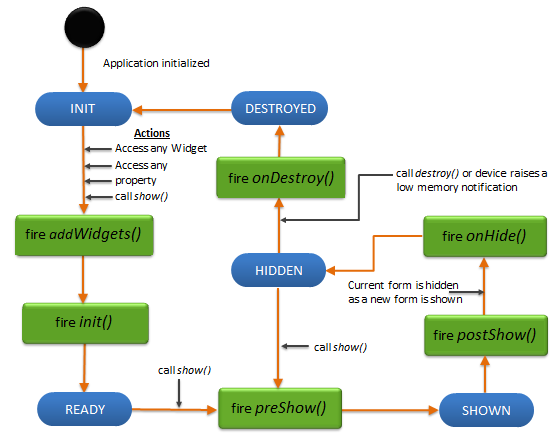

                                

Form Widget
-----------

This widget is deprecated. Older applications that use it will still function, but new applications should use the [FlexForm](FlexForm.html) widget.

A form is a visual area (basic application screen) that holds other widgets. You can use a form to set a title and scroll content (similar to a web browser). The entire contents of the form except the headers and footers scroll together. A form is the top most container widget. A form can contain any number of widgets but cannot contain another form.

The screen width occupied by the form is the total available width of the mobile device; the virtual height is determined by the number of widgets on the form (the total height of the form is sum of the virtual heights of its first level visible child widgets).

> **_Note:_** A form-level menu is not applicable on all versions of Mobile Web.

For example, if Form1 has Button1, Button2, Button3, and an HBox (the height of the box in turn is the sum of the heights of its child widgets), then the height of Form1 is the sum of the heights of Button1, Button2, Button3, and an HBox. Form1 Width is the available screen width of the phone.

##### Form Lifecycle

A form lets you add other container and widgets to create a widget hierarchy. A form fills the device screen provided for an application (excluding the device level screen controls like status bar).

Form stacking:

Typically a form is displayed by a user action on another form. That means the navigation between forms happen by the events on another form. All the navigation actions are pushed into the stack to track the navigation path, so that the user can navigate back to the previous forms in the exact reverse order of its forward navigation. When navigation to a form that is already visited and available in the middle of the stack, the target form is brought back to the top of the stack by popping all the above forms out of the stack. Currently this stack is not exposed directly to the developers and in future there will be APIs around manipulating this stack directly.

Lifecycle Methods:

A form is defined to have a lifecycle method that gets called at appropriate events. These events allow you to manage the application for better resource handling.

The following are the lifecycle methods of a form:

**addWidgets** - called when the form is used for first time either

*   for accessing its widgets,
*   accessing its properties,
*   for showing the form through the show method,
*   for any other method that invokes the form.

For example, any of the following can trigger the addWidgets method of form1 if form1 is not yet initialized:

*   form1.label1
*   form1.title
*   form1.show()

**init** - called immediately after an _addWidgets_ event for any initializations required for the form. Init initializes the form and any widgets.

In case of Server side Mobile Web and SPA, _addWidgets_ preserve">var var _init_ events gets called as soon as the form is created. In case of native platforms, as an optimization, these events are deferred until the first access.

**preShow** - called just before a form is visible on the screen. A form can be made visible by explicitly calling the show method of the form.

**postShow** - called immediately after the form is visible on the screen. A form is made visible by explicitly calling the show method of the form.

**onHide** - called when the form goes out of the screen. A form can go out of the screen when another form is to be shown.

**onDestroy** - called when a form is destroyed. A form is destroyed when the developer explicitly calls destroy and this event gets called before destroying the form.

The following image illustrates the lifecycle of a form:

A form provides you with an option to set Basic Properties, Layout Properties, Platform Specific Properties, Events, and Methods.

  
| Basic Properties | Layout Properties | Platform Specific Properties |
| --- | --- | --- |
| [enabledForIdleTimeout](Form_Basic_Properties.html#enabledforidletimeout-property) | [displayOrientation](Form_Basic_Properties.html#displayO) | [actionBarIcon](Form_Basic_Properties.html#actionBa) |
| [footers](Form_Basic_Properties.html#footers-property) | [gridCell](Form_Basic_Properties.html#gridCell) | [animateHeaderFooter](Form_Basic_Properties.html#animateH) |
| [headers](Form_Basic_Properties.html#headers-property) | [layoutMeta](Form_Basic_Properties.html#layoutMe) | [bounces](Form_Basic_Properties.html#bounces) |
| [id](Form_Basic_Properties.html#id-property) | [layoutType](Form_Basic_Properties.html#layoutTy) | [captureGPS](Form_Basic_Properties.html#captureG) |
| [info](Form_Basic_Properties.html#info-property) |  | [contextPath](Form_Basic_Properties.html#contextP) |
| [menuFocusSkin](Form_Basic_Properties.html#menufocusskin-property) |  | [configureExtendTop](Form_Basic_Properties.html#configur) |
| [menuItems](Form_Basic_Properties.html#menuitems-property) |   | [configureExtendBottom](Form_Basic_Properties.html#configur2) |
| [menuNormalSkin](Form_Basic_Properties.html#menunormalskin-property) |   | [configureStatusBarStyle](Form_Basic_Properties.html#configur3) |
| [needAppMenu](Form_Basic_Properties.html#needappmenu-property) |   | [defaultIndicatorColor](Form_Basic_Properties.html#defaultI) |
| [skin](Form_Basic_Properties.html#skin-property) |   | [enablePeekGesture](Form_Basic_Properties.html#enablePe) |
|   |   | [extendTop](Form_Basic_Properties.html#extendTo) |
| [title](Form_Basic_Properties.html#title-property) |   | [extendBottom](Form_Basic_Properties.html#extendBo) |
| [type](Form_Basic_Properties.html#type-property) |   | [statusBarStyle](Form_Basic_Properties.html#statusBa) |
|   |   | [footerOverlap](Form_Basic_Properties.html#footerOv) |
|   |   | [formTransperencyDuringPostShow](Form_Basic_Properties.html#formTran) |
|   |  | [headerOverlap](Form_Basic_Properties.html#headerOv) |
|   |  | [inputAccessoryViewType](Form_Basic_Properties.html#inputAcc) |
|   |  | [inTransitionConfig](Form_Basic_Properties.html#inTransi) |
|   |  | [layout](Form_Basic_Properties.html#layout) |
|   |  | [maxAppMenuButtons](Form_Basic_Properties.html#maxAppMe) |
|   |  | [menuPosition](Form_Basic_Properties.html#menuPosi) |
|  |  | [needsIndicatorDuringPostShow](Form_Basic_Properties.html#needsInd) |
|  |  | [noCache](Form_Basic_Properties.html#noCache) |
|  |  | [outTransitionConfig](Form_Basic_Properties.html#outTrans) |
|   |   | [retainScrollPosition](Form_Basic_Properties.html#retainSc) |
|   |   | [scrollDirection](Form_Basic_Properties.html#scrollDi) |
|   |   | [scrollsToTop](Form_Basic_Properties.html#scrollsT) |
|   |   | [secureData](Form_Basic_Properties.html#secureDa) |
|  |  | [showBottomActionBar](Form_Basic_Properties.html#showBott) |
|  |  | [showActionBar](Form_Basic_Properties.html#showActi) |
|  |  | [showActionBarIcon](Form_Basic_Properties.html#showActi2) |
|  |  | [showMiniAppMenu](Form_Basic_Properties.html#showMini) |
|  |  | [submitSecure](Form_Basic_Properties.html#submitSe) |
|  |  | [titleBar](Form_Basic_Properties.html#titleBar) |
|   |   | [titleBarConfig](Form_Basic_Properties.html#titleBar2) |
|   |   | [titleBarSkin](Form_Basic_Properties.html#titleBar3) |
|   |   | [windowSoftInputMode](Form_Basic_Properties.html#windowSo) |

  
| Events | Methods |
| --- | --- |
| [addWidgets](Form_Events.html#addwidgets-event) | [add](Form_Methods.html#add) |
| [init](Form_Events.html#init-event) | [addAt](Form_Methods.html#addat) |
| [onActionBarBack](Form_Events.html#onactionbarback-event) | [show](Form_Methods.html#show) |
| [onHide](Form_Events.html#onhide) | [destroy](Form_Methods.html#destroy) |
| [onOrientationChange](Form_Events.html#onorientationchange) | [remove](Form_Methods.html#remove) |
| [onDeviceBack](Form_Events.html#ondeviceback) | [removeAt](Form_Methods.html#removeat) |
| [onDeviceMenu](Form_Events.html#ondevicemenu) | [replaceAt](Form_Methods.html#replaceat) |
| [onDestroy](Form_Events.html#ondestroy) | [widgets](Form_Methods.html#widgets) |
| [preShow](Form_Events.html#preshow) | [setTitleBarLeftSideButtonSkin](Form_Methods.html#settitlebarleftsidebuttonskin) |
| [postShow](Form_Events.html#postshow) | [setTitleBarRightSideButtonSkin](Form_Methods.html#settitlebarrightsidebuttonskin) |
| [onLoadJS](Form_Events.html#onloadjs) | [setTitleBarSkin](Form_Methods.html#settitlebarskin) |
| [unLoadJS](Form_Events.html#unloadjs) | [showTitleBar](Form_Methods.html#showtitlebar) |
|  | [hideTitleBar](Form_Methods.html#hidetitlebar) |
|  | [scrollToWidget](Form_Methods.html#scrolltowidget) |
|  | [scrollToBeginning](Form_Methods.html#scrolltobeginning) |
|   | [scrollToEnd](Form_Methods.html#scrolltoend) |

##### Creating a Form using a constructor: voltmx.ui.Form2


var form1 = new voltmx.ui.Form2(basicConf, layoutConf, pspConf)


*   **basicConf** is an object with basic properties.
*   **layoutConf** is an object with layout properties.
*   **pspConf** is an object with platform specific properties.

> **_Note:_** The configuration properties should be passed only in the respective configuration objects otherwise they are ignored.

Example


//Defining properties for a form.
var basicConf = {id:"formHome", title:"Form Home", addWidgets:addwidgetsfrmNew, skin:"frmskn"};

var layoutConf = {contentAlignment:constants.CONTENT_ALIGN_TOP_CENTER, containerWeight:100, hExpand: true, vExpand:true};

var pspConf = {titleBar: true, titleBarSkin: "skntitlebar"};

//Creating the form.
var myForm = new voltmx.ui.Form2(basicConf,layoutConf,pspConf)


For backward compatibility with support for all [deprecated](FlexForm_Example_SampleApp.html) properties and behaviors, use the constructor **voltmx.ui.Form**.


var form1 = new voltmx.ui.Form(basicConf, layoutConf, pspConf)


##### Form Types

Volt MX  platform allows you to develop truly native applications (which use native widgets) or Hybrid applications. Hybrid applications are a version of the native application where some forms of the application are rendered in the WebView while others are rendered using the native SDK. You can choose the forms to be either native or web-based. The web-based forms can either be statically packaged (Static) along with the application or loaded from a URL(Dynamic).

Depending on the nature of the application developed, the developer can choose one of the following form types when creating a new form:

*   Native
*   Web-based
    *   Static
    *   Dynamic

The characteristics of each type of form are listed in the table below:

  
| Characteristics | Form Type |||
| --- | --- | --- | --- |
| Native | Web-based ||
| --- | --- | --- |
| Static | Dynamic |
| --- | --- |
| Rendering engine used to display form | Native SDK | UIWebView | UIWebView |
| UI definition (the widget layout and skins) | packaged along with the application | packaged along with the application | downloaded from the server |
| UI logic (logic that alters the user experience based on business rules) | packaged along with the application | packaged along with the application | downloaded from the server |
| Business Data | downloaded from the server | downloaded from the server | downloaded from the server |

##### How is the child widgets laid out on the Form?

The form lays out the first level child widgets one below the other. Each widget occupies the same width as form and the height is determined by the preferred height of the widget.

The algorithm works as follows for each widget in the list:

1.  Assign width to widget (same as form width)
2.  Get the preferred height of the widget (Child widgets request the required height (preferred height))
3.  A form considers the preferred height request and assigns the same to the child widgets
4.  Stack the widget
5.  End

> **_Note:_** For a form, there is no limit set on the vertical height and hence a form never declines the child widgets request for preferred height.

