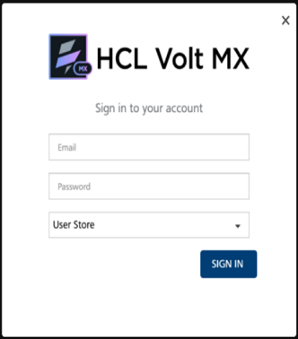
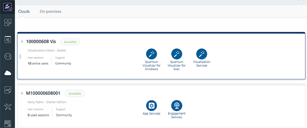
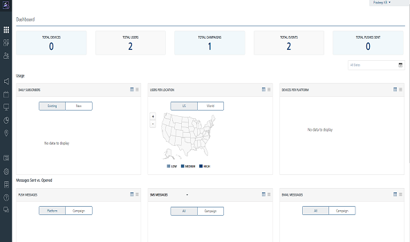
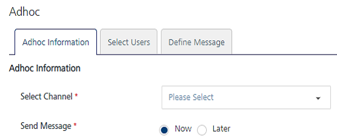
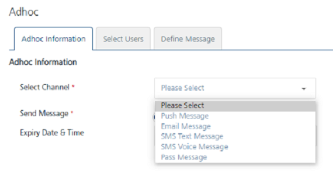
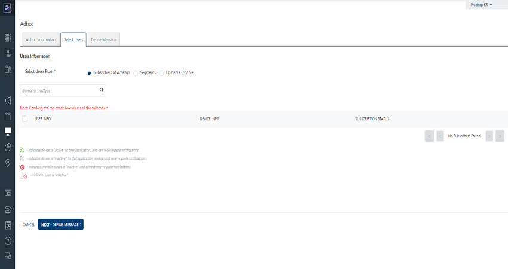
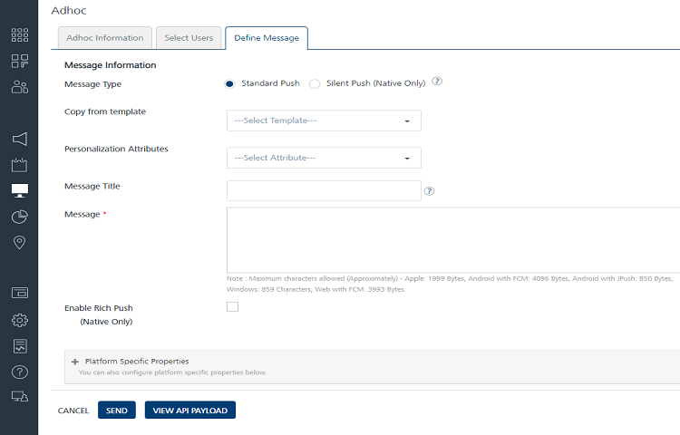

                          

2 Way SMS Quick Start Guide: Initiating an Outbound 2 way SMS via Adhoc Messaging

Initiating an Outbound 2-way SMS via Ad hoc Messaging
=====================================================

The section discusses the details of:

*   Sending an ad hoc SMS message from Engagement console and send an SMS.
*   Requesting the user to respond to the message using the SMS provider you configured in earlier steps.

It is assumed that you have already installed the Engagement demo application on your device before performing the configuration.Follow these steps:

1.  Open an Internet browser.
2.  Enter the URI: _manage.hclvoltmx.com_ in the address field and press the **Enter** key.
    
    The **Sign in to your HCL Account** page appears.
    
    
    
3.  Enter your email and password as user credentials. Click the **Sign in** button to continue.
    
    The system displays the **VoltMX Foundry** homepage.
    
    
    

1.  On the **VoltMX Foundry** home page, click **Environments** in the left panel.
    
    The **Clouds** page appears.
    
2.  On the **Clouds** page, click the **Engagement Services** tab.
    
    The **Engagement Services** home page (Dashboard) appears.
    
    
    
3.  **Engagement services**: In the left panel, click **Adhoc** under the **Engagement** section.
    
    The **Adhoc** page appears with three tabs including **Adhoc Information**, **Select Users** and **Define Message**. By default, the **Adhoc Information** tab is set to active.
    
    
    
4.  **Select Channel**: Select the **SMS Message** channel from the drop-down list.
    
    
    
5.  Click **Next- Select Users** to continue. The **Select Users** tab becomes active. The **Select Users** page displays all the users in the list view. By default the **To** option is set to **Users**.
    
    
    
6.  Select the user to send the text message from the list view.
7.  Click **Next - Define Message** to continue. The **Define Message** tab becomes active.
8.  Enter details for the following fields:
    *   **Compose from Template**: Select the required SMS template from the **Compose from template** drop-down list.
    *   **Personalization Attributes**: Select the attributes from the drop-down list to customize the SMS message.
    *   **Message Box**: Type the message in the message box.  
        .Since the 2-way SMS is set up to use the command BAL with month and year as input to check the balance, the sent message can be: **Please respond to this message with BAL MM YYYY to retrieve the balance for the month and year**.
9.  Click **Send** to send the message.  
    
    
