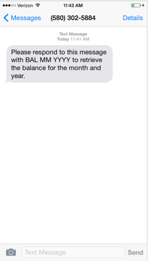
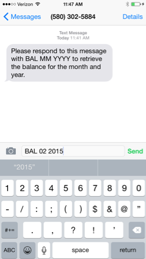
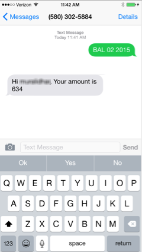

                          

2 Way SMS Quick Start Guide: Responding to the 2 way SMS Request of the User

Responding to the 2-way SMS Request of the User
===============================================

The section explains how to send an inbound SMS request, as well as receive and response to the same. It is assumed that you have already downloaded the Engagement demo application on your device and can receive ad hoc SMS messages successfully from the Engagement server.

We also assume that the application to which the request is routed from the Engagement server is configured and set up in a publicly accessible IP address. The sample server takes the command of BAL with month and year as the input and returns a balance value for that month and year.

1.  The following screen shows the SMS received on the device of the user, assuming that the user is using the Engagement demo application.
    
    
    

2.  Type a response to the incoming SMS with the code that you set up under **Settings** > **Configuration** > **Inbound** in the Engagement server.
    
    For more details refer to, [Configuring the Engagement Server to Send 2-way SMS](Configuring the messaging.md#Click_Add_Command).
    
3.  You can respond with `BAL 02 2015,` where 02 is the month and 2015 is the year for which the balance is to be retrieved.
    
    
    

3.  The following screen shows a sample response received from the configured service to which the request is routed from the Engagement server.
    
    
