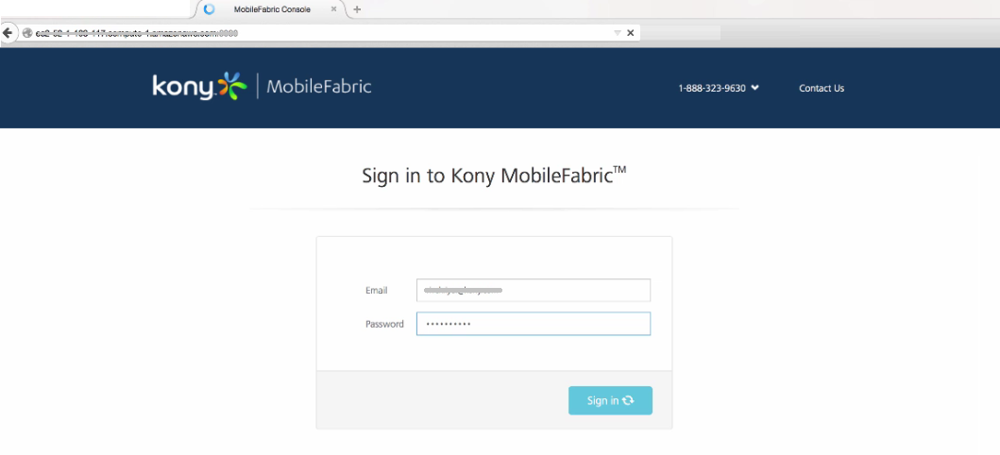
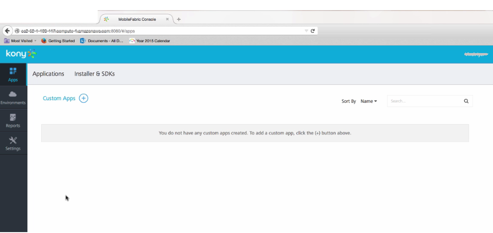
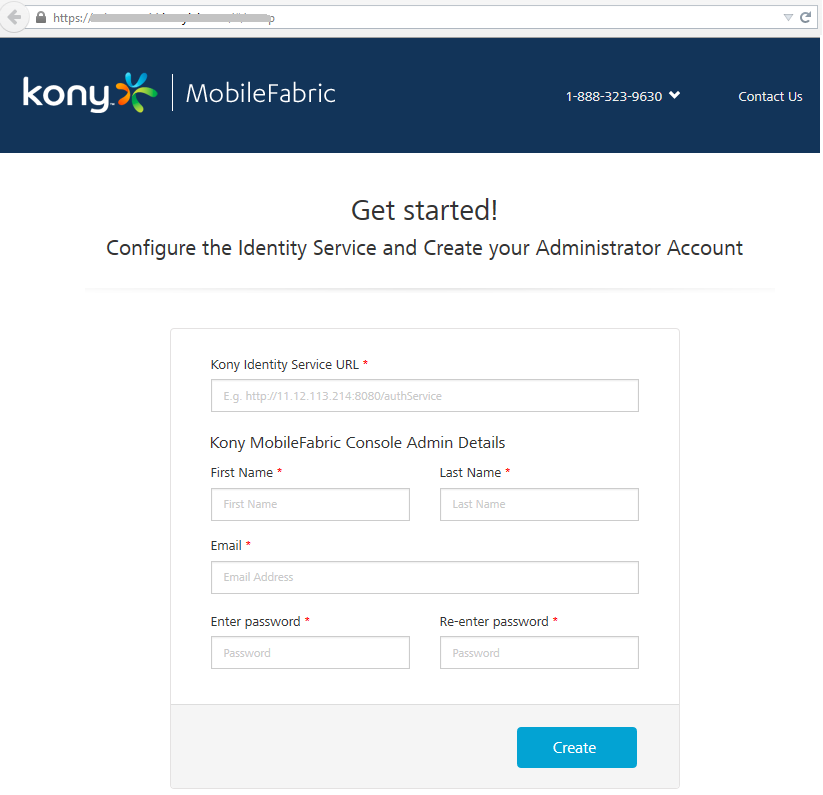

  

AWS Marketplace and VoltMX Foundry
=====================================

This section is Work in progress...

Amazon Web Services (AWS) Marketplace is an online store that helps Amazon customers find, buy, and immediately start using the software and services they need to build products and run their businesses.

You can insta The plan is to list two SKUs.

\* Developer - can be a barely big enough Amazon EC2 instance for things to run. This should run on a medium instance

\* Express - more powerful box for things to run, but not so powerful that we are cannibalizing our other VoltMX cloud scale out offering. This should run on a large instance.

The only difference between the two instances is the size of the underlying EC2 layer. The variant maybe t2 or m1 or m2 or m3 as long as the most cost effective choice is selected.

None of these choices will be high availability. They will also not have any access to VoltMX’s ticket based support channel.

The developer edition will be free. We will charge a monthly fee for the Express edition but that is to be determined currently. It is our current thought that end users will not have VoltMX productized support to seamlessly move from Developer to Express. They can of course from one SKU to another using Amazon’s AMI migration capabilities but that is outside the scope of our immediate release.

In general, our current focus is adoption so we want to drive the ‘Developer’ tier as much as possible. The ‘Express’ tier helps incentiirise the Amazon Marketplace salesforce because they get a cut from software sold on their Marketplace.

Configuring Foundry Instance on AWS Marketplace
----------------------------------------------------

Launching Foundry Instance
-------------------------------

From you Launch Instance section..............

In your terminal windows or command window type the key. For example,

The system gets connected to what..

Provide the following details. run a startup script which will ask for the following information:

1.  Public URL - default to instance URL with Amazon EC2 URL
2.  Username (Email Address) - login email
3.  First Name
4.  Last Name
5.  Password
6.  Confirm Password:
    
    Once this information is provided, the instance setup will take place and the automatic internal registration of Foundry Console to Foundry Integration, Sync, Messaging will take place. This will culminate with the generation of the URL which can then be used to access the Foundry console.
    
    screen - setup complete
    
    From the page, copy the URL and paste it in your web browser. press enter
    
    the console
    

At Public URL, type the Publich DNS URL from your AMI page??

The AWS Marketplace validates the user credentials and installs Foundry instance.

During this stage, the system completes registration with VoltMX Foundry products such as VoltMX Foundry Identity and Console, VoltMX Foundry Integration, VoltMX Foundry Messaging, and VoltMX Foundry Sync. The system creates an environment in Console.

screen shot---

After Foundry installation is completed, the system displays the confirmation message: Congratulations! VoltMX Foundry is now ready for use.

screen shot

copy the URL and paste it in a web brower's address bar and press the Enter key.

After a developer (user) runs Foundry on AWS Marketplace, the AWS Marketplace validates the user credentials and installs Foundry instance. During this stage, the system completes registration with VoltMX Foundry products such as VoltMX Foundry Identity and Console, VoltMX Foundry Integration, VoltMX Foundry Messaging, and VoltMX Foundry Sync. The system creates an environment in Console.

From setup complete dialog page, copy the URL and paste it in a web brower's address bar and press the **Enter** key.

The Sign in to VoltMX Foundry page appears.

Provide your VoltMX administrator account log-in credentials that you have created, and click Sign in.

After your credentials are authenticated, the user is directed to your Foundry account. By default, the Apps page appears.

Before you use various VoltMX Foundry services, you must create a superuser.

To accessing VoltMX Foundry, follow these steps:

1.  [How to Get Started with VoltMX Foundry Console](#how-to-get-started-with-voltmx-mobilefoundry-console)
2.  [How to Log In to VoltMX Foundry Console](#how-to-log-in-to-voltmx-mobilefoundry-console)

How to Get Started With VoltMX Foundry Console
-------------------------------------------------

After installation, you need to configure identity services and create your administrator account. Based on your Foundry installation, you will see the a list of URLs in the **Install Complete** window, shown below:

To launch VoltMX Foundry console, follow these steps:

1.  From the **Install Complete** window, copy the URL from **VoltMX Foundry Console URL**, and then go the URL in your web browser.  
    
    To remember the URL of this portal, bookmark the URL by adding it to your favorites.
    
    The **VoltMX Foundry Get started!** page appears only if you have not already configured your identity services.
    
    
    
    Fields marked with an asterisk are mandatory.
    
2.  In **VoltMX Identity Service URL** text box, enter VoltMX Identity Service URL from the **Install Complete** page.
3.  Under the **VoltMX Foundry Console Admin Details**, enter the following details:
    *   **First Name**: Enter the first name of the user.
    *   **Last Name**: Enter the last name of the user.
    *   **Email**: Enter the email address of the user. It can include alphanumeric and special characters that follow standard email address form.
    *   **Enter password**: Enter the password for the user. This is a string of characters that allows access to a system. It can be a combination of alphanumeric and special characters.
        
    *   **Re-enter password**: Retype the password to ensure the user's identity.
        
4.  Click **Create**.  
    Once the details are validated for one-time configuration, the system will:
    *   Associate your credentials with Foundry identity services and authorization services.
    *   Display the **Sign in to your VoltMX Account** page.  
        

How to Log In to VoltMX Foundry Console
------------------------------------------

If you have configured identity services and created your administrator account (Foundry superuser account), you can log in to the Foundry console. A superuser will have owner permissions by default.

1.  Go to **VoltMX Foundry Console URL** that you bookmarked in the previous section. The **Sign in to VoltMX Foundry** page appears.
    
    
    
2.  Provide your VoltMX administrator account log-in credentials that you have created, and click **Sign in**.  
    After validating your credentials, you are directed to your Foundry account. By default, the **Apps** page appears.  
    
    
    
    From this page, you can navigate to consoles (app services, sync services, messaging services), applications, environments, and settings.
