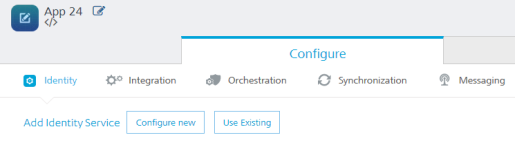

 

Creating Your Foundry App
==============================

Adding a Foundry app to your account creates a container or a logical wrapper around all the services you want to provide for your mobile app. Once your services are published, you will receive an App Key App Secret, and Service URL, which are used within your client app development tool to securely connect to your back-end Foundry services. The App key, App secret, and Service URL are initialized through SDKs.

To create your Foundry app, follow these steps:

1.  Go to the **VoltMX Foundry Console URL** that you bookmarked in the [How to Access VoltMX Foundry Console](How to access VoltMX Foundry Portal on-Prem.md) section.
2.  In the Sign in to VoltMX Foundry page that appears, provide your VoltMX administrator account log-in credentials that you have created, and click **Sign in**.
    
    For more details about how to get started and log in to console, refer to [How to Access VoltMX Foundry Console](How to access VoltMX Foundry Portal on-Prem.md).
    
    After validating your credentials, you are directed to your Foundry account. By default, the Apps page appears.
    
3.  Click **Apps** from the left pane.
4.  Click **Custom Apps**.
    
    
    
5.  Rename the app and change your app icon, if required.
    
    
