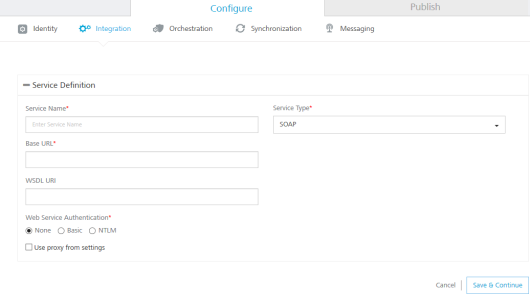
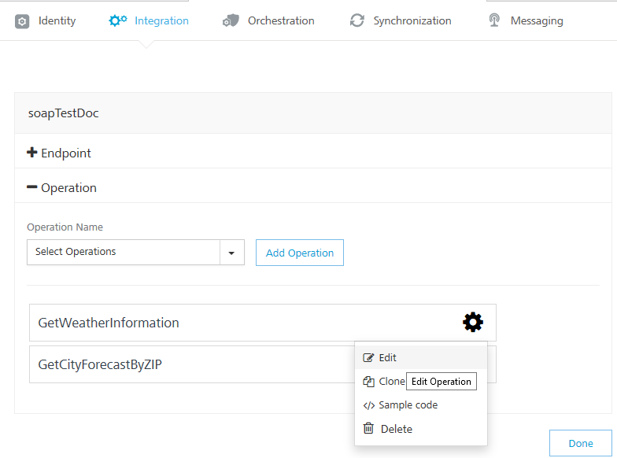
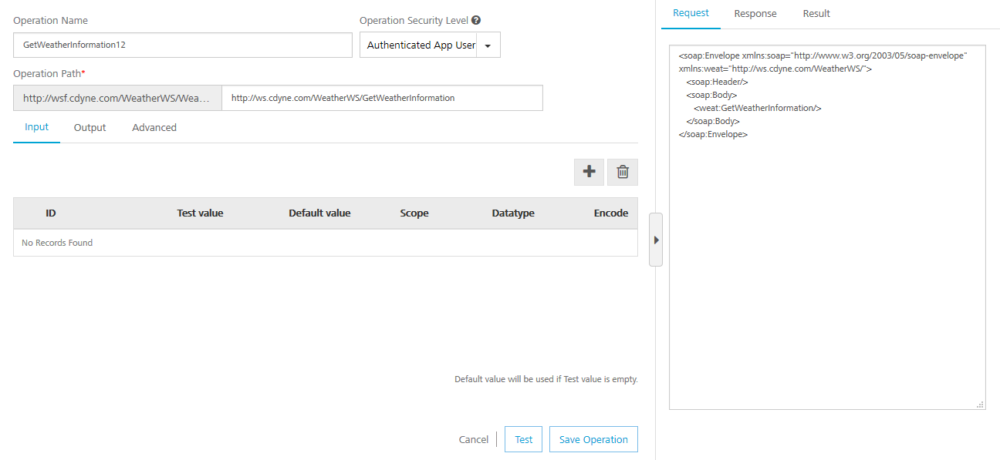
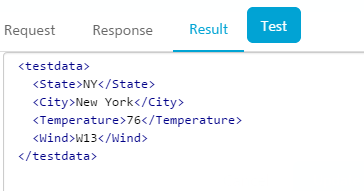
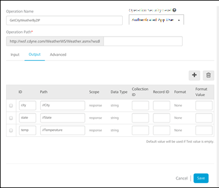
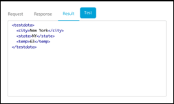
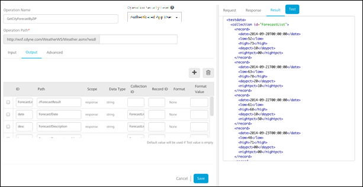
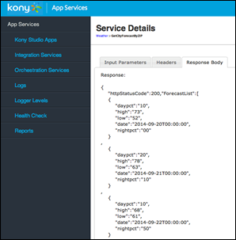
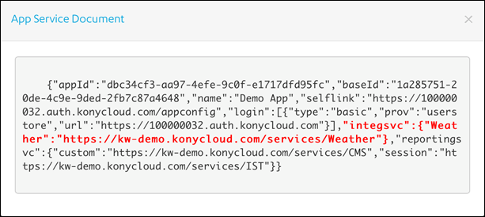

 

Creating an Integration Service
===============================

Now that we can authenticate our users, we need an easy way to retrieve data from an existing back-end system. In many cases, the back-end system does not return the data in the exact format we want, and/or it returns more data than our app needs.

The Foundry Integration Services can consume data from any back- end system. You can use our standard technology connectors for REST, JSON, or SOAP web services. You can also use our enterprise business connectors that make it easy to connect to enterprise back-end systems like Salesforce or SAP, and browse for the data objects and services you want to expose to your app.

For this example, we will use a publicly available SOAP web service for getting weather information. To get the current weather and the weather forecast for a ZIP code, we will have to call two separate services.

To call the weather services, follow these steps:

1.  Click the **Integration** tab.
2.  Click **Add Integration** > **Configure New**.
    
    
    
3.  Name your new service **Weather** and choose _SOAP_ as the **Endpoint Type**.
4.  Then enter the following URLs to complete the service definition:
    *   In the **Base URL** box, type: http://wsf.cdyne.com/WeatherWS/Weather.asmx  
        
    *   In the **WSDL URL** box, type: http://wsf.cdyne.com/WeatherWS/Weather.asmx?wsdl
5.  Under the **Web Service Authentication**, select one of the following modes:
    
    1.  **None**: Select this option if you do not want to provide any authentication for the service.
        
    2.  **Basic**: Provide User ID and Password if the external Web service requires form or basic authentication.
        
    3.  **NTLM**: Your service follows the NT LAN Manager authentication process. You are required to provide the User ID, Password, NTLM Host, and NTLM Domain.
        
    4.  To enable the proxy, select the **Use proxy from settings** check box. By default, the check box is cleared.
        
6.  Click **Save & Continue** to retrieve the WSDL. Each of the available operations are listed in a drop-down box. Select the _GetCityForecastByZip_ and _GetCityWeatherByZip_. Click **Add Operation**. This will create two operations under your Weather service that maps to the SOAP web service methods.
7.  To test and edit the _GetCityWeatherByZip_, click the settings icon and choose **Edit**.
    
    
    
8.  The operation details window opens. A sample web service request is provided showing a placeholder for any input parameters. For the GetCityWeatherByZip, the ZIP is the only input parameter displayed as `<ns1:ZIP>?XXX?</ns1:ZIP>` in the sample request. At this point, we could hard code a value, but since we want our app to provide the zip code, we need to provide an input variable name: `<ns1:ZIP>$zip</ns1:ZIP>`. We then need to define that variable under the input tab including a test value of _10036_.
    
    
    
9.  You can then test the service and see the SOAP web service response.
    
    
    
10.  On the **Output** tab, enter the following parameters and path.
    
    _city //City_
    
    _state //State_
    
    _temp //Temperature_
    
    
    
11.  Click the **Test** button again and the result will be displayed as XML.
    
    
    
    The result will be converted to a JSON before being sent to the device.
    
    This is a simple example, but it shows the power and flexibility the Foundry Integration Service provides to retrieve data and process it before returning an optimized JSON string to the device. You can also configure additional processing under the advanced tab including deploying custom code that executes before and after the service invocation.
    
12.  Edit the _GetCityForecastByZip_ in the same way. This service returns a repeating data structure for each day providing that day’s weather forecast. This requires the use of the collection ID under the output tab to create a repeating set of JSON objects. After creating the **ZIP** input parameter the same way as the previous service, enter the following output parameters:
    
    | ID | xPath | CollectionID |
    | --- | --- | --- |
    | ForecastList | //ForecastResult/Forecast |   |
    | date | Forecast/Date | ForecastList |
    | desc | Forecast/Description | ForecastList |
    | low | Forecast/Temperatures/MorningLow | ForecastList |
    | high | Forecast/Temperatures/DaytimeHigh | ForecastList |
    | daypct | Forecast/ProbabilityOfPrecipiation/Daytime | ForecastList |
    | nightpct | Forecast/ProbabilityOfPrecipiation/Nighttime | ForecastList |
    
    Test your service and you will see the resulting XML showing the repeating collections of forecasts.
    
    
    

Publishing and Testing the Service
----------------------------------

1.  Publish the app in the same way [published for the Identity Service](Creating an Identity Service.md#Publishi).
2.  After publishing, you can access the runtime console for the Integration Services by clicking the **Integration** icon on the runtime environment.
3.  Choose **Integration Services** in the left pane. This will display the Weather service and the available operations. Choose the _GetCityForecastByZip_, and then click the resulting service URL to test the service.
    
    
    
4.  Enter a test ZIP Code under the Input Parameters tab and click **Get Response**. This will execute the service directly on the runtime environment and display the exact JSON response that will be returned to the client device.
    
    
    
5.  You can also test the service using a cURL command. Return to the publish tab of the Foundry app and view the App Service Document again. Now you will see the details for the Weather service.
    
    
    
6.  Using the Weather service endpoint above and the Foundry provider token retrieved when the Identity Service was tested, you can test the _GetCityForecastByZip_ operation using the following cURL command:
    
    curl -X POST -H "X-VoltMX-Authorization: eyAiYWxnIjogIk5PTkUiLCAidHlwIjogImp3cyIgfQ.eyAiX3Njb3BlIjogImci  
    LCAiX2FjcyI6ICIxMDAwMDAwMzIiLCAiX3ZlciI6ICJ2MS4xIiwgIl9pZHAiOiA  
    idXNlcnN0b3JlIiwgIl9hcHAiOiAiZGVmOWM3MzgtMDE2My00ODNlLTk3N2YtMz  
    UwMjEyNWMxOThjIiwgImlzcyI6ICJodHRwczovLzEwMDAwMDAzMi5hdXRoLmtvb  
    nljbG91ZC5jb20iLCAiX2VtYWlsIjogImRlbW9Aa29ueS5jb20iLCAiaWF0Ijog  
    MTQxMjE4NzE1MiwgImV4cCI6IDE0MTIxOTA3NTIsICJfaXNzbWV0YSI6ICIvYXB  
    pL3YxL21ldGFkYXRhL1V5dzNKQ3VVOF81Z1BGRTc3QjN2Rnc9PSIsICJfcHJvdl  
    91c2VyaWQiOiAiZGVtb0Brb255LmNvbSIsICJqdGkiOiAiY2M4MGFkNGEtNGQ0N  
    S00MmFkLTk2ZjUtZTY0NzYwZWViZjI2IiwgIl9hdXRoeiI6ICJleUp3WlhKdGFY  
    TnphVzl1Y3lJNmUzMHNJbkp2YkdWeklqcGJYWDAiLCAiX3B1aWQiOiAyODA4MjQ  
    2MDQ5Nzk0NTUwODYgfQ.MC0CFQCP\_1JSQe9stMYjr8P4vrgKYuTn5gIUSx6j\_R9dbjFFCcTCLAiD6AOdqh0" -H "Accept: application/json" -H "Content-Type: application/x-www-form-urlencoded" -d 'zip=10036' https://kw-demo.voltmxcloud.com/services/Weather/GetCityForecastByZip
    
    The resulting JSON looks like the following:
    
```
{
        "httpStatusCode":200,"ForecastList":\[
        {
           "daypct":"10",
           "high":"73",
           "low":"52",
           "date":"2014-09-20T00:00:00",
           "nightpct":"00"
        }
    ,
        {
           "daypct":"20",
           "high":"78",
           "low":"63",
           "date":"2014-09-21T00:00:00",
           "nightpct":"10"
        }
    ,
        {
           "daypct":"10",
           "high":"68",
           "low":"61",
           "date":"2014-09-22T00:00:00",
           "nightpct":"50"
        }
    ,
        {
           "daypct":"00",
           "high":"71",
           "low":"48",
           "date":"2014-09-23T00:00:00",
           "nightpct":"00"
        }
    ,
        {
           "daypct":"10",
           "high":"68",
           "low":"49",
           "date":"2014-09-24T00:00:00",
           "nightpct":"10"
        }
    ,
        {
           "daypct":"00",
           "high":"70",
           "low":"48",
           "date":"2014-09-25T00:00:00",
           "nightpct":"10"
        }
    ,
        {
           "daypct":"00",
           "high":"73",
           "low":"50",
           "date":"2014-09-26T00:00:00",
           "nightpct":"00"
        }
    \],"opstatus":0
        }
```
