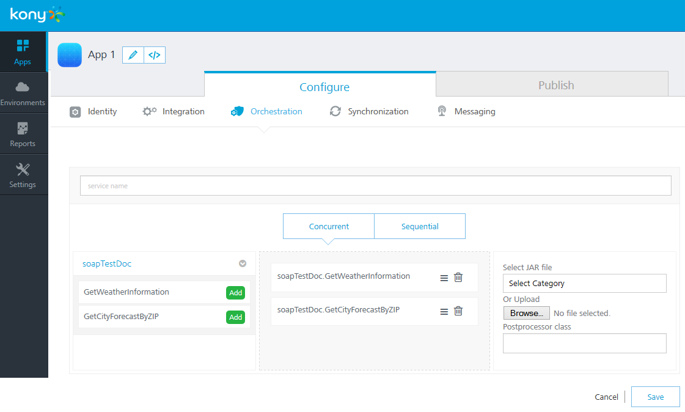

 

Creating an Orchestration Service
=================================

The following types of Orchestration Services are supported by Foundry:

*   **Composite Services** include:
    *   **Concurrent Service**: All specified integration services are called in parallel.
    *   **Sequential Service**: The output of one service can be used as the input of a subsequent service. Each integration service in the chain will be executed sequentially.
*   **Looping Service**: Allows you to call the same service in a loop using the same input values until you reach a break condition or you can send in a delimited set of input values and the service will loop through the inputs until it reaches the end.

For this example, we want to return the current weather and the forecast in one service call. Therefore, we want to create a concurrent composite Orchestration Service using our _GetCityWeatherByZip_ and our _GetCityForecastByZip_. This allows our app to call one Orchestration Service using the ZIP Code and getting back all the data we need.

To execute an Orchestration Service, follow these steps:

1.  On the **Orchestration** tab, click **Add Orchestration** > **Create Composite**.
2.  Enter a name for the service as **GetCityWeatherAndForecastByZip** and choose **Concurrent** as the type of Composite service.
3.  Add the _GetCityWeatherByZip_ and the _GetCityForecastByZip_ operations.
    
    
    
4.  Save the service.

Publishing and Testing the Service
----------------------------------

1.  Publish the app in the same way as it was [published for the Identity Service](Creating an Identity Service.md#Publishi).
2.  Authenticate the user again to get an updated claims token because the old claims token will not include permission to call the new Orchestration Service since it was generated before that service existed.
3.  Use the new claims token to call the new Orchestration Service. Send in a single input parameter for the ZIP.
    
    curl -X POST -H "X-VoltMX-Authorization: eyAiYWxnIjogIk5PTkUiLCAidHlwIjogImp3cyIgfQ.eyAiX3Njb3BlIjogImciLC  
    AiX2FjcyI6ICIxMDAwMDAwMzIiLCAiX3ZlciI6ICJ2MS4xIiwgIl9pZHAiOiAidX  
    NlcnN0b3JlIiwgIl9hcHAiOiAiZGJjMzRjZjMtYWE5Ny00ZWZlLTljMGYtZTE3MT  
    dkZmQ5NWZjIiwgImlzcyI6ICJodHRwczovLzEwMDAwMDAzMi5hdXRoLmtvbnljbG  
    91ZC5jb20iLCAiX2VtYWlsIjogImRlbW9Aa29ueS5jb20iLCAiaWF0IjogMTQxMz  
    A4MDExOSwgImV4cCI6IDE0MTMwODM3MTksICJfaXNzbWV0YSI6ICIvYXBpL3YxL2  
    1ldGFkYXRhL1V5dzNKQ3VVOF81Z1BGRTc3QjN2Rnc9PSIsICJfcHJvdl91c2VyaW  
    QiOiAiZGVtb0Brb255LmNvbSIsICJqdGkiOiAiOWVkNDZkMmMtYzIxZi00MDNiLW  
    I4OTItOGI3ODJlNDFjYTk3IiwgIl9hdXRoeiI6ICJleUp3WlhKdGFYTnphVzl1Y3  
    lJNmUzMHNJbkp2YkdWeklqcGJYWDAiLCAiX3B1aWQiOiAyODA4MjQ2MDQ5Nzk0NT  
    UwODYgfQ.MCwCFFeP0FTjaGs6DvkL\_KnwGgEQ4DvRAhRLlQXgF7IZM24X4dAlhP-B6Pt4lg" -H "Accept: application/json" -H "Content-Type: application/x-www-form-urlencoded" -d 'zip=10036' https://kw-demo.voltmxcloud.com/services/GetCityWeatherAndForecastByZip/GetCit  
    yWeatherAndForecastByZip
    
4.  The result will include the output for both G_etCityForecastBZip_ and _GetCityWeatherByZip_.
```
{
        "httpStatusCode":200,
        "opstatus\_GetCityForecastByZIP": 0,
        "opstatus\_GetCityWeatherByZIP": 0,
        "state": "NY",
        "temp": "63",
        "ForecastList":\[
            {
               "daypct":"10",
               "high":"73",
               "low":"52",
               "date":"2014-09-20T00:00:00",
               "nightpct":"00"
            },
            {
               "daypct":"20",
               "high":"78",
               "low":"63",
               "date":"2014-09-20T00:00:00",
               "nightpct":"10"
            },
            {
               "daypct":"10",
               "high":"68",
               "low":"61",
               "date":"2014-09-22T00:00:00",
               "nightpct":"50"
            },
            {
               "daypct":"00",
               "high":"71",
               "low":"48",
               "date":"2014-09-23T00:00:00",
               "nightpct":"00"
            },
            {
                "daypct":"10",
                "high":"68",
                "low":"49",
                "date":"2014-09-24T00:00:00",
                "nightpct":"10"
             },
             {
                 "daypct":"00",
                 "high":"70",
                 "low":"48",
                 "date":"2014-09-25T00:00:00",
                 "nightpct":"10"
            },
            {
                 "daypct":"00",
                 "high":"73",
                 "low":"50",
                 "date":"2014-09-26T00:00:00",
                 "nightpct":"00"
             }
        \],
        "opstatus":0,
        "city": "New York"
     }
```
