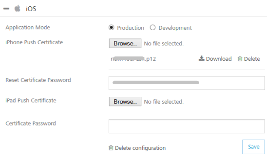
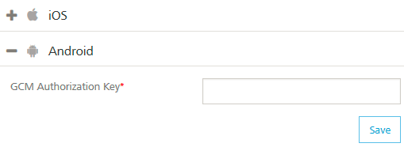
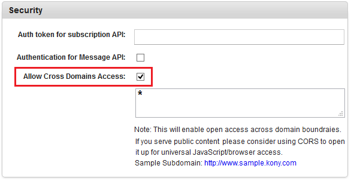
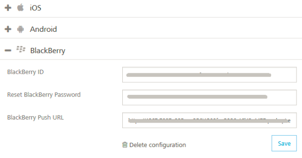
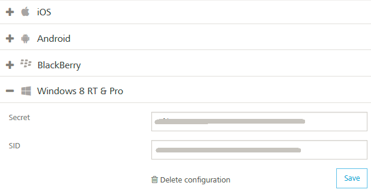
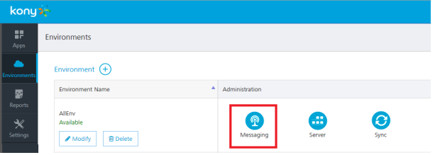

  

Messaging
=========

Messaging service allows you to upload push certificates for iOS, Android, BlackBerry, and Windows 8 RT platforms.

For sending messages, follow these steps:

1.  Add Push Certificates
2.  Access Messaging Console
3.  Send a Push Message

Add Push Certificates
---------------------

Foundry messaging supports the following platforms:

1.  [iOS](#ios)
2.  [Android](#android)
3.  [BlackBerry](#blackberry)
4.  [Windows 8 RT & Pro](#windows-8-rt-amp-pro)

This section details the process for adding push certificates to your application.

### iOS

Refer to the following section for creating a push certificate: [http://opensource.voltmxtechsw.com/volt-mx-docs/voltmxlibrary/default.html#../Subsystems/VMS\_Console\_User\_Guide/Content/Apps/Adding\_Platform.html](http://opensource.voltmxtechsw.com/volt-mx-docs/voltmxlibrary/default.html#../Subsystems/VMS_Console_User_Guide/Content/Apps/Adding_Platform.md)

To add iOS Push Certificates for your app, follow these steps:

1.  Expand **iOS**. A list of configurable items appear.
    
    
    
2.  **Application Mode**: An appropriate application mode.
    *   Production mode: When selected, production certificates and associated password details are entered while sending push notifications. Push notifications are delivered in real-time.
    *   Development mode: When selected, you can still send push message notifications, but delivery of push notifications are not real-time.
3.  **iPhone Push Certificate**: From here, you can upload, download, or delete a certificate.
    *   Click **Browse** to upload an iPhone certificate.
    *   Click **Download** to download an iPhone certificate.
    *   Click **Delete** to delete an iPhone certificate.
4.  **Certificate Password**: Enter the password for iPhone, and then click Save to complete the configuration process. 
5.  **iPad Push Certificate**: From here, you can upload, download, or delete a certificate.
    *   Click **Browse** to upload an iPhone certificate.
    *   Click **Download** to download an iPhone certificate.
    *   Click **Delete** to delete an iPhone certificate. 
6.  Click **Save** to complete the configuration process for iOS platform.

### Android

Refer to the following section for creating a push certificate: [http://opensource.voltmxtechsw.com/volt-mx-docs/voltmxlibrary/default.html#../Subsystems/VMS\_Console\_User\_Guide/Content/Apps/Adding\_Platform.html](http://opensource.voltmxtechsw.com/volt-mx-docs/voltmxlibrary/default.html#../Subsystems/VMS_Console_User_Guide/Content/Apps/Adding_Platform.md)

To add Android Push Certificates for your app, follow these steps:

1.  Expand **Android**. A list of configurable items appear.
    
    
    
2.  Enter the GCM authorization key, and then click **Save** to complete the configuration process.
    
    Google Cloud Messaging for Android (GCM) is a service that helps you to send data from servers to Android applications on Android devices. This can be a lightweight message telling the Android application that there is new data to be fetched from the server (for example, a movie uploaded by a friend), or it can be a message containing up to 4kb of payload data (so apps like instant messaging can consume the message directly). The GCM service handles all aspects of queuing of messages and delivery to the target Android application running on the target device.
    
    From PhoneGap application, to use messaging services (subscription, push messages and fetch messages), you must enable cross-origin resource sharing (CORS) in VMS console.  
      
    To enable CORS, in **VMS Console > General > Settings > Security**, select the **Allow Cross Domains Access** check box. In VMS, by default the check box is cleared.  
    
      For more details, refer to [VMS Console > General > Settings > Security](http://opensource.voltmxtechsw.com/volt-mx-docs/voltmxonpremises#../Subsystems/VMS_Console_User_Guide/Content/General_-_Settings.html?TocPath=VoltMX_Foundry|VoltMX_Messaging_Services|VoltMX_Messaging_Services_Console_User_Guide|Miscellaneous|Settings|_____1) section.  
      
    

### BlackBerry

Refer to the following section for creating a push certificate: [http://opensource.voltmxtechsw.com/volt-mx-docs/voltmxlibrary/#../Subsystems/VMS\_Console\_User\_Guide/Content/Apps/Adding\_Platform.html](http://opensource.voltmxtechsw.com/volt-mx-docs/voltmxlibrary/default.html#../Subsystems/VMS_Console_User_Guide/Content/Apps/Adding_Platform.md)

To add BlackBerry Push Certificates for your app, follow these steps:

1.  Expand **BlackBerry**. A list of configurable items appear.
    
    
    
2.  **BlackBerry ID**: Enter the ID.
    
    BlackBerry Identity is a single, master key for BlackBerry products, sites, services, and applications, offering: Simplified access, privacy and security controls, a personalized and customizable experience.
    
3.  **BlackBerry Password**: Enter the password.
4.  **BlackBerry Push URL**: Enter the web address.
5.  Click **Save** to complete the configuration process.
6.  To delete configuration for BlackBerry, click **Delete Configuration**.
    

### Windows 8 RT & PRO

Refer to the following section for creating a push certificate: [http://opensource.voltmxtechsw.com/volt-mx-docs/voltmxlibrary/#../Subsystems/VMS\_Console\_User\_Guide/Content/Apps/Adding\_Platform.html](http://opensource.voltmxtechsw.com/volt-mx-docs/voltmxlibrary/default.html#../Subsystems/VMS_Console_User_Guide/Content/Apps/Adding_Platform.md)

Windows push certificate is a purchased SSL certificate that is converted to correct format for uploading to Foundry.

To add Windows Push Certificates for your app, follow these steps:

1.  Expand **WINDOWS 8 RT** and **PRO**. A list of configurable items appear.
    
    
    
2.  **Secret**: Enter the secret key details.
    
    Windows Secret is an associated secret key that contains strings used in authentication with VMS APIs. It is used in authentication on the client side during registration.
    
3.  **SID**: Enter the SID details, and then click Save to complete the configuration process.
    
    Windows SID is a security identifier that is a unique, immutable identifier of a user, user group or other security principal. A security principal has a single SID for life, and all properties of the principal, including its name, are associated with the SID. This design allows a principal to be renamed (for example, from "John" to "Jane") without affecting the security attributes of objects that refer to the principal.
    
4.  To delete push configuration for Windows, click **Delete Configuration**.
    

Accessing Messaging Service Console
-----------------------------------

The Messaging Service Console allows you to add and manage applications, view the stored certificates, and manage a subscribers list.

You can access Messaging Service console from your Foundry cloud account by clicking the **Messaging Service** in the your cloud dashboard.

For more information on Messaging Service Console, refer to the following guide: [http://opensource.voltmxtechsw.com/volt-mx-docs/voltmxlibrary/default.html#../Subsystems/VMS\_Console\_User\_Guide/Content/Cover\_Page.html?TocPath=VoltMX Development Cloud|VoltMX Messaging Services|VoltMX Messaging Services Console User Guide|\_\_\_\_\_1](http://opensource.voltmxtechsw.com/volt-mx-docs/voltmxlibrary/default.html#../Subsystems/VMS_Console_User_Guide/Content/Cover_Page.md?TocPath=VoltMX Development Cloud|VoltMX Messaging Services|VoltMX Messaging Services Console User Guide|_____1).
