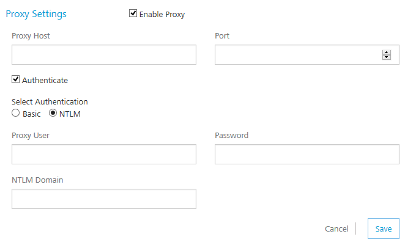

  

Settings
========

Using **Settings**, a superuser can manage tasks such as adding new users, assigning roles to users, deleting users, configuring proxy server, and configuring reports server.

Settings includes the following sections:

*   [Users](#users)
*   [Proxy](#proxy)
*   [Studio](#studio)
*   [Reports](Settings.md#Reports)

Users
-----

A user is an individual person. Each user needs an account to access the Foundry console. A superuser creates user accounts for owners, admins, and members who use the Foundry console.

As a user, you must be an admin or owner to access the Users page and perform different tasks based on the role.

### How to Add a User

To add a user, follow these steps:

1.  In your Foundry account, click **Settings**. By default, the **Users** page appears. The **Users** tab is visible to only users who are owners or admins. The page lists all owners, admins, and members of the account.
    
    
    
2.  In the **Users** page, click **Add New User** button. The **Add New User** page appears.
    
    
    
    All these fields are mandatory except the **Phone** number field.
    
3.  Enter the details as required.
4.  Click **Save** to save the user details. The system will add the new user in the grid.

### How to Change Environment Access to a User

Users can be provided full access or no access to configured environments. An environment can contain all three servers such as server, messaging and sync together or in different combinations. You can change the access for each user separately.

To change an environment access, follow these steps:

1.  In the **Settings > Users** page, hover your cursor over the required user from the list, click the **Settings** button, and then click **Change Environment Access**.
    
    
    
    The **Environment Access** page appears with all configured environments.
    
    
    
2.  For an environment, from the **Access** drop-down list, select the option.
    *   **No Access**: indicates that users cannot access an environment.
    *   **Full Access**: indicates that users can access an environment.
3.  Click **Done** to close the page.

Proxy
-----

With proxy, you can enable more security to your apps. Typically, you use the proxy server to filter web content and monitor uploads and downloads when surfing the Internet. When connecting to the Internet through proxies, the IP address of your machine will not be shown. However, the IP of the proxy server will be shown.

 As a user, you must be an admin or owner to access the **Proxy** page and perform different tasks based on the role.

### How to Configure a Proxy

You can configure only one proxy server. A proxy server can be basic or NT LAN Manager (NTLM) authentication.

To configure a basic or NTLM proxy, follow these steps:

1.  In your Foundry account, click **Settings > Proxy**. The **Proxy Settings** page appears.
    
    
    
2.  Select the **Enable Proxy** check box.
3.  In the **Proxy Host** text box, enter the IP of the server.
    
    
    
4.  From the **Port** text box, enter the port number. The **Port** text box supports port numbers from 1 to 65535.
5.  To enable authentication for your proxy, select the **Authenticate** check box, and follow these steps. Otherwise skip to [Step 6](#Step6Proxy).
    1.  Under **Select Authentication**, select **Basic** or **NTLM**.
        
        For NTLM authentication, you need to add the following configurations for VoltMX Studio. Follow these steps:
        
        *   In the **Proxy User** text box, enter the user for the proxy.
        *   In the **Password** text box, enter the password for the proxy.
        *   In the **NTLM Domain** text box, enter the domain for the proxy.
6.  Click **Save** to the save the proxy. The confirmation message appears.

### How to Enable a Proxy to an Integration Service

Once a proxy is configured, you can enable the proxy for an integration service. For more details, refer to [Creating an Integration Service](Creating an Integration Service.md).

Studio
------

The Studio tab lists -D parameters that you need to log in to VoltMX Studio (IDE.) The parameters are generated during Foundry installation.

To configure VoltMX Studio, copy and paste the following parameters in the  `eclipse.ini` file located in your VoltMX Studio install folder - for example, `<C:\Program Files\VoltMX_6.0.3QA\VoltMX_Studio>eclipse.ini`.

### How to Configure -D parameters in VoltMX Studio

To configure -D parameters in VoltMX Studio (IDE), follow these steps:

If you use secured services (HTTPS), configure Java Runtime Environment (JRE) associated with VoltMX Studio with CA certificates. If your CA certificate is not configured, the login to VoltMX Studio fails.  
  
For details, refer to [VoltMX Foundry Install Guide > Troubleshoot with SSL Certificate Issues](http://opensource.voltmxtechsw.com/volt-mx-docs/voltmxonpremises#../Subsystems/VoltMX_Foundry_Windows_Install_Guide/Content/Post-Installation_Tasks.html?TocPath=VoltMX_Foundry|VoltMX_Foundry_Windows_Install_Guide|_____8).

1.  Open the `eclipse.ini` file located in your VoltMX Studio install folder - for example, `<C:\Program Files\VoltMX_6.0.1GA\VoltMX_Studio>eclipse.ini`.
2.  Copy the **\-D parameters** from the **Studio** tab and paste them in the `eclipse.ini` file.
3.  Save the `eclipse.ini` file and restart VoltMX Studio.

Reports
-------

Under the **Settings**, the **Reports** tab allows you to configure the JasperReports Server. Once you complete JasperReports Server configuration, the **Reports** page (shown below) displays data (reports) from the JasperReports Server.

Currently, the **Reports** page displays only **Standard Reports**. To view standard reports, click the report. For more details on standard reports, refer to [VoltMX Reporting and Analytics - Standard Reports](http://opensource.voltmxtechsw.com/volt-mx-docs/voltmxlibrary#../Subsystems/VoltMX_Analytics_Standard_Reports_Guide/Content/Homepage.html?TocPath=VoltMX_Foundry|Reporting_and_Analytics|VoltMX_Analytics_Standard_Reports_Guide|_____1).

### How to Configure JasperReports Server

Before configuring the JasperReports Server in the **Reports** tab, ensure that you have installed the JasperReports Server and configured Foundry Console in the JasperReports Server.

1.  In your Foundry account, click **Settings** > **Reports**. The **Reports** page appears.
2.  In the **Jasper URL** text box, enter the JasperReports Server URL.
3.  In the **Username** text box, type jasperadmin.
    
    Note: Enter credentials for jasperadmin. The default credentials for jasperadmin:  
    username = jasperadmin  
    password = jasperadmin
    
4.  In the **Password** box, type `jasperadmin`.
5.  Click **Save** to the save the JasperReports Server. The confirmation message appears.
    
    After you configured JasperReports Server successfully, you can access the standard reports from **Reports** > **Standard Reports** page.
