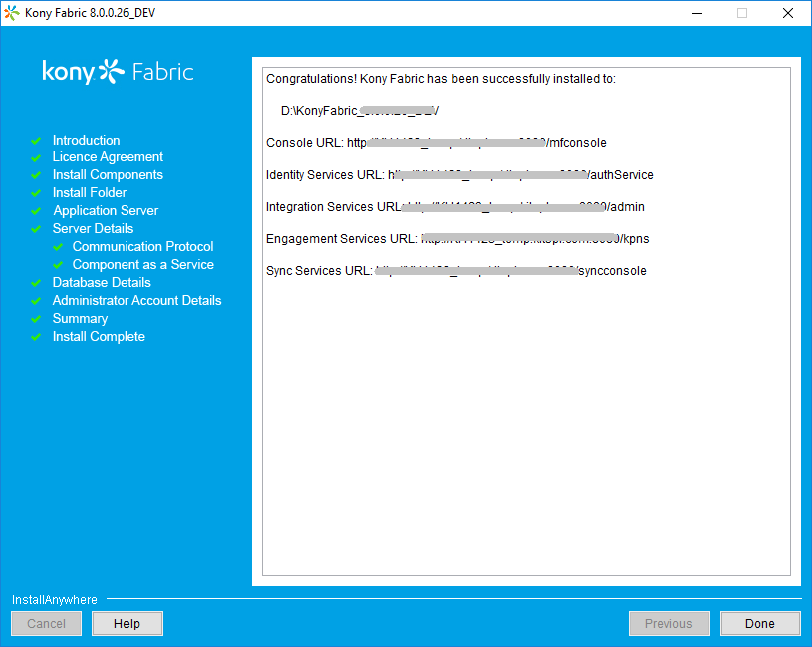
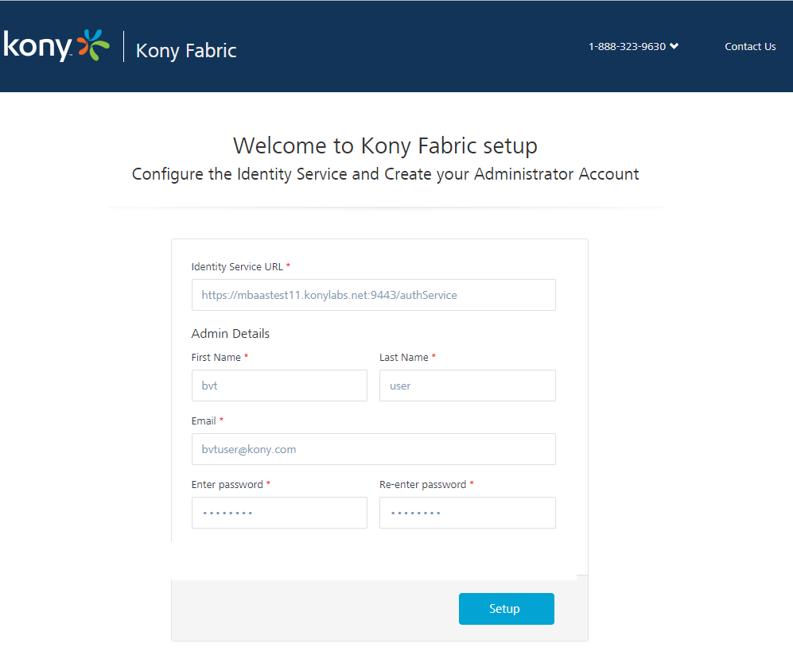
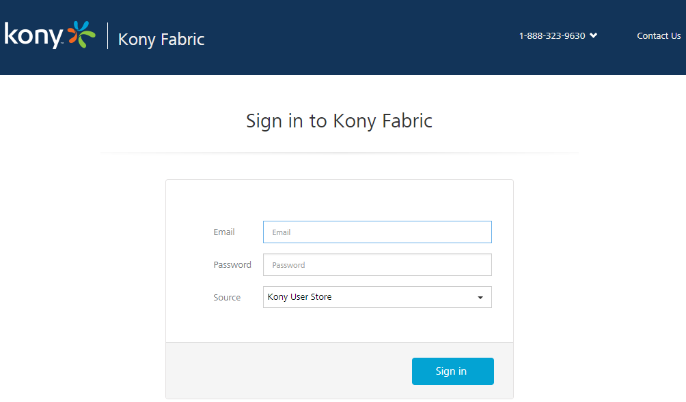
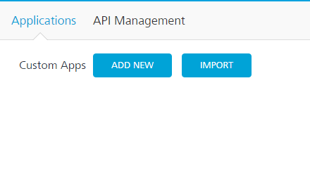

  

Accessing VoltMX Foundry Console
=============================

Before you use various VoltMX Foundry services, you must create a superuser.

To accessing VoltMX Foundry, follow these steps:

1.  [How to Get Started with VoltMX Foundry Console](#how-to-get-started-with-voltmx-foundry-console)
2.  [How to Log In to VoltMX Foundry Console](#how-to-log-in-to-voltmx-foundry-console)

How to Get Started With VoltMX Foundry Console
-------------------------------------------

After installation, you need to configure identity services and create your administrator account. Based on your VoltMX Foundry installation, you will see the a list of URLs in the **Install Complete** window, shown below:

To launch VoltMX Foundry console, follow these steps:

1.  From the **Install Complete** window, copy the URL from **VoltMX Foundry Console URL**, and then go the URL in your web browser.  
    
    To remember the URL of this portal, bookmark the URL by adding it to your favorites.
    
    The **Welcome to VoltMX Foundry setup** page appears only if you have not already configured your identity services.
    
    
    
    Fields marked with an asterisk are mandatory.
    
2.  In **VoltMX Identity Service URL** text box, enter VoltMX Identity Service URL from the **Install Complete** page.
3.  Under the **VoltMX Foundry Console Admin Details**, enter the following details:
    *   **First Name**: Enter the first name of the user.
    *   **Last Name**: Enter the last name of the user.
    *   **Email**: Enter the email address of the user. It can include alphanumeric and special characters that follow standard email address form.
    *   **Enter password**: Enter the password for the user. This is a string of characters that allows access to a system. It can be a combination of alphanumeric and special characters.
        
    *   **Re-enter password**: Retype the password to ensure the user's identity.
        
4.  Click **Setup**.  
    Once the details are validated for one-time configuration, the system will:
    *   Associate your credentials with VoltMX Foundry identity services and authorization services.
    *   Display the **Sign in to your VoltMX Account** page.  
        

How to Log In to VoltMX Foundry Console
------------------------------------

If you have configured identity services and created your administrator account (VoltMX Foundry superuser account), you can log in to the VoltMX Foundry console. A superuser will have owner permissions by default.

1.  Go to **VoltMX Foundry Console URL** that you bookmarked in the previous section. The **Sign in to VoltMX Foundry** page appears.
    
    
    
2.  Provide your VoltMX administrator account log-in credentials that you have created, and click **Sign in**.  
    After validating your credentials, you are directed to your VoltMX Foundry account. By default, the **Apps** page appears.  
    
    
    
    From this page, you can navigate to consoles (app services, sync services, engagement services), applications, environments, and settings.
