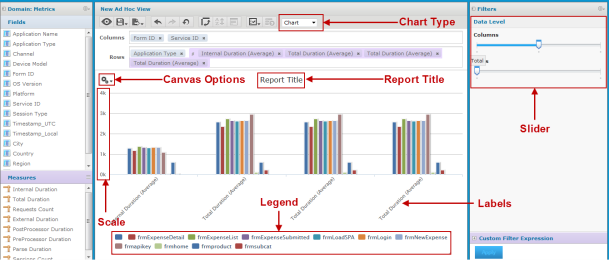
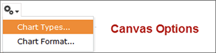
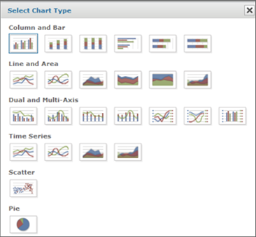
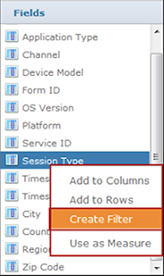
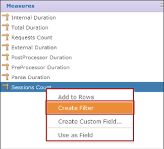
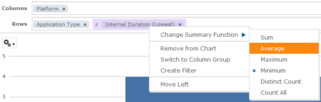

                            

Chart Report User Interface
===========================

The following figure illustrates the **Canvas** or **Report Builder** area in the Ad Hoc Editor. Sliders in the **Filters** pane are also shown: 

1.  **Chart Type** - Allows you to modify the selected chart type. As Chart is selected, the chart type of report is displayed in the **Report Builder** area.
2.  **Canvas Options** - Allows you to select different chart types and chart formats.

1.  Click **Chart Types..** option. The following dialog appears. Click to select a chart type. A blue border indicates the current selection.

6.  **Scale** - All measures are plotted against the same scale, which is sometimes confusing. You can use a calculated field to multiply or divide one measure so that its values are closer to those in the other measures in your chart.
7.  **Legend** - The legend is created when measures are added to the chart. Click one or more legends to hide the associated measures; click again to show them.
8.  **Labels** - The labels on the horizontal scale indicate the values by which the chart is grouped. If there are too many values in the chart, zoom in or use filters to reduce your data.
9.  **Slider** - Drag to set the level of aggregation to use for viewing the data.
10.  **Report Title** - This allows you to enter a report title.

> **_Note:_** As the nature of a chart is to display summarized data, the data mode menu is not available. Charts always present the full data set, not a sample. This may impact performance when working with large data sets.

In addition to generating a chart, you can also do the following: 

1.  **Zoom** - Click and drag or swipe to zoom. Only labels used in the zoom area are displayed, so you can use zoom to simplify your view. The zoom level is not saved when you save a view or report; it is always reset to the full view of the chart. A **Reset Zoom** option appears if you zoom to reset the zooming level to normal.
2.  **Filter a Chart** - Right-click a field in the **Data Selection** panel or the layout band and select **Create Filter**.

 or 

4.  **Select a measure’s summary function** - Right-click the measure’s name in the layout band, and select a function from the context menu.
    
    
    
5.  **Set the granularity of groups** - Use the slider to set the granularity of groups.
