                             

Creating a Report (Table, Chart, and Crosstab)
==============================================

To create a custom report, follow these steps:

1. In the **Reports** \> **Custom Reports**, click **CREATE REPORT**.
    
    > **_Note:_** Upon clicking **Create Report** button, the Standard Domain (Standard Metrics V8.0) is updated with new fields.
    
    The following **Data Choose: Source** dialog appears.  
    
    | Volt MX On-Premise | Volt MX Cloud |
    | --- | --- |
    | JasperReports Server 6.0/6.2/7.1 | JasperReports Server 7.1 |
    | 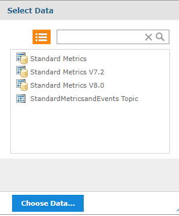 | 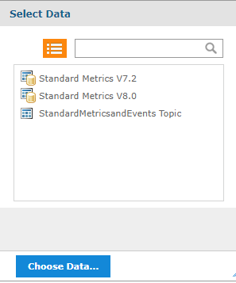 |
    
2. Select Data.
    
    There are two types of datasets. Datasets starting with word **Standard** contains metrics collected for all applications deployed to development environments in the Cloud/VoltMX Foundry account. The **Standard** datasets are available even if no custom metrics have been defined.
    
    **Standard Metrics V8.0** is the latest Standard dataset. **Standard Metrics V7.2, Standard Metrics**, and **Standard Metrics and Events** are older versions of datasets and subsets of the **Standard Metrics V8.0**. For Cloud/On-premises, it is recommended to use **Standard Metrics V8.0** dataset.
    

1. Click **Choose Data**. The **Data Chooser** dialog appears.

    * For Custom Reports using **Standard Metrics V8.0**, the **Source** is classified into six sections as follows.
    
      * Sessions
      * Requests
      * Events
      * Subrequests
      * Direct API Requests
      * Direct API Sub Requests
    
      The Data Chooser for Standard Metrics V8.0 is as follows.
    
      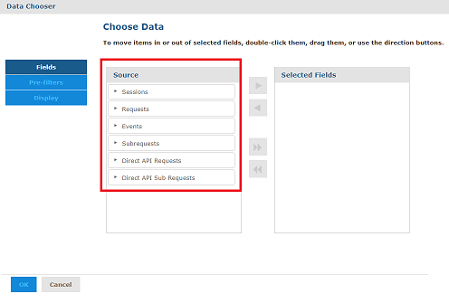
    
    * For Custom Reports using the Custom Metrics Domain, the **Source** is classified into eight sections as follows.
    
      * Sessions
      * Requests
      * Events
      * Subrequests
      * Direct API Requests
      * Direct API Sub Requests
      * Custom Metrics
      * Custom Metrics - Direct API
    
      The Data Chooser dialog box appears as follows.
    
      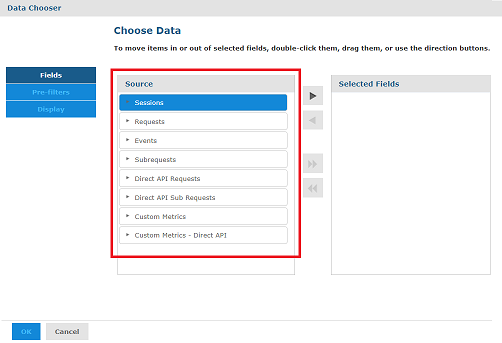
    
      > **_Important:_**
    
      * With the latest changes in the Custom Metrics, you can pull all the application related fields directly from the **Custom Metrics** view instead of pulling it from the **Requests** view. This will accelerate the report creation process.
        
      * If the views pertaining to Direct API (Direct API Requests, Direct API Subrequests, Custom Metrics - Direct API) are selected, the elements related to the Direct API views are only allowed to be moved as part of adhoc reporting.
      * If the views pertaining to Volt MX SDK (Sessions, Requests, Events, Subrequests, Custom Metrics) are chosen, the elements related to the Volt MX SDK views are only allowed to be moved as part of adhoc reporting.
      * While retrieving the data for custom metric fields from Custom Metrics or Custom Metrics - Direct API views, you will get the data for both Direct API and Volt MX SDK requests by default.
        
        To differentiate between the Direct API data and Volt MX SDK data, do the following:
        
        1.  Add a filter on the **sdktype** field.
        2.  Pass the following conditions and values in the sdktype field:
            
            *   For Direct API(Custom Metrics - Direct API view) requests, use the **equality** condition with the value as **api**.
            
            *   For Volt MX SDK(Custom Metrics view) requests, use the **non-equality** condition with the value as **api**.
    
    
      * **Session** is a dataset used to retrieve the information such as the number of times the app is used, the number of users who used the app, the location where the app is accessed, and OS versions of the app. This table contains an entry for every time the user launches the app or when the app comes to the foreground after being in the background for more than 30 minutes. It is used as a default dataset for building reports. If you do not have any requirements from other datasets, it is recommended to use only session dataset for building reports because it has the least volume of records and helps to build the reports faster.
      *   **Events** table contains an entry for every event that the client app generates as part of the project settings. Volt MX Foundry SDKs can send data on the application events to track the journey of a user in the app. The APIs can report standard app events such as Form Entry, Form Exit, Service Request, Touch, Gesture, and Orientation. The APIs can also report error events and app crashes. You can use the data in the table to analyze the app flows that a user takes, how much time a user spends on a form, or how often does the app crash or cause an error. One session can contain several application events based on how a developer configures the app.
      *   **Requests** table contains an entry for every service invocation to the Foundry server such as integration, object, and orchestration service. This dataset is used while analyzing the server-side service performance, checking the volume of service calls. One session contains several service requests.
      *   **Subrequests** are requests within the context of another request, such as integration service invoked within an object service.
      *   **Direct API Requests** are similar to **Requests** except that the requests are made directly to the API endpoint, instead of client app built using Foundry SDK.
      *   **Direct API Sub Requests** are similar to **Subrequests** except that the calls are made directly to the API endpoint, instead of client app built using Foundry SDK.

3. Select items from the **Source** pane and move them to the **Selected Fields** pane.
    1. Click **Add**  to move an item from **Source** pane to **Selected Fields** pane.
    2.  To move all the items from **Source** pane to **Selected Fields** pane, click **Add All**  icon.
    3.  To remove the items from Selected Pane, select an item from the **Selected Fields** pane and click **Remove** 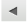 icon.
    4.  To move all the items from **Selected Fields** pane to **Source** pane, click **Remove All**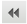 icon.
        *   For Custom Reports using either Standard Metrics V8.0 or Standard Metrics V7.2 or Custom Metrics Domain.
            
            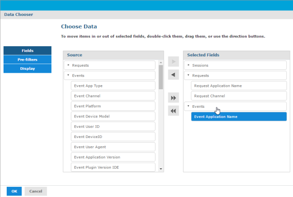
            
        *   For Custom Reports using other datasets.
            
            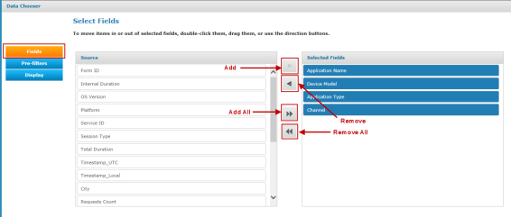  
            

        > **_Note:_** Selecting display fields in the Fields screen is a mandatory step.

5. Click **Pre-filters**. This is an optional setting if you want to restrict data available to the report builder.
    
   1. To add a Pre-filter, double-click a field from **Fields** pane. The field is added to the **Filters** pane, and you can configure options to customize the filter. For example, if you want to view only the data of custom metrics services, and not view data of other service calls for the same application, create a filter for **Service ID**. Next, choose a function as **equals**, choose **capturevoltmxcustommetrics** from the list, and configure it.
   2. Click the **Locked** check box to make the pre-filter unchangeable within the report builder.
    
     > **_Important:_** Do not use this option if you want the filter value to be editable from the report builder (Ad Hoc view).
    
     * For Custom Reports using either Standard Metrics V8.0 or Standard Metrics V7.2 or Custom Metrics Domain.
        
        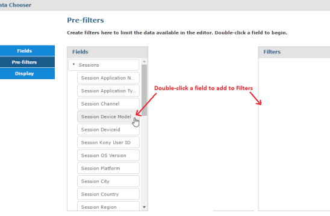
        
        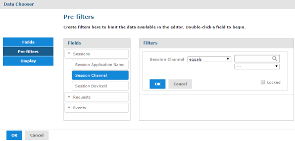
        
        The following image shows a filter added to the **Filters** pane.
        
        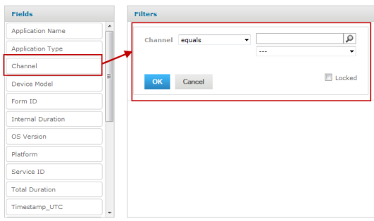
        
     * For Custom Reports using other datasets.
        
        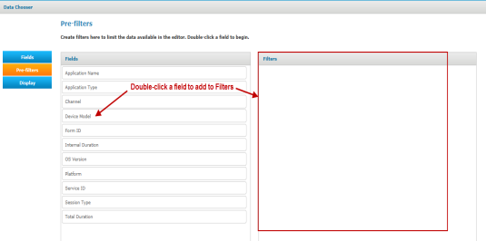
        
    
    2. Select criteria from the list. By default, **equals** is selected. The following options are available: 
    
       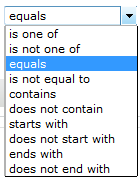
    
    4. Search for the type by entering a keyword in the box and click **Search**. The type of the item is based on the selected pre-filter.
    5. You can also select the type from the list. The list is populated with all the values of the selected pre-filter. In the current example, the list is populated with all types of channels.
    
       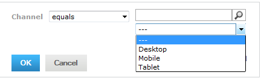
    
       > **_Note:_** Selecting display fields in the Fields screen is a mandatory step.
    
6. Click **OK**. The filter is added to the **Data Chooser**.
   You can modify or remove the filter by clicking on **Change** or **Remove** links.
   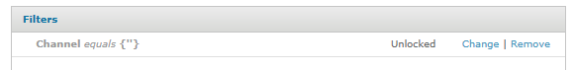

9. Click **Display**. The following screen appears.

   * For Custom Reports using Standard Metrics V8.0, Standard Metrics V7.2, or custom metrics.
    
     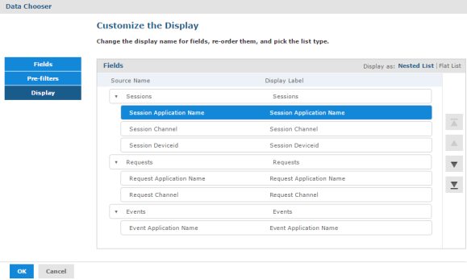
    
     In this screen, you can change the display name for fields, re-order, and pick the list type.
    
   * For Custom Reports using other datasets.
    
     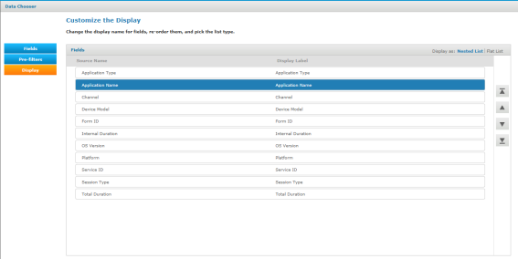  
    

1. Click a **Display Label** and an editable box appears.
   * For Custom Reports using Standard Metrics V8.0, Standard Metrics V7.2, or custom metrics.
     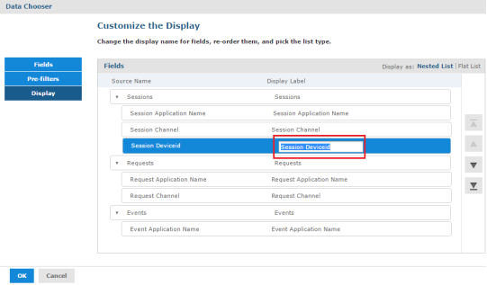
        
   * For Custom Reports using other datasets.   
     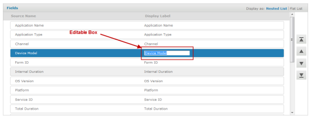
        
2. Enter a name for the display label.
3. Move the fields up or down using the **Move Up** and **Move Down** 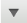 options.
4. Move multiple fields to top or bottom using the **Move to Top** 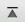 and **Move to Bottom** 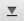 options.

12. To generate a report, select an option from the following list. The Data Chooser dialog provides three options to generate the report: 
    
    1.  Click **Table** to generate a table report. A report builder screen appears in which you can customize the view of the report with **Fields** and **Measures**. To view the user interface elements of a table report, [click here](#Table_Report_User_Interface_).
    2.  Click **Chart** to generate a chart report. There are different kinds of chart reports available in the cloud portal. To view the user interface elements of a chart report, [click here](#Generating_a_Chart_Report_).
    3.  Click **Crosstab** to generate a cross tabulation report, which allows you to do cumulative operations such as total and sum. To view the user interface elements of a crosstab report, [click here](#Crosstab_Report_User_Interface).
    4.  Click **Cancel** to close the **Data Chooser** dialog.
    
    > **_Note:_** The default data view type is Crosstab. You can change it to either Table, Chart or Crosstab after the report builder user interface gets loaded.
    

    The Default Ad Hoc View for **Table** report is illustrated in the following picture:

    * For Custom Reports using Standard Metrics V8.0, Standard Metrics V7.2, or custom metrics.
    
      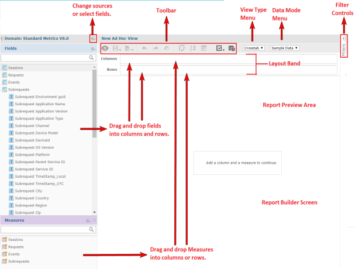
    
    * For Custom Reports using other datasets.
    
      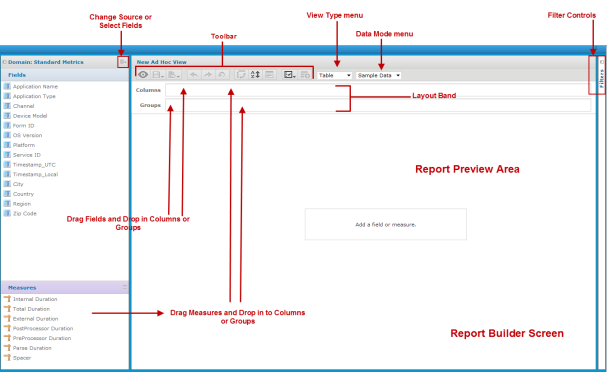
    

Two types of items appear in the **New Ad Hoc View** dialog to the left.
