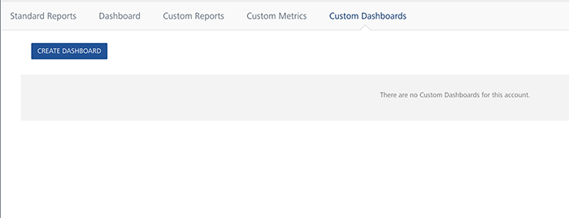

                            

You are here: Accessing Custom Dashboards

Custom Dashboards
=================

A custom dashboard displays reports in a single and integrated view. A dashboard can include standard reports, custom reports, input controls for choosing the data in one or more frames, and custom frames that points to URLs for other content. By combining different types of related content, you can create appealing and data-rich dashboards.

Accessing Custom Dashboards
---------------------------

To access custom dashboards, follow these steps:

1.  Log on to **VoltMX Foundry Console**.
    
    The **VoltMX Foundry Console** home page appears.
    
2.  Click **Reports** from the left pane of the screen.
    
    The **Reports** window appears displaying **Standard Reports** by default.
    
3.  Click **Custom Dashboards** from the upper right corner of the window.
    
    The **Custom Dashboards** window appears.
    
    
    
    > **_Note:_** If you have any custom dashboards created, by default the list of dashboards are displayed. Else, the message **There are no custom dashboards for this account** is displayed.
    
    > **_Note:_** To Import and Export Custom Reports and Custom Dashboards through MFCLI, refer to [Import Custom Reports and Custom Dashboards through MFCLI](../../../Foundry/voltmx_foundry_user_guide/Content/Export_Import_Custom_Reports_Dashboards_MFCLI.md)
    

Prerequisites
-------------

### Prerequisites for Cloud

Following are the prerequisites for creating a custom dashboard in Volt MX Cloud: 

*   A working account in Volt MX Cloud.
*   Active Volt MX Foundry Cloud
*   An application deployed to Volt MX Foundry Cloud.
*   An account admin or the users who has custom access or full access to the reports can create a custom dashboard.

### Prerequisites for On-premises

Following are the prerequisites for creating a custom dashboard in On-premises: 

*   A working account in Volt MX Cloud.
*   An account owner or an account admin can create a custom dashboard.
